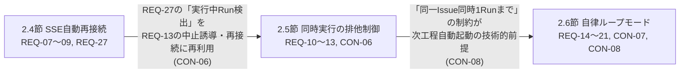

# claudeCodeGUI 要件定義書

## 0. 文書情報

| 項目 | 内容 |
|---|---|
| 版数 | 1.0 |
| 作成日 | 2026-08-24 |
| 作成者（サブエージェント） | 要件定義工程 開発サブエージェント |
| 対象範囲 | `docs/architecture-overview.md` 4.1〜4.9節（2026-08-24時点で「要件確定・未実装」の9件） |

### 改訂履歴

| 版数 | 日付 | 内容 |
|---|---|---|
| 1.0 | 2026-08-24 | 初版。architecture-overview.md 4.1〜4.9節をREQ/NFR/CON形式に正式化 |

## 1. 本書の位置づけ

本書は `docs/architecture-overview.md` の「4. 主な設計判断」節（4.1〜4.9）で既にユーザーとの対話を経て確定済みの内容を、正式な要件定義書の体裁（REQ-xx / NFR-xx / CON-xx）に変換したものである。

- **内容面**（何を決めたか）は architecture-overview.md の記載を正とし、変更していない。本書での変更はID付与・構造化などフォーマットのみ。
- architecture-overview.md 内で「未確定」「次回の設計工程で詰める」と明記されている論点は、要件として断定せず「4章 後工程で検討する事項」に区別して記載する。
- 各IDの詳細な理由・背景は architecture-overview.md 4.1〜4.9節の該当行を一次参照とし、本書では重複して書き下さない（`docs/traceability_matrix.md` のID対応関係の記載方針に準拠）。

## 2. 要件一覧

### 2.1 モック実行モード（出典: architecture-overview.md 4.1）

目的: (a) claude CLI未導入/未認証の第三者へのデモ・配布用、(b) 自分の開発中に実際のAPI呼び出しを避けるための開発用モック。両方を満たす（architecture-overview.md 4.1節「決定内容」表 項目1）。

| ID | 分類 | 内容 |
|---|---|---|
| REQ-01 | 機能要件 | `appsettings.json` の `ClaudeCli:MockMode`(bool) でモック実行を明示的にON/OFFできる。加えて、設定済みCLIパスが実行不可と判定された場合は `MockMode` の値によらず自動的にモック実行へフォールバックする |
| REQ-02 | 機能要件 | モック出力は、工程（Stage）ごとの汎用サンプルテキストをIssue実データに依存せず組み立て、`type:"system"`/`type:"assistant"`/`type:"result"` の3種のstream-json行として即座に（意図的遅延なし）全行配信する。SSE配信・`Run`状態遷移・`ApplyResult`による結果判定は本番実行と共通経路を通す。対象プロジェクトへの実ファイル書き込みは一切行わない |
| REQ-03 | 機能要件 | `Models/Run.cs` に `IsMock`(bool) を追加し、Run一覧・詳細表示でモック実行を区別できるようにする |
| CON-01 | 制約 | UIトグルは追加しない。Run単位の切替は行わず、アプリ全体の挙動として設定ファイルのみで統一する |

### 2.2 GUI配置の改善（出典: architecture-overview.md 4.2。配色は実装済みのため対象外）

| ID | 分類 | 内容 |
|---|---|---|
| REQ-04 | 機能要件 | 実行ログビュー（`.log-view`）が未実行状態のとき、「まだ実行していません」等のプレースホルダテキストを表示する |
| REQ-05 | 機能要件 | 成果物ブラウザのツリーとエディタの高さをCSS変数で揃える |
| CON-02 | 制約 | Issue詳細画面全体の構造（編集フォーム／工程実行／成果物ブラウザの縦一列配置）は現状維持とし、タブ切り替え等の構造変更は行わない |
| CON-03 | 制約 | 工程実行の操作列（テンプレート選択・パーミッションモード選択・実行/中止ボタン）は対応不要とする（現状は実害なし。テンプレート名が長くなる想定がなければ様子見とし、その想定が生じた場合は再検討する） |

> 後工程で検討する事項: 対象範囲（全画面共通か特定画面限定か）は未検討のため、コンポーネント設計工程で扱う。

### 2.3 パーミッションモード運用方針とTargetProjectPathの範囲制限（出典: architecture-overview.md 4.3）

| ID | 分類 | 内容 |
|---|---|---|
| REQ-06 | 機能要件 | `TargetProjectPath` の範囲制限を導入する。許可する作業用ルートフォルダ（複数可）を設定し、それ以外の絶対パスをIssue作成・更新時に拒否する |
| CON-04 | 制約 | `bypassPermissions` はGUIの選択肢として現状のまま残す（`wwwroot/app.js:101-105`）。実行前の追加確認ダイアログ等、選択時の抑止策は導入しない |
| NFR-01 | 非機能要件（セキュリティ） | REQ-06によるパス範囲制限は「意図しない機微なフォルダを対象に指定してしまう」誤操作の防止を目的とし、`bypassPermissions` 実行中に許可ルート配下から外へ出るコマンドが実行される可能性自体を技術的に防ぐものではない。この限界を「7. 既知の制約」相当のドキュメントに追記する |

> 後工程で検討する事項: 範囲制限の具体的な設定方法（単一ルートか複数許可か）、検証を行うレイヤ（Issue作成/更新APIでのバリデーション想定）、既存の `ArtifactService.ResolveWithinRoot` との役割分担は未確定であり、コンポーネント設計工程で詰める。

### 2.4 SSE自動再接続（出典: architecture-overview.md 4.4）

| ID | 分類 | 内容 |
|---|---|---|
| REQ-07 | 機能要件 | 「runIdを指定してログ表示をやり直す」共通の再接続関数を実装する。ページ再読込時の再接続と、接続断からの自動復帰を同じ関数で扱う |
| REQ-08 | 機能要件 | 再接続時は画面のログ表示を一旦クリアしてから、`StreamLogAsync` が返す既存ログ全体を再描画する（二重表示防止） |
| REQ-09 | 機能要件 | `app.js` の `EventSource` の `onerror` 発生時に、REQ-07の再接続関数を呼び出す。多少の遅延を入れて再試行し、`es.close()` で即座に諦めない |
| REQ-27 | 機能要件 | 「Issueの実行中Runを検出する」機能として、既存の `GET /api/issues/{issueId}/runs` エンドポイント（`Program.cs:103-106`）が返すそのIssueのRun一覧から `Status == "running"` のRunの有無を確認する。ページ再読込時にこの判定を行い、実行中RunがあればそのrunIdを使ってREQ-07の再接続関数を呼び出す。2.5節CON-06が再利用する「実行中Run検出」の仕組みもこの判定を指す |
| CON-05 | 制約 | ブラウザを閉じてもRunはサーバー側でバックグラウンド実行を継続する前提（既存設計のまま）で開発する。サーバープロセス自体が停止した場合の孤児化Run（`Run.Status`が`"running"`のまま更新されない状態）の検知・復旧は本要件の対象外 |

> 補足（独立レビュー指摘対応、2026-08-24）: architecture-overview.md 4.4節の決定内容表は「実行中Runを検出する」仕組みそのものを論点として明示的に挙げておらず、4.5節論点4が4.4節側の機能として存在する前提で言及するのみだった。この対応漏れを埋めるため、REQ-27を本書側で新規に追加した（既存のID体系の続きとしてREQ-27を採番。所属は本節）。実装コードを確認したところ、`Program.cs:103-106`の`GET /api/issues/{issueId}/runs`エンドポイントは`JsonFileStore<Run>`から該当Issueの全Runを取得して返しており、`Run.Status`（`ClaudeRunEngine.StartAsync`が処理開始時点で`"running"`として保存する。`Services/ClaudeRunEngine.cs:57`）を含むため、この判定に転用可能であることを確認済み。

### 2.5 同一Issueへの同時実行の排他制御（出典: architecture-overview.md 4.5）

| ID | 分類 | 内容 |
|---|---|---|
| REQ-10 | 機能要件 | 同一Issueに対しては同時に1つのRunのみ許可する。キュー化はせず、実行中に新規Run開始を試みた場合は拒否する |
| REQ-11 | 機能要件 | `RunContext` に `IssueId` を追加し、`StartAsync` 開始時に `_active.Values` から同一IssueIdの実行中Runがないか確認する方式で判定する |
| REQ-12 | 機能要件 | 拒否時は `Run.Status = "failed"` とし、既存の実行中RunIdをレスポンスに含める（既存の実行中Runには影響しない） |
| REQ-13 | 機能要件 | 新規実行が拒否された際、フロント側は返された既存RunIdを使って「このIssueは実行中です。中止しますか？」等の形でその場から中止操作に誘導する |
| CON-06 | 制約 | 実行中Runの停止手段は既存の `CancelAsync`/`POST /api/runs/{id}/cancel` をそのまま使う。REQ-13のUXおよびページ再読込後の中止操作誘導は、2.4節（SSE自動再接続）で実装する「Issueの実行中Runを検出する」仕組みを再利用する設計とする |

### 2.6 自律ループモード（出典: architecture-overview.md 4.6。本アプリの機能としての自律ループモード。Claude Code側の開発ワークフローの自律ループモードとは別物）

| ID | 分類 | 内容 |
|---|---|---|
| REQ-14 | 機能要件 | `Issue.LoopEnabled` 等によりIssueごとに明示的にON/OFFする。全Issue共通のグローバル設定にはしない |
| REQ-15 | 機能要件 | アプリ全体でStageごとに既定テンプレートを1つ設定できるようにする。将来Issueごとに上書きできる拡張余地を残した設計とするが、今回はIssueごとの上書きは実装しない |
| REQ-16 | 機能要件 | Run成功時、`Issue.CurrentStage` を次工程に更新し、その工程の既定テンプレートで次のRunを自動起動する。最終工程(`deployment`)が成功したら `Issue.Status = "done"` にしてループを終了する |
| REQ-17 | 機能要件 | Run失敗時は即座に停止し、`Issue.LoopEnabled` をfalseに戻す。Issue一覧・詳細画面で「ループ停止中（要確認）」等の表示を行う |
| REQ-18 | 機能要件 | ループ実行中は人間が都度パーミッションモードを選べないため、Issueごとに既定のパーミッションモードを設定できるようにする |
| REQ-19 | 機能要件 | 「自律ループ開始」を既存の「実行」ボタンとは独立した操作にする。停止は既存の「中止」ボタンを流用しつつ、中止時は現在のRunだけでなく `Issue.LoopEnabled` もfalseに戻す |
| REQ-20 | 機能要件 | 連続自動実行回数の上限を4回とする。失敗がなくても4回遷移した時点で自動停止し、人間の再確認を要する |
| REQ-21 | 機能要件 | `Run` にループ由来か区別するフラグ（例: `TriggeredByLoop`）を追加する。ループ由来のRunにのみ自動遷移をトリガーし、`Issue.LoopEnabled = true` 中でも通常の「実行」ボタンからの手動実行は単発扱いとし自動遷移のトリガーにしない |
| CON-07 | 制約 | スコープは「工程のRunが成功したら次工程を自動的に起動する」シンプルなシーケンサーに限定する。`waterfall-dev-workflow`スキルの自律ループモード章が持つレビュー再判定・非収束時のエスカレーション判断を含む本格的な自動化は対象外。Issueごとのテンプレート上書き（REQ-15の拡張）も今回は対象外 |
| CON-08 | 制約 | 2.5節（同一Issueへの同時実行の排他制御）の「同一Issueは同時に1Runまで」という制約が、本機能（前工程の完了を待ってから次工程を自動起動する動作）の技術的前提となる。2.5節REQ-10〜13が未実装のままでは本節の要件は成立しない |

### 2.7 Run/ログの保持方針（出典: architecture-overview.md 4.7）

| ID | 分類 | 内容 |
|---|---|---|
| REQ-22 | 機能要件 | 件数ベースの保持方針とする。Issueごとに直近N件のRun（およびそれに対応するログファイル）のみ残し、それより古いものを削除する。N=20 |

> 後工程で検討する事項: 削除トリガーのタイミング（新規Run作成時に都度チェックするか、起動時にまとめて行うか等）は未確定であり、コンポーネント設計工程で詰める。

### 2.8 Issue削除時に孤児化するRun/ログの扱い（出典: architecture-overview.md 4.8）

| ID | 分類 | 内容 |
|---|---|---|
| REQ-23 | 機能要件 | イベント駆動のカスケード削除ではなく、状態を見て判断する「孤児掃除」方式を採る。`runtime-data/runs/*.json` を走査し、参照先の `IssueId` が `runtime-data/issues/` に存在しないRunを検出する。GUI/API経由・ファイル直接操作どちらの削除でも孤児化を検出できる |
| REQ-24 | 機能要件 | 検出した孤児Runは即座に完全削除せず、`runtime-data/orphaned/` 等へ退避（quarantine）する。復元可能な状態を保ち、一定期間後に手動またはバッチで完全削除する |
| REQ-25 | 機能要件 | どのRunIdをどの理由（対応Issue不在）で退避したか、ログに記録する（監査ログ） |
| NFR-02 | 非機能要件（安全性） | 「Issueが見つからない＝削除された」という判定の誤判定リスク（ディスクI/O異常等でIssueストア読み取りが一時的に失敗するケース）に対する安全弁として、Issueストアの一覧取得が失敗した場合、または孤児と判定されるRunの割合が異常に高い場合（例: 50%超）は、処理を中断してログに警告を出すだけとし、削除・退避を実行しない |

> 後工程で検討する事項: 実行タイミング（アプリ起動時／手動トリガー等）は未確定であり、コンポーネント設計工程で詰める。

### 2.9 自動テスト方針（出典: architecture-overview.md 4.9。`test-strategy`スキルの単体/結合/GUIの3層構成に準拠）

| ID | 分類 | 内容 |
|---|---|---|
| NFR-03 | 非機能要件（テスト容易性） | 単体テストは純粋ロジックを優先してカバーする。`ClaudeRunEngine.BuildPrompt`、`ArtifactService.ResolveWithinRoot`、および2.3〜2.8節（4.3〜4.8相当）で新たに決めたロジック（排他判定・ループ回数カウント・保持件数プルーニング・孤児判定＋安全弁）など、間違えると影響が大きい箇所を優先する |
| NFR-04 | 非機能要件（テスト容易性） | 結合テストは主要エンドポイント（Run開始・SSE配信・2.3〜2.8節で決めた新機能に関わるもの等）を対象とし、下位レイヤ（`ClaudeRunEngine`・`ArtifactService`・`JsonFileStore`等）はモックに置き換えず実際の呼び出し関係のまま検証する |
| REQ-26 | 機能要件 | `src/ClaudeCodeGui.Tests` 等、xUnitベースの新規テストプロジェクトを追加する |
| CON-09 | 制約 | GUI/E2Eは自動テストとして整備しない。正常系の動作確認はAIエージェントによるスクリーンショット確認を許容するが、異常系の検証やクリック操作の網羅的自動化は行わない。意図しない挙動が発生した場合はその場で中断し、原因究明は静的な方法（コード読解等）に切り替える |

## 3. 要件間の整合性確認

2.4節→2.5節→2.6節は次のように技術的に連鎖している。

- **2.5節（排他制御）と2.6節（自律ループモード）の関係**: architecture-overview.md 4.5節末尾に明記の通り、REQ-10〜13（同一Issue同時1Run制限）はREQ-14〜21（自律ループの自動遷移）が正しく機能するための技術的前提である（CON-08）。ループが次工程を自動起動する時点では前工程のRunは既に完了し `_active` から除去されているため、REQ-11の判定ロジックと矛盾は生じない。実装順序としても2.5節の実装完了が2.6節の前提になる点を後工程（コンポーネント設計）に申し送る。
- **2.4節（SSE再接続）と2.5節（排他制御）の関係**: CON-06の通り、2.5節の拒否時UX（REQ-13）とページ再読込後の中止操作は、2.4節で実装する「実行中Run検出」の仕組みを再利用する設計である。初版では2.4節側にこの検出手段を規定するREQが欠落しており（独立レビューで指摘、2026-08-24）、REQ-27を新規追加して対応関係を明示した。2.4節（REQ-07〜09・REQ-27）の実装が2.5節の一部機能（REQ-13の中止誘導）の前提になる。
- その他の節（2.1〜2.3、2.7〜2.9）は互いに独立しており、矛盾は確認されなかった。

## 4. 既存プロトタイプの制約（`docs/architecture-overview.md` 7. 既知の制約）との対応

| 既知の制約（7.より） | 今回解消しようとしているか | 対応ID |
|---|---|---|
| SSEの自動再接続なし | 解消対象 | REQ-07〜REQ-09、REQ-27、CON-05（2.4節） |
| 同時実行の排他制御なし | 解消対象 | REQ-10〜REQ-13、CON-06（2.5節） |
| 「質問しない」対策は万能ではない | 対象外（今回の9件に含まれない） | — |
| 自律ループモード未実装 | 解消対象 | REQ-14〜REQ-21、CON-07、CON-08（2.6節） |
| 自動テスト未整備 | 解消対象 | NFR-03、NFR-04、REQ-26、CON-09（2.9節） |
| 単一ユーザー・ローカル専用が前提 | 対象外（今回の9件に含まれない） | — |

補足: 「7. 既知の制約」には列挙されていないが、4.7節本文中で言及されている「Run/ログが無制限に蓄積する」はREQ-22（2.7節）で、4.8節本文中で言及されている「Issue削除時のRun/ログ孤児化」はREQ-23〜25・NFR-02（2.8節）で、それぞれ解消対象としている。また、4.3節で新たに指摘された「`TargetProjectPath`の範囲制限がない」点はREQ-06・NFR-01（2.3節）で解消対象としている。
