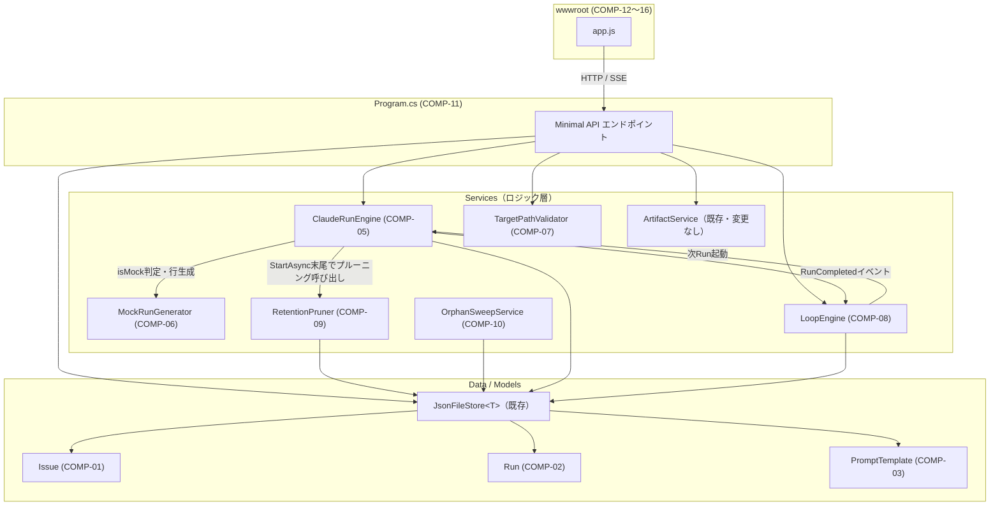
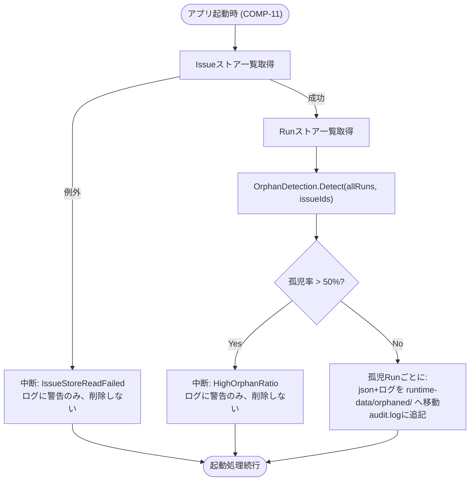

# claudeCodeGUI コンポーネント設計書

## 0. 文書情報

| 項目 | 内容 |
|---|---|
| 版数 | 1.0 |
| 作成日 | 2026-08-24 |
| 作成者（サブエージェント） | コンポーネント設計工程 開発サブエージェント（論理設計担当） |
| 対象範囲 | `docs/01_requirements/requirements.md` REQ-01〜27・NFR-01〜04・CON-01〜09（全40件） |
| 入力ドキュメント | `docs/01_requirements/requirements.md`、`docs/architecture-overview.md`、`docs/class-function-design.md`、`src/ClaudeCodeGui/` 実装コード |

## 1. 設計方針

- **ゼロからの再設計はしない**。既存の5レイヤ構成（`Models/` / `Data/` / `Services/` / `Program.cs` / `wwwroot/`）をそのまま踏襲し、40件の要件を満たすための**変更・追加箇所**を明確にする。
- **ロジック層とHTTPハンドラ/表示層の分離**（CLAUDE.md品質方針）を徹底する。新規ロジック（モック判定・排他判定・ループ遷移判定・保持件数プルーニング・孤児判定）は、副作用（ファイルI/O・DI経由のストアアクセス）を持たない**静的・純粋関数**として切り出し、その関数を呼び出す薄い非同期メソッド（副作用担当）と分離する。`ArtifactService.ResolveWithinRoot`が既に体現しているこの設計パターンを踏襲する。
- 新規コンポーネントには`COMP-01`から連番でIDを付与する。既存のまま変更しないコンポーネント（`JsonFileStore<T>`、`ArtifactService`本体、`Models/PromptTemplate.cs`のBody処理等）にはIDを振らない。
- 各REQ/NFR/CON IDと本書のコンポーネントIDとの対応関係の一次情報源は`docs/traceability_matrix.md`とする。本書では各コンポーネントの説明末尾に簡潔なID一覧のみを記載する。

## 2. コンポーネント一覧

| COMP-xx | 種別 | 対象ファイル | 概要 |
|---|---|---|---|
| COMP-01 | 拡張 | `Models/Issue.cs` | 自律ループ関連フィールドの追加 |
| COMP-02 | 拡張 | `Models/Run.cs` | モック実行・ループ由来フラグの追加 |
| COMP-03 | 拡張 | `Models/PromptTemplate.cs`, `Data/TemplateSeeder.cs` | Stage既定テンプレートフラグの追加 |
| COMP-04 | 拡張 | `appsettings.json` | モックモード・許可ルートの設定項目追加 |
| COMP-05 | 拡張 | `Services/ClaudeRunEngine.cs` | モック分岐・同時実行排他・完了通知イベント・既存バグ修正 |
| COMP-06 | 新規 | `Services/MockRunGenerator.cs`（新規ファイル） | モック実行の判定・出力生成ロジック |
| COMP-07 | 新規 | `Services/TargetPathValidator.cs`（新規ファイル） | `TargetProjectPath`許可ルート範囲チェック |
| COMP-08 | 新規 | `Services/LoopEngine.cs`（新規ファイル） | 自律ループの遷移判定・進行制御 |
| COMP-09 | 新規 | `Services/RetentionPruner.cs`（新規ファイル） | Run/ログの件数ベース保持（プルーニング） |
| COMP-10 | 新規 | `Services/OrphanSweepService.cs`（新規ファイル） | 孤児Run検出・quarantine退避・安全弁 |
| COMP-11 | 拡張 | `Program.cs` | エンドポイント追加・変更、起動時処理の追加、DI配線 |
| COMP-12 | 拡張 | `wwwroot/app.js` | SSE自動再接続・実行中Run検出 |
| COMP-13 | 拡張 | `wwwroot/app.js` | 排他制御拒否時のUX誘導 |
| COMP-14 | 拡張 | `wwwroot/app.js`, `wwwroot/styles.css` | 自律ループ操作UI |
| COMP-15 | 拡張 | `wwwroot/app.js`, `wwwroot/styles.css` | GUI配置の改善（実行ログのプレースホルダ・成果物ブラウザの高さ統一） |
| COMP-16 | 拡張 | `wwwroot/app.js`, `wwwroot/index.html` | テンプレート既定フラグの編集UI |
| COMP-17 | 新規 | `src/ClaudeCodeGui.Tests/`（新規プロジェクト） | xUnitベースの単体・結合テスト |

既存のまま変更しない主なコンポーネント: `Data/JsonFileStore<T>`（永続化の基盤としてそのまま利用）、`Services/ArtifactService`（`ResolveWithinRoot`はCOMP-07とは別レイヤの検証として現状維持。3節参照）。

### 2.1 コンポーネント依存関係の概観



## 3. コンポーネント詳細

### 3.1 Models

#### COMP-01 `Issue` モデル拡張

**責務**: 自律ループの状態（有効フラグ・既定パーミッションモード・連続実行回数・停止理由）をIssue単位で保持する、振る舞いを持たないデータ構造（既存方針を踏襲）。

**追加プロパティ**:

| プロパティ | 型 | 既定値 | 意味 |
|---|---|---|---|
| `LoopEnabled` | bool | `false` | 自律ループが有効か |
| `DefaultPermissionMode` | string | `"acceptEdits"` | ループ実行時に使う既定パーミッションモード |
| `LoopConsecutiveRunCount` | int | `0` | 現在のループセッションで起動済みの自動実行回数（ループ開始時に1にリセット） |
| `LoopStopReason` | string? | `null` | 自動停止理由。`"failed"`\|`"limit_reached"`\|`"no_default_template"`\|`null`（null=未停止 or 手動停止） |

**設計判断**: 手動停止（中止ボタン経由、REQ-19）では`LoopStopReason`は変更しない（＝`null`のまま）。「要確認」表示（REQ-17・REQ-20）は`LoopStopReason != null`の場合のみ行う設計とし、ユーザー自身が止めた場合と区別する。

対応ID: REQ-14, REQ-17, REQ-18, REQ-20

#### COMP-02 `Run` モデル拡張

**責務**: 個々の実行がモックか、自律ループ由来かを区別する属性を追加する。

| プロパティ | 型 | 既定値 | 意味 |
|---|---|---|---|
| `IsMock` | bool | `false` | モック実行だったか |
| `TriggeredByLoop` | bool | `false` | 自律ループが自動起動したRunか（手動「実行」ボタンでは常に`false`） |

対応ID: REQ-03, REQ-21

#### COMP-03 `PromptTemplate` モデル拡張 / `TemplateSeeder` 変更

**責務**: Stageごとの既定テンプレートを1つ指定できるようにする。

| プロパティ | 型 | 既定値 | 意味 |
|---|---|---|---|
| `IsDefaultForStage` | bool | `false` | このテンプレートが`Stage`の既定テンプレートか |

**一意性制約**: 「Stageごとに既定は1つまで」という不変条件は、保存時（COMP-11のテンプレート作成/更新ハンドラ）で担保する。同一`Stage`の他テンプレートで`IsDefaultForStage=true`のものがあれば、保存前に`false`へ落とす（フラグを立てたテンプレートが常に唯一の既定になる、後勝ち方式）。この判定自体は`LoopEngine`（COMP-08）ではなく、テンプレートの保存という関心事に閉じているため、テンプレート保存処理の一部として実装する（`Program.cs`のテンプレートPOST/PUTハンドラ内、または`JsonFileStore<PromptTemplate>`を受け取る小さな静的関数として切り出す）。

**`TemplateSeeder`の変更**: 初回起動時に投入する5件の既定テンプレートは、それぞれ`IsDefaultForStage = true`で作成する。既定テンプレートが1つも設定されていない状態だと自律ループ（COMP-08）が起動できないため、seed直後から動作する状態にする。

対応ID: REQ-15

### 3.2 設定

#### COMP-04 `appsettings.json` 拡張

```jsonc
{
  "ClaudeCli": {
    "Path": "C:\\Users\\21452\\.local\\bin\\claude.exe",
    "MockMode": false            // 追加: REQ-01
  },
  "Security": {
    "AllowedProjectRoots": []    // 追加: REQ-06。空配列 = 制限なし（後方互換）
  }
}
```

**`AllowedProjectRoots`が空の場合の挙動**: 要件定義書2.3節の「後工程で検討する事項」（検証を行うレイヤ、設定方法）のうち設定方法をここで確定する。空配列＝制限なし（既存の挙動を維持）とし、運用者がフォルダを明示的に設定した時点で範囲制限が有効になるオプトイン方式とする。単一ルートでも複数ルートでも配列でそのまま表現できる。

対応ID: REQ-01, CON-01, REQ-06

### 3.3 Services（ロジック層）

#### COMP-05 `ClaudeRunEngine` 拡張

**責務**: 既存の「claude CLIサブプロセス起動・ログ配信」に加え、(a) モック実行への分岐、(b) 同一Issueの同時実行拒否、(c) Run完了をLoopEngineへ通知するイベント、を追加する。

**`StartAsync`のシグネチャ変更**:

```csharp
public async Task<RunStartResult> StartAsync(
    Issue issue, PromptTemplate template, string permissionMode, bool triggeredByLoop = false)
```

`RunStartResult`は新規record: `record RunStartResult(Run Run, string? ConflictingRunId);`

**入出力**:

| 項目 | 内容 |
|---|---|
| 入力 | `Issue`, `PromptTemplate`, `permissionMode`（文字列）, `triggeredByLoop`（既定`false`、手動実行時は指定しない＝REQ-21） |
| 出力 | `RunStartResult`。`ConflictingRunId`が非nullなら排他拒否（REQ-12）、そうでなければ通常どおり起動済みの`Run` |
| 副作用 | `Run`の保存、`_active`への登録、バックグラウンドでのCLI起動またはモック実行、ログファイルへの追記 |

**排他判定のアトミック性（設計時に発見、修正が必要）**: 「`_active.Values`から同一IssueIdを走査して探す」→「見つからなければ登録する」という2段階の実装はcheck-then-actであり原子的でない。ほぼ同時に2つの`StartAsync`呼び出しが来た場合、両方が「実行中Runなし」と判定してしまい、同一Issueに2つのRunが並行起動されうる。この確認と登録を単一の原子操作にするため、`ClaudeRunEngine`に`IssueId`→`RunId`を保持する専用の`ConcurrentDictionary<string, string> _activeIssueRuns`フィールドを追加し、`ConcurrentDictionary<TKey,TValue>.GetOrAdd(key, value)`（「キーが無ければ`value`を追加してそれを返し、既にあれば追加せず既存値を返す」を単一操作で行う）を排他ゲートとして使う。既存の`_active`（`RunId`→`RunContext`、SSE配信・キャンセル対象プロセスの参照に使用）とは責務が異なる別の辞書として併存させ、`_active`のキー方式（RunId単位）は変更しない。

```csharp
private readonly ConcurrentDictionary<string, string> _activeIssueRuns = new(); // IssueId -> RunId
```

**処理フロー（`StartAsync`冒頭、`Run`インスタンス生成直後に追加）**:

1. `var winningRunId = _activeIssueRuns.GetOrAdd(issue.Id, run.Id);` を呼ぶ。`run`（新規`Run`インスタンス、`Id`は`Guid`で既に採番済み・まだ未保存）を先に生成しておく必要がある。
2. `winningRunId != run.Id`（＝既に別のRunIdが登録済みだった＝排他ロックを獲得できなかった）場合、CLIを起動せず`Run`を`Status="failed"`, `IsError=true`, `ResultSummary`に競合RunId（`winningRunId`）入りの文言で作成・保存し、`RunStartResult(rejectedRun, winningRunId)`を返す（REQ-12）。`_activeIssueRuns`へは何も書き込まない（既存エントリをそのまま保持）。
3. `winningRunId == run.Id`（＝このRunが排他ロックを獲得した）場合は既存どおり対象ディレクトリ存在チェック → `MockRunGenerator.ShouldUseMock(...)`（COMP-06）でモック判定 → `Run.IsMock`・`Run.TriggeredByLoop`を設定して保存 → `RetentionPruner.PruneAsync(...)`（COMP-09）を呼び出し古いRunを削除 → `_active`（RunId単位、既存の辞書）へ`RunContext`登録 → `ExecuteAsync`をバックグラウンド起動。
   - **ロック解放漏れの注意**: 対象ディレクトリが存在せず即`failed`で早期リターンする既存分岐（`ExecuteAsync`を一度も起動しない）では、手順1で既に`_activeIssueRuns`のロックを獲得済みであるにもかかわらず、通常は解放役を担う`ExecuteAsync`の`finally`（手順4）に到達しない。このパスでは早期リターンの直前に`_activeIssueRuns.TryRemove(issue.Id, out _);`を呼び、その場でロックを解放すること。これを忘れると、対象ディレクトリが存在しないIssueは以後永久に排他ロックされたままになる。
4. `ExecuteAsync`の`finally`（`_active.TryRemove(run.Id, out _)`と同じ箇所）で`_activeIssueRuns.TryRemove(issue.Id, out _);`を呼び、Issue単位のロックを解放する。

**`RunContext`の拡張**: 排他判定は`_activeIssueRuns`側で完結するため、`RunContext`自体に`IssueId`・`RunId`フィールドを追加する必要はない（当初案から変更）。`RunContext`への追加は後述のキャンセル競合修正の`IsCanceled`フラグのみとする。

**`ExecuteAsync`の分岐**: `isMock`引数を追加し、モック時は既存の`ProcessStartInfo`〜`Process.Start`の代わりに`MockRunGenerator.GenerateLines(template.Stage)`（COMP-06）の各行を`ctx.Append`し、`ExitCode=0`として`ApplyResult`へ渡す。**SSE配信・`RunContext.Append`・`ApplyResult`・保存・`_active`からの除去は本番実行と完全に共通のコードパスを通る**（REQ-02の「共通経路」要件を満たす設計）。対象プロジェクトへのファイル書き込みはモック分岐内で一切発生しない。

**完了通知イベント（自律ループ連携用）**:

```csharp
public event Func<Run, Task>? RunCompleted;
```

`ExecuteAsync`の`finally`（保存・`_active`除去の直後）で`RunCompleted?.Invoke(run)`を呼ぶ。`LoopEngine`（COMP-08）がこれを購読し、次工程の自動起動を判断する。`ClaudeRunEngine`自身はループの中身（次工程は何か等）を一切知らない疎結合設計とする。

**既存バグの修正（設計時に発見、REQ-19/CON-06の前提となるため本コンポーネントで修正）**: 現行実装は`CancelAsync`が`_runStore.GetAsync(runId)`で**別インスタンス**の`Run`を取得して`Status="canceled"`を保存する一方、`ExecuteAsync`は起動時に受け取った**元の`Run`インスタンス**を使い続け、プロセスKillで異常終了したプロセスの終了コードに基づき`ApplyResult`が`Status="failed"`と判定してそれを`finally`で上書き保存してしまう。この結果、中止したはずのRunの最終状態が`canceled`ではなく`failed`になる競合がある。**修正方針**: `RunContext`に`IsCanceled`フラグを持たせ、`CancelAsync`がプロセスKillと同時にこのフラグを立てる。`ExecuteAsync`の`finally`は`ctx.IsCanceled`が真の場合、`ApplyResult`を呼ばないことに加えて、`run.Status`を明示的に`"canceled"`へ設定してから（既存どおり）`_runStore.SaveAsync(run)`を呼ぶ。**`ApplyResult`呼び出しをスキップするだけでは不十分な点に注意**: `finally`内の`run.FinishedAt = DateTimeOffset.UtcNow; await _runStore.SaveAsync(run);`は`ApplyResult`呼び出しの成否に関わらず無条件に実行されるため、`ApplyResult`をスキップしただけでは`run.Status`が初期値`"running"`のまま保存され、`CancelAsync`が先に保存した`"canceled"`を上書きしてしまう。`finally`内の`SaveAsync`自体をスキップする案ではなく、保存直前に`run.Status`を`"canceled"`へ揃えてから保存する案を採る。これにより、`CancelAsync`側の保存と`ExecuteAsync`側の保存のどちらが後に完了しても、最終的な永続化結果は`"canceled"`で一致する（保存順序に依存しない）。

対応ID: REQ-01, REQ-02, REQ-03, REQ-10, REQ-11, REQ-12, CON-05, CON-08

#### COMP-06 `MockRunGenerator`（新規）

**責務**: モック実行の要否判定と、Stage別サンプル出力（stream-json 3行）の生成。両方とも**副作用のない静的関数**とし、単体テストの対象にする（NFR-03）。

```csharp
public static class MockRunGenerator
{
    // 設定値と実CLIパスの実行可否からモック要否を判定する（REQ-01）。
    // cliPathが絶対パスかつファイル不在の場合のみ自動フォールバックする
    // （PATH解決に依存するコマンド名指定はFile.Existsで判定できないため対象外。制約として明記）。
    public static bool ShouldUseMock(bool configMockMode, string cliPath);

    // Stageごとの汎用サンプルを、system/assistant/resultの3行(stream-json文字列)として返す（REQ-02）。
    // Issueの実データには一切依存しない。
    public static IReadOnlyList<string> GenerateLines(string stage);
}
```

`GenerateLines`が返す3行は、`wwwroot/app.js`の`appendLogLine`が解釈できる形（`type:"system"`は`session_id`を持つ、`type:"assistant"`は`message.content[].text`、`type:"result"`は`is_error`/`result`）に合わせる。既存の`ApplyResult`（COMP-05）がそのまま解釈できることを単体テストで確認する。

**NFR-04との関連**: `ShouldUseMock`/`GenerateLines`により、結合テスト（COMP-17）は実CLIプロセスを起動せずに`ClaudeRunEngine`の一連の経路（起動→SSE配信→`Run`状態確定）を検証できる。実際のAnthropic API呼び出しを伴わないため、自動テストとして安全に組み込める（本PCが機微な環境であることを踏まえた設計上の利点）。

対応ID: REQ-01, REQ-02

#### COMP-07 `TargetPathValidator`（新規）

**責務**: `Issue.TargetProjectPath`が、運用者が許可した作業用ルートフォルダ群のいずれか配下にあるかを検証する。

```csharp
public class TargetPathValidator
{
    public TargetPathValidator(IReadOnlyList<string> allowedRoots);
    public bool IsAllowed(string targetPath);

    // 純粋関数本体（単体テスト対象）
    public static bool IsWithinAllowedRoots(string targetPath, IReadOnlyList<string> allowedRoots);
}
```

`IsWithinAllowedRoots`は`allowedRoots`が空なら常に`true`（制限なし、COMP-04の設計判断）。非空の場合は`Path.GetFullPath`で正規化した`targetPath`が、いずれかの許可ルート自身または`root + セパレータ`で始まるかを`ArtifactService.ResolveWithinRoot`と同様の比較ロジックで判定する。

**`ArtifactService.ResolveWithinRoot`との役割分担**（要件定義書2.3節「後工程で検討する事項」への回答）:

| | `TargetPathValidator`（COMP-07） | `ArtifactService.ResolveWithinRoot`（既存・変更なし） |
|---|---|---|
| 検証対象 | Issue作成・更新時の`TargetProjectPath`そのもの | 個々のファイルアクセス時の相対パス |
| 検証タイミング | Issue登録・更新の都度（1回） | 成果物一覧・読み込み・保存の都度 |
| 判定基準 | 運用者が設定した許可ルート群のいずれかに含まれるか | そのIssueの`TargetProjectPath`配下から出ていないか（`../`対策） |
| 目的 | 「意図しない機微なフォルダを指定してしまう」誤操作の防止（NFR-01） | ディレクトリトラバーサル対策 |

両者は独立した二段構えであり、どちらか一方に統合しない。`ArtifactService`は変更しない。

**NFR-01への対応**: `TargetPathValidator`はIssue登録・更新時の誤操作防止であり、`bypassPermissions`実行中にCLIプロセス自身が許可ルート外へアクセスすることを技術的に防ぐものではない。この限界は実装時に`docs/architecture-overview.md`の「7. 既知の制約」節へ追記する（ドキュメント更新はコンポーネント設計の対象外だが、実装工程での対応事項として本書に明記する）。

対応ID: REQ-06, NFR-01

#### COMP-08 `LoopEngine`（新規）

**責務**: 「工程のRunが成功したら次工程を自動的に起動する」シーケンサー（CON-07のスコープ限定を厳守）。`ClaudeRunEngine`の`RunCompleted`イベントを購読し、Run完了のたびに継続可否を判定して次のRunを起動する。ループの**開始**（REQ-19）・**停止**（REQ-19の中止流用）のエントリポイントも持つ。

**判定ロジックとオーケストレーションの分離**（品質方針）: 「次に何をすべきか」の判定は副作用のない静的関数`Evaluate`に切り出し、実際のストア読み書き・Run起動という副作用は`HandleRunCompletedAsync`が担う。

```csharp
public enum LoopAction { Ignore, StopFailed, StopLimitReached, StopNoDefaultTemplate, Complete, Advance }
public record LoopDecision(LoopAction Action, string? NextStage, PromptTemplate? NextTemplate);

public class LoopEngine
{
    public const int MaxConsecutiveRuns = 4; // REQ-20

    // 純粋関数: Issue/完了したRun/テンプレート一覧から次に取るべき行動を決定する。
    // ストアやファイルには一切触れない（単体テスト対象、NFR-03）。
    public static LoopDecision Evaluate(
        Issue issue, Run completedRun, IReadOnlyList<PromptTemplate> templates,
        int maxConsecutiveRuns = MaxConsecutiveRuns);

    // 純粋関数: 5工程の定義順で次工程を返す。最終工程(deployment)ならnull。
    public static string? GetNextStage(string currentStage);

    // 純粋関数: 指定StageのIsDefaultForStage=trueなテンプレートを1件返す（無ければnull）。
    public static PromptTemplate? ResolveDefaultTemplate(IReadOnlyList<PromptTemplate> templates, string stage);

    // 副作用あり: RunCompletedイベントのハンドラ。Evaluateの結果に応じてIssueを更新し、
    // Advanceなら次のRunをClaudeRunEngine.StartAsyncで起動する。
    public Task HandleRunCompletedAsync(Run completedRun);

    // 副作用あり: 「自律ループ開始」操作（REQ-19）。LoopEnabled/LoopConsecutiveRunCount/LoopStopReasonを
    // 初期化し、現在のStageの既定テンプレートで最初のRunを起動する。
    public Task<RunStartResult?> StartLoopAsync(string issueId);

    // 副作用あり: 中止操作からの流用（REQ-19、Program.cs側のcancelハンドラから呼ばれる）。
    // LoopEnabledをfalseに戻す（LoopStopReasonは変更しない＝手動停止と自動停止を区別）。
    public Task StopLoopAsync(string issueId);
}
```

**`Evaluate`の判定順序**（`LoopDecision`）:

1. `completedRun.TriggeredByLoop == false` または `issue.LoopEnabled == false` → `Ignore`（手動実行はトリガーにしない＝REQ-21。既にループが止まっている場合も無視）
2. `completedRun.Status != "succeeded"` → `StopFailed`（REQ-17）
3. `GetNextStage(issue.CurrentStage)`が`null`（最終工程`deployment`が成功） → `Complete`（REQ-16、呼び出し側で`Issue.Status="done"`, `LoopEnabled=false`に設定）
4. `issue.LoopConsecutiveRunCount > maxConsecutiveRuns` → `StopLimitReached`（REQ-20。比較演算子は`>`であって`>=`ではない点に注意。理由は次項「連続実行回数の数え方」のオフバイワン修正を参照）
5. 次工程の既定テンプレートが存在しない → `StopNoDefaultTemplate`（REQ-15が未設定の場合の安全な停止。要件には明記のない境界ケースだが、無限に失敗し続けるより安全に止める設計とした）
6. 上記いずれでもなければ → `Advance`（`Issue.CurrentStage`を次工程に更新し、`LoopConsecutiveRunCount`をインクリメントしてから次Runを起動）

**連続実行回数の数え方（REQ-20の解釈）**: 「4回」は自律ループが**起動したRunの数**（`TriggeredByLoop=true`のRun数）の上限とする。`StartLoopAsync`が最初のRunを起動する時点で`LoopConsecutiveRunCount=1`とし、`Advance`判定のたびにインクリメントする。

**設計時に発見したオフバイワン（修正済み）**: 判定④の比較を`issue.LoopConsecutiveRunCount >= maxConsecutiveRuns`（`>=`）としていた初期案では、既定Issueが`requirements`から失敗なく5工程を完走しようとするケースで、`testing`工程完了時点（`LoopConsecutiveRunCount=4`）に③（`deployment`はまだ次工程が存在するため`Complete`にならず通過）の直後で④が真になって`StopLimitReached`が発火し、5件目（`deployment`）のRunが一度も起動されないバグがあった。`architecture-overview.md` 4.6節#7が意図する「上限4回＝5工程を最後まで自動で通すのに必要な最小回数（工程間の遷移4回）」を実現するため、④の比較演算子を`>`（超過）に修正した。`issue.LoopConsecutiveRunCount`自体の初期値（`StartLoopAsync`時点で1）・インクリメントタイミング（`Advance`のたび）は変更していない。

**トレース（既定設定・上限4、Issueを`CurrentStage=requirements`から開始し失敗なく完走するケース）**:

| Run完了時のStage | 完了時の`LoopConsecutiveRunCount` | ④の判定（`> 4`） | 結果 |
|---|---|---|---|
| requirements | 1 | 1 > 4 は偽 | ③次工程`design`あり→非該当、④通過→⑥Advance。`CurrentStage=design`, count→2、Run2起動 |
| design | 2 | 2 > 4 は偽 | ③次工程`implementation`あり→非該当、④通過→⑥Advance。`CurrentStage=implementation`, count→3、Run3起動 |
| implementation | 3 | 3 > 4 は偽 | ③次工程`testing`あり→非該当、④通過→⑥Advance。`CurrentStage=testing`, count→4、Run4起動 |
| testing | 4 | 4 > 4 は偽 | ③次工程`deployment`あり→非該当、④通過→⑥Advance。`CurrentStage=deployment`, count→5、Run5起動 |
| deployment | 5 | （③で確定するため④は評価されない） | ③`GetNextStage(deployment)=null`→`Complete`。`Issue.Status=done`, `LoopEnabled=false` |

`deployment`完了時点では`LoopConsecutiveRunCount=5`（上限4を上回っている）が、判定順序上③（`Complete`）が④（`StopLimitReached`）より先に評価されるため上限には抵触しない。上限が実際に`StopLimitReached`として効くのは、最大`maxConsecutiveRuns`回のAdvanceを終えてもなお次工程が存在する場合（テンプレート構成の不備・将来の工程追加等、既定の5工程パイプラインでは通常発生しない想定外のケース）に限られる、という安全弁としての位置づけである。既存Issueを`design`以降のStageで作成しループを開始した場合は当然5件未満で完走しうるため、なおさら上限に達することはない。

**依存関係**: `JsonFileStore<Issue>`, `JsonFileStore<PromptTemplate>`, `ClaudeRunEngine`（`StartAsync`呼び出しと`RunCompleted`購読の両方）。

対応ID: REQ-14, REQ-15, REQ-16, REQ-17, REQ-18, REQ-19, REQ-20, REQ-21, CON-07, CON-08

#### COMP-09 `RetentionPruner`（新規）

**責務**: Issueごとに直近20件のRun（およびログファイル）のみ残し、それより古いものを削除する（REQ-22）。

```csharp
public static class RetentionPruner
{
    // 純粋関数: Issueの全Run一覧から「削除すべき（保持件数からあふれた）」Runを返す。
    // StartedAt降順に並べ、先頭keep件を除いた残りを返す（単体テスト対象、NFR-03）。
    public static IReadOnlyList<Run> SelectRunsToPrune(IReadOnlyList<Run> issueRuns, int keep = 20);

    // 副作用あり: 指定Issueの全Runを取得し、SelectRunsToPruneの結果をRunストア・ログファイルの両方から削除する。
    public static async Task PruneAsync(string issueId, JsonFileStore<Run> runStore, string logDir);
}
```

**削除トリガーのタイミング（要件定義書2.7節「後工程で検討する事項」への回答）**: **新規Run作成の都度**（`ClaudeRunEngine.StartAsync`の末尾、Run保存直後）チェックする方式を採る。本アプリは「稀にしか再起動しないローカルツール」であるため、起動時一括処理では長期間プルーニングが走らないリスクがある。件数チェックと最大でも数件のファイル削除のみで軽量なため、Run起動のレイテンシへの影響は無視できると判断した。

対応ID: REQ-22

#### COMP-10 `OrphanSweepService`（新規）

**責務**: Issueが存在しないRun（孤児Run）を検出し、即時削除ではなく`runtime-data/orphaned/`へ退避する。誤判定への安全弁を含む（NFR-02）。

```csharp
public enum SweepAbortReason { IssueStoreReadFailed, HighOrphanRatio }
public record OrphanDetectionResult(bool Aborted, SweepAbortReason? AbortReason, IReadOnlyList<Run> Orphans);

public static class OrphanDetection
{
    // 純粋関数: 全Run一覧と、正常に取得できたIssueId集合（取得失敗時はnull）から、
    // 孤児Runと安全弁の要否を判定する（単体テスト対象、NFR-03）。
    public static OrphanDetectionResult Detect(
        IReadOnlyList<Run> allRuns, IReadOnlySet<string>? issueIds, double abortRatioThreshold = 0.5);
}

public class OrphanSweepService
{
    // 副作用あり: Issueストア・Runストアを読み取り、OrphanDetection.Detectを呼び、
    // 中断でなければ孤児Runのjson+ログを runtime-data/orphaned/ へ移動し、監査ログに1行追記する。
    public Task SweepAsync();
}
```

**`Detect`の判定**:

1. `issueIds is null`（Issueストアの一覧取得が例外を投げた） → `Aborted=true`, `AbortReason=IssueStoreReadFailed`（NFR-02）
2. `allRuns.Count > 0` かつ `孤児と判定されるRunの割合 > abortRatioThreshold`（既定0.5＝50%） → `Aborted=true`, `AbortReason=HighOrphanRatio`（NFR-02）
3. それ以外 → `Aborted=false`, `Orphans`＝`IssueId`が`issueIds`に含まれないRunの一覧

`SweepAsync`は中断時、削除・退避を一切実行せずログへ警告のみ出す。

**退避先・監査ログ**: `runtime-data/orphaned/runs/{runId}.json`・`runtime-data/orphaned/run-logs/{runId}.log`へ移動し、`runtime-data/orphaned/audit.log`に`{timestamp, runId, issueId, reason:"issue_not_found"}`を1行追記する（REQ-25）。完全削除（一定期間後の手動/バッチ削除）は本要件のスコープ外のため実装しない（quarantineフォルダを残すのみで復元可能な状態を保つ、というREQ-24の要求を満たせば足りる）。

**実行タイミング（要件定義書2.8節「後工程で検討する事項」への回答）**: **アプリ起動時**（`Program.cs`、`TemplateSeeder.SeedDefaultsAsync`と同じ起動シーケンス内）に1回実行する。既存の`TemplateSeeder`呼び出しパターンと一貫させ、追加の手動トリガーUIは今回のスコープでは設けない（必要になれば将来追加できるよう、`SweepAsync()`は単体で呼び出し可能な設計にしておく）。

対応ID: REQ-23, REQ-24, REQ-25, NFR-02

### 3.4 Program.cs（HTTPハンドラ/表示層）

#### COMP-11 `Program.cs` エンドポイント拡張・DI配線・起動時処理

**責務**: 上記ロジック層コンポーネントをHTTPエンドポイントおよび起動シーケンスに配線する、既存方針どおりの薄い層。ロジック判定は一切持たず、ロジック層の呼び出し結果をHTTPレスポンスへ変換するだけに留める。

**DI登録の追加**（`builder.Services.AddSingleton(...)`）: `TargetPathValidator`（`Security:AllowedProjectRoots`から構築）、`LoopEngine`、`RetentionPruner`・`OrphanSweepService`（静的クラス/インスタンスとして必要な形で登録）。`ClaudeRunEngine`のコンストラクタに`ClaudeCli:MockMode`設定へのアクセスを追加。

**起動時処理の追加**（`TemplateSeeder.SeedDefaultsAsync`呼び出しの直後）:
1. `loopEngine`を`claudeRunEngine.RunCompleted`へ購読登録
2. `await orphanSweepService.SweepAsync();`

**エンドポイントの変更・追加**:

| メソッド | パス | 変更内容 | 対応ID |
|---|---|---|---|
| POST | `/api/issues` | `TargetPathValidator.IsAllowed`でNGなら`400 Bad Request` | REQ-06 |
| PUT | `/api/issues/{id}` | 同上。加えて`LoopEnabled`・`DefaultPermissionMode`をリクエストDTOに追加 | REQ-06, REQ-14, REQ-18 |
| POST | `/api/templates`, PUT `/api/templates/{id}` | `IsDefaultForStage`受け渡し＋同一Stage内の既定一意性を保存前に解決 | REQ-15 |
| POST | `/api/issues/{issueId}/runs` | `engine.StartAsync(...)`の戻り値が`RunStartResult`に変更。`ConflictingRunId`が非nullなら`409 Conflict`（body: `{error, conflictingRunId, run}`）、そうでなければ従来どおり`202 Accepted` | REQ-12 |
| **POST** | **`/api/issues/{issueId}/loop/start`（新規）** | `loopEngine.StartLoopAsync(issueId)`を呼び、`RunStartResult`を`/api/issues/{issueId}/runs`と同じ形式で返す | REQ-19 |
| POST | `/api/runs/{id}/cancel` | `engine.CancelAsync(id)`成功後、対象Runの`IssueId`を取得し`loopEngine.StopLoopAsync(issueId)`を呼ぶ | REQ-19, CON-06 |

既存の`GET /api/issues/{issueId}/runs`はREQ-27の「実行中Run検出」にフロント側（COMP-12）がそのまま利用する。バックエンド側の変更は不要（要件定義書REQ-27の補足どおり）。

対応ID: REQ-06, REQ-12, REQ-15, REQ-19, CON-06

### 3.5 wwwroot（フロントエンド）

いずれもビルドステップなしの素のJavaScript（`app.js`）に対する追加であり、既存の「グローバル変数で状態を保持する」「`innerHTML`へ差し込む値は必ず`escapeHtml`/`escapeAttr`を通す」という既存パターンを踏襲する。CON-02（画面構造は現状維持）を守り、新規タブや画面遷移は追加しない。

#### COMP-12 SSE自動再接続・実行中Run検出（`app.js`）

**責務**: 「runIdを指定してログ表示をやり直す」共通関数を実装し、ページ再読込時の再接続と接続断からの自動復帰を同じ経路で扱う。

```js
// 入力: issueId, runId  出力: なし（副作用としてEventSource接続・DOM更新）
function connectRunStream(issueId, runId) {
  if (activeEventSource) activeEventSource.close();
  currentRunId = runId;
  const logView = document.getElementById("run-log");
  logView.textContent = "";              // REQ-08: クリアしてから再描画
  document.getElementById("run-start").disabled = true;
  document.getElementById("run-cancel").disabled = false;

  const es = new EventSource(`/api/runs/${runId}/stream`);
  activeEventSource = es;
  es.onmessage = (ev) => {
    appendLogLine(logView, ev.data);
    if (ev.data.includes('"type":"result"')) { es.close(); finishRun(issueId); }
  };
  es.onerror = () => {                    // REQ-09: 即座に諦めず遅延後に再接続
    es.close();
    setTimeout(() => connectRunStream(issueId, runId), RECONNECT_DELAY_MS);
  };
}
```

既存の`startRun`は、Run開始APIの成功後に`connectRunStream(issueId, run.id)`を呼ぶ形へリファクタリングする（EventSource生成ロジックの重複を排除）。

**実行中Run検出（REQ-27）**: `selectIssue`がRun一覧を取得した直後、`runs.find(r => r.status === "running")`があれば`connectRunStream(issue.id, runningRun.id)`を呼ぶ。ページ再読込・別タブでの再開時にも自動でログ表示を再開する。

対応ID: REQ-07, REQ-08, REQ-09, REQ-27, CON-06

#### COMP-13 排他制御拒否時のUX誘導（`app.js`）

**責務**: 同時実行が拒否された（`409 Conflict`）際、返された`conflictingRunId`を使って中止操作へ誘導する。

`api()`ヘルパーを拡張し、エラー時に`err.status`・`err.body`（パース済みJSON、失敗時は`null`）を投げる例外オブジェクトに持たせる。`startRun`（およびCOMP-14の`startLoop`）はこの構造化エラーを`catch`し、`err.status === 409 && err.body?.conflictingRunId`であれば`confirm("このIssueは実行中です。中止しますか？")`を出し、同意されれば`POST /api/runs/{conflictingRunId}/cancel`を呼ぶ（REQ-13）。ページ再読込後の中止操作誘導は、COMP-12の実行中Run検出（`run-cancel`ボタンが有効化された状態でログが再表示される）をそのまま再利用する（CON-06）。

対応ID: REQ-13, CON-06

#### COMP-14 自律ループ操作UI（`app.js`, `styles.css`）

**責務**: 「自律ループ開始」ボタン、ループ停止状態の表示、Issueごとの既定パーミッションモード選択UIを追加する。既存の「実行」「中止」ボタンの構造は変えず、`.run-controls`内に要素を追加する形とする（CON-02準拠）。

- **開始操作（REQ-19）**: 「実行」ボタンとは別に「自律ループ開始」ボタンを追加。クリックで`POST /api/issues/{id}/loop/start`を呼び、成功時は通常のRun開始と同様に`connectRunStream`へ接続する。
- **停止操作（REQ-19）**: 既存の「中止」ボタンをそのまま流用（バックエンド側でループも止まるためフロント側の追加実装は不要）。
- **既定パーミッションモード（REQ-18）**: Issue編集フォームに`e-default-permission-mode`セレクトを追加し、`PUT /api/issues/{id}`のペイロードに含める。
- **停止中表示（REQ-17, REQ-20）**: `issue.loopStopReason`が非nullなら、Issue詳細画面のヘッダ付近に「ループ停止中（要確認）: {理由}」のバッジを表示する（`loopStopReason`の値ごとに日本語文言をマッピング: `failed`→「実行失敗」、`limit_reached`→「連続実行上限到達」、`no_default_template`→「既定テンプレート未設定」）。Issue一覧の各行にも同様の短いインジケータ（例: `⚠`）を表示する。

対応ID: REQ-17, REQ-18, REQ-19, REQ-20

#### COMP-15 GUI配置の改善（`app.js`, `styles.css`）

**責務**: 要件定義書2.2節（REQ-04, REQ-05）の実装。対象範囲は、該当するUI要素（`.log-view`・成果物ブラウザ）が存在するIssue詳細画面に限られる（要件定義書2.2節の「後工程で検討する事項」への回答：対象範囲は実質的にIssue詳細画面のみであり、他画面には該当要素が存在しないため画面単位の対応方針検討自体が不要と判明した）。

- **REQ-04**: `renderIssueDetail`が生成する`#run-log`の初期HTMLに、プレースホルダ用の要素（例: `<div class="log-view-placeholder">まだ実行していません</div>`）を含める。`connectRunStream`／`startRun`が呼ばれてログ表示を開始する際にこのプレースホルダを消す（`logView.textContent = ""`で自然に置き換わる）。
- **REQ-05**: `styles.css`に`--browser-panel-height: 320px;`のようなCSS変数を`:root`へ追加し、`.artifact-tree { max-height: var(--browser-panel-height); }`と`.artifact-editor textarea { height: var(--browser-panel-height); }`の両方に適用して高さを揃える。
- CON-02（画面構造は現状維持）・CON-03（工程実行の操作列は対応不要）はそれぞれ「変更しない」という設計判断そのものであり、本コンポーネントの範囲外として明示的に対応不要とする。CON-04（`bypassPermissions`のプルダウンは現状維持）も同様に本コンポーネントで変更を加えない。

対応ID: REQ-04, REQ-05, CON-02, CON-03, CON-04

#### COMP-16 テンプレート既定フラグの編集UI（`app.js`, `index.html`）

**責務**: `PromptTemplate.IsDefaultForStage`（COMP-03）をGUIから設定できるようにする。テンプレート作成フォーム（`index.html`の`#template-form`）と編集フォーム（`app.js`の`renderTemplateDetail`が生成する`#template-edit-form`）の両方に「この工程の既定テンプレートにする」チェックボックスを追加し、`POST`/`PUT /api/templates`のペイロードに含める。同一Stageで別のテンプレートに既にチェックが入っている場合の一意性解決はCOMP-11（バックエンド）側の責務であり、フロント側は単に現在の状態をチェックボックスへ反映するのみ（一覧再取得時に他テンプレートの`isDefaultForStage`が自動的に更新されて見える）。

対応ID: REQ-15

### 3.6 テスト

#### COMP-17 `ClaudeCodeGui.Tests`（新規プロジェクト）

**責務**: xUnitベースの単体・結合テストプロジェクトを追加する（REQ-26）。`test-strategy`スキルの3層構成（単体/結合/GUI）のうち、単体・結合の2層を自動テストとして整備する（GUIはCON-09により対象外）。

**プロジェクト構成**:

```
src/ClaudeCodeGui.Tests/
  ClaudeCodeGui.Tests.csproj      xUnit, src/ClaudeCodeGui への ProjectReference
  Unit/
    ClaudeRunEngineTests.cs       BuildPrompt、同時実行排他（`_activeIssueRuns`によるアトミックな排他）の対象。排他判定自体は`ConcurrentDictionary.GetOrAdd`のアトミック性に委ねる設計であり静的な純粋関数へは切り出さないため、`ClaudeRunEngine`インスタンスに対し2つの`StartAsync`をほぼ同時に呼び出し、一方が成功・他方が`ConflictingRunId`付きで拒否されることを検証する準結合テストとして書く
    MockRunGeneratorTests.cs      ShouldUseMock, GenerateLines
    TargetPathValidatorTests.cs   IsWithinAllowedRoots
    LoopEngineTests.cs            Evaluate, GetNextStage, ResolveDefaultTemplate
    RetentionPrunerTests.cs       SelectRunsToPrune
    OrphanDetectionTests.cs       Detect（安全弁ケース含む）
    ArtifactServiceTests.cs       ResolveWithinRoot（既存ロジック、未整備だったため追加）
  Integration/
    IssueEndpointsTests.cs        Issue CRUD + TargetPathValidator連携
    RunEndpointsTests.cs          Run開始（モックモードで実行）・SSE配信・排他拒否(409)
    LoopEndpointsTests.cs         ループ開始→自動遷移→停止の一連
    TemplateEndpointsTests.cs     既定テンプレート一意性
```

**単体テスト方針（NFR-03）**: COMP-05〜COMP-10で切り出した静的・純粋関数（`BuildPrompt`、`ArtifactService.ResolveWithinRoot`、`MockRunGenerator.ShouldUseMock`/`GenerateLines`、`TargetPathValidator.IsWithinAllowedRoots`、`LoopEngine.Evaluate`/`GetNextStage`/`ResolveDefaultTemplate`、`RetentionPruner.SelectRunsToPrune`、`OrphanDetection.Detect`）を優先してカバーする。

**結合テスト方針（NFR-04）**: `WebApplicationFactory<Program>`（または同等の手段）を用い、`appsettings`で`ClaudeCli:MockMode=true`を指定した実インスタンスに対してHTTPリクエストを送る。`ClaudeRunEngine`・`ArtifactService`・`JsonFileStore<T>`はモックに置き換えず実際の呼び出し関係のまま検証する（モックモードにより実CLI起動そのものは回避しつつ、アプリ内部の連携はモックしない、という両立）。テスト用の`runtime-data`は一時ディレクトリを都度使用し、実データと分離する。

**GUIテスト（CON-09）**: 自動テストとしては整備しない。正常系のスクリーンショット確認は実装完了後にAIエージェントへ別途依頼する運用とし、本コンポーネント設計・テストプロジェクトの範囲には含めない。

対応ID: NFR-03, NFR-04, REQ-26, CON-09

## 4. 主要フローのシーケンス図

### 4.1 自律ループの1サイクル（成功時の自動遷移／失敗時・上限到達時の停止）

```mermaid
sequenceDiagram
    participant Engine as ClaudeRunEngine (COMP-05)
    participant Loop as LoopEngine (COMP-08)
    participant IssueStore as JsonFileStore<Issue>
    participant TmplStore as JsonFileStore<PromptTemplate>

    Note over Engine: Run完了 (ExecuteAsyncのfinally)
    Engine ->> Loop: RunCompletedイベント(run)
    Loop ->> IssueStore: GetAsync(run.IssueId)
    IssueStore -->> Loop: issue
    alt issue.LoopEnabled == false または run.TriggeredByLoop == false
        Loop -->> Engine: (Ignore、何もしない)
    else run.Status != "succeeded"
        Loop ->> IssueStore: SaveAsync(issue with LoopEnabled=false, LoopStopReason="failed")
    else 次工程が存在しない (deployment成功)
        Loop ->> IssueStore: SaveAsync(issue with Status="done", LoopEnabled=false)
    else LoopConsecutiveRunCount > 4
        Loop ->> IssueStore: SaveAsync(issue with LoopEnabled=false, LoopStopReason="limit_reached")
    else 既定テンプレートなし
        Loop ->> IssueStore: SaveAsync(issue with LoopEnabled=false, LoopStopReason="no_default_template")
    else Advance
        Loop ->> TmplStore: GetAllAsync()
        Loop ->> Loop: ResolveDefaultTemplate(nextStage)
        Loop ->> IssueStore: SaveAsync(issue with CurrentStage=nextStage, LoopConsecutiveRunCount+1)
        Loop ->> Engine: StartAsync(issue, nextTemplate, issue.DefaultPermissionMode, triggeredByLoop:true)
    end
```

### 4.2 同時実行の排他制御とSSE再接続・ループ停止の連携

```mermaid
sequenceDiagram
    participant Browser as app.js (COMP-12/13/14)
    participant Api as Program.cs (COMP-11)
    participant Engine as ClaudeRunEngine (COMP-05)
    participant Loop as LoopEngine (COMP-08)

    Browser ->> Api: POST /api/issues/{id}/runs
    Api ->> Engine: StartAsync(issue, template, mode)
    alt 同一Issueが実行中
        Engine -->> Api: RunStartResult(rejectedRun, conflictingRunId)
        Api -->> Browser: 409 Conflict {conflictingRunId}
        Browser ->> Browser: confirm("中止しますか？")
        Browser ->> Api: POST /api/runs/{conflictingRunId}/cancel
        Api ->> Engine: CancelAsync(conflictingRunId)
        Engine -->> Api: true
        Api ->> Loop: StopLoopAsync(issueId)
    else 実行中Runなし
        Engine -->> Api: RunStartResult(run, null)
        Api -->> Browser: 202 Accepted {run}
        Browser ->> Browser: connectRunStream(issueId, run.id)
        Browser ->> Api: GET /api/runs/{run.id}/stream (SSE)
        Note over Browser,Api: 接続断発生
        Browser ->> Browser: onerror → 遅延後にconnectRunStream再呼び出し
        Browser ->> Api: GET /api/runs/{run.id}/stream (SSE, 再接続)
    end
```

### 4.3 孤児Run掃除（安全弁込み）



## 5. 対応ID一覧（要約）

各コンポーネントが対応するREQ/NFR/CON IDの詳細な対応表は`docs/traceability_matrix.md`の「①要件×コンポーネント」表を一次情報源とする。全40件（REQ-01〜27、NFR-01〜04、CON-01〜09）が最低1つのコンポーネント（COMP-01〜17）に対応していることを同表で確認済み。

## 6. 要件定義書「後工程で検討する事項」への回答まとめ

| 要件定義書の節 | 論点 | 本書での決定 |
|---|---|---|
| 2.2節（REQ-04, 05） | 対応方針の対象範囲（全画面か特定画面か） | 該当UI要素はIssue詳細画面にしか存在しないため、実質的にIssue詳細画面限定（3.5節 COMP-15） |
| 2.3節（REQ-06） | 設定方法・検証レイヤ・`ArtifactService`との役割分担 | `appsettings.json`の`Security:AllowedProjectRoots`（配列、空＝制限なし）。検証はIssue作成/更新ハンドラ（COMP-11）から`TargetPathValidator`（COMP-07）を呼ぶ。`ArtifactService.ResolveWithinRoot`とは別レイヤとして併存（3.3節 COMP-07） |
| 2.7節（REQ-22） | 削除トリガーのタイミング | 新規Run作成の都度（`ClaudeRunEngine.StartAsync`末尾、COMP-09） |
| 2.8節（REQ-23〜25） | 実行タイミング | アプリ起動時（`TemplateSeeder`と同じ起動シーケンス、COMP-10） |
