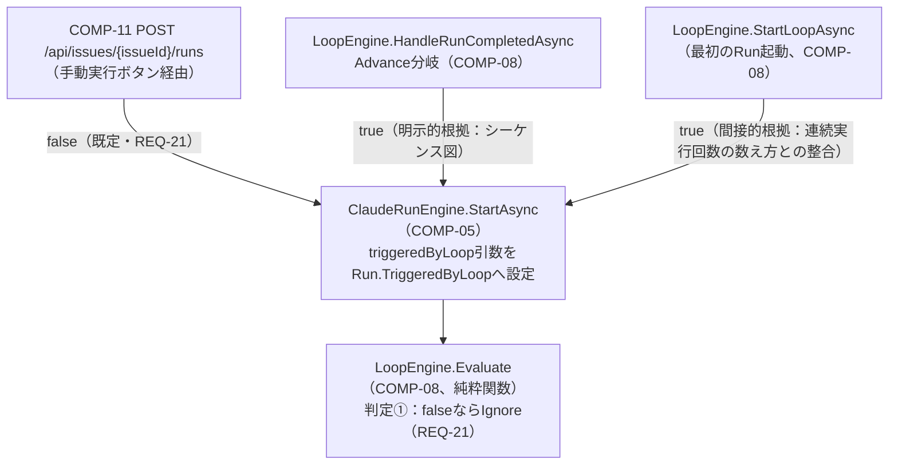

# COMP-02 `Run` モデル拡張

**対象ファイル**: `src/ClaudeCodeGui/Models/Run.cs`

**関数設計の要否についての判断**: `Run`はコンポーネント設計書3.1節でCOMP-01（`Issue`）と同様「振る舞いを持たないデータ構造」の追加として位置づけられている（3.1節COMP-02の記載は責務・プロパティ表のみで、独立したメソッド・関数は一切定義されていない）。実装上も既存の`Run`（`src/ClaudeCodeGui/Models/Run.cs`）は`Id`/`IssueId`/`TemplateId`/`Stage`/`PermissionMode`/`Status`/`ExitCode`/`ResultSummary`/`IsError`/`StartedAt`/`FinishedAt`の11プロパティすべてが自動実装プロパティ（`{ get; set; }`）またはプロパティ初期化子のみで構成されており、ファクトリメソッド・バリデーションメソッドの類は存在しない。

追加される`IsMock`・`TriggeredByLoop`もいずれも単純な`bool`（既定値`false`）であり、相互依存や複合的な不変条件（invariant）を持たない。

以上より、**本コンポーネントには独立した関数はなく、プロパティの読み書きは各利用コンポーネント（COMP-05, COMP-08）の関数設計側で規定する**。以下は、その委譲関係を明確にするための「プロパティ×読み書き元」対応表である（COMP-01と同じ形式）。

#### 追加プロパティと読み書き元

| プロパティ | 型 / 既定値 | 書き込み元（副作用を伴う関数） | 読み取り元 |
|---|---|---|---|
| `IsMock` | `bool` / `false` | `ClaudeRunEngine.StartAsync`（COMP-05）。`MockRunGenerator.ShouldUseMock(configMockMode, cliPath)`（COMP-06、純粋関数）の判定結果を、Run生成後・保存前に`Run.IsMock`へ設定する（コンポーネント設計書3.3節COMP-05「処理フロー」手順3「Run.IsMock・TriggeredByLoopを設定して保存」を参照） | `wwwroot/app.js`の`renderRunHistory`（既存関数、Run一覧表示。REQ-03）。表示先の帰属は下記「`IsMock`表示先の割り当てに関する確認事項」を参照 |
| `TriggeredByLoop` | `bool` / `false` | `ClaudeRunEngine.StartAsync`（COMP-05）。呼び出し元が渡す`triggeredByLoop`引数（既定`false`）をそのまま`Run.TriggeredByLoop`へ設定する。呼び出し元ごとの値・根拠は下記「`TriggeredByLoop`の書き込み経路（補足）」を参照 | `LoopEngine.Evaluate`（COMP-08、純粋関数）。判定①`completedRun.TriggeredByLoop == false`で`Ignore`（手動実行はループ継続のトリガーにしない＝REQ-21） |

##### `TriggeredByLoop`の書き込み経路（補足）

上表の書き込み元は、呼び出し元によって渡す値と根拠の確度が異なるため、詳細を以下に補足する。

- 手動「実行」ボタン経由（COMP-11 `POST /api/issues/{issueId}/runs`ハンドラ）: 引数を指定しないため常に`false`（REQ-21）。
- `LoopEngine.HandleRunCompletedAsync`のAdvance分岐（COMP-08）: `triggeredByLoop: true`を明示的に渡す。component_design.md 4.1節のシーケンス図に明示的根拠あり。
- `LoopEngine.StartLoopAsync`（最初のRunを起動する経路、COMP-08）: `triggeredByLoop: true`を渡す必要があると判断したが、こちらはシーケンス図に明示的記載はなく、COMP-08「連続実行回数の数え方」節の記述〈`StartLoopAsync`が最初のRunを起動する時点で`LoopConsecutiveRunCount=1`とする〉と整合するには`TriggeredByLoop=true`を渡す必要がある、という間接的根拠による（`LoopConsecutiveRunCount`は`TriggeredByLoop=true`のRun数の上限としてカウントされるため）。

##### `IsMock`表示先の割り当てに関する確認事項

REQ-03は「Run**一覧・詳細表示**でモック実行を区別できるようにする」ことを求めている（requirements.md REQ-03、およびarchitecture-overview.md 4.1節#8「履歴上の区別」も同旨）。この「一覧」「詳細表示」の2箇所それぞれについて、`wwwroot/app.js`を確認し、担当する既存関数・箇所を特定した上で帰属先コンポーネントの有無を検討した。両者の比較は以下のとおり。

| 観点 | 一覧側（`renderRunHistory`） | 詳細表示側（`#run-log` ／ `appendLogLine`・`connectRunStream`） |
|---|---|---|
| 担当画面要素 | Issue詳細画面の「実行履歴」テーブル`#run-history-body` | `#run-log`（`renderIssueDetail`が生成するログビュー） |
| 該当関数（既存） | `renderRunHistory` | `appendLogLine`・`connectRunStream`・その呼び出し元`startRun`（実行中Run自動検出時は`selectIssue`も経路に含む） |
| component_design.md 3.5節（COMP-12〜16）上の帰属先 | いずれの節の責務にも該当しない | COMP-12が`connectRunStream(issueId, runId)`を新設する定義元だが、`isMock`をログビューへ反映する処理はいずれの節にも記載がない |
| 表示追加の規模 | `r.isMock`を参照する記述を足す程度の軽微な改修 | `isMock`が真の場合に`[mock] モック実行です`等の1行を追記する、または`#run-log`付近にバッジを1つ表示する程度の軽微な改修 |
| 実装工程での帰属候補の確度 | 「最も近い」既存改修コンポーネントを特定できない | COMP-12を「最も近い」既存改修コンポーネントとして扱うことは妥当な選択肢 |

以下、それぞれの確認経緯を補足する。

###### 一覧側（`renderRunHistory`）

`renderRunHistory`（既存関数、`wwwroot/app.js`。Issue詳細画面の「実行履歴」テーブル`#run-history-body`を描画する）が一覧表示を担う。component_design.md 3.5節（COMP-12〜16、いずれも`wwwroot/app.js`/`styles.css`が対象）を確認したところ、`renderRunHistory`へ`IsMock`表示列・バッジを追加する改修は、COMP-12（SSE自動再接続・実行中Run検出）、COMP-13（排他制御拒否時のUX誘導）、COMP-14（自律ループ操作UI）、COMP-15（GUI配置の改善。対応範囲はREQ-04・REQ-05に限定する旨が明記されている）、COMP-16（テンプレート既定フラグ編集UI）のいずれの責務にも該当しない。

*結論*: `renderRunHistory`への表示追加自体は、Run一覧行のテンプレート文字列に`r.isMock`を参照する記述を足す程度の軽微な改修であり、新規の関数・ロジックを要しない。ただしREQ-03のUI表示部分を担うコンポーネントがcomponent_design.md上に明示的に存在しないことを確認した（COMP-01の関数設計レビューラウンド1で発覚した`DefaultPermissionMode`妥当性検証の帰属先欠落と同種の、上流ドキュメントの記載欠落）。

###### 詳細表示側（実行ログビュー `#run-log` ／ `appendLogLine`・`connectRunStream`）

`wwwroot/app.js`を確認したところ、Run一覧のテーブル行には過去Runの詳細を開くクリックハンドラ等は実装されておらず、Run単位の詳細な内容（`type:"system"`/`type:"assistant"`/`type:"result"`の各行）を表示する画面要素は、`#run-log`（`renderIssueDetail`が生成する`
`）のみである。この`#run-log`への描画は、SSEで届いた1行を整形して追記する`appendLogLine`（既存関数）と、それを呼び出す既存の`startRun`が担っている。

component_design.md 3.5節COMP-12は、この`startRun`のEventSource接続部分を`connectRunStream(issueId, runId)`という新設関数へ切り出すリファクタリングを規定している（「既存の`startRun`は、Run開始APIの成功後に`connectRunStream(issue.id, run.id)`を呼ぶ形へリファクタリングする」）。すなわち実装工程後は、`#run-log`への描画は`appendLogLine`と`connectRunStream`（およびその呼び出し元`startRun`、実行中Run自動検出時は`selectIssue`）が担う設計である。

しかし、COMP-12の`connectRunStream(issueId, runId)`は引数に`issueId`と`runId`のみを取り、`Run`オブジェクト（`isMock`を含む）を受け取らない設計になっている。呼び出し元の`startRun`はRun開始APIのレスポンスとして`isMock`を含む`Run`オブジェクトを既に取得しているため情報自体は呼び出し元に存在するが、component_design.md 3.5節（COMP-12〜16）のいずれの記載にも、`appendLogLine`・`connectRunStream`・`startRun`に`IsMock`をログビューへ反映させる処理は含まれていない。実行中Run自動検出（`selectIssue`が`runs.find(r => r.status === "running")`から`connectRunStream`を呼ぶ経路）についても同様に、検出した`runningRun.isMock`を表示へ反映する記述はない。すなわち一覧側と同種の帰属先欠落が詳細表示側にも存在することを確認した。

*結論*: 詳細表示側についても、一覧側と同じくREQ-03のUI表示部分を担うコンポーネントがcomponent_design.md上に明示的に存在しない。表示追加自体は、Runの`isMock`が真の場合に`appendLogLine`呼び出しの前後で`[mock] モック実行です`等の1行をログビューへ追記する、または`#run-log`付近にバッジを1つ表示する程度の軽微な改修であり、新規の関数・ロジックを要しない。

###### component_design.mdの扱い・今後の対応（一覧側・詳細表示側 共通）

*結論（component_design.mdの扱い）*: component_design.mdは本工程の上流で確定済みの文書であり、本関数設計工程からその記載内容（新規コンポーネントの追加やCOMP-12〜16の責務範囲変更）を書き換えることはできない。

*今後の対応（申し送り）*: 実装工程で`renderRunHistory`（一覧側）・`appendLogLine`/`connectRunStream`/`startRun`（詳細表示側）を改修する際、これらの表示追加をどのコンポーネントの実装範囲に含めるか、独立した軽微な改修として扱うかを実装時点で確定する。ただし一覧側と詳細表示側とでは、帰属先候補の根拠の強さが異なる点に注意すること。

- 詳細表示側: component_design.md 3.5節COMP-12（責務「SSE自動再接続・実行中Run検出」）は`connectRunStream(issueId, runId)`自体を新設する定義元であるため、COMP-12を「最も近い」既存改修コンポーネントとして実装範囲に含めることは妥当な選択肢である。
- 一覧側: `renderRunHistory`はCOMP-12〜16（本節上の「一覧側」で確認済みのとおり、COMP-12を含むいずれの節にも明示的に含まれない）のいずれの責務にも含まれておらず、component_design.md上に「最も近い」既存改修コンポーネントは特定できない。実装工程では、便宜上COMP-12へ含めるか、独立した軽微な改修として扱うかを別途確定する必要がある。

本節（COMP-02）ではこれ以上の判断は行わない。

#### 補助関数の要否

初期化用ファクトリメソッド・バリデーションメソッドについても検討したが、以下の理由により追加不要と判断した。

##### 理由1: 初期化の単純さ

追加2プロパティはいずれも単純な既定値（`false`）で足り、既存11プロパティ同様プロパティ初期化子で完結する。相互に依存する初期化順序や複合的な不変条件（invariant）が存在しない。

##### 理由2: 値の妥当性検証について

`IsMock`・`TriggeredByLoop`はいずれも`bool`型であり、C#の型システム自体が取りうる値を`true`/`false`の2値に制約するため、`DefaultPermissionMode`（`string`、COMP-01参照）のような追加の妥当性検証（既知の文字列集合に含まれるかのチェック）は原理的に不要である。COMP-01で発覚したような「検証ロジックの帰属先が上流ドキュメントに存在しない」という欠落は、本コンポーネントの追加プロパティ自体には該当しない（上記の表示先の帰属先欠落とは別種の論点である）。

対応ID: REQ-03, REQ-21

