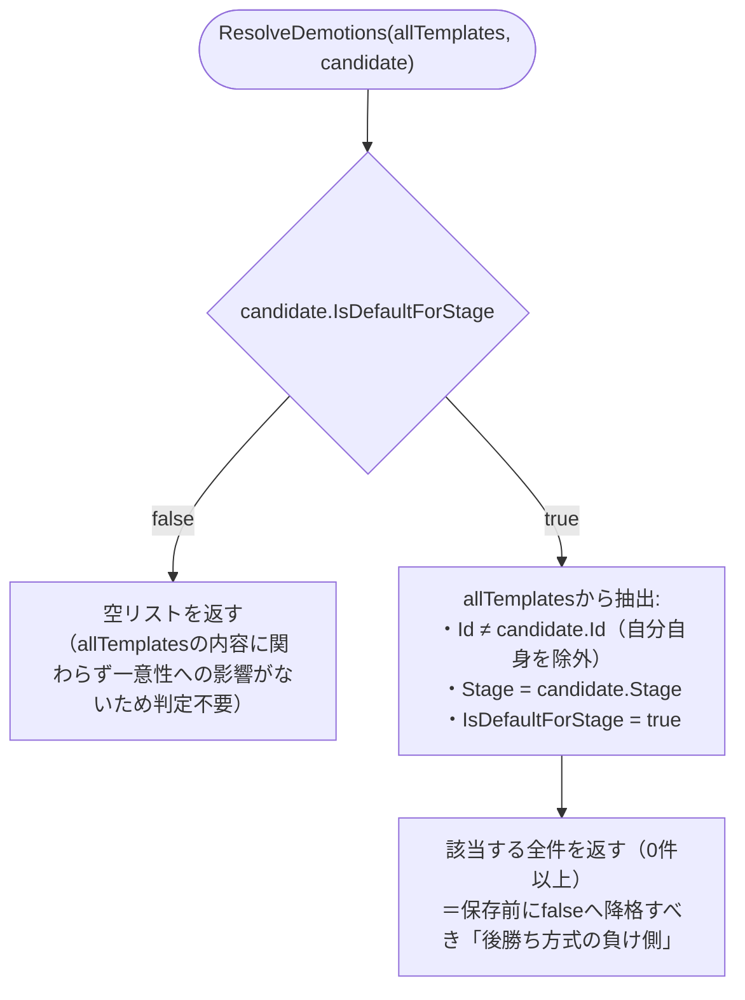

# COMP-03 `PromptTemplate` モデル拡張 / `TemplateSeeder` 変更

**対象ファイル**: `src/ClaudeCodeGui/Models/PromptTemplate.cs`, `src/ClaudeCodeGui/Data/TemplateSeeder.cs`, `src/ClaudeCodeGui/Services/PromptTemplateDefaultResolver.cs`（新規）

**COMP-01/02との違い**: COMP-01（`Issue`）・COMP-02（`Run`）はいずれも「振る舞いを持たないデータ構造の追加のみ」で独立した関数が不要だったのに対し、COMP-03はモデル拡張（`PromptTemplate.IsDefaultForStage`）に加え、「Stageごとに既定は1つまで」という不変条件を担保する副作用のないロジック関数`PromptTemplateDefaultResolver.ResolveDemotions`（component_design.md 3.1節、レビューラウンド3でHTTPハンドラ内実装の選択肢を削除しロジック層へ一本化）を新規に持つ。以下、モデル拡張部分（2.3.1）とロジック関数部分（2.3.2）を分けて記載する。

#### 2.3.1 モデル拡張: `PromptTemplate.IsDefaultForStage`

**関数設計の要否についての判断**: `IsDefaultForStage`自体は`Id`/`Name`/`Stage`/`Body`等の既存4プロパティ同様、自動実装プロパティ（`{ get; set; }`）として追加するのみであり、`PromptTemplate`モデル自身にファクトリメソッド・バリデーションメソッドは不要（COMP-01/02と同じ判断根拠）。ただし、この値が満たすべき不変条件（Stageごとに唯一）の判定ロジックはモデル自身ではなく`PromptTemplateDefaultResolver`（2.3.2節）が担う設計であり、COMP-01の`DefaultPermissionMode`のように「検証ロジックの帰属先が存在しない」欠落には該当しない（component_design.md 3.1節で明示的にCOMP-03自身の責務として切り出し済み）。

##### 追加プロパティと読み書き元

| プロパティ | 型 / 既定値 | 書き込み元（副作用を伴う関数） | 読み取り元 |
|---|---|---|---|
| `IsDefaultForStage` | `bool` / `false` | ①`TemplateSeeder.SeedDefaultsAsync`（本節2.3.3、初回起動時に5件全てを`true`で作成）<br>②COMP-11 `POST /api/templates`・`PUT /api/templates/{id}`ハンドラ（リクエストDTOの値をcandidateへ設定。`true`の場合は保存前に`PromptTemplateDefaultResolver.ResolveDemotions`（2.3.2）の戻り値に基づき他テンプレートを`false`へ降格してから、candidate自身を保存する。手順はcomponent_design.md 157〜165行目のフロー図のとおり） | `PromptTemplateDefaultResolver.ResolveDemotions`（COMP-03自身、2.3.2。同一Stageの他テンプレートの現在値を判定に使う）<br>`LoopEngine.ResolveDefaultTemplate`（COMP-08、純粋関数。指定Stageで`IsDefaultForStage == true`の1件を検索する。関数設計はCOMP-08の関数設計工程で確定する）<br>`wwwroot/app.js`（COMP-16、テンプレート作成/編集フォームの「この工程の既定テンプレートにする」チェックボックスへ初期状態を反映） |

`ResolveDefaultTemplate`（COMP-08所属）は`IsDefaultForStage`の主要な読み取り元だが、関数自体の入出力仕様（シグネチャ・事前条件・事後条件・境界値）はCOMP-08の関数設計節で確定する（本節では重複記載しない。1節「設計方針」の対応ID一次情報源の方針に準拠）。

#### 2.3.2 ロジック関数: `PromptTemplateDefaultResolver.ResolveDemotions`

**責務**: 「Stageごとに既定は1つまで」という不変条件を、保存前にどのテンプレートを降格（`IsDefaultForStage = false`へ）すべきかという形で判定する。component_design.md 3.1節で確定済みのシグネチャ・コメントをそのまま踏襲し、変更しない。

```csharp
public static class PromptTemplateDefaultResolver
{
    public static IReadOnlyList<PromptTemplate> ResolveDemotions(
        IReadOnlyList<PromptTemplate> allTemplates, PromptTemplate candidate);
}
```

**純粋関数（ストア等への副作用なし、単体テスト対象、NFR-03）**。

**事前条件**:

- `allTemplates`: null不可。呼び出し元（COMP-11のPOST/PUTハンドラ）が`JsonFileStore<PromptTemplate>.GetAllAsync()`の結果をそのまま渡す。0件（空リスト）は許容する。
- `candidate`: null不可。POST時はリクエストDTOから構築した未保存の新規テンプレート（`Id`は新規採番済み、`allTemplates`にはまだ含まれない）。PUT時は更新後の値を反映したテンプレート（`Id`は`allTemplates`中の対象テンプレートと同一）。いずれの経路でも呼び出し元が`Id`・`Stage`・`IsDefaultForStage`を確定させた状態で渡す。

**事後条件・戻り値の意味**:

- `candidate.IsDefaultForStage == false`の場合、一意性への影響がないため常に空リスト（`allTemplates`の内容に関わらず判定不要。component_design.md 150行目のコメントのとおり）。
- `candidate.IsDefaultForStage == true`の場合、`allTemplates`のうち「`Id`が`candidate.Id`と異なる」かつ「`Stage`が`candidate.Stage`と等しい」かつ「`IsDefaultForStage == true`」の全件を返す（0件以上）。これらが保存前に`false`へ降格されるべき「後勝ち方式の負け側」。
- `candidate`自身は`Id`一致により判定対象から常に除外する（PUT時に`allTemplates`へ含まれる自分自身を誤って降格対象に含めない設計上必須の条件。POST時は`candidate.Id`が新規採番でありそもそも`allTemplates`中に一致するIdが存在しないため、この除外条件は実害を生まないが、POST/PUT両経路で同一ロジックを共有できるようあえて条件から外さない）。
- `allTemplates`・`candidate`いずれも変更しない（副作用なし）。新しいリストを構築して返す。
- 同一Stageに`IsDefaultForStage == true`のテンプレートが（データ不整合等により）2件以上existingですでに存在するケースでも、`candidate`以外の該当するもの全てを返す（1件のみを返す設計にはしない）。呼び出し元がこれら全てを`false`へ更新して保存すれば、結果的に不変条件（Stageごとに既定は1つまで）が自己修復される。

##### `ResolveDemotions`のアルゴリズム（補足図）

上記の事後条件をフローチャートで整理すると以下のとおり。`candidate`自身はId一致により判定対象から常に除外される点、および`candidate.IsDefaultForStage`が`true`のときのみ`allTemplates`側のフィルタリングが行われる点が要点である。



##### 代表的な境界値・分岐条件

`candidate.IsDefaultForStage`の値によって分岐が大きく二分される（`false`なら`allTemplates`の内容によらず常に空リスト、`true`なら`allTemplates`側の状態に応じて戻り値が変わる）ため、以下では値ごとに表を分けて示す（#は元の8パターンの通し番号）。

###### `candidate.IsDefaultForStage == false`の場合

| # | `allTemplates` | 期待される戻り値 |
|---|---|---|
| 2 | 空リスト | 空リスト |
| 8 | 任意 | 空リスト（`allTemplates`の内容に関わらず） |

###### `candidate.IsDefaultForStage == true`の場合

| # | `allTemplates` | 期待される戻り値 |
|---|---|---|
| 1 | 空リスト | 空リスト（対象が存在しないため） |
| 3 | 同一Stageの既存default trueがcandidate自身のみ（PUTで他に競合なし） | 空リスト（Id一致で自己除外され、他に該当なし） |
| 4 | 同一Stageに他テンプレート1件が`IsDefaultForStage=true` | その1件を含むリスト（1件） |
| 5 | 異なるStageに`IsDefaultForStage=true`のテンプレートが存在 | 空リスト（Stage不一致のため対象外） |
| 6 | 同一Stageに他テンプレートが複数あるが全て`IsDefaultForStage=false` | 空リスト（降格対象なし、`false`のテンプレートは元々対象外） |
| 7 | 同一Stageに（データ不整合により）`IsDefaultForStage=true`が2件以上存在（candidate以外） | 該当する全件（2件以上） |

**呼び出し元（COMP-11、副作用担当）との関係**: COMP-11のテンプレートPOST/PUTハンドラは、①リクエストDTOからcandidateを構築→②`GetAllAsync()`で全件取得→③`ResolveDemotions(allTemplates, candidate)`を呼ぶ→④返ってきた降格対象それぞれの`IsDefaultForStage`を`false`にして保存→⑤candidate自身を保存、という手順を踏むだけであり（component_design.md 159〜165行目のフロー図のとおり）、一意性の判定ロジック自体はハンドラ側に一切持たない。この呼び出し手順自体はcomponent_design.md側で確定済みのため、本関数設計工程では変更しない。

#### 2.3.3 既存関数の変更: `TemplateSeeder.SeedDefaultsAsync`

**対象ファイル**: `src/ClaudeCodeGui/Data/TemplateSeeder.cs`（既存ファイル）

**シグネチャ**: `public static async Task SeedDefaultsAsync(JsonFileStore<PromptTemplate> store)`（変更なし）。副作用（`store.GetAllAsync()`・`store.SaveAsync()`呼び出し）を伴うため純粋関数ではない。

**変更内容**: 初回起動時に投入する5件（`requirements`/`design`/`implementation`/`testing`/`deployment`の各Stage1件ずつ）の既定テンプレートのオブジェクト初期化子に、それぞれ`IsDefaultForStage = true`を追加する（component_design.md 169行目）。

**事前条件**: `store`は初期化済みの`JsonFileStore<PromptTemplate>`インスタンス（既存のまま変更なし）。

**事後条件**:

- 呼び出し時点で`store`が空でない場合（`existing.Count > 0`）: 何もせず即座に戻る（既存の冪等性ガードをそのまま維持。既存テンプレートの`IsDefaultForStage`は一切変更しない）。
- 呼び出し時点で`store`が空の場合: 5件のテンプレートをStageごとに1件ずつ生成し、それぞれ`IsDefaultForStage = true`を設定して`SaveAsync`する。結果として5つのStage全てに、唯一の`IsDefaultForStage = true`テンプレートが存在する状態になる（COMP-08 `LoopEngine`が起動できるための前提条件。component_design.md 169行目「既定テンプレートが1つも設定されていない状態だと自律ループが起動できないため」）。

**代表的な境界値・分岐条件**:

| # | 呼び出し時点の`store`の状態 | 結果 |
|---|---|---|
| 1 | 空（`existing.Count == 0`） | 5件seed。各Stage1件ずつ、いずれも`IsDefaultForStage = true` |
| 2 | 1件以上既存 | 早期return。既存データは一切変更しない |

**`ResolveDemotions`（2.3.2）を呼ばない理由**: seed実行時は`store`が空であることが呼び出し条件（分岐#1）であり、5件のStageは互いに異なるため、同一Stage内で複数の`IsDefaultForStage = true`が競合する状況がそもそも発生しない。したがって一意性解決ロジックを介さず直接`SaveAsync`する設計で不変条件（Stageごとに既定は1つまで）は保たれる。一意性解決が必要になるのは、seed後にCOMP-11経由でテンプレートが追加・変更される実行時経路（2.3.2「呼び出し元」参照）のみである。

対応ID: REQ-15

