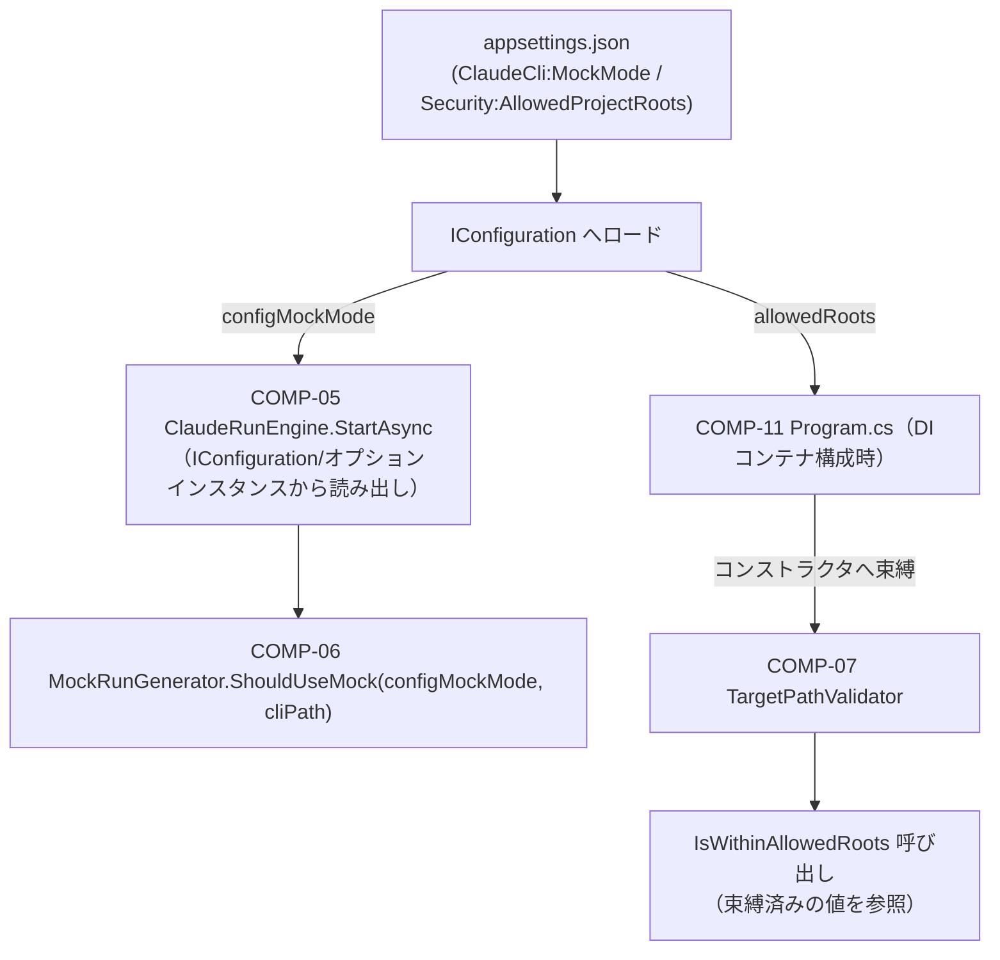

# COMP-04 `appsettings.json` 拡張

**対象ファイル**: `src/ClaudeCodeGui/appsettings.json`

**関数設計の要否についての判断**: COMP-04はコンポーネント設計書3.2節で「設定値の追加のみ」と位置づけられている。追加される`ClaudeCli:MockMode`・`Security:AllowedProjectRoots`の2設定項目は、`ClaudeCli:Path`と同じくアプリ起動時の設定オブジェクトへ読み込まれるだけの単純な構成設定値であり、POCOまたはレコード型のプロパティとして定義・読み取りされる。`appsettings.json`自体には振る舞いロジックは存在しない。

本コンポーネントには独立した関数はなく、各設定値の読み取りは利用側コンポーネント（COMP-05, COMP-06, COMP-07）の関数設計側で規定する。以下は、その依存関係を明確にするための「設定値×読み取り元」対応表である（COMP-01「プロパティ×読み書き元」表と同じ形式を転用したもので、設定値を読み書きする関数を特定する）。

#### 追加設定値と読み取り元

| 設定値 | 型 | 既定値 | 意味 | 読み取り元 |
|---|---|---|---|---|
| `ClaudeCli:MockMode` | `bool` | `false` | モック実行モードの有効化（REQ-01, CON-01） | `COMP-06 MockRunGenerator.ShouldUseMock(configMockMode, cliPath)`（純粋関数。`COMP-05 ClaudeRunEngine.StartAsync`が呼び出す） |
| `Security:AllowedProjectRoots` | `string[]` | `[]`（空配列） | `TargetProjectPath`許可ルート群。空＝制限なし（REQ-06） | `AllowedProjectRoots`の値はCOMP-11のDI構成時に`TargetPathValidator`のコンストラクタへ一度だけ束縛され、以降各リクエストでの`IsAllowed(targetPath)`呼び出し時は既に束縛済みの値が参照される |

#### 補足: 構成値の読み取り箇所（実装段階で確定される詳細）

ASP.NET Core の標準設定解決（`appsettings.json` → `IConfiguration` → `IOptions<T>`）により、上記2設定値は下図の流れで読み込まれる。関数設計段階では型・意味のみを規定し、具体的な`AddOptions`/`Configure`の実装形態はCOMP-11の実装工程で確定する。

- `ClaudeCli:MockMode`: `COMP-06 MockRunGenerator.ShouldUseMock`が`bool configMockMode`引数として受け取る。値そのものは呼び出し側の`COMP-05 ClaudeRunEngine.StartAsync`が`IConfiguration`またはオプションインスタンスから読み出し、そのまま渡す。
- `Security:AllowedProjectRoots`: `COMP-07 TargetPathValidator`がコンストラクタ時にDI経由で`IReadOnlyList<string> allowedRoots`を受け取り、以後の`IsWithinAllowedRoots`呼び出しに使用する。設定値の読み込み自体はDIコンテナ側（`COMP-11 Program.cs`）が行い、本コンポーネントは受け取った値を利用するのみである。

対応ID: REQ-01, CON-01, REQ-06

