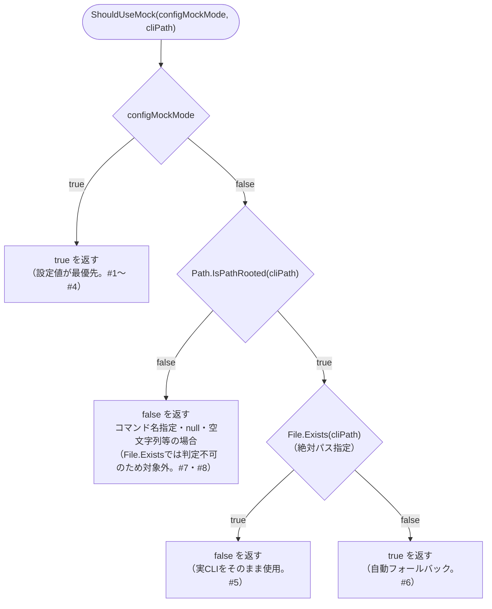

# COMP-06 `MockRunGenerator`（新規）

**対象ファイル**: `src/ClaudeCodeGui/Services/MockRunGenerator.cs`（新規）

**責務**: component_design.md 3.3節COMP-06（306〜328行目）を参照（内容は変更しない）。モック実行の要否判定（`ShouldUseMock`）と、Stage別サンプル出力の生成（`GenerateLines`）を担う、いずれも**副作用のない静的関数・純粋関数**（NFR-03、単体テスト対象）。COMP-05 `ClaudeRunEngine.StartAsync`（2.5.1節手順1）・`ExecuteAsync`（2.5.2節）が呼び出し元となる。

```csharp
public static class MockRunGenerator
{
    public static bool ShouldUseMock(bool configMockMode, string cliPath);
    public static IReadOnlyList<string> GenerateLines(string stage);
}
```

#### 2.6.1 `ShouldUseMock(bool configMockMode, string cliPath)`

**純粋関数（副作用なし、単体テスト対象、NFR-03）**。

**事前条件**:

- `configMockMode`: `appsettings.json`の`ClaudeCli:MockMode`から読み出された値（COMP-04 2.4節）。制約なし（`true`/`false`いずれも許容）。
- `cliPath`: `ClaudeRunEngine`が保持する`_claudeCliPath`（`appsettings.json`の`ClaudeCli:Path` ?? `"claude"`）。本関数自体はnull/空文字列も許容し例外を投げない（下記境界値#4・#8参照）。

**判定に用いるAPIの候補と選定**: 「`cliPath`が絶対パスかどうか」の判定には`System.IO.Path.IsPathRooted(string?)`を用いる（`null`・空文字列を渡しても例外を投げず`false`を返す、.NET標準の仕様）。代替候補として`Path.IsPathFullyQualified`も検討したが、こちらはWindows上でドライブレター必須などより厳密な判定になる。`"claude"`のようなコマンド名指定と絶対パス指定を区別するという本関数の目的に対しては`Path.IsPathRooted`で十分であり、既存実装（`ClaudeRunEngine`コンストラクタの`_claudeCliPath`既定値`"claude"`）との整合も取りやすいため、`Path.IsPathRooted`を採用する。

**事後条件・戻り値の意味**:

- `configMockMode == true`の場合、`cliPath`の値によらず常に`true`を返す（設定値が最優先。REQ-01「明示的にON/OFFできる」）。
- `configMockMode == false`の場合のみ、`cliPath`の実行可否判定に進む。
  - `Path.IsPathRooted(cliPath) == true`（絶対パス指定）かつ`File.Exists(cliPath) == false`（ファイル不在）の場合のみ`true`（自動フォールバック、REQ-01後段）。
  - `Path.IsPathRooted(cliPath) == true`かつ`File.Exists(cliPath) == true`の場合は`false`（実CLIをそのまま使用）。
  - `Path.IsPathRooted(cliPath) == false`（コマンド名指定など、PATH解決に依存する形）の場合は`File.Exists`による判定を行わず、常に`false`を返す。これは、PATH解決に依存するコマンド名指定は`File.Exists`では実行可否を判定できないため対象外とする、という制約による（component_design.md注記のとおり）。この場合の実行可否の最終判断は、`ExecuteAsync`側の実プロセス起動失敗時の`catch`節（2.5.2節、既存の例外処理経路）に委ねる。

##### `ShouldUseMock`の判定フロー（補足図）

上記の事後条件（`configMockMode`優先→絶対パス判定→ファイル存在確認、の順に評価する分岐構造）をフローチャートで整理すると以下のとおり。各終端の分岐条件・戻り値は、後述の真理値表（境界値・分岐条件）の該当パターンと対応している。



**参考実装（アルゴリズム）**:

```csharp
public static bool ShouldUseMock(bool configMockMode, string cliPath)
{
    if (configMockMode) return true;
    return Path.IsPathRooted(cliPath) && !File.Exists(cliPath);
}
```

**境界値・分岐条件（真理値表）**:

| # | `configMockMode` | `cliPath`の分類 | `Path.IsPathRooted` | `File.Exists`判定 | 戻り値 | 備考 |
|---|---|---|---|---|---|---|
| 1 | `true` | 絶対パス・実在（例: `C:\...\claude.exe`が存在） | `true` | 判定しない | `true` | 設定値が最優先 |
| 2 | `true` | 絶対パス・不在 | `true` | 判定しない | `true` | 同上 |
| 3 | `true` | コマンド名指定（例: `"claude"`） | `false` | 対象外 | `true` | 同上 |
| 4 | `true` | `null`または空文字列（境界値） | `false`（例外を投げない） | 対象外 | `true` | 同上。`configMockMode`分岐で確定するため`cliPath`の値を評価する前に返る |
| 5 | `false` | 絶対パス・実在 | `true` | `true` | `false` | 実CLIが使用可能と判定、モック不要 |
| 6 | `false` | 絶対パス・不在 | `true` | `false` | `true` | 自動フォールバック（REQ-01後段） |
| 7 | `false` | コマンド名指定（PATH解決依存） | `false` | 判定しない（対象外） | `false` | `File.Exists`で判定できないための制約。実行時にCLI起動を試み、失敗時は`ExecuteAsync`の既存`catch`節に委ねる |
| 8 | `false` | `null`または空文字列（境界値） | `false`（例外を投げない） | 判定しない | `false` | `Path.IsPathRooted(null)`/`Path.IsPathRooted("")`はいずれも`false`を返すため、#7のコマンド名指定と同じ扱いになる |

#### 2.6.2 `GenerateLines(string stage)`

**純粋関数（副作用なし、単体テスト対象、NFR-03）**。Issueの実データには一切依存しない（REQ-02）。

**事前条件**:

- `stage`: `PromptTemplate.Stage`相当の文字列。COMP-03（`TemplateSeeder.SeedDefaultsAsync`、2.3.3節）が定義する既知の5値（`"requirements"`/`"design"`/`"implementation"`/`"testing"`/`"deployment"`）を主な想定入力とするが、本関数はこれらの値による分岐処理を一切行わない（下記「`stage`引数による変化の範囲」参照）。`null`・空文字列・未知の文字列も含め、あらゆる`string`値を受け付け例外を投げない（C#の文字列補間は`null`を空文字列として展開するため、これらの値でも呼び出しが失敗しない）。

**`stage`引数による変化の範囲**: component_design.md 318行目の「Stageごとの汎用サンプル」は、既知のStage名ごとに文面を出し分ける分岐処理を要求するものではなく、**返す3行のテキスト中に`stage`の値をそのまま埋め込む**程度の違いにとどめる（COMP-06の責務は「Issueの実データに依存しない汎用サンプルであること」の担保であり、Stage名自体による細かな文面の作り込みは要件の対象外）。そのため未知のStage文字列・`null`・空文字列が渡された場合も、分岐エラーや例外は発生せず、同じ構造の3行がそのまま返る（下記境界値#4参照）。

**返す3行の正確なJSON構造**: 戻り値は要素数3の`IReadOnlyList<string>`で、各要素は改行を含まない1行のJSON文字列（stream-json形式）。`wwwroot/app.js`の`appendLogLine`（211〜230行目）が要求する必須フィールドとの対応は以下のとおり。

| # | `type` | JSON構造（例、`{stage}`は引数の値をそのまま埋め込み） | `appendLogLine`側の対応処理 |
|---|---|---|---|
| 1 | `"system"` | `{"type":"system","session_id":"mock-session-{stage}"}` | `obj.type === "system"`分岐で`obj.session_id`を`[system] session=...`として表示 |
| 2 | `"assistant"` | `{"type":"assistant","message":{"content":[{"type":"text","text":"[mock] {stage}工程のモック実行サンプル出力です。"}]}}` | `obj.type === "assistant"`分岐で`obj.message.content[].text`を収集し`[assistant] ...`として表示（`content`配列は要素数1、`text`は空文字列にしない。空にすると`appendLogLine`のフォールバック分岐＝生JSON行がそのまま表示される経路に落ちるため） |
| 3 | `"result"` | `{"type":"result","is_error":false,"result":"モック実行が完了しました（stage: {stage}）"}` | `obj.type === "result"`分岐で`obj.is_error`・`obj.result`を`[result] is_error=false ...`として表示。`ApplyResult`（COMP-05）も同一行から`is_error`・`result`を読み取る |

**`IsError`/`result`（`ApplyResult`が読み取るフィールド）の値**: モック実行は常に成功として扱う。3行目（`type:"result"`）は`is_error`を常に`false`、`result`を常に非null・非空の完了メッセージ文字列とする。COMP-05 2.5.2節の設計により、モック実行時の`exitCode`は`0`固定であるため、`ApplyResult`到達時の`run.Status`は`exitCode == 0 && !run.IsError`の判定により常に`"succeeded"`になる（`GenerateLines`側が失敗ケースを模擬する必要はない。REQ-02は成功パスの共通経路検証を目的としており、異常系のモックはCOMP-06の責務に含まれない）。

**`"type":"result"`の部分文字列一致制約**: `ExecuteAsync`（COMP-05、既存実装134行目・2.5.2節）は、モック実行時も本番実行時と同じ`line.Contains("\"type\":\"result\"")`判定で`lastResultLine`を捕捉する。この判定はキーと値の間にスペースを含まない厳密な部分文字列一致であるため、`GenerateLines`が返す3行目のJSON文字列は、`"type"`キーと`"result"`値の間に空白を含めない形（`"type":"result"`）で構成する必要がある。`System.Text.Json.JsonSerializer`の既定設定（インデントなし）はコロン後にスペースを挿入しないためこの制約を満たすが、文字列リテラルで直接組み立てる実装を選ぶ場合は、この部分文字列が崩れないよう注意する（実装工程での申し送り事項）。

**境界値・分岐条件**:

| # | `stage`の値 | 戻り値 |
|---|---|---|
| 1 | 既知のStage名（例: `"requirements"`） | 3行（system/assistant/result）。テキスト中の`{stage}`部分に`"requirements"`が埋め込まれる |
| 2 | 既知の別のStage名（例: `"deployment"`） | 同様に3行。分岐処理はなく、埋め込まれる文字列のみが異なる |
| 3 | 未知のStage文字列（例: `"unknown-stage"`、境界値） | 例外を投げず、同じ構造の3行を返す（`{stage}`部分に`"unknown-stage"`がそのまま埋め込まれる） |
| 4 | `null`または空文字列（境界値） | 例外を投げず、同じ構造の3行を返す（`{stage}`部分は空文字列として展開される） |
| 5 | 常に共通 | 戻り値の要素数は常に3、`type`の並びは常に`system`→`assistant`→`result`固定（COMP-05側が3行全てに`ctx.Append`を呼ぶ前提と整合、2.5.2節） |

対応ID: REQ-01, REQ-02

