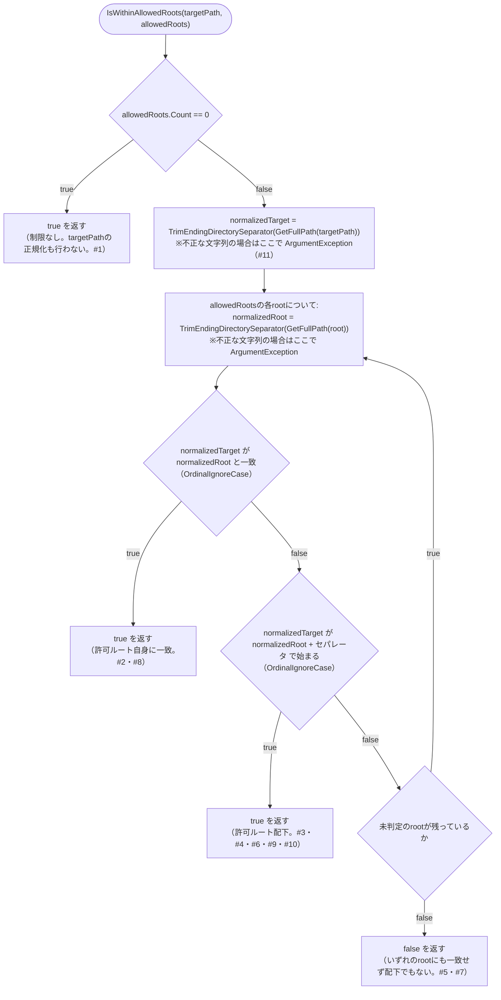

# COMP-07 `TargetPathValidator`（新規）

**対象ファイル**: `src/ClaudeCodeGui/Services/TargetPathValidator.cs`（新規）

**責務**: component_design.md 3.3節COMP-07（330〜360行目）を参照（内容は変更しない）。`Issue.TargetProjectPath`が運用者の許可した作業用ルートフォルダ群のいずれか配下にあるかを検証する。COMP-06 `MockRunGenerator`と同様、判定ロジック本体（`IsWithinAllowedRoots`）は**副作用のない静的純粋関数**（NFR-03、単体テスト対象）とし、インスタンス側（`IsAllowed`）は構成値を束縛して渡すだけの薄いラッパーとする。

```csharp
public class TargetPathValidator
{
    public TargetPathValidator(IReadOnlyList<string> allowedRoots);
    public bool IsAllowed(string targetPath);

    // 純粋関数本体（単体テスト対象）
    public static bool IsWithinAllowedRoots(string targetPath, IReadOnlyList<string> allowedRoots);
}
```

#### 2.7.1 既存`ArtifactService.ResolveWithinRoot`の比較ロジックの確認（設計の前提）

`IsWithinAllowedRoots`の比較ロジックを設計するにあたり、まず既存実装`ArtifactService.ResolveWithinRoot`（`src/ClaudeCodeGui/Services/ArtifactService.cs` 49〜58行目）の大文字小文字・セパレータの扱いを確認した。

```csharp
private static string ResolveWithinRoot(string rootPath, string relativePath)
{
    var root = Path.GetFullPath(rootPath);
    var combined = Path.GetFullPath(Path.Combine(root, relativePath ?? ""));
    if (combined != root && !combined.StartsWith(root + Path.DirectorySeparatorChar, StringComparison.OrdinalIgnoreCase))
    {
        throw new UnauthorizedAccessException("対象プロジェクトディレクトリの外にはアクセスできません。");
    }
    return combined;
}
```

**確認事項（重要な発見）**: この既存コードは、同一メソッド内で大文字小文字の扱いが**不統一**になっている。

| 判定対象 | 比較方法 | 大文字小文字 |
|---|---|---|
| ルート自身との一致（`combined != root`） | 既定の`!=`演算子 | 区別する（`Ordinal`相当） |
| 配下判定（`StartsWith`） | `StringComparison.OrdinalIgnoreCase`を明示指定 | 区別しない |

この不統一を踏まえ、既存コード・`TargetPathValidator`それぞれでの扱いを整理する。

- **既存`ResolveWithinRoot`でこの不統一が実害を生まない理由**: `combined`は`root`自身を`Path.Combine`の第1引数に使って構築されるため、`combined`の`root`部分の文字列（大文字小文字を含む）は常に`root`と同一になる。したがって`relativePath`が`""`または`"."`等でルート自身を指す場合、`combined`と`root`は常に同一の大文字小文字で一致し、`!=`判定でも問題が生じない。
- **`TargetPathValidator`ではこの前提が成り立たない**: `IsWithinAllowedRoots`が比較する`targetPath`と`allowedRoots`の各要素は、一方から他方を`Path.Combine`で構築したものではなく、**独立に入力される2つの文字列**である（`targetPath`はIssue登録時に運用者が入力した`TargetProjectPath`、`allowedRoots`は`appsettings.json`の`Security:AllowedProjectRoots`）。そのため、同じフォルダを指していても大文字小文字表記が一致しない組み合わせ（例: 許可ルート`C:\Projects`、対象パス`C:\projects`）が現実に起こり得る。

**結論（大文字小文字の扱い）**: `IsWithinAllowedRoots`では、ルート自身に一致する場合の判定・配下判定の**両方**に`StringComparison.OrdinalIgnoreCase`を用いる。既存`ResolveWithinRoot`の実装をそのまま模倣するのではなく、上記の不統一を引き継がない（本PCで過去に発生したWindowsの大文字小文字非区別によるフォルダ衝突事故を踏まえ、NFR-01の趣旨＝意図しないフォルダへのアクセス防止に照らして、大文字小文字の違いだけで許可判定が変わることは避けるべきと判断した）。Windowsの既定ファイルシステム（NTFS）・SMB共有はいずれも大文字小文字を区別しないため、`OrdinalIgnoreCase`の採用はファイルシステムの実際の挙動とも整合する。

#### 2.7.2 `IsWithinAllowedRoots(string targetPath, IReadOnlyList<string> allowedRoots)`

**純粋関数（副作用なし、単体テスト対象、NFR-03）**。

**事前条件**:

| 引数 | 意味・由来 | null許容 | 不正な文字列（空文字列・ホワイトスペースのみ・不正な文字を含む場合等）の扱い |
|---|---|---|---|
| `targetPath` | `Issue.TargetProjectPath`相当の文字列 | 不可（呼び出し元がnullを渡す経路はない） | `Path.GetFullPath`が`ArgumentException`を送出する（例外を投げずプロセスのカレントディレクトリを返すわけではない）。本関数はこれを捕捉しない（呼び出し元がこの例外を処理する前提とする）。この場合の扱いは下記境界値#11参照 |
| `allowedRoots` | `appsettings.json`の`Security:AllowedProjectRoots`から読み出された値（COMP-04 2.4節）。要素が絶対パスであることを前提とする | 不可（呼び出し元は空配列`[]`を既定値として渡す） | 本関数自体は相対パス文字列が混入していても例外を投げない（`Path.GetFullPath`が呼び出し元プロセスのカレントディレクトリを基準に解決するため。運用者の設定ミスに対する追加の入力検証は行わない）。ただし要素が空文字列・ホワイトスペースのみ・不正な文字を含む文字列の場合は、`targetPath`と同様にループ内の`Path.GetFullPath(root)`で`ArgumentException`を送出する |

**例外契約（まとめ）**: 本関数は`targetPath`・`allowedRoots`の要素が不正な文字列（空文字列・ホワイトスペースのみ・Windowsで使用できない文字を含む場合等）であった場合に`Path.GetFullPath`由来の`ArgumentException`を送出しうる。本関数自身はこれを捕捉・変換しないため、呼び出し元（COMP-11）が例外処理の要否を実装工程で判断する。

**判定ロジック（正規化・比較）**:

1. `allowedRoots.Count == 0`の場合、常に`true`を返す（制限なし。component_design.md 345行目、COMP-04の設計判断）。この分岐が最優先であり、`targetPath`の正規化すら行わない。
2. `allowedRoots.Count > 0`の場合、以下を各要素について判定し、いずれか1つでも条件を満たせば`true`を返す（1件も満たさなければ`false`）。
   - `normalizedTarget = Path.TrimEndingDirectorySeparator(Path.GetFullPath(targetPath))`
   - 各`root`について`normalizedRoot = Path.TrimEndingDirectorySeparator(Path.GetFullPath(root))`
   - `string.Equals(normalizedTarget, normalizedRoot, StringComparison.OrdinalIgnoreCase)`（許可ルート自身に一致する場合）、または
   - `normalizedTarget.StartsWith(normalizedRoot + Path.DirectorySeparatorChar, StringComparison.OrdinalIgnoreCase)`（許可ルート配下にある場合）

##### `IsWithinAllowedRoots`の判定フロー（補足図）

上記の判定ロジック（`allowedRoots`が空かどうか→各`root`について「ルート自身か」「配下か」の順に評価する分岐構造）をフローチャートで整理すると以下のとおり。各終端の分岐条件・戻り値は、後述の境界値表（境界値・分岐条件）の該当パターン番号と対応している。



**`Path.TrimEndingDirectorySeparator`を用いる理由（セパレータの扱い）**: `allowedRoots`は運用者が`appsettings.json`に手入力する値であるため、末尾にセパレータが付く表記（例: `C:\Projects\`）・付かない表記（例: `C:\Projects`）の両方が入力され得る。`Path.GetFullPath`だけでは末尾セパレータの有無が保持されてしまい（`GetFullPath("C:\\Projects\\")`は末尾の`\`を保持する）、素朴に`root + Path.DirectorySeparatorChar`を組み立てると`C:\Projects\\`のような二重セパレータになり配下判定が常に失敗する不具合を生む。.NET標準の`Path.TrimEndingDirectorySeparator`は、末尾セパレータを除去しつつドライブルート（`C:\`）はそのまま維持する（除去すると`C:`という非ルートの相対パス表記になってしまうことを防ぐ）ため、`targetPath`・`allowedRoots`双方に一律で適用することで、入力表記の揺れを吸収する。`targetPath`側も同様に末尾セパレータが付いている可能性があるため、同じ処理を適用する。

**`../`を含む相対パス表記の扱い**: `targetPath`に`C:\Projects\..\Other`のような表記が含まれる場合も、`Path.GetFullPath`が`..`セグメントを解決してから比較するため（例: `C:\Other`に正規化）、意図せず許可ルート配下と誤判定されることはない。これは`ArtifactService.ResolveWithinRoot`が`../`によるディレクトリトラバーサルを防ぐのと同じ`Path.GetFullPath`の性質を利用している。

**相対パスの`targetPath`が渡された場合の限界（申し送り）**: `targetPath`自体が絶対パスでなく相対パス表記だった場合、`Path.GetFullPath`はASP.NET Coreプロセスのカレントディレクトリを基準に解決するため、結果はプロセスの起動条件に依存し呼び出しごとに一定しない可能性がある。`TargetPathValidator`自体はこれを検知・拒否しない（`allowedRoots`が空でない限り、解決結果が偶然いずれかのルート配下に一致しなければ`false`となり結果的に拒否されるが、意図した「相対パス表記そのものを拒否する」動作ではない）。この限界はcomponent_design.md 358行目が言及する「NFR-01への対応」の限界（`bypassPermissions`実行中のCLIプロセス自体のアクセス制御はしない）とは別種の限界であり、実装工程で`docs/architecture-overview.md`「7. 既知の制約」節へ追記する際にあわせて記載することを申し送る。

##### アルゴリズム（参考実装）

```csharp
public static bool IsWithinAllowedRoots(string targetPath, IReadOnlyList<string> allowedRoots)
{
    if (allowedRoots.Count == 0) return true;

    var normalizedTarget = Path.TrimEndingDirectorySeparator(Path.GetFullPath(targetPath));
    foreach (var root in allowedRoots)
    {
        var normalizedRoot = Path.TrimEndingDirectorySeparator(Path.GetFullPath(root));
        if (string.Equals(normalizedTarget, normalizedRoot, StringComparison.OrdinalIgnoreCase))
            return true;
        if (normalizedTarget.StartsWith(normalizedRoot + Path.DirectorySeparatorChar, StringComparison.OrdinalIgnoreCase))
            return true;
    }
    return false;
}
```

##### 境界値・分岐条件

| # | `allowedRoots` | `targetPath` | 判定の要点 | 戻り値 |
|---|---|---|---|---|
| 1 | 空配列 | 任意（例: `C:\Anything`） | 分岐1が最優先、正規化すら行わない | `true` |
| 2 | `["C:\Projects"]` | `C:\Projects`（許可ルート自身、完全一致） | `Equals`分岐で一致 | `true` |
| 3 | `["C:\Projects"]` | `C:\Projects\foo`（配下） | `StartsWith("C:\Projects\\")`分岐で一致 | `true` |
| 4 | `["C:\Projects\"]`（末尾セパレータあり） | `C:\Projects\foo` | `TrimEndingDirectorySeparator`により`allowedRoots`が#3と同じ`C:\Projects`に正規化される | `true` |
| 5 | `["C:\Projects"]` | `C:\Projects2\foo`（兄弟フォルダ、前方一致するが配下ではない、境界値） | `Equals`不一致。`StartsWith("C:\Projects\\")`も「`C:\Projects2`の12文字目が`\`ではなく`2`」のため不一致 | `false` |
| 6 | `["C:\Projects"]` | `C:\projects\foo`（大文字小文字が異なる） | `OrdinalIgnoreCase`により`3`と同一視される | `true` |
| 7 | `["C:\Projects"]` | `C:\Projects\..\Other`（`..`を含む表記） | `Path.GetFullPath`が`C:\Other`に正規化してから判定するため、実際には許可ルート外と判定される | `false` |
| 8 | `["C:\Projects"]` | `C:\Projects\sub\..`（配下から`..`で許可ルート自身へ戻る表記） | `Path.GetFullPath`が`C:\Projects`に正規化し、`Equals`分岐で一致 | `true` |
| 9 | `["C:\Projects", "D:\Work"]`（複数ルート） | `D:\Work\foo` | 1件目`Equals`/`StartsWith`とも不一致→2件目で`StartsWith`一致 | `true` |
| 10 | `["\\\\server\\share"]`（UNCパス） | `\\server\share\foo` | UNCパスも`Path.GetFullPath`・`StartsWith`の対象として同様に扱える（SMB共有も大文字小文字非区別のため`OrdinalIgnoreCase`と整合） | `true` |
| 11 | `["C:\Projects"]` | `""`（空文字列、境界値） | `Path.GetFullPath("")`は`ArgumentException`を送出する（`false`は返らない）。本関数はこれを捕捉しないため、呼び出し元に例外が伝播する | 例外（`ArgumentException`） |

#### 2.7.3 `IsAllowed(string targetPath)`

**薄いラッパー（副作用なし。コンストラクタで束縛した`allowedRoots`をそのまま`IsWithinAllowedRoots`へ渡すのみ）**。

```csharp
public class TargetPathValidator
{
    private readonly IReadOnlyList<string> _allowedRoots;

    public TargetPathValidator(IReadOnlyList<string> allowedRoots)
    {
        _allowedRoots = allowedRoots;
    }

    public bool IsAllowed(string targetPath) => IsWithinAllowedRoots(targetPath, _allowedRoots);
}
```

**事前条件**: `targetPath`は`IsWithinAllowedRoots`と同一（2.7.2節参照）。コンストラクタ引数`allowedRoots`はDIコンテナ構成時（COMP-11、Program.cs）に`appsettings.json`の`Security:AllowedProjectRoots`から一度だけ束縛される（component_design.md 2.4節「補足: 構成値の読み取り箇所」のシーケンスのとおり）。

**事後条件・戻り値の意味**: `IsWithinAllowedRoots(targetPath, _allowedRoots)`の戻り値をそのまま返す。本メソッド自身は正規化・比較ロジックを一切持たない（ロジックの二重実装を避け、単体テストは静的関数`IsWithinAllowedRoots`側に集約する。`IsAllowed`自体のテストは「コンストラクタに渡した値がそのまま静的関数へ渡ること」の確認に留める）。

**境界値・分岐条件**: 2.7.2節の境界値表がそのまま適用される（`allowedRoots`をコンストラクタ引数`allowedRoots`に読み替える）。`IsAllowed`固有の追加の境界値はない。

#### 2.7.4 呼び出し元との関係（COMP-11への依存関係の記載に留める）

`TargetPathValidator.IsAllowed`は、Issue作成・更新エンドポイント（`Program.cs`の`POST /api/issues`・`PUT /api/issues/{id}`ハンドラ、COMP-11）から呼び出される想定である。現状（本節作成時点）の`Program.cs`（28〜61行目）を確認したところ、両ハンドラはリクエストDTO（`CreateIssueRequest`/`UpdateIssueRequest`）が持つ`TargetProjectPath`を検証なしにそのまま`Issue.TargetProjectPath`へ設定しており、`TargetPathValidator`は未組み込みである。

- `TargetPathValidator`自体のDI登録（`builder.Services.AddSingleton<TargetPathValidator>(...)`等、コンストラクタへ`Security:AllowedProjectRoots`の値をどう束縛するか）、および`IsAllowed`が`false`を返した場合のHTTPレスポンス（例: `400 Bad Request`）の具体的な実装は、COMP-11自身の関数設計・実装工程で確定する。本節ではCOMP-07がCOMP-11から呼ばれるという依存関係の記載に留め、COMP-11の実装詳細には踏み込まない（1節「設計方針」の対応ID一次情報源の方針、およびCOMP-03 2.3.1節末尾の記載方針に準拠）。

対応ID: REQ-06, NFR-01

