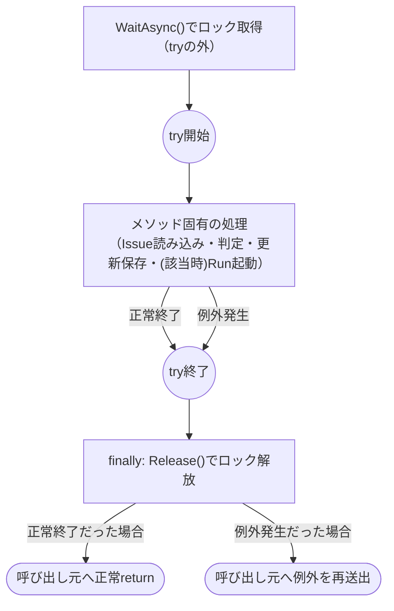
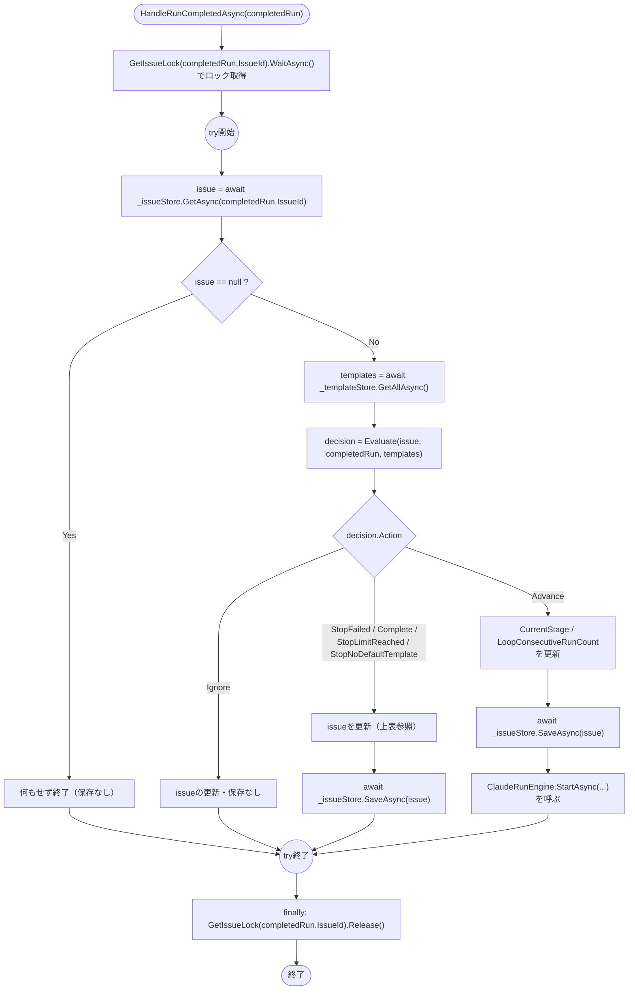
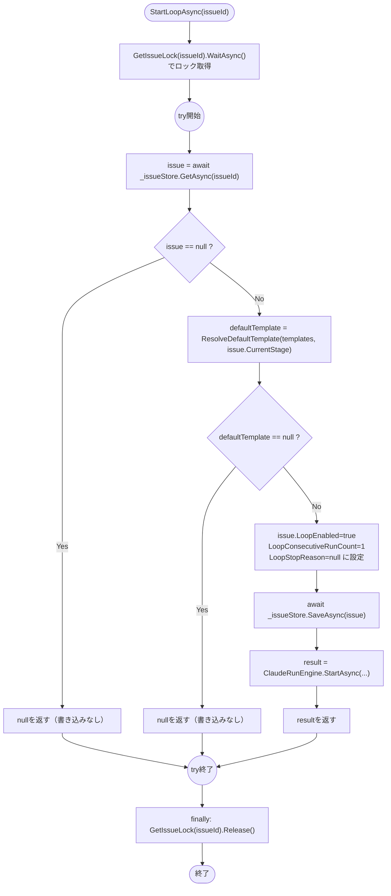
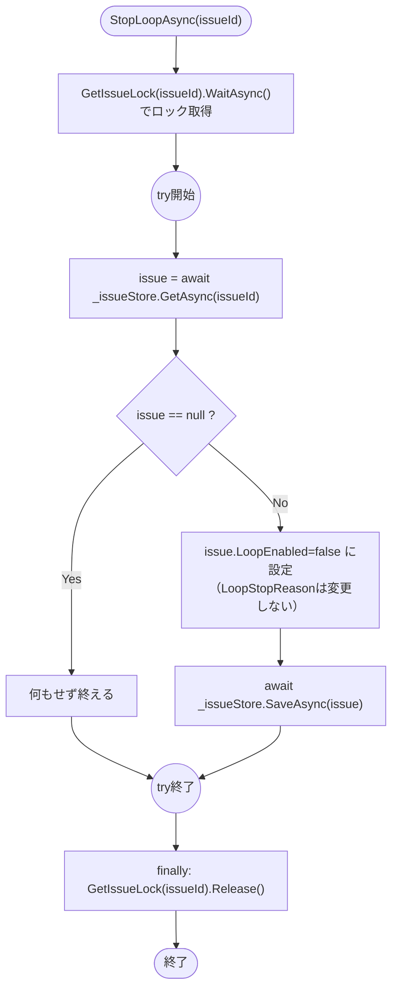

# COMP-08 `LoopEngine`

**対象ファイル**: `src/ClaudeCodeGui/Services/LoopEngine.cs`（新規）

**責務**: component_design.md 3.3節COMP-08（362〜533行目）を参照（内容は変更しない）。「工程のRunが成功したら次工程を自動的に起動する」シーケンサー（CON-07のスコープ限定）。

判定ロジック（`Evaluate`/`GetNextStage`/`ResolveDefaultTemplate`、いずれも副作用のない純粋関数、単体テスト対象・NFR-03）と、実際のストア読み書き・Run起動という副作用（`HandleRunCompletedAsync`/`StartLoopAsync`/`StopLoopAsync`）を分離する方針（品質方針）は、COMP-05/06/07と同様に本節でも踏襲する。

**依存関係**: `JsonFileStore<Issue>`, `JsonFileStore<PromptTemplate>`, `ClaudeRunEngine`（`StartAsync`呼び出しと`RunCompleted`購読の両方）。

小節構成は以下のとおり（純粋関数3つ→ロック解放方針→副作用あり関数3つの順）。

| 小節 | 対象関数／要素 | 純粋関数／副作用 |
|---|---|---|
| 2.8.1 | `Evaluate` | 純粋関数 |
| 2.8.2 | `GetNextStage` | 純粋関数 |
| 2.8.3 | `ResolveDefaultTemplate` | 純粋関数 |
| 2.8.4 | ロック解放の設計方針（3メソッド共通） | — |
| 2.8.5 | `HandleRunCompletedAsync` | 副作用あり |
| 2.8.6 | `StartLoopAsync`（`DefaultPermissionMode`検証の結論を含む） | 副作用あり |
| 2.8.7 | `StopLoopAsync` | 副作用あり |

#### 2.8.1 `Evaluate(Issue issue, Run completedRun, IReadOnlyList<PromptTemplate> templates, int maxConsecutiveRuns = MaxConsecutiveRuns)`

**純粋関数（ストア等への副作用なし、単体テスト対象、NFR-03）**。ストアやファイルには一切触れない（component_design.md 386行目）。

**シグネチャ**:

```csharp
public static LoopDecision Evaluate(
    Issue issue, Run completedRun, IReadOnlyList<PromptTemplate> templates,
    int maxConsecutiveRuns = MaxConsecutiveRuns);

public enum LoopAction { Ignore, StopFailed, StopLimitReached, StopNoDefaultTemplate, Complete, Advance }
public record LoopDecision(LoopAction Action, string? NextStage, PromptTemplate? NextTemplate);
```

**事前条件**:

| 引数 | 制約 |
|---|---|
| `issue` | null不可。`CurrentStage`（5値のいずれか。下記「`GetNextStage`との事前条件の共有」参照）・`LoopEnabled`・`LoopConsecutiveRunCount`が設定済みの既存`Issue` |
| `completedRun` | null不可。`TriggeredByLoop`・`Status`が確定済みの完了Run（`ClaudeRunEngine.ExecuteAsync`の`finally`到達時点で`Status`は最終確定している。本節2.5.5節参照）。`completedRun.IssueId == issue.Id`であることは呼び出し元（`HandleRunCompletedAsync`）が保証する前提とし、本関数自身は突き合わせを行わない |
| `templates` | null不可。0件（空リスト）を許容する |
| `maxConsecutiveRuns` | 既定`MaxConsecutiveRuns`（4）。任意の`int`を受け付け、値の妥当性検証（負値等）は行わない（呼び出し元は既定値をそのまま使う想定で、component_design.mdもこの引数の検証を要求していない） |

**事後条件・戻り値の意味**: `LoopDecision(Action, NextStage, NextTemplate)`を返す。`Action`はcomponent_design.md 454〜462行目の7分岐の判定順序（①〜⑦）どおりに決定する（判定順序・分岐条件は変更しない）。

**`NextStage`/`NextTemplate`フィールドの分岐ごとの値（本関数設計工程で確定した詳細）**: component_design.mdの`LoopDecision`レコード定義は`NextStage`/`NextTemplate`の型のみを規定しており、各`Action`ごとにどちらのフィールドが設定されるかは明記されていない（テストケース設計に転用するには曖昧なため、本関数設計工程で以下のとおり確定する。判定順序・分岐条件自体への変更ではない）。

| `Action` | `NextStage` | `NextTemplate` | 備考 |
|---|---|---|---|
| `Ignore`（①②） | `null` | `null` | 早期returnのため`GetNextStage`すら呼ばない |
| `StopFailed`（③） | `null` | `null` | 同上 |
| `Complete`（④） | `null` | `null` | `GetNextStage(issue.CurrentStage)`が`null`を返した、その値そのもの |
| `StopLimitReached`（⑤） | `GetNextStage(issue.CurrentStage)`の値（非null） | `null` | ④を通過済みのため`NextStage`は非nullだが、⑤で停止するため`ResolveDefaultTemplate`はまだ呼ばない |
| `StopNoDefaultTemplate`（⑥） | 同上（非null） | `null` | `ResolveDefaultTemplate(templates, nextStage)`が`null`を返した、その値そのもの |
| `Advance`（⑦） | 同上（非null） | `ResolveDefaultTemplate(templates, nextStage)`の値（非null） | 呼び出し元（`HandleRunCompletedAsync`）が次Run起動に使う実体 |

**`Evaluate`内部での`GetNextStage`/`ResolveDefaultTemplate`の呼び出しタイミング**: 上表のとおり、`Evaluate`は判定④で`GetNextStage(issue.CurrentStage)`を、判定⑥で`ResolveDefaultTemplate(templates, nextStage)`をそれぞれ1回だけ呼び出し、結果をローカル変数として判定⑤〜⑦で使い回す（再計算しない）。両関数とも純粋関数であるため、`Evaluate`から呼び出しても副作用は生じない。

**`GetNextStage`との事前条件の共有（発見した確認事項・軽微）**: `issue.CurrentStage`が5値（`requirements`/`design`/`implementation`/`testing`/`deployment`）のいずれかであることは、`TemplateSeeder.SeedDefaultsAsync`（2.3.3節）が定義する既定Stage集合、および`Issue`の通常のライフサイクル（`HandleRunCompletedAsync`のAdvance分岐が`GetNextStage`の戻り値のみを`CurrentStage`へ設定する）から成り立つ暗黙の前提であり、component_design.mdはこれを明示的な事前条件として書き下していない。

この前提が破られた場合（例: データ不整合により`CurrentStage`が未知の文字列になっている）、`GetNextStage`は`null`を返し、`Evaluate`の判定④はこれを「`deployment`が成功した」場合と区別なく`Complete`と判定してしまう（`Issue.Status="done"`という誤った状態遷移）。

CON-07が定める「シンプルなシーケンサーに限定する」というスコープを踏まえ、本関数設計では新たな検証関数を追加せず、`issue.CurrentStage`が常に5値のいずれかであることを`Evaluate`・`GetNextStage`共通の事前条件として明記するにとどめる（2.8.2節参照）。

実際には`Issue.CurrentStage`を書き込む経路は本コンポーネント自身（`HandleRunCompletedAsync`のAdvance分岐、および`StartLoopAsync`のループ開始時の初期化）だけでなく、既存の`PUT /api/issues/{id}`ハンドラ（`src/ClaudeCodeGui/Program.cs` 48〜61行目、特に56行目`issue.CurrentStage = req.CurrentStage;`）にも存在する。このハンドラはリクエストDTO（`UpdateIssueRequest`）由来の任意の文字列を妥当性検証なしにそのまま書き込む経路であり、5値以外の文字列がここから混入しうる（COMP-01 2.1節「`DefaultPermissionMode`の妥当性検証について」が指摘した欠落と同型の欠落）。この検証追加の要否は、値を実際に書き込む側であるCOMP-11（`PUT /api/issues/{id}`ハンドラ、本書ではまだ関数設計未着手）の関数設計時に判断することとし、本節（COMP-08）ではこれ以上の判断は行わず、その旨を申し送る。

**代表的な境界値・分岐条件**: 下表は7分岐の判定順序（component_design.md 466〜481行目のフローチャート）、オフバイワン修正（同483〜499行目）、手動中止時のパターンA/B競合トレース（同501〜521行目）を踏まえ、単体テストのケース設計にそのまま転用できる粒度で個別の入力値の組み合わせに展開したもの（`maxConsecutiveRuns`は既定の4を用いる場合と、引数を変えた境界確認の場合の両方を含む）。

| # | `TriggeredByLoop` | `LoopEnabled` | `completedRun.Status` | `GetNextStage(CurrentStage)` | `LoopConsecutiveRunCount` vs `maxConsecutiveRuns` | `ResolveDefaultTemplate`結果 | `Action` |
|---|---|---|---|---|---|---|---|
| 1 | `false` | 任意 | 任意 | - | - | - | `Ignore`（①。手動実行はトリガーにしない＝REQ-21） |
| 2 | `true` | `false` | 任意 | - | - | - | `Ignore`（①。既にループが止まっている） |
| 3 | `true` | `true` | `"canceled"` | - | - | - | `Ignore`（②。手動中止由来。パターンA/Bいずれの到達順序でも成立、501〜521行目参照） |
| 4 | `true` | `true` | `"failed"` | - | - | - | `StopFailed`（③） |
| 5 | `true` | `true` | `"succeeded"` | `null`（`deployment`完了） | - | - | `Complete`（④） |
| 6 | `true` | `true` | `"succeeded"` | 非null（例: `design`） | `4 > 4`（偽） | - | ⑤通過→⑦へ進む（下記#9参照） |
| 7 | `true` | `true` | `"succeeded"` | 非null | `5 > 4`（真） | - | `StopLimitReached`（⑤。オフバイワン: 比較は`>`であって`>=`ではない） |
| 8 | `true` | `true` | `"succeeded"` | 非null | `1 > 0`（真、カスタム`maxConsecutiveRuns=0`指定時の境界） | - | `StopLimitReached`（⑤。`maxConsecutiveRuns`引数を変えた場合の境界確認） |
| 9 | `true` | `true` | `"succeeded"` | 非null | 上限以内（偽） | `null`（既定テンプレートなし） | `StopNoDefaultTemplate`（⑥） |
| 10 | `true` | `true` | `"succeeded"` | 非null | 上限以内（偽） | 非null | `Advance`（⑦） |
| 11 | `true` | `true` | `"succeeded"` | `null`（`GetNextStage`が未知の`CurrentStage`により`null`を返す境界値、上記「発見した確認事項」参照） | - | - | `Complete`（④相当。`Complete`と本来の「`deployment`完了」を`Evaluate`は区別しない） |

上記#6は「④・⑤を通過し⑦へ進む中間状態」を示す行であり、単体では`Action`が確定しない（#9・#10のいずれかに枝分かれする）ため参考として残すが、実際のテストケースとしては#9・#10のように`ResolveDefaultTemplate`の結果まで確定させた行を使う。#7・#8は同一の`Action`（`StopLimitReached`）に対し、既定値・カスタム値それぞれで超過側の境界（`>`が真になる側）を確認するテストケースを示す。等号側の境界（`>`が偽になる側）は#6で示されている。

オフバイワン修正の経緯・5工程完走時の詳細なトレース（`requirements`→`design`→…→`deployment`の各段階での`LoopConsecutiveRunCount`の値）はcomponent_design.md 489〜499行目の表をそのまま参照する（本表では重複記載しない）。

##### `Evaluate`の判定フロー（補足図）

上記の判定順序・`NextStage`/`NextTemplate`の確定タイミングを合わせて図示すると以下のとおり（component_design.md 466〜481行目のフローチャートに、本節で確定した`NextStage`/`NextTemplate`の代入タイミングを追記したもの）。

```mermaid
flowchart TD
    Start(["Evaluate(issue, completedRun, templates, maxConsecutiveRuns)"]) --> Q1{"①TriggeredByLoop==false\nまたはLoopEnabled==false ?"}
    Q1 -->|Yes| R1["Ignore(null, null)"]
    Q1 -->|No| Q2{"②Status==\"canceled\" ?"}
    Q2 -->|Yes| R2["Ignore(null, null)"]
    Q2 -->|No| Q3{"③Status!=\"succeeded\" ?"}
    Q3 -->|Yes| R3["StopFailed(null, null)"]
    Q3 -->|No| Calc1["nextStage = GetNextStage(issue.CurrentStage)"]
    Calc1 --> Q4{"④nextStage == null ?"}
    Q4 -->|Yes| R4["Complete(null, null)"]
    Q4 -->|No| Q5{"⑤LoopConsecutiveRunCount\n> maxConsecutiveRuns ?"}
    Q5 -->|Yes| R5["StopLimitReached(nextStage, null)"]
    Q5 -->|No| Calc2["nextTemplate = ResolveDefaultTemplate(templates, nextStage)"]
    Calc2 --> Q6{"⑥nextTemplate == null ?"}
    Q6 -->|Yes| R6["StopNoDefaultTemplate(nextStage, null)"]
    Q6 -->|No| R7["⑦Advance(nextStage, nextTemplate)"]
```

#### 2.8.2 `GetNextStage(string currentStage)`

**純粋関数（ストア等への副作用なし、単体テスト対象、NFR-03）**。

**シグネチャ**: `public static string? GetNextStage(string currentStage);`

**事前条件**: `currentStage`は`Issue.CurrentStage`相当の文字列。5値（`requirements`/`design`/`implementation`/`testing`/`deployment`）のいずれかであることを前提とするが、本関数自身は`null`・空文字列・未知の文字列を渡されても例外を投げない（下記境界値#6・#7参照。この前提の位置づけは2.8.1節「`GetNextStage`との事前条件の共有」を参照）。

**事後条件・戻り値の意味**: 5工程の定義順（`requirements`→`design`→`implementation`→`testing`→`deployment`）で次工程のStage名を返す。`currentStage == "deployment"`（最終工程）の場合は`null`を返す。

**代表的な境界値・分岐条件**:

| # | `currentStage` | 戻り値 |
|---|---|---|
| 1 | `"requirements"` | `"design"` |
| 2 | `"design"` | `"implementation"` |
| 3 | `"implementation"` | `"testing"` |
| 4 | `"testing"` | `"deployment"` |
| 5 | `"deployment"`（最終工程） | `null` |
| 6 | 未知の文字列（例: `"unknown-stage"`、境界値） | `null`（例外は投げない。2.8.1節「発見した確認事項」参照） |
| 7 | `null`または空文字列（境界値） | `null`（同上。`switch`式等での既定分岐として扱う想定） |

#### 2.8.3 `ResolveDefaultTemplate(IReadOnlyList<PromptTemplate> templates, string stage)`

**純粋関数（ストア等への副作用なし、単体テスト対象、NFR-03）**。

**シグネチャ**: `public static PromptTemplate? ResolveDefaultTemplate(IReadOnlyList<PromptTemplate> templates, string stage);`

**事前条件**: `templates`はnull不可、0件（空リスト）を許容する。`stage`は`GetNextStage`の戻り値または`Issue.CurrentStage`を想定するが、本関数自身は`null`・空文字列・未知の文字列を渡されても例外を投げない（該当するテンプレートが見つからないだけで、通常どおり`null`を返す）。

**事後条件・戻り値の意味**: `templates`のうち「`Stage == stage`」かつ「`IsDefaultForStage == true`」の条件を満たす1件を返す（該当なしなら`null`）。同一`stage`に`IsDefaultForStage == true`が（データ不整合により）2件以上存在する場合も、例外は投げず`templates`内の並び順で最初に見つかった1件を返す（`PromptTemplateDefaultResolver.ResolveDemotions`、2.3.2節により通常この状態は起こらないはずだが、既定テンプレート起動判定という重要経路を止めないための防御的設計とする）。

**代表的な境界値・分岐条件**:

| # | `templates` | `stage` | 戻り値 |
|---|---|---|---|
| 1 | 空リスト | 任意 | `null` |
| 2 | 該当`stage`に`IsDefaultForStage=true`が1件 | 該当`stage` | その1件 |
| 3 | `IsDefaultForStage=true`のテンプレートは存在するが別の`stage` | 該当しない`stage` | `null`（Stage不一致） |
| 4 | 該当`stage`のテンプレートは存在するが全て`IsDefaultForStage=false` | 該当`stage` | `null` |
| 5 | 該当`stage`に`IsDefaultForStage=true`が2件以上（データ不整合、境界値） | 該当`stage` | 並び順で最初の1件（例外を投げない。上記「事後条件」参照） |
| 6 | 任意 | `null`または空文字列（境界値） | `null`（一致するテンプレートがないため通常どおり。例外は投げない） |

#### 2.8.4 ロック解放の設計方針（`HandleRunCompletedAsync`/`StartLoopAsync`/`StopLoopAsync`共通）

component_design.md 418〜452行目で確定済みの方針（COMP-05の`_activeIssueRuns`との違いの整理を含む）をそのまま踏襲する。3メソッドいずれも、Issue単位の`SemaphoreSlim(1,1)`（`GetOrAdd`で取得）を用い、次の単純な形（1段の`try/finally`のみ、成功フラグ不要）でロック解放を保証する。

```csharp
private readonly ConcurrentDictionary<string, SemaphoreSlim> _issueLocks = new();
private SemaphoreSlim GetIssueLock(string issueId) =>
    _issueLocks.GetOrAdd(issueId, _ => new SemaphoreSlim(1, 1));

public async Task HandleRunCompletedAsync(Run completedRun)
{
    await GetIssueLock(completedRun.IssueId).WaitAsync();
    try
    {
        // Issue読み込み → Evaluate呼び出し → Issue更新・保存 → (Advanceなら)StartAsync呼び出し
        // Ignore等、早期リターンする分岐もすべてこのtry内で完結させる
    }
    finally
    {
        GetIssueLock(completedRun.IssueId).Release();
    }
}
```

`StartLoopAsync`・`StopLoopAsync`も同型（対象キーは引数の`issueId`そのもの）。`WaitAsync()`自体は`try`の外で呼ぶ（ロック未取得の状態で`finally`から`Release()`を呼ぶと`SemaphoreFullException`になるため）。

`try`ブロック本体で発生しうる例外（`JsonFileStore`のI/O例外、`ClaudeRunEngine.StartAsync`内の予期しない例外等）は`catch`を設けず`finally`でのロック解放後にそのまま呼び出し元へ再送出する（COMP-05の(b)経路と同様。component_design.md 450行目）。

3メソッドいずれも「ロック取得からIssue更新完了（および`StartLoopAsync`でのRun起動呼び出し）までが同一の`async`メソッドの呼び出しスタック内で完結する」ため、この1段の`try/finally`が解放保証として必要十分である（根拠の詳細はcomponent_design.md 452行目を参照。本節では変更しない）。

`GetIssueLock`のエントリは`GetOrAdd`で作成後も明示的には破棄しない（Issue数がローカルツールの規模で少数にとどまるため許容する設計判断、component_design.md 512行目）。

##### ロック区間の共通パターン（補足図）

上記の`try/finally`によるロック解放保証を、3メソッド共通のパターンとして図示すると以下のとおり（正常終了・例外発生いずれの経路でも`finally`でのロック解放を通ることを示す）。



#### 2.8.5 `HandleRunCompletedAsync(Run completedRun)`

**副作用あり**（`JsonFileStore<Issue>`・`JsonFileStore<PromptTemplate>`の読み書き、`ClaudeRunEngine.StartAsync`呼び出し）。

**シグネチャ**: `public Task HandleRunCompletedAsync(Run completedRun);`

**事前条件**: `completedRun`はnull不可（`ClaudeRunEngine.RunCompleted`イベントの購読ハンドラとして呼ばれるため、`ExecuteAsync`の`finally`が構築した確定済みの`Run`インスタンスを受け取る。2.5.5節参照）。

**処理の骨格**（component_design.md 397〜401行目・434〜448行目のコード例を踏襲）:

1. `GetIssueLock(completedRun.IssueId).WaitAsync()`でロックを取得する。
2. `try`区間内:
   1. `issue = await _issueStore.GetAsync(completedRun.IssueId)`でIssueを読み込む。
   2. `issue is null`の場合（下記「`issue`が見つからない場合の扱い（発見した確認事項・軽微）」参照）、以降の処理を行わずreturnする（保存なし）。
   3. `templates = await _templateStore.GetAllAsync()`でテンプレート一覧を取得する。
   4. `decision = Evaluate(issue, completedRun, templates)`（既定の`MaxConsecutiveRuns`を用いる）。
   5. `decision.Action`に応じて下表のとおり`issue`を更新し、`Advance`の場合のみ`ClaudeRunEngine.StartAsync`を呼ぶ。
3. `finally`区間で`GetIssueLock(completedRun.IssueId).Release()`を呼ぶ。

**`issue`が見つからない場合の扱い（発見した確認事項・軽微）**: component_design.mdは`HandleRunCompletedAsync`が読み込む`Issue`が存在しない場合の扱いを明記していない（通常はIssue削除とRun完了イベントがほぼ同時に発生する稀なケースのみで起こりうる。COMP-10の孤児Run退避とは別の、ライブでの競合シナリオ）。

本関数設計では、例外を投げず・何も保存せず処理を打ち切る（ログ出力の要否は実装工程で判断）という防御的な扱いとする。CON-07のスコープ（シンプルなシーケンサー）を踏まえ、新たな検知・通知の仕組みは追加しない。

**`decision.Action`ごとのIssue更新・Run起動**:

| `Action` | `issue`の更新内容 | `ClaudeRunEngine.StartAsync`呼び出し |
|---|---|---|
| `Ignore` | なし（保存も行わない） | なし |
| `StopFailed` | `LoopEnabled=false`, `LoopStopReason="failed"` | なし |
| `Complete` | `LoopEnabled=false`, `Status="done"`（`LoopStopReason`は変更しない＝`null`のまま。2.1節「`LoopStopReason`の書き込み経路」参照） | なし |
| `StopLimitReached` | `LoopEnabled=false`, `LoopStopReason="limit_reached"` | なし |
| `StopNoDefaultTemplate` | `LoopEnabled=false`, `LoopStopReason="no_default_template"` | なし |
| `Advance` | `CurrentStage=decision.NextStage`, `LoopConsecutiveRunCount`をインクリメント | `StartAsync(issue, decision.NextTemplate, issue.DefaultPermissionMode, triggeredByLoop: true)`（`try`区間内、`Issue`の保存完了後に呼ぶ。呼び出し自体は`Task.Run`によるバックグラウンド実行の開始のみを待ち、Run本体の完了までは待たない。2.5.1節手順5参照） |

`Ignore`以外はいずれも更新後に`await _issueStore.SaveAsync(issue)`を1回呼ぶ（`Advance`の場合は`SaveAsync`の後に`StartAsync`を呼ぶ順序を厳守する。component_design.mdコード例のコメント「Issue更新・保存 → (Advanceなら)StartAsync呼び出し」のとおり）。

**代表的な境界値・分岐条件**:

| # | 状況 | 結果 |
|---|---|---|
| 1〜6 | `Evaluate`が返す6種類の`Action`（`Ignore`/`StopFailed`/`Complete`/`StopLimitReached`/`StopNoDefaultTemplate`/`Advance`） | 上表のとおり（`Evaluate`自体の分岐条件は2.8.1節の境界値表を参照。本節では`Action`確定後のIssue更新・Run起動側の挙動のみを扱う） |
| 7 | `completedRun.IssueId`に対応する`Issue`が存在しない（境界値） | 何もせず`finally`でロック解放して終了（上記「発見した確認事項」参照） |
| 8 | `Advance`分岐で`ClaudeRunEngine.StartAsync`がさらに同一Issueへの実行中Runと衝突する（理論上は起こらないはずだが、`_activeIssueRuns`と`LoopEngine`のIssueロックは別物であるための確認） | `StartAsync`は2.5.1節の排他拒否系（`RunStartResult(rejectedRun, winningRunId)`）を返す。`HandleRunCompletedAsync`はこの戻り値を特別扱いせずそのまま終える（`Advance`分岐が呼ばれる時点で、当該Issueの前Runは`ExecuteAsync`の`finally`で既に`_activeIssueRuns`から除去済みのため、実際にはこの衝突は通常発生しない。2.5.1節境界値#5参照） |
| 9 | `_issueStore.SaveAsync`・`ClaudeRunEngine.StartAsync`内で予期しない例外が発生 | `catch`を設けず`finally`でロック解放後に呼び出し元（`RunCompleted`イベント発火元）へ再送出（2.8.4節） |

##### `HandleRunCompletedAsync`の処理フロー（補足図）

上記「処理の骨格」と`decision.Action`ごとのIssue更新・Run起動（上表）を合わせて図示すると以下のとおり。



#### 2.8.6 `StartLoopAsync(string issueId)`

**副作用あり**（`JsonFileStore<Issue>`・`JsonFileStore<PromptTemplate>`の読み書き、`ClaudeRunEngine.StartAsync`呼び出し）。

**シグネチャ**: `public Task<RunStartResult?> StartLoopAsync(string issueId);`

**事前条件**: `issueId`はnull不可（`POST /api/issues/{issueId}/loop/start`のルートパラメータ、COMP-11から渡される）。`issueId`に対応する`Issue`が実在するかどうかは本関数の事前条件ではなく、下記「`issueId`に対応する`Issue`が存在しない場合の扱い」で戻り値として扱う。

**処理の骨格**（component_design.md 403〜409行目・523〜527行目を踏襲）:

1. `GetIssueLock(issueId).WaitAsync()`でロックを取得する。
2. `try`区間内:
   1. `issue = await _issueStore.GetAsync(issueId)`。
   2. `issue is null`の場合（下記「発見した確認事項」参照）、書き込みを行わず`null`を返す。
   3. `defaultTemplate = ResolveDefaultTemplate(await _templateStore.GetAllAsync(), issue.CurrentStage)`。
   4. `defaultTemplate is null`の場合、`issue`への書き込みを一切行わず`null`を返す（component_design.md 523行目「更新前に判定するため書き込みは発生しない」）。
   5. 上記2つのガードを通過した場合のみ、`issue.LoopEnabled = true`, `issue.LoopConsecutiveRunCount = 1`, `issue.LoopStopReason = null`に設定し`await _issueStore.SaveAsync(issue)`する。
   6. `result = await _claudeRunEngine.StartAsync(issue, defaultTemplate, issue.DefaultPermissionMode, triggeredByLoop: true)`を呼び、`result`を返す。
3. `finally`区間で`GetIssueLock(issueId).Release()`を呼ぶ。

**`issueId`に対応する`Issue`が存在しない場合の扱い（発見した確認事項・軽微）**: component_design.md・COMP-11節のいずれにも、`StartLoopAsync(issueId)`呼び出し前に`Issue`の存在を確認する処理は規定されていない。既存の他のIssueスコープエンドポイント（`Program.cs`の`GET /api/issues/{id}`等、`issue is null → Results.NotFound()`のパターン）とは異なり、`POST /api/issues/{issueId}/loop/start`のエンドポイント定義（component_design.md 613行目）は「`loopEngine.StartLoopAsync(issueId)`の戻り値が`null`なら`400 Bad Request`」とのみ記載しており、`Issue`不存在時の`404 NotFound`パターンとの整理がなされていない。

本関数設計では、シグネチャが`Task<RunStartResult?>`（`null`許容の1種類の失敗表現のみ）に確定済みであることを踏まえ、`Issue`が見つからない場合も「既定テンプレート不在」と同じ`null`を返す形に統一する（意味的には`404`の方が正確だが、`null`の使い分けのために戻り値型を変更することはcomponent_design.mdの確定事項の変更に当たるため本工程では行わない）。

この結果、COMP-11側のHTTPレスポンスは`Issue`不存在・既定テンプレート不在のいずれも`400 Bad Request`として扱われる（本来`404`が意味的に正確な`Issue`不存在ケースも`400`に丸められる点は軽微な指摘として申し送る）。

**事後条件・戻り値の意味**:

- `Issue`不存在、または既定テンプレート不在の場合: `null`を返す。`Issue`への書き込みは一切発生しない。
- それ以外: `issue.LoopEnabled`/`LoopConsecutiveRunCount`/`LoopStopReason`を初期化・保存した上で、`ClaudeRunEngine.StartAsync`の戻り値（`RunStartResult`。正常起動または排他拒否のいずれか、2.5.1節参照）をそのまま返す。

**代表的な境界値・分岐条件**:

| # | `issueId`→`Issue`取得 | `CurrentStage`の既定テンプレート | 結果 |
|---|---|---|---|
| 1 | 存在する | 存在する | `LoopEnabled=true`, `LoopConsecutiveRunCount=1`, `LoopStopReason=null`を保存後、`StartAsync`を呼びその戻り値（`RunStartResult(run, null)`または`RunStartResult(rejectedRun, winningRunId)`）を返す |
| 2 | 存在する | 存在しない | `Issue`書き込みなし、`StartAsync`も呼ばず`null`を返す（component_design.md 523行目、400扱い） |
| 3 | 存在しない（境界値） | - | `null`を返す（上記「発見した確認事項」参照。400扱い） |
| 4 | 存在する。既に`LoopEnabled=true`で稼働中のIssueへ再度呼び出し（多重開始、境界値） | 存在する | 既存の`LoopEnabled`値等は無視して常に初期化し直す（`LoopConsecutiveRunCount`は`1`へリセットされる。二重開始そのものを拒否するガードはcomponent_design.mdに規定がなく本節でも追加しない）。ただし`StartAsync`側の`_activeIssueRuns`排他制御（COMP-05、`LoopEngine`のIssueロックとは別物）により、既にRunが実行中であれば`StartAsync`は排他拒否系（`RunStartResult(rejectedRun, winningRunId)`）を返す。この場合`issue.LoopConsecutiveRunCount`は`1`にリセットされた状態のまま保存済みとなる点に注意（`StartAsync`失敗時のロールバックは行わない設計） |
| 5 | `HandleRunCompletedAsync`・`StopLoopAsync`が同一Issueへ同時にアクセス（排他確認） | - | `GetIssueLock`により直列化され、Lost Updateは発生しない（2.8.4節） |

##### `StartLoopAsync`の処理フロー（補足図）

上記「処理の骨格」を図示すると以下のとおり（2つのガード条件はいずれも`issue`への書き込み前に判定するため、`null`を返す経路では書き込みが発生しない）。



##### `DefaultPermissionMode`の妥当性検証についての結論（COMP-01からの申し送り事項への回答）

`function_design.md` 2.1節（89〜91行目）は、`Issue.DefaultPermissionMode`の妥当性検証（既知の値かどうかのチェック）がシステムのどこにも実装されていない設計上の欠落を指摘し、「COMP-05/COMP-08/COMP-11いずれかの関数設計時に検証関数の要否を確定する」よう申し送っていた。本節（COMP-08）の作成にあたり、以下の3点を確認した上で結論を出す。

1. **COMP-05側の既存決定（本節2.5.1節）**: `ClaudeRunEngine.StartAsync`の`permissionMode`引数について、「値の妥当性検証は行わない（既存動作維持。COMP-01『補助関数の要否』節で申し送り済みの未解決欠落であり、本節では新規のバリデーション関数を追加しない）」とすでに明記済みである。
2. **COMP-11側の現状**: `docs/02_component_design/component_design.md` 3.4節COMP-11（593〜622行目）を確認したところ、`PUT /api/issues/{id}`ハンドラの変更内容は「`LoopEnabled`・`DefaultPermissionMode`をリクエストDTOに追加」とのみ記載され、値の検証には一切言及がない。COMP-11自体の関数設計はまだ着手されていない（本タスク時点）。
3. **`StartLoopAsync`自身の設計**: component_design.md 523行目付近が確定させている`StartLoopAsync`の処理は、`issue.DefaultPermissionMode`を検証せずそのまま`ClaudeRunEngine.StartAsync`へ渡す設計であり、本節の処理の骨格（上記手順6）もこれをそのまま踏襲している。

**結論**: `DefaultPermissionMode`の妥当性検証は、**COMP-08（`LoopEngine`）には追加しない**。理由は以下のとおり。

- component_design.mdが確定させた`StartLoopAsync`の設計（検証なしでそのまま渡す）を、本関数設計工程で覆すことはスコープ外である。
- 値を実際に書き込む唯一の経路は`PUT /api/issues/{id}`ハンドラ（COMP-11、Issue編集フォーム経由。本節2.1節「追加プロパティと読み書き元」表参照）であり、`DefaultPermissionMode`を消費する側（`ClaudeRunEngine.StartAsync`＝COMP-05、`LoopEngine.StartLoopAsync`＝COMP-08）双方に同じ検証ロジックを重複実装するよりも、値が生成・書き込まれる入力境界（COMP-11）で一度だけ検証する方が、CON-07が定める「LoopEngineはシンプルなシーケンサーに限定する」というスコープにも整合する。
- UIを介する通常経路では、値はCOMP-14が生成する`#e-default-permission-mode`セレクトの固定の選択肢（CON-04が現状維持を定める既知の値集合）から来るため、UIを介する限り不正値が入る余地は本来小さい。リスクが生じるのはAPIを直接叩く等UIを介さない経路に限られ、これは入力境界（COMP-11）での検証で防ぐのが最も筋が良い。

**申し送り（COMP-11の関数設計工程へ）**: 本申し送り事項は解消済みとし、COMP-01・COMP-05・COMP-08いずれにも検証ロジックは追加しないことを確定する。新規バリデーション関数を追加するかどうか（`PUT /api/issues/{id}`ハンドラ内でのインライン検証、または独立した`static`検証関数のいずれの形にするか）は、COMP-11自身の関数設計工程で確定する。追加しないという判断（既存動作維持のまま据え置く）も選択肢として排除しない。

#### 2.8.7 `StopLoopAsync(string issueId)`

**副作用あり**（`JsonFileStore<Issue>`の読み書きのみ。`ClaudeRunEngine`呼び出しはない）。

**シグネチャ**: `public Task StopLoopAsync(string issueId);`

**事前条件**: `issueId`はnull不可（`POST /api/runs/{id}/cancel`ハンドラが、対象Runの`IssueId`を取得した上で呼ぶ。COMP-11、component_design.md 614行目）。

**処理の骨格**（component_design.md 411〜414行目を踏襲）:

1. `GetIssueLock(issueId).WaitAsync()`でロックを取得する。
2. `try`区間内:
   1. `issue = await _issueStore.GetAsync(issueId)`。
   2. `issue is null`の場合（下記「発見した確認事項」参照）、何もせず終える。
   3. それ以外の場合、`issue.LoopEnabled = false`に設定し`await _issueStore.SaveAsync(issue)`する。**`LoopStopReason`は一切変更しない**（`null`のまま据え置く。手動停止と自動停止を区別する設計。2.1節「`LoopStopReason`の書き込み経路」参照）。
3. `finally`区間で`GetIssueLock(issueId).Release()`を呼ぶ。

**`issueId`に対応する`Issue`が存在しない場合の扱い（発見した確認事項・軽微）**: `StopLoopAsync`は`CancelAsync(id)`が`true`を返した直後に呼ばれる経路（COMP-11、component_design.md 614行目）が唯一の想定呼び出し元であり、通常は対象`Issue`が存在するはずである。ただし理論上、`CancelAsync`成功と`StopLoopAsync`呼び出しの間にIssueが削除される極めて稀な競合が起こりうる（Issue削除機能自体の詳細はCOMP-11・4.8節の範囲であり本節では扱わない）。`HandleRunCompletedAsync`（2.8.5節）・`StartLoopAsync`（2.8.6節）と一貫させ、例外を投げず何もせず終える防御的な扱いとする。

**事後条件・戻り値の意味**: `Issue`が存在する場合、`LoopEnabled=false`を保存する（`LoopStopReason`は不変）。`Issue`が存在しない場合、何もしない。戻り値は`Task`（成功・失敗を区別する戻り値は持たない。呼び出し元も戻り値を判定しない設計、component_design.md 411〜414行目に準拠）。

**代表的な境界値・分岐条件**:

| # | `issue`取得 | 呼び出し前の`LoopEnabled` | 結果 |
|---|---|---|---|
| 1 | 存在、`true` | `true` | `LoopEnabled=false`を保存。`LoopStopReason`は変更しない |
| 2 | 存在、`false`（多重停止・冪等性、境界値） | `false` | `LoopEnabled=false`のまま再度保存（値は変わらないが`SaveAsync`自体は実行される）。エラーにはしない |
| 3 | 存在しない（境界値） | - | 何もせず正常終了（上記「発見した確認事項」参照） |
| 4 | `HandleRunCompletedAsync`・`StartLoopAsync`が同一Issueへ同時にアクセス（パターンA/B、2.8.1節#3・component_design.md 501〜521行目） | - | `GetIssueLock`により直列化される。到達順序に関わらず`LoopStopReason`が誤って書き換わらないことは`Evaluate`判定②（2.8.1節#3）と本メソッドの排他により保証される |

##### `StopLoopAsync`の処理フロー（補足図）

上記「処理の骨格」を図示すると以下のとおり。



対応ID: REQ-14, REQ-15, REQ-16, REQ-17, REQ-18, REQ-19, REQ-20, REQ-21, CON-07, CON-08

