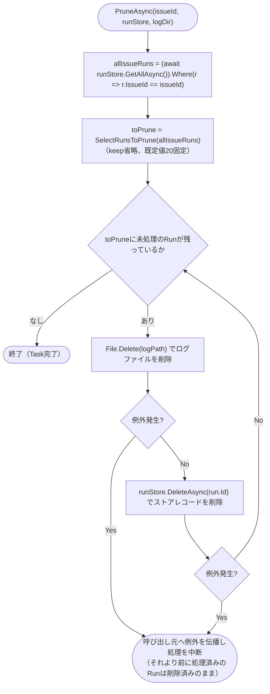

# COMP-09 `RetentionPruner`（新規）

**対象ファイル**: `src/ClaudeCodeGui/Services/RetentionPruner.cs`（新規）

**責務**: component_design.md 3.3節COMP-09（535〜553行目）を参照（シグネチャ・削除トリガーのタイミングは変更しない）。Issueごとに直近20件のRun（およびログファイル）のみ残し、それより古いものを完全に削除する（REQ-22）。COMP-06/07/08と同様、判定ロジック本体（`SelectRunsToPrune`）は**副作用のない静的純粋関数**（NFR-03、単体テスト対象）とし、実際のストア・ファイル削除を行う`PruneAsync`は**副作用あり**の薄いラッパー処理とする。

```csharp
public static class RetentionPruner
{
    public static IReadOnlyList<Run> SelectRunsToPrune(IReadOnlyList<Run> issueRuns, int keep = 20);
    public static async Task PruneAsync(string issueId, JsonFileStore<Run> runStore, string logDir);
}
```

**呼び出し元との関係**: `PruneAsync`は`ClaudeRunEngine.StartAsync`（COMP-05、2.5.1節手順3）から、新規Run保存直後・バックグラウンド実行開始前に呼ばれる（component_design.md 551行目の「新規Run作成の都度」チェック方式）。

2.5.1節境界値#6が既に確定させているとおり、`PruneAsync`内で発生した例外は`ClaudeRunEngine.StartAsync`側で`catch`されず、そのまま呼び出し元（HTTPハンドラ等）へ再送出される。本節の設計（後述「削除中に一部ファイルの削除が失敗した場合の扱い」）はこの既存決定を前提として組み立てる。

COMP-09は`REQ-24`（孤児Runの退避）のような復元可能性の担保を要求されていない点でCOMP-10 `OrphanSweepService`と異なる（component_design.md 537行目は「削除する」であり「退避する」ではない）。そのため監査ログ・quarantineフォルダへの移動は行わず、単純な完全削除とする。

#### 2.9.1 `SelectRunsToPrune(IReadOnlyList<Run> issueRuns, int keep = 20)`

**純粋関数（ストア等への副作用なし、単体テスト対象、NFR-03）**。

**事前条件**:

| 引数 | 意味・由来 | null許容 | 不正値の扱い |
|---|---|---|---|
| `issueRuns` | 対象Issueに紐づくRun一覧（`PruneAsync`が`runStore.GetAllAsync()`を`IssueId`でフィルタしたもの。呼び出し元がフィルタ済みの値を渡す前提で、本関数自身は`IssueId`の突き合わせを行わない） | 不可。`null`が渡された場合、本関数内部の`issueRuns.OrderByDescending(...)`呼び出し時点で`ArgumentNullException(nameof(source))`を送出する（LINQ`OrderByDescending`の標準仕様。本関数はこれを捕捉・変換しない） | 空リスト（0件）は正常な入力として許容する（下記境界値#1） |
| `keep` | 保持件数。既定値20（REQ-22のN=20） | - | `int`型のため`null`は入力できない。0・負数も例外を投げず受け付ける（下記「`keep`が0または負数の場合」参照） |

**`keep`が0または負数の場合の扱い**: 本関数は`Skip(keep)`（LINQ標準）を用いる設計とする。.NET標準の`Enumerable.Skip`は`count`が0以下の場合、要素を1つもスキップせず全要素をそのまま返す仕様であるため、`keep <= 0`の場合は`issueRuns`の全件（並び替え後の全件）が削除対象として返る。

これは「保持件数0＝全件削除」という自然な解釈と一致するため、本関数はこの標準挙動をそのまま採用し、`keep`の妥当性検証（負数を拒否する等）は追加しない（`PruneAsync`は`keep`を省略し既定値20のみを使うため、実際にこの分岐が実運用で使われるのは単体テストでの境界確認が主）。

**`StartedAt`が同一値のRunが複数件ある場合の順序の扱い**: `OrderByDescending`（LINQ標準）は**安定ソート**である（キーが等しい要素同士は入力`issueRuns`内の元の相対順序を保つ、.NET公式仕様）。そのため`StartedAt`の同値が複数件存在する場合、どちらが「保持される`keep`件」側に入りどちらが「削除対象」側に入るかは、`issueRuns`が渡された時点での並び順（＝`PruneAsync`が`JsonFileStore<Run>.GetAllAsync()`から得る順序。`Directory.EnumerateFiles`のファイル列挙順に依存し、.NET標準では特定の順序を保証しない）によって決まる。

`StartedAt`はRun開始時に`DateTimeOffset.UtcNow`で払い出される値であり、同一ミリ秒単位での複数Run開始は本アプリの単一Issue直列実行制約（COMP-05の同時実行排他制御、REQ-10〜13）の下では通常発生しないが、理論上の境界条件として本節で扱いを明記する（`SelectRunsToPrune`自身の不具合ではなく、入力順序が不定な場合の自然な帰結であり、component_design.mdの確定事項と矛盾するものではない）。

**事後条件・戻り値の意味**: `issueRuns`を`StartedAt`降順（新しい順）に並べ替えた上で、先頭`keep`件を除いた残り（＝保持件数からあふれた、削除すべき古いRun）をそのまま返す。戻り値の並び順は「`StartedAt`降順に並べた列の`keep`件目より後ろ」であり、結果自体も`StartedAt`降順のままである（`PruneAsync`はこの順序のまま逐次削除する。順序自体は削除処理の正しさに影響しない）。本関数はストア・ファイルには一切触れない。

**代表的な境界値・分岐条件**:

| # | `issueRuns`件数 | `keep` | 戻り値 |
|---|---|---|---|
| 1 | 0件（空リスト） | 20（既定） | 空リスト |
| 2 | 20件未満（例: 5件） | 20（既定） | 空リスト（保持件数に満たないため削除対象なし） |
| 3 | ちょうど20件 | 20（既定） | 空リスト（`Skip(20)`が20件全てをスキップ） |
| 4 | 21件 | 20（既定） | 1件（`StartedAt`が最も古い1件） |
| 5 | 25件 | 20（既定） | 5件（`StartedAt`が古い順の5件。並び順は降順のまま＝新しい方から数えて21〜25番目） |
| 6 | 5件 | `0` | 5件（全件が削除対象。「`keep`が0または負数の場合」参照） |
| 7 | 5件 | `-1`（負数、境界値） | 5件（同上、`Skip`の標準挙動により0と同じ扱い） |
| 8 | 25件のうち`StartedAt`が同一値のRunが複数（20件目と21件目の境界に同値が含まれる、境界値） | 20（既定） | 安定ソートにより`issueRuns`内の元の並び順で先頭20件・残り5件に分かれる（「`StartedAt`が同一値のRunが複数件ある場合の順序の扱い」参照。どちらが保持されるかは入力順序に依存し、本関数の不具合ではない） |
| 9 | `null`（境界値） | 任意 | `ArgumentNullException`（LINQ標準、本関数は捕捉しない） |

**参考実装（アルゴリズム）**:

```csharp
public static IReadOnlyList<Run> SelectRunsToPrune(IReadOnlyList<Run> issueRuns, int keep = 20)
{
    return issueRuns
        .OrderByDescending(r => r.StartedAt)
        .Skip(keep)
        .ToList();
}
```

#### 2.9.2 `PruneAsync(string issueId, JsonFileStore<Run> runStore, string logDir)`

**副作用あり**（`JsonFileStore<Run>`からのRunレコード削除、ログファイルの削除）。

**事前条件**:

| 引数 | 意味・由来 | null許容 | 不正値の扱い |
|---|---|---|---|
| `issueId` | 対象Issueの`Id`。`ClaudeRunEngine.StartAsync`が保持する`issue.Id`をそのまま渡す想定 | 不可（呼び出し元がnullを渡す経路はない）。仮に`null`が渡された場合も、`Where(r => r.IssueId == issueId)`は`Run.IssueId`が常に非null文字列（既定値`""`）であるため単に0件マッチとなり、例外は発生しない（下記境界値#6参照） | 空文字列は「該当Issueなし」として0件マッチになるだけで例外にはならない |
| `runStore` | DIで束縛される`JsonFileStore<Run>`インスタンス | 不可 | - |
| `logDir` | ログファイルの格納ディレクトリの絶対パス。`ClaudeRunEngine`が保持する`_logDir`（`Path.Combine(dataRoot, "run-logs")`）と同一の値を呼び出し元が渡す想定 | 不可 | 本関数自体はディレクトリの存在確認を行わない。存在しないディレクトリを渡された場合も、配下の各ログファイルパスに対する`File.Delete`は「ファイルが見つからない」場合と同様に例外を投げない（.NET`File.Delete`の仕様。パス自体が不正な形式の場合は`ArgumentException`等が伝播しうるが、本関数はこれを捕捉しない） |

**処理の骨格**:

1. `allIssueRuns = (await runStore.GetAllAsync()).Where(r => r.IssueId == issueId).ToList()`で対象Issueの全Runを取得する（`Program.cs`の`GET /api/issues/{issueId}/runs`ハンドラ、103〜106行目と同一のフィルタパターン）。
2. `toPrune = SelectRunsToPrune(allIssueRuns)`（既定`keep=20`を用いる。`PruneAsync`のシグネチャに`keep`引数はなく、component_design.mdの確定シグネチャどおりREQ-22のN=20固定とする）。
3. `toPrune`の各Runについて、**この順序で**削除する（順序の設計判断は下記参照）。
   1. `logPath = Path.Combine(logDir, $"{run.Id}.log")`を`File.Delete(logPath)`で削除する。
   2. `await runStore.DeleteAsync(run.Id)`でRunストアからレコードを削除する。
4. 途中で例外が発生した場合は`catch`せず、その時点で処理を打ち切り呼び出し元へ伝播する（下記「削除中に一部ファイルの削除が失敗した場合の扱い」参照）。

##### `PruneAsync`の処理フロー（補足図）

上記「処理の骨格」（対象Run取得→削除対象の選定→各Runについて「ログファイル削除→ストアレコード削除」の順に削除→途中の例外は伝播して中断）を図示すると以下のとおり。削除順序の根拠は次項「削除順序の設計判断」を参照。



**削除順序の設計判断（ログファイル→Runストアレコードの順とする根拠）**: component_design.mdはRunストア・ログファイルどちらを先に削除するかを規定していないため、以下の理由により「ログファイル→Runストアレコード」の順を採用する。

`JsonFileStore<Run>.DeleteAsync`（`src/ClaudeCodeGui/Data/JsonFileStore.cs` 65〜70行目）は`File.Exists`確認後に削除する実装であり、対象ファイルが既に存在しない場合は例外を投げず何もしない（冪等）。同様に.NET標準の`File.Delete`も、対象ファイルが存在しない場合は例外を投げない仕様であり、ログファイル削除も冪等になる。

この冪等性を踏まえて削除順序ごとの失敗時の挙動を比較すると、以下のとおりである。

| 削除順序 | 途中で例外が発生した場合の挙動 |
|---|---|
| ログファイル→Runストアレコード（採用） | ログファイル削除で例外が発生した場合、Runストアレコードはまだ削除されず残る。この場合、当該Runは次回以降の`PruneAsync`呼び出し（次の新規Run作成時）でも引き続き`SelectRunsToPrune`の削除対象として選定され続けるため、削除は自然に再試行される（次回はログファイルが既に削除済みなら`File.Delete`は無処理で成功し、Runストアレコードの削除まで完了する） |
| Runストアレコード→ログファイル（不採用） | レコード削除が先に成功してしまうと、その後のログファイル削除が失敗しても当該Runは`runStore.GetAllAsync()`の結果から既に消えているため、以降`SelectRunsToPrune`の対象に二度と現れず、ログファイルだけが永久に削除されずに残る（REQ-22が求める「対応するログファイルも削除する」という趣旨に反する孤立ファイルが発生する） |

以上より、失敗時に自己修復可能な「ログファイル→Runストアレコード」の順を採用する。

**削除対象のRunがログファイルを持たない場合（あるいは既に手動削除されている場合）の扱い**: 上記のとおり.NET標準の`File.Delete`は対象ファイルが存在しない場合に例外を投げない（`FileNotFoundException`・`DirectoryNotFoundException`のいずれも発生しない、.NET公式の既定動作）。したがって、ログファイルが最初から存在しない場合・運用者が手動で先に削除済みの場合のいずれも、特別な分岐なしにそのまま「削除済みとみなして次のステップ（Runストアレコード削除）へ進む」という通常経路で扱われる。

**削除中に一部ファイルの削除が失敗した場合の扱い（例外を送出するか・スキップして続行するか）**: **例外を送出し、その時点で処理を中断する（個別の失敗を捕捉してスキップし続行する設計は採らない）**。判断根拠は以下のとおり。

1. **既存決定との整合**: 2.5.1節境界値#6が既に確定させているとおり、`ClaudeRunEngine.StartAsync`は`RetentionPruner.PruneAsync`呼び出しを含む区間で`catch`を設けず、発生した例外をそのまま呼び出し元へ再送出する設計になっている。COMP-08（2.8.4節）の`try/finally`方針も同様に「予期しない例外は`catch`せずそのまま再送出する」という本システム全体で一貫したパターンである。`PruneAsync`内部だけが「個別失敗を捕捉してログ出力しつつ続行する」という異なる方針を採ると、この一貫性が崩れる。
2. **部分実行を許容しても実害が小さい**: 上記「削除順序の設計判断」のとおり、`SelectRunsToPrune`が返す削除対象は`PruneAsync`が新規Run作成の都度呼ばれる限り、未処理分は次回呼び出しで再度選定され削除が再試行される（自己修復）。一度の呼び出しで全件を削除しきれなくても、保持件数の超過が無制限に拡大し続けるわけではなく、次にRunが作成されるたびに1件ずつでも削除が進む。
3. **本関数の呼び出しタイミング（新規Run作成のホットパス）を踏まえた選択**: 個別失敗を握りつぶして継続する実装は、一見「Run作成処理を止めない」という点で有利に見えるが、component_design.md 551行目が確定させている削除トリガーのタイミング（新規Run作成の都度チェック）自体は変更対象外であり、例外を再送出した場合の呼び出し元の挙動（Run作成自体が失敗として扱われるか等）は2.5.1節・2.5.2節側の既存決定に委ねられている。`PruneAsync`側で独自に例外を握りつぶすと、削除失敗（例: ログファイルが他プロセスにロックされている等のディスクI/O異常）が呼び出し元に一切伝わらなくなり、運用上の異常検知の機会を失う。CLAUDE.mdの品質方針が求める「副作用とロジックを混在させない」設計とも整合的に、`PruneAsync`は削除処理をそのまま行い、異常系のハンドリング方針は呼び出し元（COMP-05）の既存決定に一元化する。

なお、この設計により`toPrune`のうち例外発生Run以降（`SelectRunsToPrune`の戻り順で後続のもの）は当該呼び出しでは一切処理されない。これは意図した挙動であり、ロールバック（既に削除済みの分を復元する処理）も行わない。

**事後条件・戻り値の意味**: 戻り値は`Task`（成功・失敗を区別する戻り値は持たない）。全ての削除が成功した場合、`SelectRunsToPrune(allIssueRuns)`が返した各Runは、Runストア・ログファイルの両方から削除された状態になる。途中で例外が発生した場合、それより前に処理済みのRunは削除済みのまま、それ以降のRunは未削除のまま残り、呼び出し元に例外が伝播する。

**代表的な境界値・分岐条件**:

| # | 状況 | 結果 |
|---|---|---|
| 1 | 対象Issueの全Run件数が20件以下 | `SelectRunsToPrune`が空リストを返すため、`GetAllAsync`以降のファイル・ストア削除処理は一切実行されない |
| 2 | 対象Issueの全Run件数が21件以上、全削除が成功 | 古い方から溢れた分（件数-20件）がRunストア・ログファイルの両方から削除される |
| 3 | 削除対象Runのログファイルが既に存在しない（手動削除済み等、境界値） | `File.Delete`が無処理で成功扱いとなり、後続の`runStore.DeleteAsync`まで正常に完了する（上記「ログファイルを持たない場合の扱い」参照） |
| 4 | 削除対象Runのストアレコードが既に存在しない（境界値。ログファイルのみ残っている等） | `runStore.DeleteAsync`が`File.Exists`確認により無処理で成功する（`JsonFileStore.DeleteAsync`の既存実装、冪等） |
| 5 | 削除対象Runのログファイル削除中に例外（ロック中・権限エラー等のI/O異常、境界値） | 例外が呼び出し元へ伝播し処理を中断する。当該Runのストアレコードは削除されない（未処理のまま残り次回再試行される）。それより前に処理済みのRunは削除済みのまま（上記「削除中に一部ファイルの削除が失敗した場合の扱い」参照） |
| 6 | `issueId`に一致するRunが1件も存在しない（新規Issue等、境界値） | `allIssueRuns`が空リストとなり、`SelectRunsToPrune`も空リストを返すため何もしない |
| 7 | `logDir`が実在しないディレクトリを指す（構成不整合、境界値） | 各ログファイルパスに対する`File.Delete`は「ファイルが見つからない」場合と同様に例外を投げず無処理で成功する（実運用では`ClaudeRunEngine`と同じ`logDir`を渡す想定のため通常は発生しない） |

**参考実装（アルゴリズム）**:

```csharp
public static async Task PruneAsync(string issueId, JsonFileStore<Run> runStore, string logDir)
{
    var allIssueRuns = (await runStore.GetAllAsync())
        .Where(r => r.IssueId == issueId)
        .ToList();

    var toPrune = SelectRunsToPrune(allIssueRuns);

    foreach (var run in toPrune)
    {
        var logPath = Path.Combine(logDir, $"{run.Id}.log");
        File.Delete(logPath);              // 存在しなければ無処理（.NET標準仕様）
        await runStore.DeleteAsync(run.Id); // 存在しなければ無処理（JsonFileStore既存実装）
    }
}
```

対応ID: REQ-22

