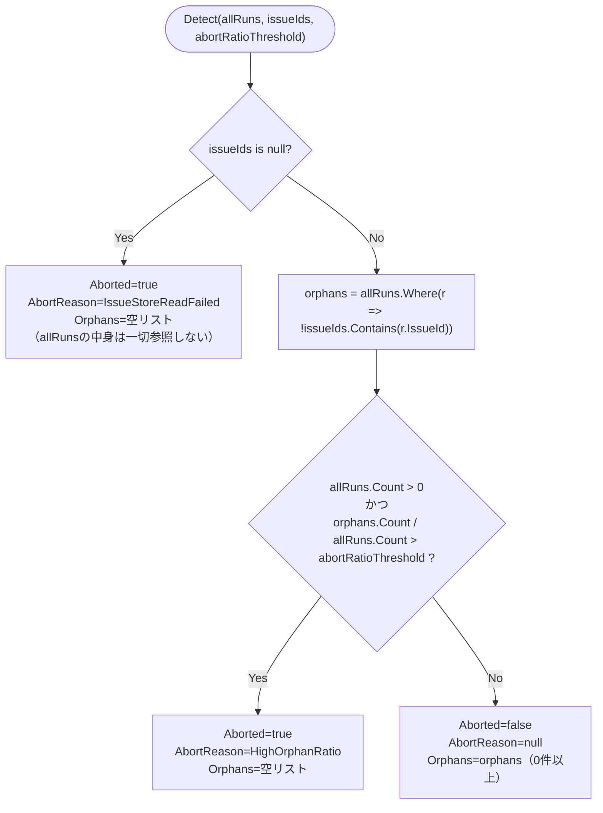

# COMP-10 `OrphanSweepService`（新規）

**対象ファイル**: `src/ClaudeCodeGui/Services/OrphanSweepService.cs`（新規）

**責務**: component_design.md 3.3節COMP-10（555〜591行目）を参照（シグネチャ・判定順序・退避先・実行タイミングは変更しない）。Issueが存在しないRun（孤児Run）を検出し、`runtime-data/orphaned/`へ退避する（REQ-23, REQ-24, REQ-25）。COMP-06〜09と同様、判定ロジック本体（`OrphanDetection.Detect`）は**副作用のない静的純粋関数**（NFR-03、単体テスト対象）とし、実際のストア読み取り・ファイル移動・監査ログ追記を行う`OrphanSweepService.SweepAsync`は**副作用あり**の薄いラッパー処理とする（COMP-09の`RetentionPruner.SelectRunsToPrune`／`PruneAsync`と同じ「純粋関数＋薄い副作用ラッパー」構成）。

```csharp
public enum SweepAbortReason { IssueStoreReadFailed, HighOrphanRatio }
public record OrphanDetectionResult(bool Aborted, SweepAbortReason? AbortReason, IReadOnlyList<Run> Orphans);

public static class OrphanDetection
{
    public static OrphanDetectionResult Detect(
        IReadOnlyList<Run> allRuns, IReadOnlySet<string>? issueIds, double abortRatioThreshold = 0.5);
}

public class OrphanSweepService
{
    public Task SweepAsync();
}
```

**COMP-09との違い（NFR-02）**: COMP-09（`RetentionPruner`）は「保持件数からあふれたRunを完全削除する」だけの処理であり、誤判定に対する安全弁を持たない。これに対しCOMP-10は、「Issueが見つからない＝削除された」という判定が誤判定（IssueストアI/Oの一時的失敗等）である可能性を要件自体が明示的に警戒しており（NFR-02）、`OrphanDetection.Detect`の判定１・２（後述）という形で安全弁がロジックの一部として組み込まれている点がCOMP-09と本質的に異なる。この違いは、後述「退避中に一部ファイルの移動が失敗した場合の扱い」でのCOMP-09との異同判断にも影響する。

**呼び出し元との関係**: `SweepAsync`は`Program.cs`（COMP-11）の起動シーケンス内、`TemplateSeeder.SeedDefaultsAsync`呼び出し直後に`await orphanSweepService.SweepAsync();`として1回だけ呼ばれる（component_design.md 589行目、601〜603行目）。

#### 2.10.0 `OrphanSweepService`のコンストラクタ（関数設計工程での具体化）

component_design.md 571〜576行目のクラス定義はメソッド（`SweepAsync`）のみを規定しており、コンストラクタの引数は確定していない。COMP-07 `TargetPathValidator`（2.7節）と同様、関数設計工程でコンストラクタを具体化する。

```csharp
public class OrphanSweepService
{
    public OrphanSweepService(
        JsonFileStore<Issue> issueStore,
        JsonFileStore<Run> runStore,
        string dataRoot,
        ILogger<OrphanSweepService> logger);
}
```

- `issueStore` / `runStore`: 既存のDI登録済みインスタンス（`Program.cs` 10, 12行目）をそのまま注入する。`ClaudeRunEngine`（COMP-05）のコンストラクタが`JsonFileStore<Run> runStore`をDI経由で受け取るのと同じパターン。
- `dataRoot`: `ClaudeRunEngine(IConfiguration config, string dataRoot, JsonFileStore<Run> runStore)`（既存コンストラクタ、`Program.cs` 13〜14行目で`dataRoot`変数を直接渡している）と同じパターンで、`runtime-data`のルートパスを受け取る。コンストラクタ内で以下のサブディレクトリパスを導出し、退避先ディレクトリ（`orphaned/`以下）は`Directory.CreateDirectory`で事前に作成しておく（`ClaudeRunEngine`が`_logDir`を`Directory.CreateDirectory(_logDir)`するのと同じ方針。`SweepAsync`実行のたびに存在確認する必要をなくす）。

  | フィールド | パス | 用途 |
  |---|---|---|
  | `_runsDir` | `Path.Combine(dataRoot, "runs")` | 移動元。Runレコードjsonの格納先（`JsonFileStore<Run>`のcollectionName`"runs"`と同一パス規則） |
  | `_logDir` | `Path.Combine(dataRoot, "run-logs")` | 移動元。Runログファイルの格納先（`ClaudeRunEngine._logDir`と同一パス） |
  | `_orphanedRunsDir` | `Path.Combine(dataRoot, "orphaned", "runs")` | 移動先（component_design.md 587行目`runtime-data/orphaned/runs/{runId}.json`） |
  | `_orphanedLogsDir` | `Path.Combine(dataRoot, "orphaned", "run-logs")` | 移動先（同587行目`runtime-data/orphaned/run-logs/{runId}.log`） |
  | `_auditLogPath` | `Path.Combine(dataRoot, "orphaned", "audit.log")` | 監査ログの追記先（同587行目） |

- `logger`: NFR-02が求める「ログに警告を出す」（中断時）を実現するための標準的なASP.NET Core DIの`ILogger<T>`。既存コードベースにはログ出力の前例がないため、本コンポーネントで新たに導入する（標準的な選択であり、代替手段を要件・設計書のいずれも指定していない）。

#### 2.10.1 `OrphanDetection.Detect(IReadOnlyList<Run> allRuns, IReadOnlySet<string>? issueIds, double abortRatioThreshold = 0.5)`

**純粋関数（ストア等への副作用なし、単体テスト対象、NFR-03）**。

**事前条件**:

| 引数 | 意味・由来 | null許容 | 不正値の扱い |
|---|---|---|---|
| `allRuns` | 全Run一覧（`SweepAsync`が`runStore.GetAllAsync()`の結果をそのまま渡す） | 不可。`null`が渡された場合（`issueIds`が`null`でない場合）、`allRuns.Where(...)`（LINQ拡張メソッド`Enumerable.Where`）呼び出し時点で`ArgumentNullException(nameof(source))`を送出する（.NET標準の`Enumerable.Where`は`source == null`の場合にこの例外を送出する仕様であり、`NullReferenceException`にはならない。`source`は`Enumerable.Where`拡張メソッド自身の仮引数名であり、呼び出し側の実引数名`allRuns`ではない点に注意。COMP-09 2.9.1節の`issueRuns`と同じLINQ null渡しパターン）。`issueIds`が`null`の場合は判定１が先に確定するため`allRuns`へは一切アクセスせず例外は発生しない（下記境界値#9参照）。呼び出し元（`SweepAsync`）が`null`を渡す経路は存在しない | 空リスト（0件）は正常な入力として許容する（下記境界値#1・#2） |
| `issueIds` | 正常に取得できたIssueId集合。**取得に失敗した場合は`null`を渡す設計**（component_design.md 565行目のコメントのとおり。`SweepAsync`側が例外を`null`へ変換する。2.10.2節参照） | 許容する。`null`＝Issueストア読み取り失敗を表す、本関数の入力インターフェース上の正式な状態（エラーコードではなくデータ型として表現する設計） | - |
| `abortRatioThreshold` | 孤児割合の中断閾値。既定値`0.5`（50%） | - | `double`型のため`null`は入力できない。本関数は範囲検証（`0.0`〜`1.0`であることの確認）を行わない。呼び出し元（`SweepAsync`）は既定値をそのまま使う想定であり、実運用でこの分岐が使われるのは単体テストでの境界確認が主（COMP-09 2.9.1節「`keep`が0または負数の場合」と同じ考え方）。負数や`1.0`超を渡した場合の挙動は下記境界値#8参照 |

**事後条件・戻り値の意味（判定の優先順位）**: component_design.md 579〜583行目の3分岐を、この順序で評価する（**上から順に確定し、該当した時点で以降の判定は行わない**）。

1. `issueIds is null`（Issueストアの一覧取得が失敗） → `OrphanDetectionResult(true, IssueStoreReadFailed, 空リスト)`。**`allRuns`が空かどうかに関わらず、`issueIds is null`であればこの判定が最優先で確定する**（`allRuns`へは一切アクセスしない。下記「`allRuns`が空かつ`issueIds`が`null`の場合の優先順位」参照）。
2. （判定１に該当しない場合）`orphans = allRuns.Where(r => !issueIds.Contains(r.IssueId)).ToList()`を計算した上で、`allRuns.Count > 0 かつ (double)orphans.Count / allRuns.Count > abortRatioThreshold` → `OrphanDetectionResult(true, HighOrphanRatio, 空リスト)`。`allRuns.Count > 0`のガードにより、`allRuns`が空の場合はこの判定に該当しない（0/0の不定形を避ける。下記境界値#1参照）。
3. （いずれにも該当しない場合） → `OrphanDetectionResult(false, null, orphans)`。`orphans`は`allRuns`のうち`IssueId`が`issueIds`に含まれない全件（0件以上）。

**`allRuns`が空かつ`issueIds`が`null`の場合の優先順位**: 上記のとおり判定１は`issueIds is null`のみで確定し`allRuns`の中身を一切参照しないため、`allRuns`が空リストであっても`issueIds is null`であれば必ず`IssueStoreReadFailed`で中断する。「孤児Runが1件も存在しない（`allRuns`が空）から安全」という理由で判定２・３側に流れることはない。これは、Issueストアの読み取りに失敗した時点でRunストア側の状態にかかわらず判断を保留する、というNFR-02の安全弁の趣旨（読み取り失敗＝判断材料が信頼できない状態）に沿った設計である。

**判定２の閾値比較が`>`（`>=`ではない）であることの確認**: component_design.md 582行目の記載「孤児と判定されるRunの割合 > abortRatioThreshold」をそのまま踏襲し、**厳密に上回った場合のみ中断**する（ちょうど閾値と一致する場合は中断しない）。下記境界値#5参照。COMP-08 `LoopEngine.Evaluate`の「オフバイワン」修正（`>`であって`>=`ではない、component_design.md 3.3節）と同種の、比較演算子の等号有無を明示すべき論点であるため本節でも同様に明記する。

##### 判定フロー（補足図）



##### 代表的な境界値・分岐条件

| # | `allRuns` | `issueIds` | `abortRatioThreshold` | 孤児割合 | 結果 |
|---|---|---|---|---|---|
| 1 | 空リスト（0件） | 非null（空集合含む） | 0.5（既定） | - （`allRuns.Count > 0`が不成立） | `Aborted=false`, `Orphans=空リスト` |
| 2 | 空リスト（0件） | `null`（読み取り失敗） | 0.5（既定） | - | `Aborted=true`, `IssueStoreReadFailed`（判定１優先。上記「`allRuns`が空かつ`issueIds`が`null`の場合の優先順位」参照） |
| 3 | 非空（例: 10件） | `null`（読み取り失敗） | 0.5（既定） | - | `Aborted=true`, `IssueStoreReadFailed`（`allRuns`の中身に関わらず） |
| 4 | 非空（例: 10件） | 非null | 0.5（既定） | 0%（孤児0件、全Runの`IssueId`が`issueIds`に含まれる） | `Aborted=false`, `Orphans=空リスト` |
| 5 | 非空（例: 10件） | 非null | 0.5（既定） | ちょうど50%（10件中5件が孤児、境界値） | `Aborted=false`, `Orphans=孤児5件`（`>`であって`>=`ではないため中断しない） |
| 6 | 非空（例: 10件） | 非null | 0.5（既定） | 50%をわずかに超過（10件中6件が孤児） | `Aborted=true`, `HighOrphanRatio`, `Orphans=空リスト` |
| 7 | 非空（例: 10件） | 非null（空集合、Issueが1件も存在しない状態） | 0.5（既定） | 100%（全件が孤児） | `Aborted=true`, `HighOrphanRatio`, `Orphans=空リスト` |
| 8 | 非空（例: 10件、孤児3件=30%） | 非null | `1.0`超（境界値、例: `1.5`） | 30% | `Aborted=false`（`orphans.Count / allRuns.Count`の最大値は`1.0`であり`1.0`超の閾値を上回ることは原理的にないため、判定２は常に不成立。事前条件の範囲検証は行わない設計の帰結） |
| 9 | `null`（境界値、`issueIds`が`null`でない場合のみ到達） | 非null | 0.5（既定） | - | `ArgumentNullException(nameof(source))`（LINQ標準`Enumerable.Where`の仕様。本関数は捕捉しない。呼び出し元がこの組み合わせで渡す経路は存在しない） |
| 10 | 非空（1件のみ） | 非null | 0.5（既定） | 0%または100%（1件しかないため50%という割合は取り得ない） | 0%なら`Aborted=false, Orphans=空`、100%なら`Aborted=true, HighOrphanRatio`（`N`が小さいほど閾値ちょうど＝境界値#5のケースを実際には取りにくい点に注意。テストケース設計では`N=10`のような閾値をちょうど跨ぐ件数を用いること） |

**参考実装（アルゴリズム）**:

```csharp
public static OrphanDetectionResult Detect(
    IReadOnlyList<Run> allRuns, IReadOnlySet<string>? issueIds, double abortRatioThreshold = 0.5)
{
    if (issueIds is null)
        return new OrphanDetectionResult(true, SweepAbortReason.IssueStoreReadFailed, Array.Empty<Run>());

    var orphans = allRuns.Where(r => !issueIds.Contains(r.IssueId)).ToList();

    if (allRuns.Count > 0 && (double)orphans.Count / allRuns.Count > abortRatioThreshold)
        return new OrphanDetectionResult(true, SweepAbortReason.HighOrphanRatio, Array.Empty<Run>());

    return new OrphanDetectionResult(false, null, orphans);
}
```

#### 2.10.2 `OrphanSweepService.SweepAsync()`

**副作用あり**（Issueストア・Runストアの読み取り、孤児Runのjson・ログファイルの移動、監査ログファイルへの追記）。

**事前条件**: 引数なし。コンストラクタで束縛済みの`issueStore`・`runStore`・各パス（2.10.0節）・`logger`を用いる。`Program.cs`起動シーケンス内で1回だけ呼ばれる想定（component_design.md 589行目）だが、`SweepAsync`自身は複数回呼ばれても安全な設計とする（下記「処理の骨格」参照。将来手動トリガーUIを追加する場合に備え、component_design.md 589行目が言及する「単体で呼び出し可能な設計」を満たす）。

**処理の骨格**:

1. Issueストアから`issueIds`を構築する。`issueStore.GetAllAsync()`を呼び、成功すれば`issues.Select(i => i.Id).ToHashSet()`を`issueIds`とする。**この呼び出しのみ例外を捕捉し**、例外が発生した場合は`issueIds = null`とする（下記「`issueStore.GetAllAsync()`の例外を捕捉する設計判断」参照）。
2. `allRuns = await runStore.GetAllAsync()`で全Runを取得する。**この呼び出しは例外を捕捉しない**（下記同項目参照）。
3. `result = OrphanDetection.Detect(allRuns, issueIds, abortRatioThreshold: 0.5)`を呼ぶ（`abortRatioThreshold`は既定値をそのまま使う。呼び出し元固有の値を渡す経路はない）。
4. `result.Aborted == true`の場合: `logger.LogWarning(...)`で`result.AbortReason`を含む警告を1行出力し、削除・退避処理を一切行わずそのまま終了する（component_design.md 585行目）。
5. `result.Aborted == false`の場合: `result.Orphans`の各Runについて、**この順序で**退避する（順序の設計判断は下記「移動順序の設計判断」参照）。
   1. `logSrc = Path.Combine(_logDir, $"{run.Id}.log")`が存在すれば（`File.Exists`）、`logDst = Path.Combine(_orphanedLogsDir, $"{run.Id}.log")`へ`File.Move`する。存在しなければ何もしない（下記「ログファイルが存在しない場合の扱い」参照）。
   2. `runSrc = Path.Combine(_runsDir, $"{run.Id}.json")`を`runDst = Path.Combine(_orphanedRunsDir, $"{run.Id}.json")`へ`File.Move`する（`runStore.DeleteAsync`は使わない。`DeleteAsync`は削除のみでファイルを退避先へ運べないため、本メソッドは`File.Move`を直接使う。下記「`JsonFileStore.DeleteAsync`を使わない理由」参照）。
   3. 上記2手順が両方成功した後、監査ログ1行を`_auditLogPath`へ追記する（`{timestamp, runId, issueId, reason:"issue_not_found"}`形式、component_design.md 587行目。追記タイミングは下記「監査ログへの追記タイミング・フォーマット」参照。この追記自体が失敗した場合の扱いは下記「監査ログ追記が失敗した場合の扱い」参照。ログ移動・jsonレコード移動の例外とは扱いが異なる）。
6. 上記5-1・5-2（ログファイル・Runレコードjsonの`File.Move`）で途中に例外が発生した場合は`catch`せず、その時点で処理を打ち切り呼び出し元へ伝播する（下記「退避中に一部ファイルの移動が失敗した場合の扱い」参照）。上記5-3（監査ログ追記）で例外が発生した場合は、この方針とは異なり`catch`して警告ログを出力した上で次のRunの処理を継続する（下記「監査ログ追記が失敗した場合の扱い」参照。ファイル移動失敗とは性質が異なるため扱いを分けている）。

##### `SweepAsync`の処理フロー（補足図）

```mermaid
flowchart TD
    Start(["SweepAsync()"]) --> ReadIssues["issueStore.GetAllAsync() を呼ぶ\n（例外を捕捉する）"]
    ReadIssues -->|成功| SetIds["issueIds = 取得したIssueIdのHashSet"]
    ReadIssues -->|例外| SetNull["issueIds = null"]
    SetIds --> ReadRuns
    SetNull --> ReadRuns["allRuns = await runStore.GetAllAsync()\n（例外を捕捉しない＝伝播する）"]
    ReadRuns --> Detect["OrphanDetection.Detect(allRuns, issueIds)"]
    Detect --> Q{"result.Aborted"}
    Q -->|true| Warn["logger.LogWarning(result.AbortReason)\n退避処理は一切行わず終了"]
    Q -->|false| Loop{"result.Orphansに\n未処理のRunが残っているか"}
    Loop -->|なし| Done(["終了（Task完了）"])
    Loop -->|あり| MoveLog["ログファイルが存在すれば\norphaned/run-logs/ へ File.Move"]
    MoveLog --> MoveRun["runs/{runId}.json を\norphaned/runs/ へ File.Move"]
    MoveRun --> Audit["audit.log に1行追記\n{timestamp, runId, issueId, reason:\"issue_not_found\"}"]
    Audit -->|成功| Loop
    Audit -.->|例外| AuditWarn["logger.LogWarning\n（監査ログ追記のみ失敗。\nRun自体は退避済みのまま次のRunへ継続）"]
    AuditWarn --> Loop
    MoveLog -.->|例外| Propagate(["呼び出し元へ例外を伝播し処理を中断\n（それより前に処理済みのRunは移動済みのまま）"])
    MoveRun -.->|例外| Propagate
```

##### `issueStore.GetAllAsync()`の例外を捕捉する設計判断（COMP-09との異同）

**設計判断: `SweepAsync`のうち`issueStore.GetAllAsync()`の呼び出しに限り例外を捕捉し`issueIds = null`へ変換する。それ以外（`runStore.GetAllAsync()`、退避処理の各`File.Move`）は捕捉せず伝播させる。**

COMP-09 `RetentionPruner.PruneAsync`（2.9.2節）は「予期しない例外はキャッチせず再送出する」という本システム全体で一貫した方針を採っており、本節でも既定ではこれを踏襲する。しかし`issueStore.GetAllAsync()`の呼び出しに限っては、以下の理由によりこの既定方針の**意図的な例外**として、あえて例外を捕捉する設計とする。

1. **NFR-02自体が要求する挙動である**: NFR-02は「ディスクI/O異常等でIssueストア読み取りが一時的に失敗するケース」を名指しし、「Issueストアの一覧取得が失敗した場合...処理を中断してログに警告を出すだけとし、削除・退避を実行しない」ことを明示的に求めている。またcomponent_design.md 565行目は`OrphanDetection.Detect`の`issueIds`引数について「正常に取得できたIssueId集合（取得失敗時はnull）」と、失敗を`null`という値で表現するインターフェースをすでに確定させている。この`null`を生成する変換処理（例外→`null`）は`SweepAsync`が担う以外の場所がなく、`SweepAsync`が例外を捕捉すること自体がNFR-02の実装そのものである（COMP-09のような「捕捉しない」という一般方針からの逸脱ではなく、COMP-10固有の要件を満たすための必須の実装）。
2. **COMP-09にはこの種の安全弁の対象となる要件が存在しない**: COMP-09（Runの保持件数超過削除）には、判定材料の取得失敗を区別して安全側に倒すという要求がそもそも存在しない（NFR-02はCOMP-10のみに対応するID）。したがって「COMP-09は捕捉しない」という決定と「COMP-10のIssueストア読み取りは捕捉する」という決定は、対応する要件が異なる以上、矛盾しない。むしろ両者とも「各コンポーネントが自身に課された要件の要求どおりに振る舞う」という一貫した原則の表れである。
3. **捕捉範囲を`issueStore.GetAllAsync()`の呼び出し1箇所に限定し、それ以外へは広げない**: `runStore.GetAllAsync()`の読み取り失敗や、退避処理中の`File.Move`失敗は、NFR-02が名指しする「Issueストアの一覧取得」の失敗ではなく、また`OrphanDetection.Detect`の安全弁（判定１・２）が対象とする種類の「誤判定リスク」でもない、純然たる予期しないI/O異常である。これらはCOMP-09・COMP-05・COMP-08と同じ本システム全体の既定方針（捕捉せず伝播させる）に従う。`SweepAsync`は`Program.cs`の起動シーケンス内で1回だけ同期的に呼ばれる（component_design.md 601〜603行目）ため、ここで例外が伝播した場合はアプリ起動自体が失敗する。これは`TemplateSeeder.SeedDefaultsAsync`（起動シーケンス内の隣接する処理）が例外を投げた場合と同じ挙動であり、起動時初期化処理における失敗の可視化という既存の思想と整合する（黙って握りつぶし、運用者が異常に気づけないまま起動を継続させることは避ける）。

以上より、**COMP-09の「キャッチせず再送出」方針とCOMP-10は、大部分（`runStore.GetAllAsync()`・退避処理の`File.Move`）で一致するが、`issueStore.GetAllAsync()`の1箇所に限り、NFR-02という上位要件の直接の要求により意図的に異なる（例外を捕捉する）**。これは方針のブレではなく、要件が明示的に要求する例外的取り扱いであることを、単体テスト設計時にも区別できるよう本節に明記する。

##### 移動順序の設計判断（ログファイル→Runレコードjsonの順とする根拠）

component_design.mdは退避対象（json・ログ）2ファイルの移動順序を規定していないため、COMP-09 2.9.2節「削除順序の設計判断」と同じ考え方で決定する。

`File.Move`は移動元ファイルが存在しない場合`FileNotFoundException`を送出する（COMP-09の`File.Delete`・`JsonFileStore.DeleteAsync`とは異なり、**移動は削除と違って冪等ではない**点に注意。この非対称性を踏まえ、ログファイル側は移動前に`File.Exists`で存在確認するガードを設ける、2手順目「ログファイルが存在しない場合の扱い」参照）。

移動順序ごとの失敗時の挙動を比較すると以下のとおり。

| 移動順序 | 途中で例外が発生した場合の挙動 |
|---|---|
| ログファイル→Runレコードjson（採用） | ログファイル移動で例外が発生した場合、Runレコードjsonは`runs/`ディレクトリに残ったままとなる。次回`SweepAsync`実行時、`runStore.GetAllAsync()`は当該Runを引き続き返すため`Detect`の孤児判定対象に再び現れ、退避が自然に再試行される（次回はログファイルが既に移動済みなら`File.Exists`が`false`を返し無処理でスキップされ、Runレコードjsonの移動まで完了する） |
| Runレコードjson→ログファイル（不採用） | Runレコードjsonの移動が先に成功してしまうと、当該jsonは`runs/`ディレクトリから既に消えているため、以降`runStore.GetAllAsync()`の結果に二度と現れず`Detect`の孤児判定対象からも外れる。その後ログファイルの移動が失敗すると、ログファイルだけが元の`run-logs/`に永久に取り残される（REQ-24が求める「復元可能な状態を保つ」退避が、ログ側だけ果たされない孤立ファイルを生む） |

以上より、COMP-09と同じ「失敗時に自己修復可能な順序」という判断基準により、ログファイル→Runレコードjsonの順を採用する。

**ログファイルが存在しない場合の扱い**: モック実行のRunや、運用者が手動でログファイルのみ先に削除済みのケース等、ログファイルが最初から存在しない場合を想定し、移動前に`File.Exists(logSrc)`で確認し、存在しない場合は例外を発生させず単に移動をスキップしてRunレコードjsonの移動へ進む（`File.Move`自体は存在しないファイルに対し`FileNotFoundException`を送出するため、COMP-09の`File.Delete`のような自然な冪等性がなく、本メソッド側で明示的にガードする必要がある点がCOMP-09との実装上の相違点）。

**`JsonFileStore<Run>.DeleteAsync`を使わない理由**: `DeleteAsync`（`src/ClaudeCodeGui/Data/JsonFileStore.cs` 65〜70行目）は対象ファイルを削除するのみで、退避先へ内容を運ぶ機能を持たない。REQ-24は「即座に完全削除せず退避する」ことを求めており、単純な削除では要件を満たさないため、`SweepAsync`は`_runsDir`・`_orphanedRunsDir`のパスを自前で構築し`File.Move`を直接呼ぶ（2.10.0節のパス導出を参照。`JsonFileStore<Run>`の内部ファイル配置規則＝`Path.Combine(dataRoot, "runs", $"{id}.json")`と一致させる必要があるが、これは`JsonFileStore`のコンストラクタが`Path.Combine(dataRoot, collectionName)`という規則的な命名を用いているため、既存のPublicメンバーからは導出できないパスを本コンポーネント側で複製している。COMP-11のDI構成時、`collectionName`のリテラル値（`"runs"`）が変わった場合は本コンポーネントのパス構築も追従して変更する必要がある点に注意）。

**監査ログへの追記タイミング・フォーマット**: 1件のRunにつき、ログファイル・Runレコードjsonの両方の移動が成功した**直後**（他のRunの処理を待たず、Runごとに逐次）追記する。理由は以下のとおり。

- 移動前に追記すると、移動が途中で失敗した場合に「実際には退避されていないRunの監査ログ記録が残る」という、ログの正確性を損なう不整合が生じる。
- 全Run処理後にまとめて追記する（バッチ化）と、後続のRunで例外が発生した場合、既に退避済みの先行Runについても監査ログが一切記録されないまま処理が打ち切られてしまう（退避自体は完了しているのに、REQ-25が求める監査証跡が欠落する）。
- Runごとの逐次追記であれば、途中で例外が発生しても、それより前に処理済みのRunは「ファイル移動済み・監査ログ記録済み」の両方が整合した状態で残る。

フォーマットはcomponent_design.md 587行目の`{timestamp, runId, issueId, reason:"issue_not_found"}`をそのまま踏襲し、1行1レコードのJSON Lines形式で`_auditLogPath`へ追記する（`File.AppendAllTextAsync`等で改行区切り）。各フィールドの値は以下のとおり。

| フィールド | 値 | 補足 |
|---|---|---|
| `timestamp` | `DateTimeOffset.UtcNow` | 追記時点の値。Runの`StartedAt`等の過去の時刻は使わない |
| `runId` | `run.Id` | - |
| `issueId` | `run.IssueId` | 存在しないIssueのId文字列そのもの。孤児と判定された根拠を監査ログ上でも追跡できるようにするため、変換や匿名化はしない |
| `reason` | 固定文字列`"issue_not_found"` | component_design.md 587行目のとおり、本コンポーネントが扱う退避理由は現状この1種類のみ。中断理由を表す`SweepAbortReason`とは別の概念であることに注意（`SweepAbortReason`は中断理由、`reason:"issue_not_found"`は個々のRun退避の理由） |

**退避中に一部ファイルの移動が失敗した場合の扱い（①ログファイル・②Runレコードjsonの`File.Move`が失敗した場合。③監査ログ追記の失敗は性質が異なるため次項「監査ログ追記が失敗した場合の扱い」で別途扱う）（例外を送出するか・スキップして続行するか）**: **例外を送出し、その時点で処理を中断する（個別の失敗を捕捉してスキップし続行する設計は採らない）**。COMP-09 2.9.2節「削除中に一部ファイルの削除が失敗した場合の扱い」と同じ判断根拠（既存決定との整合、部分実行を許容しても実害が小さい＝次回`SweepAsync`実行時に自己修復される、副作用とロジックを混在させない設計方針）がそのまま当てはまる。

相違点は、COMP-10の場合「次回の`SweepAsync`実行」が次回のアプリ起動時である点（COMP-09の`PruneAsync`は新規Run作成の都度呼ばれるためより頻繁に再試行される）。本アプリは「稀にしか再起動しないローカルツール」（component_design.md 551行目、COMP-09節）であるため、退避漏れの再試行間隔はCOMP-09より長くなりうるが、これは実行タイミング自体の設計判断（component_design.md 589行目で確定済み、本節では変更しない）に起因するものであり、`SweepAsync`単体の例外処理方針をこの理由で変える必要はないと判断した。

**監査ログ追記自体が失敗した場合の扱い（設計判断）**: **`File.AppendAllTextAsync`が失敗した場合は例外を`catch`し、`logger.LogWarning`で警告を出力した上で、当該Runは退避済みとして扱い（例外を伝播させず）次のRunの処理を継続する。**上記①②の`File.Move`失敗時（例外を伝播し処理中断）とは異なる方針である。

理由:

1. **File.Move失敗時とは前提が異なる**: `File.Move`失敗時に例外を伝播させ処理を打ち切るのは、まだ退避が完了していないRunが存在するため、それ以上不整合な状態で処理を進めないための判断である。これに対し監査ログ追記の時点では、当該Runのログファイル・Runレコードjsonは**既に両方とも`orphaned/`への移動が完了している**（処理の骨格5-1・5-2が両方成功した後にのみ5-3が実行される）。すなわち監査ログ追記の失敗は、REQ-24が求める「復元可能な状態での退避」自体には影響しない、監査証跡（REQ-25）のみに関わる問題である。
2. **例外を伝播させた場合の実害の方が大きい**: 仮に監査ログ追記の例外を伝播させると、`SweepAsync`は`Program.cs`起動シーケンス内で呼ばれるため（component_design.md 589行目）、アプリ起動自体が失敗する。「監査ログ1行が書けなかった」という事象に対し、アプリ全体を起動不能にするのは不釣り合いに大きい代償である。また伝播させた場合、`result.Orphans`に残る他の孤児Runの退避処理も一切実行されなくなり、監査ログ追記が失敗した1件以外の退避まで巻き添えで止まってしまう。
3. **「次回`SweepAsync`実行時の自己修復」に頼れない**: 当該Runのjsonは既に`orphaned/runs/`へ移動済みのため、以降`runStore.GetAllAsync()`の対象から外れ、`OrphanDetection.Detect`の孤児判定対象には二度と現れない。COMP-09や本節①②の失敗ケースが前提とする「次回実行時に再試行され自己修復される」という安全網が、この監査ログ追記失敗のケースには存在しない。捕捉せず伝播させても自己修復は起きないため、伝播させる設計上のメリットがない。
4. **残存リスクの明示（NFR-02の対象外）**: 上記の結果、監査ログ追記が失敗したRunについては、`orphaned/runs/`・`orphaned/run-logs/`へのファイル自体は正しく退避済み（REQ-24は満たす）だが、`orphaned/audit.log`への該当行が永久に欠落する可能性が残る。これはNFR-02が対象とする「Issueストア読み取り失敗時の誤判定防止」とは異なる種類のリスクであり、本節ではNFR-02の安全弁の対象外として明示する。運用上は`logger.LogWarning`が出力されるため、アプリケーションログを確認すれば当該Runの退避自体は完了していたことを事後的に把握できる（監査ログ本体には残らないが、アプリケーションログには痕跡が残る）。

比較のため、退避時の3手順それぞれの失敗時挙動を以下にまとめる。

| 手順 | 失敗時の挙動 | 自己修復可能性 | 判断根拠 |
|---|---|---|---|
| ①ログファイル`File.Move` | 例外を伝播し処理中断 | あり（jsonが`runs/`に残るため次回`SweepAsync`で再試行） | 「移動順序の設計判断」参照 |
| ②Runレコードjson `File.Move` | 例外を伝播し処理中断 | あり（①は成功済みだが②未完了のRunは孤児判定対象に残り続けるため次回再試行される） | 「退避中に一部ファイルの移動が失敗した場合の扱い」参照 |
| ③監査ログ`File.AppendAllTextAsync` | 例外を`catch`し警告ログを出力、当該Runは退避済み扱いのまま次Runへ継続 | **なし**（①②は成功済みでjsonが`orphaned/`へ移動済みのため孤児判定対象から恒久的に外れ、再試行されない） | 本節（監査ログ追記が失敗した場合の扱い）参照。自己修復できないからこそ、伝播による道連れ被害（アプリ起動失敗・他の孤児Runの退避巻き添え停止）を避け、実害を「当該1件の監査ログ欠落」に限定する方針を採る |

**事後条件・戻り値の意味**: 戻り値は`Task`（成功・失敗を区別する戻り値は持たない）。中断（`Aborted=true`）の場合、ストア・ファイルは一切変更されない（監査ログへの追記も行わない）。

正常終了の場合、`result.Orphans`の各Runについて、`runs/{runId}.json`・（存在すれば）`run-logs/{runId}.log`が`orphaned/`配下へ移動済みとなる。監査ログについては、通常は`orphaned/audit.log`に対応する1行が追記済みとなるが、追記自体が失敗したRunに限り（「監査ログ追記が失敗した場合の扱い」参照）、ファイル移動は完了しているにもかかわらず例外を伝播させず`logger.LogWarning`で警告するのみとするため、`audit.log`への該当行が欠落する可能性がある。

途中で①ログファイル・②Runレコードjsonの`File.Move`のいずれかで例外が発生した場合、それより前に処理済みのRunは退避（および監査ログ追記が成功していれば記録）済みのまま、それ以降のRunは未処理のまま残り、呼び出し元（`Program.cs`起動シーケンス）に例外が伝播する。

**代表的な境界値・分岐条件**:

| # | 状況 | 結果 |
|---|---|---|
| 1 | `issueStore.GetAllAsync()`が正常終了し、`OrphanDetection.Detect`が`Aborted=false`・`Orphans`空リストを返す（孤児なし） | `runStore.GetAllAsync()`以降のファイル移動・監査ログ処理は一切実行されない（`result.Orphans`が空のためループ本体に入らない） |
| 2 | `issueStore.GetAllAsync()`が例外を送出（ディスクI/O異常等） | `issueIds = null`となり`Detect`が`IssueStoreReadFailed`で中断。`logger.LogWarning`のみでファイル移動・監査ログ追記は一切行わない（NFR-02） |
| 3 | `Detect`が`HighOrphanRatio`で中断（孤児割合が閾値超過） | `logger.LogWarning`のみでファイル移動・監査ログ追記は一切行わない（NFR-02） |
| 4 | 孤児Runが1件以上あり、全件の移動・監査ログ追記が成功 | 該当する全Runのjson・（存在すれば）ログファイルが`orphaned/`配下へ移動され、`audit.log`に同数の行が追記される |
| 5 | 孤児Runのログファイルが最初から存在しない（モック実行のRun等、境界値） | `File.Exists`判定によりログ移動はスキップされ、Runレコードjsonの移動・監査ログ追記は通常どおり完了する（上記「ログファイルが存在しない場合の扱い」参照） |
| 6 | 孤児Runのログファイル移動中に例外（ロック中・権限エラー等のI/O異常、境界値） | 例外が呼び出し元へ伝播し処理を中断する。当該Runのレコードjsonは移動されない（未処理のまま残り次回`SweepAsync`実行時に再試行される）。それより前に処理済みのRunは退避済みのまま（上記「退避中に一部ファイルの移動が失敗した場合の扱い」参照） |
| 7 | `runStore.GetAllAsync()`自体が例外を送出（Runストア側の破損等） | 捕捉されず呼び出し元（`Program.cs`起動シーケンス）へ伝播する。アプリ起動が失敗する（上記「`issueStore.GetAllAsync()`の例外を捕捉する設計判断」参照。NFR-02の対象は明示的に「Issueストアの一覧取得」の失敗のみであり、Runストア側の失敗は対象外） |
| 8 | 孤児Runのログファイル・Runレコードjson両方の移動が成功した直後、監査ログ`File.AppendAllTextAsync`が失敗（ディスク容量不足・ロック中等のI/O異常、境界値） | 例外を`catch`し`logger.LogWarning`で警告を出力、当該Runは退避済み扱いのまま次のRunの処理へ継続する（例外は伝播しない）。当該Runのjson・ログファイルは`orphaned/`へ移動済みだが`audit.log`への該当行は欠落する（「監査ログ追記が失敗した場合の扱い」参照。自己修復されない残存リスクとして明示） |

**参考実装（アルゴリズム）**:

```csharp
public async Task SweepAsync()
{
    IReadOnlySet<string>? issueIds;
    try
    {
        var issues = await _issueStore.GetAllAsync();
        issueIds = issues.Select(i => i.Id).ToHashSet();
    }
    catch (Exception ex)
    {
        _logger.LogWarning(ex, "Issueストアの一覧取得に失敗したため孤児Run掃除を中断します。");
        issueIds = null;
    }

    var allRuns = await _runStore.GetAllAsync(); // 例外は捕捉せず伝播させる

    var result = OrphanDetection.Detect(allRuns, issueIds);
    if (result.Aborted)
    {
        _logger.LogWarning("孤児Run掃除を中断しました。理由: {Reason}", result.AbortReason);
        return;
    }

    foreach (var run in result.Orphans)
    {
        var logSrc = Path.Combine(_logDir, $"{run.Id}.log");
        if (File.Exists(logSrc))
        {
            File.Move(logSrc, Path.Combine(_orphanedLogsDir, $"{run.Id}.log"));
        }

        var runSrc = Path.Combine(_runsDir, $"{run.Id}.json");
        File.Move(runSrc, Path.Combine(_orphanedRunsDir, $"{run.Id}.json"));

        try
        {
            var entry = new { timestamp = DateTimeOffset.UtcNow, runId = run.Id, issueId = run.IssueId, reason = "issue_not_found" };
            await File.AppendAllTextAsync(_auditLogPath, JsonSerializer.Serialize(entry) + Environment.NewLine);
        }
        catch (Exception ex)
        {
            // 上記2件のFile.Moveは既に成功済み（Runは退避済み）。この時点でjsonはorphaned/へ
            // 移動済みのため例外を伝播させても次回SweepAsyncで再試行されず自己修復は起きない
            // （「監査ログ追記が失敗した場合の扱い」参照）。警告のみ出し次のRunへ継続する。
            _logger.LogWarning(ex, "孤児Run {RunId} の監査ログ追記に失敗しました（退避自体は完了）。", run.Id);
        }
    }
}
```

対応ID: REQ-23, REQ-24, REQ-25, NFR-02

