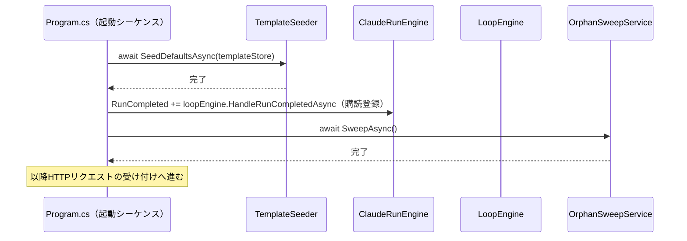
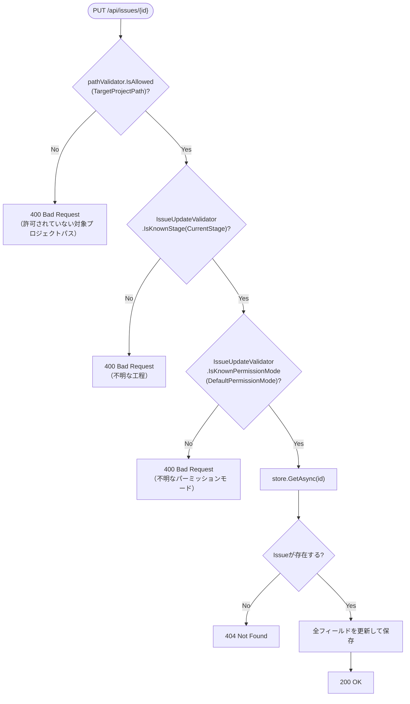

# COMP-11 `Program.cs` エンドポイント拡張・DI配線・起動時処理

**対象ファイル**: `src/ClaudeCodeGui/Program.cs`

**責務**: component_design.md 3.4節COMP-11（593〜622行目）を参照（エンドポイント一覧・変更内容・対応IDは変更しない）。COMP-05〜10のロジック層コンポーネントをHTTPエンドポイントおよび起動シーケンスへ配線する、判定ロジックを一切持たない薄い層。本節はこの薄い層をDI登録・起動時処理・各ハンドラの処理の骨格まで具体化する。

**小節構成**:

| 節 | 内容 | 種別 |
|---|---|---|
| 2.11.1 | DI登録の追加 | — |
| 2.11.2 | 起動時処理の追加 | — |
| 2.11.3 | `IssueUpdateValidator`（新規。COMP-01・COMP-08からの申し送り事項への回答） | 純粋関数 |
| 2.11.4 | `POST /api/issues` ハンドラの変更 | 副作用あり |
| 2.11.5 | `PUT /api/issues/{id}` ハンドラの変更 | 副作用あり |
| 2.11.6 | `POST /api/templates` / `PUT /api/templates/{id}` ハンドラの変更 | 副作用あり |
| 2.11.7 | `ToRunStartResponse`（新規、共通ヘルパー） | 副作用のない変換関数 |
| 2.11.8 | `POST /api/issues/{issueId}/runs` ハンドラの変更 | 副作用あり |
| 2.11.9 | `POST /api/issues/{issueId}/loop/start` ハンドラ（新規） | 副作用あり |
| 2.11.10 | `POST /api/runs/{id}/cancel` ハンドラの変更 | 副作用あり |
| 2.11.11 | 変更不要と確認したエンドポイント | — |

#### 2.11.1 DI登録の追加

component_design.md「DI登録の追加」節を、既存の`Program.cs`（1〜15行目）のDI登録ブロックへの具体的な追加として以下のとおり確定する。追加位置は既存の`builder.Services.AddSingleton<ArtifactService>();`（15行目）の直後、`var app = builder.Build();`（17行目）の前とする。

```csharp
builder.Services.AddSingleton(sp => new TargetPathValidator(
    builder.Configuration.GetSection("Security:AllowedProjectRoots").Get<string[]>() ?? Array.Empty<string>()));
builder.Services.AddSingleton<LoopEngine>();
builder.Services.AddSingleton(sp => new OrphanSweepService(
    sp.GetRequiredService<JsonFileStore<Issue>>(),
    sp.GetRequiredService<JsonFileStore<Run>>(),
    dataRoot,
    sp.GetRequiredService<ILogger<OrphanSweepService>>()));
```

| 登録対象 | 登録方法 | 根拠 |
|---|---|---|
| `TargetPathValidator` | ファクトリ経由。コンストラクタ引数`allowedRoots`に`appsettings.json`の`Security:AllowedProjectRoots`を束縛する | 2.7.3節「事前条件」（DIコンテナ構成時に一度だけ束縛） |
| `LoopEngine` | 型登録のみ（`AddSingleton<LoopEngine>()`）。コンストラクタ引数（`JsonFileStore<Issue>`・`JsonFileStore<PromptTemplate>`・`ClaudeRunEngine`）はいずれも既存登録済みの型のため、ASP.NET CoreのDIコンテナが自動解決できる | 2.8節冒頭「依存関係」 |
| `RetentionPruner` | **登録不要**（下記「確認事項」参照） | 2.9節 |
| `OrphanSweepService` | ファクトリ経由。コンストラクタ引数`dataRoot`（`string`）はDIで自動解決できない値のため、既存の`dataRoot`変数（`Program.cs` 7行目）を直接渡す。`issueStore`/`runStore`/`logger`は既存登録済みの型から解決する | 2.10.0節（コンストラクタ引数） |

**`RetentionPruner`のDI登録が不要であることの確認（発見した確認事項）**: 2.9節でCOMP-09 `RetentionPruner`は`public static class RetentionPruner`（静的クラス）と確定しており、`PruneAsync(string issueId, JsonFileStore<Run> runStore, string logDir)`も`static`メソッドである。呼び出し元は`ClaudeRunEngine.StartAsync`（COMP-05、2.5.1節手順3）であり、`runStore`・`logDir`はいずれも`ClaudeRunEngine`自身が既に保持している値をそのまま渡す設計のため、`RetentionPruner`自体をDIコンテナへ登録する必要は生じない。

component_design.mdの「静的クラス/インスタンスとして必要な形で登録」という記述は、`RetentionPruner`（静的クラス＝登録不要）と`OrphanSweepService`（インスタンス＝登録必要）のそれぞれに応じた扱いを指しており、両者を区別せず一律に`AddSingleton`する必要はないと解釈した。

**`ClaudeRunEngine`のコンストラクタ変更が不要であることの確認（発見した確認事項）**: component_design.mdは「`ClaudeRunEngine`のコンストラクタに`ClaudeCli:MockMode`設定へのアクセスを追加」と記載しているが、既存コンストラクタは既に`ClaudeRunEngine(IConfiguration config, string dataRoot, JsonFileStore<Run> runStore)`という形で`IConfiguration config`をまるごと受け取っている（`Program.cs` 13〜14行目、2.10.0節でも同一コンストラクタが参照されている）。`ClaudeCli:MockMode`は`IConfiguration`から`config["ClaudeCli:MockMode"]`等で読み取れるため、この`config`引数だけで既に到達可能であり、シグネチャ自体の変更や`Program.cs`側のDI登録変更は不要である。

component_design.mdのこの記述は「（既存のconfig引数経由で）アクセスできるようにする」という設計意図の言い換えであり、実装上の追加作業を要求するものではないと判断した。矛盾ではなく確認事項として明記するに留め、component_design.mdの記載自体は変更しない。

#### 2.11.2 起動時処理の追加

component_design.md「起動時処理の追加」節が指定する2手順を、既存の`using (var scope = ...)`ブロック（`Program.cs` 19〜22行目）内、`TemplateSeeder.SeedDefaultsAsync`呼び出しの直後に追記する。

```csharp
using (var scope = app.Services.CreateScope())
{
    await TemplateSeeder.SeedDefaultsAsync(app.Services.GetRequiredService<JsonFileStore<PromptTemplate>>());

    var claudeRunEngine = app.Services.GetRequiredService<ClaudeRunEngine>();
    var loopEngine = app.Services.GetRequiredService<LoopEngine>();
    claudeRunEngine.RunCompleted += loopEngine.HandleRunCompletedAsync;

    await app.Services.GetRequiredService<OrphanSweepService>().SweepAsync();
}
```

##### 起動時処理のシーケンス（補足図）



**手順の順序について**: component_design.mdが指定する順序（①`loopEngine`を`RunCompleted`へ購読登録→②`orphanSweepService.SweepAsync()`）をそのまま踏襲する。①を②より先に行う理由は明記されていないが、`SweepAsync`はストア読み取り・ファイル移動のみで`RunCompleted`イベントを発火させる経路を持たない（2.10節参照）ため、実際にはこの順序を入れ替えても機能上の差異は生じない。本節ではcomponent_design.mdの確定順序をそのまま維持する。

**代表的な境界値・分岐条件**:

| # | 状況 | 結果 |
|---|---|---|
| 1 | 通常起動 | シード→購読登録→`SweepAsync`の順に完了し、以降HTTPリクエストの受け付けへ進む |
| 2 | `SweepAsync`が`issueStore.GetAllAsync()`以外の箇所で例外を送出（2.10節「発見した確認事項」参照） | 例外が`Program.cs`の起動シーケンスへ伝播し、アプリ起動自体が失敗する（2.10節の設計判断どおり） |
| 3 | `TemplateSeeder.SeedDefaultsAsync`が例外を送出（既存動作） | 同様に起動シーケンスへ伝播し起動失敗（本節での変更なし。既存の挙動を維持） |

#### 2.11.3 `IssueUpdateValidator`（新規。COMP-01・COMP-08からの申し送り事項への回答）

**対象ファイル**: `src/ClaudeCodeGui/Services/IssueUpdateValidator.cs`（新規）

**責務**: `PUT /api/issues/{id}`が受け取る`CurrentStage`・`DefaultPermissionMode`が既知の値かどうかを検証する。COMP-06/07/08/09/10と同様、**副作用のない静的純粋関数**（NFR-03、単体テスト対象）とする。

```csharp
public static class IssueUpdateValidator
{
    public static readonly IReadOnlyList<string> KnownStages =
        new[] { "requirements", "design", "implementation", "testing", "deployment" };

    public static readonly IReadOnlyList<string> KnownPermissionModes =
        new[] { "acceptEdits", "bypassPermissions", "plan" };

    public static bool IsKnownStage(string? stage) => KnownStages.Contains(stage);
    public static bool IsKnownPermissionMode(string? mode) => KnownPermissionModes.Contains(mode);
}
```

`KnownStages`はCOMP-08 2.8.1/2.8.2節の5値（`TemplateSeeder.SeedDefaultsAsync`が定義するStage集合と一致）、`KnownPermissionModes`はCON-04が現状維持を定める`wwwroot/app.js:101-105`のプルダウン選択肢（`acceptEdits`/`bypassPermissions`/`plan`）をそれぞれそのまま転記した固定値である。値の一次情報源はこの2箇所であり、`IssueUpdateValidator`自身が新たに定義するものではない。

##### 未決事項①: `DefaultPermissionMode`の妥当性検証についての結論

COMP-01（2.1節「補助関数の要否」）・COMP-08（2.8.6節「`DefaultPermissionMode`の妥当性検証についての結論」）はいずれも、値を実際に書き込む入力境界であるCOMP-11で検証関数の要否を確定するよう申し送っていた。

**結論: 追加する。** `IssueUpdateValidator.IsKnownPermissionMode`を`PUT /api/issues/{id}`ハンドラ内で呼び出し、`false`なら`400 Bad Request`を返す（2.11.5節）。

理由:

- COMP-08 2.8.6節が既に整理したとおり、`DefaultPermissionMode`を消費する側（COMP-05`ClaudeRunEngine.StartAsync`・COMP-08`LoopEngine.StartLoopAsync`）双方に同じ検証ロジックを重複実装するより、値が生成・書き込まれる唯一の経路（本ハンドラ）で一度だけ検証する方が、CON-07「LoopEngineはシンプルなシーケンサーに限定する」というスコープにも整合する。
- CLAUDE.md品質方針「ロジック層は単体テスト可能な構成にすること」を踏まえ、検証ロジックはハンドラ内へのインライン記述ではなく独立した`static`純粋関数とし、単体テスト対象として切り出す（COMP-06`MockRunGenerator.ShouldUseMock`等、既存の他コンポーネントの構成パターンを踏襲）。
- UIを介する通常経路では値は固定の選択肢からしか来ないため実害は小さいが、API直叩き等UIを介さない経路からの不正値混入を防ぐガードとして、入力境界での検証を追加すること自体のコストは小さい（新規プロパティのnull以外への読み替えのみで、既存のCLI起動ロジック側には一切手を入れない）。

##### 未決事項②: `Issue.CurrentStage`の妥当性検証についての結論

COMP-08 2.8.1節「`GetNextStage`との事前条件の共有」が、既存プロトタイプの`PUT /api/issues/{id}`ハンドラ（`Program.cs:56`）が`CurrentStage`を検証なしに書き込んでいる点、およびこれが破られると`Evaluate`の判定④が誤って`Complete`（`Issue.Status="done"`という誤った状態遷移）と判定するリスクを指摘し、COMP-11の関数設計工程での判断を申し送っていた。

**結論: 追加する。** `IssueUpdateValidator.IsKnownStage`を`PUT /api/issues/{id}`ハンドラ内で呼び出し、`false`なら`400 Bad Request`を返す（2.11.5節）。`DefaultPermissionMode`と同一の判断根拠（入力境界での検証が最も筋が良い、というCOMP-01・COMP-08共通の申し送りロジック）に加え、以下の理由により一貫した扱いとする。

- `DefaultPermissionMode`の妥当性検証を本節で追加すると確定した以上、同じハンドラ内で同種の欠落（既知の固定値集合を検証なしに書き込む）を`CurrentStage`のみ据え置くと、同一ハンドラ内で判断基準が割れてしまう。
- `CurrentStage`の不正値混入がもたらす実害（`Evaluate`の`Complete`誤判定による`Issue.Status="done"`への誤遷移）は、`DefaultPermissionMode`の不正値混入（`ClaudeRunEngine.StartAsync`が未知の`permissionMode`文字列をそのままCLI起動引数へ渡す実装上の不確実性）より大きい。CON-07が定める「シンプルなシーケンサー」というLoopEngine自体のスコープ限定は、LoopEngine内部に新たな検証ロジックを持ち込まないことを求めているのであり、LoopEngineの外側（COMP-11の入力境界）で不正値の混入自体を防ぐことと矛盾しない。
- `wwwroot/app.js`の`#e-stage`セレクト（`stageOptions`変数から生成、既存実装）も5Stageの固定選択肢しか生成しないため、UIを介する通常経路への影響はない（既存の正常な値のみを許容する形になるだけ）。

**両検証の位置づけの整理**: 以上により、COMP-01・COMP-08で申し送られていた2件の欠落はいずれもCOMP-11で解消することとし、`Issue`モデル自身（COMP-01）・`ClaudeRunEngine.StartAsync`（COMP-05）・`LoopEngine`（COMP-08）のいずれにも検証ロジックを追加しないという既存の確定事項は変更しない。

**代表的な境界値・分岐条件**:

| # | 関数 | 入力 | 戻り値 |
|---|---|---|---|
| 1 | `IsKnownStage` | `"requirements"`/`"design"`/`"implementation"`/`"testing"`/`"deployment"`（5値） | `true` |
| 2 | `IsKnownStage` | `"unknown-stage"`（未知の文字列、境界値） | `false` |
| 3 | `IsKnownStage` | `null`（境界値） | `false`（`Contains`は`null`要素を含まない配列に対し安全に`false`を返す） |
| 4 | `IsKnownStage` | `""`（空文字列、境界値） | `false` |
| 5 | `IsKnownPermissionMode` | `"acceptEdits"`/`"bypassPermissions"`/`"plan"`（3値） | `true` |
| 6 | `IsKnownPermissionMode` | `"unknown-mode"`（未知の文字列、境界値） | `false` |
| 7 | `IsKnownPermissionMode` | `null`（境界値） | `false` |
| 8 | `IsKnownPermissionMode` | `""`（空文字列、境界値） | `false` |

#### 2.11.4 `POST /api/issues` ハンドラの変更

component_design.md「`TargetPathValidator.IsAllowed`でNGなら`400 Bad Request`」（REQ-06）をそのまま実装する。リクエストDTO（`CreateIssueRequest`）自体の変更はない。

```csharp
app.MapPost("/api/issues", async (CreateIssueRequest req, JsonFileStore<Issue> store, TargetPathValidator pathValidator) =>
{
    if (!pathValidator.IsAllowed(req.TargetProjectPath))
        return Results.BadRequest(new { error = $"許可されていない対象プロジェクトパスです: {req.TargetProjectPath}" });

    var issue = new Issue
    {
        Title = req.Title,
        Description = req.Description ?? "",
        TargetProjectPath = req.TargetProjectPath,
    };
    await store.SaveAsync(issue);
    return Results.Created($"/api/issues/{issue.Id}", issue);
});
```

**代表的な境界値・分岐条件**:

| # | `TargetProjectPath` | 結果 |
|---|---|---|
| 1 | 許可ルート配下（`IsAllowed`が`true`） | 従来どおり`201 Created` |
| 2 | 許可ルート外（`IsAllowed`が`false`） | `400 Bad Request`。`Issue`は作成されない |
| 3 | `Security:AllowedProjectRoots`が空配列（既定値） | `IsWithinAllowedRoots`は「空＝制限なし」（2.7節）のため常に`true`。既存動作を維持 |

#### 2.11.5 `PUT /api/issues/{id}` ハンドラの変更

component_design.md「同上。加えて`LoopEnabled`・`DefaultPermissionMode`をリクエストDTOに追加」（REQ-06, REQ-14, REQ-18）を、2.11.3節で確定した2件の妥当性検証とあわせて実装する。

```csharp
record UpdateIssueRequest(
    string Title, string? Description, string TargetProjectPath,
    string CurrentStage, string Status, bool LoopEnabled, string DefaultPermissionMode);

app.MapPut("/api/issues/{id}", async (
    string id, UpdateIssueRequest req, JsonFileStore<Issue> store, TargetPathValidator pathValidator) =>
{
    if (!pathValidator.IsAllowed(req.TargetProjectPath))
        return Results.BadRequest(new { error = $"許可されていない対象プロジェクトパスです: {req.TargetProjectPath}" });
    if (!IssueUpdateValidator.IsKnownStage(req.CurrentStage))
        return Results.BadRequest(new { error = $"不明な工程です: {req.CurrentStage}" });
    if (!IssueUpdateValidator.IsKnownPermissionMode(req.DefaultPermissionMode))
        return Results.BadRequest(new { error = $"不明なパーミッションモードです: {req.DefaultPermissionMode}" });

    var issue = await store.GetAsync(id);
    if (issue is null) return Results.NotFound();

    issue.Title = req.Title;
    issue.Description = req.Description ?? "";
    issue.TargetProjectPath = req.TargetProjectPath;
    issue.CurrentStage = req.CurrentStage;
    issue.Status = req.Status;
    issue.LoopEnabled = req.LoopEnabled;
    issue.DefaultPermissionMode = req.DefaultPermissionMode;
    issue.UpdatedAt = DateTimeOffset.UtcNow;
    await store.SaveAsync(issue);
    return Results.Ok(issue);
});
```

**検証と`404`判定の順序についての設計判断**: component_design.mdはこの順序を規定していないため、本節で以下のとおり確定する。3件のリクエストボディ検証（パス許可・Stage・PermissionMode）を、`store.GetAsync(id)`による`Issue`存在確認より先に行う。

理由は、いずれもリクエストボディのみで判定可能でストアI/Oを要さないため、不要なストア読み取りを避けられること、および`POST /api/issues`ハンドラ（ストア書き込み前に検証する構成）との一貫性を保つためである。この順序自体は3件の検証結果を左右しない（`Issue`の存在有無と3検証の合否は独立している）。

##### 検証順序のフロー（補足図）



**代表的な境界値・分岐条件**:

| # | パス許可 | `CurrentStage`妥当性 | `DefaultPermissionMode`妥当性 | `Issue`存在 | 結果 |
|---|---|---|---|---|---|
| 1 | 許可 | 妥当 | 妥当 | 存在する | `200 OK`。全フィールドを更新して保存 |
| 2 | 不許可（境界値） | - | - | - | `400 Bad Request`（パス）。以降の検証・`Issue`読み取りは行わない |
| 3 | 許可 | 不正（境界値） | - | - | `400 Bad Request`（Stage）。`DefaultPermissionMode`検証・`Issue`読み取りは行わない |
| 4 | 許可 | 妥当 | 不正（境界値） | - | `400 Bad Request`（PermissionMode）。`Issue`読み取りは行わない |
| 5 | 許可 | 妥当 | 妥当 | 存在しない（境界値） | `404 Not Found`。3検証はすべて通過済みだが対象`Issue`がないため更新しない |
| 6 | 許可 | 妥当 | 妥当 | 存在する。`LoopEnabled`を`true`→`false`（または逆）に変更 | `200 OK`。`LoopEngine`側の状態（`LoopConsecutiveRunCount`・`LoopStopReason`）はこのハンドラでは一切変更しない（COMP-08側が別途管理する値であり、本ハンドラは`LoopEnabled`・`DefaultPermissionMode`以外のループ関連プロパティを触らない） |

#### 2.11.6 `POST /api/templates` / `PUT /api/templates/{id}` ハンドラの変更

component_design.md「`IsDefaultForStage`受け渡し。一意性の判定は`PromptTemplateDefaultResolver.ResolveDemotions`（COMP-03）を呼び、返ってきた降格対象を保存するだけ」（REQ-15）を、2.3.2節「呼び出し元（COMP-11、副作用担当）との関係」が確定済みの5手順（①candidate構築→②`GetAllAsync()`→③`ResolveDemotions`→④降格保存→⑤candidate保存）のとおり実装する。

```csharp
record SaveTemplateRequest(string Name, string Stage, string Body, bool IsDefaultForStage);

app.MapPost("/api/templates", async (SaveTemplateRequest req, JsonFileStore<PromptTemplate> store) =>
{
    var template = new PromptTemplate
    {
        Name = req.Name, Stage = req.Stage, Body = req.Body, IsDefaultForStage = req.IsDefaultForStage,
    };

    var allTemplates = await store.GetAllAsync();
    foreach (var demoted in PromptTemplateDefaultResolver.ResolveDemotions(allTemplates, template))
    {
        demoted.IsDefaultForStage = false;
        await store.SaveAsync(demoted);
    }
    await store.SaveAsync(template);
    return Results.Created($"/api/templates/{template.Id}", template);
});

app.MapPut("/api/templates/{id}", async (string id, SaveTemplateRequest req, JsonFileStore<PromptTemplate> store) =>
{
    var template = await store.GetAsync(id);
    if (template is null) return Results.NotFound();

    template.Name = req.Name;
    template.Stage = req.Stage;
    template.Body = req.Body;
    template.IsDefaultForStage = req.IsDefaultForStage;
    template.UpdatedAt = DateTimeOffset.UtcNow;

    var allTemplates = await store.GetAllAsync();
    foreach (var demoted in PromptTemplateDefaultResolver.ResolveDemotions(allTemplates, template))
    {
        demoted.IsDefaultForStage = false;
        await store.SaveAsync(demoted);
    }
    await store.SaveAsync(template);
    return Results.Ok(template);
});
```

**`allTemplates`に`candidate`自身の更新前の値が含まれることについて（確認事項）**: PUT側では`await store.GetAllAsync()`が返す一覧に、更新前（`req`反映前）の`template`エントリがそのまま含まれる。しかし`ResolveDemotions`は`Id`一致で候補を自己除外する仕様（2.3.2節「事前条件」）のため、この更新前エントリの`IsDefaultForStage`値が何であっても判定結果には影響しない。

呼び出し順序（`GetAllAsync`を`template`のフィールド更新後・保存前に呼ぶ）を変えても結果は変わらないため、既存の`store.GetAsync`→フィールド更新→`GetAllAsync`という素直な順序をそのまま採用した。

**代表的な境界値・分岐条件**:

| # | エンドポイント | `IsDefaultForStage` | 状況 | 結果 |
|---|---|---|---|---|
| 1 | POST | `false` | - | `ResolveDemotions`は空リストを返す。降格処理は実行されず、新規テンプレートのみ保存 |
| 2 | POST | `true` | 同一Stageに既存の既定テンプレートあり | 既存の1件が`IsDefaultForStage=false`で降格保存された後、新規テンプレートが既定として保存される（後勝ち方式） |
| 3 | PUT | `true`→`true`（既に自分が既定） | 同一Stageの既定は自分自身のみ | `ResolveDemotions`は自己除外により空リストを返す。降格処理なしで保存のみ行われる |
| 4 | PUT | `false`→`true`（既定への昇格） | 同一Stageに他の既定テンプレートあり | その1件が降格され、更新対象が新たな既定になる |
| 5 | PUT | 対象テンプレートが存在しない（境界値） | - | `404 Not Found`。`ResolveDemotions`は呼ばれない |

#### 2.11.7 `ToRunStartResponse`（新規、共通ヘルパー）

`POST /api/issues/{issueId}/runs`・`POST /api/issues/{issueId}/loop/start`の両エンドポイントが、component_design.mdにより「同じ形式で返す」（`ConflictingRunId`が非nullなら`409 Conflict`、そうでなければ`202 Accepted`）と規定されているため、レスポンス整形ロジックの重複を避けるべく共通のローカル関数として切り出す。**副作用のない変換関数**（HTTPレスポンスオブジェクトの構築のみを行い、ストア等への読み書きは一切行わない。ただしCOMP-05〜10の業務ロジック判定を含まないため、他節の「純粋関数（単体テスト対象）」とは区別し、COMP-11自身の薄い層に閉じたヘルパーと位置づける）。

```csharp
static IResult ToRunStartResponse(RunStartResult result) =>
    result.ConflictingRunId is not null
        ? Results.Conflict(new { error = "同一Issueに対して実行中のRunがあるため開始できませんでした。", conflictingRunId = result.ConflictingRunId, run = result.Run })
        : Results.Accepted($"/api/runs/{result.Run.Id}", result.Run);
```

トップレベルステートメント形式の`Program.cs`ではローカル関数として`app.Run();`より前（エンドポイント定義群の近く）に配置する。

**代表的な境界値・分岐条件**:

| # | `result.ConflictingRunId` | 結果 |
|---|---|---|
| 1 | `null`（正常起動、2.5.1-B節） | `202 Accepted`。`Location`ヘッダは`/api/runs/{result.Run.Id}`、bodyは`result.Run`そのもの |
| 2 | 非null（排他拒否、2.5.1-A節） | `409 Conflict`。bodyは`{error, conflictingRunId, run}`（`run`は`Status="failed"`の`rejectedRun`。REQ-12） |

#### 2.11.8 `POST /api/issues/{issueId}/runs` ハンドラの変更

component_design.md「`engine.StartAsync(...)`の戻り値が`RunStartResult`に変更。...`409 Conflict`...`202 Accepted`」（REQ-12）を、2.11.7節のヘルパーを使って実装する。`Issue`/`PromptTemplate`不存在時の既存の`404`分岐は変更しない。

```csharp
app.MapPost("/api/issues/{issueId}/runs", async (
    string issueId, StartRunRequest req,
    JsonFileStore<Issue> issueStore, JsonFileStore<PromptTemplate> templateStore, ClaudeRunEngine engine) =>
{
    var issue = await issueStore.GetAsync(issueId);
    if (issue is null) return Results.NotFound(new { error = "Issueが見つかりません。" });

    var template = await templateStore.GetAsync(req.TemplateId);
    if (template is null) return Results.NotFound(new { error = "テンプレートが見つかりません。" });

    var result = await engine.StartAsync(issue, template, req.PermissionMode ?? "acceptEdits");
    return ToRunStartResponse(result);
});
```

**代表的な境界値・分岐条件**: 2.11.7節の表がそのまま適用される。加えて既存の`404`分岐（`issue is null`・`template is null`）は変更なし。

#### 2.11.9 `POST /api/issues/{issueId}/loop/start` ハンドラ（新規）

component_design.md「`loopEngine.StartLoopAsync(issueId)`を呼ぶ。戻り値が`null`...なら`400 Bad Request`、非nullなら`RunStartResult`を...同じ形式で返す」（REQ-19, REQ-15）をそのまま実装する。COMP-08 2.8.6節が確定したとおり、`Issue`不存在・既定テンプレート不在のいずれも同じ`null`として返るため、本ハンドラ側でこの2ケースを区別する手段はない（COMP-08側の設計上の制約として2.8.6節に明記済み。本節ではこの制約をそのまま受け入れる）。

```csharp
app.MapPost("/api/issues/{issueId}/loop/start", async (string issueId, LoopEngine loopEngine) =>
{
    var result = await loopEngine.StartLoopAsync(issueId);
    if (result is null)
        return Results.BadRequest(new { error = "ループを開始できません（Issueが存在しないか、現在の工程の既定テンプレートが未設定です）。" });
    return ToRunStartResponse(result);
});
```

**代表的な境界値・分岐条件**:

| # | `StartLoopAsync`の戻り値 | 結果 |
|---|---|---|
| 1 | `null`（`Issue`不存在、境界値。2.8.6節#3） | `400 Bad Request`。本来`404`が意味的に正確だが2.8.6節の確定事項どおり`400`に丸められる（COMP-08側の申し送り事項、本節では変更しない） |
| 2 | `null`（既定テンプレート不在、2.8.6節#2） | `400 Bad Request` |
| 3 | `RunStartResult(run, null)`（正常起動、2.8.6節#1） | 2.11.7節表#1のとおり`202 Accepted` |
| 4 | `RunStartResult(rejectedRun, winningRunId)`（`StartAsync`側の排他拒否、2.8.6節#1） | 2.11.7節表#2のとおり`409 Conflict` |

#### 2.11.10 `POST /api/runs/{id}/cancel` ハンドラの変更

component_design.md「`engine.CancelAsync(id)`成功後、対象Runの`IssueId`を取得し`loopEngine.StopLoopAsync(issueId)`を呼ぶ」（REQ-19, CON-06）を実装する。既存の`CancelAsync(string runId)`（2.5.3節）は`bool`のみを返し`IssueId`を返さないため、`IssueId`は`JsonFileStore<Run>`から別途取得する。

```csharp
app.MapPost("/api/runs/{id}/cancel", async (
    string id, ClaudeRunEngine engine, JsonFileStore<Run> runStore, LoopEngine loopEngine) =>
{
    if (!await engine.CancelAsync(id)) return Results.NotFound();

    var run = await runStore.GetAsync(id);
    if (run is not null)
    {
        await loopEngine.StopLoopAsync(run.IssueId);
    }
    return Results.Ok();
});
```

**`IssueId`取得のタイミングについての設計判断**: `CancelAsync`成功後に`runStore.GetAsync(id)`を呼ぶ（先に取得してから`CancelAsync`を呼ぶ順序は採らない）。理由は、`CancelAsync`が`false`を返すケース（対象Runが存在しない・既に終了済み）では`StopLoopAsync`を呼ぶ必要がなく、この場合の無駄なストア読み取りを避けられるため。`Run.IssueId`は`CancelAsync`の呼び出し前後で値が変わらないプロパティであるため、取得順序自体が結果に影響することはない。

**`run is null`の場合の扱い（発見した確認事項・軽微）**: `CancelAsync`は`_active`辞書上のプロセスKillに成功した時点で`true`を返しうる実装であり（2.5.3節のコード例）、`_runStore`側に対応する`Run`レコードが存在しない場合でも`true`を返しうる（理論上、`Run`削除等との極めて稀な競合）。

本ハンドラはこのケースを`run is null`で検知し、`StopLoopAsync`を呼ばずに`200 OK`を返す（Run自体のキャンセルは成功しているため）。この防御的な扱いは、COMP-08の`HandleRunCompletedAsync`/`StartLoopAsync`/`StopLoopAsync`いずれもが採用している「対象レコードが見つからない場合は例外を投げず何もしない」という一貫した方針（2.8.5〜2.8.7節）に整合させたものである。

**`LoopStopReason`競合状態について**: component_design.md「`POST /api/runs/{id}/cancel`と手動中止時の`LoopStopReason`競合状態について」節が確認済みのとおり、本ハンドラ自体（`CancelAsync`→`StopLoopAsync`という同期的な2段呼び出し）に対策は不要であり、対策（`Evaluate`への`canceled`分岐追加・Issue単位ロック）はCOMP-08側（2.8.1節#3、2.8.4節）に閉じて実装済みである。本節ではこの記載を確認し、COMP-11側の追加変更は不要であることを再確認するに留める。

**代表的な境界値・分岐条件**:

| # | `CancelAsync`の戻り値 | `runStore.GetAsync(id)` | 結果 |
|---|---|---|---|
| 1 | `true` | 存在する（通常経路） | `200 OK`。`loopEngine.StopLoopAsync(run.IssueId)`を呼ぶ（対象`Issue`が`LoopEnabled=true`でなくても2.8.7節「事前条件」どおりエラーにはならない） |
| 2 | `true` | 存在しない（境界値、上記「発見した確認事項」参照） | `200 OK`。`StopLoopAsync`は呼ばれない |
| 3 | `false`（対象Runが存在しない、または既に終了済み） | - | `404 Not Found`。`StopLoopAsync`は呼ばれない |
| 4 | `true` | 存在する。対象Issueが`LoopEnabled=false`（ループ未使用のRunを中止した場合） | `200 OK`。`StopLoopAsync`は`Issue`を読み込み`LoopEnabled=false`を再度保存する（2.8.7節境界値#2、冪等でありエラーにはしない） |

#### 2.11.11 変更不要と確認したエンドポイント

| エンドポイント | 確認内容 |
|---|---|
| `GET /api/issues/{issueId}/runs` | component_design.md「既存の`GET /api/issues/{issueId}/runs`はREQ-27の...フロント側（COMP-12）がそのまま利用する。バックエンド側の変更は不要」のとおり、`Program.cs` 103〜106行目のハンドラに変更は加えない |
| `DELETE /api/issues/{id}` | component_design.md COMP-11節（3.4節593〜622行目）に変更の記載がなく、4.8節（孤児Run退避、COMP-09/10）が別途対応するため、本節の対象外として変更しない |
| `DELETE /api/templates/{id}` | 同上、component_design.md COMP-11節に変更の記載なし |
| `GET /api/runs/{id}/stream` | 同上、SSE自動再接続（REQ-07〜09, REQ-27）はCOMP-12（フロント側）・既存実装の範囲であり、本節（COMP-11のPUT/POST系ハンドラ変更）の対象外 |

対応ID: REQ-06, REQ-12, REQ-14, REQ-15, REQ-16, REQ-17, REQ-18, REQ-19, CON-04, CON-06

