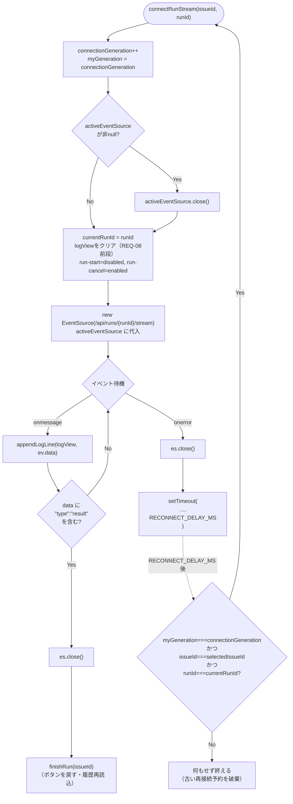
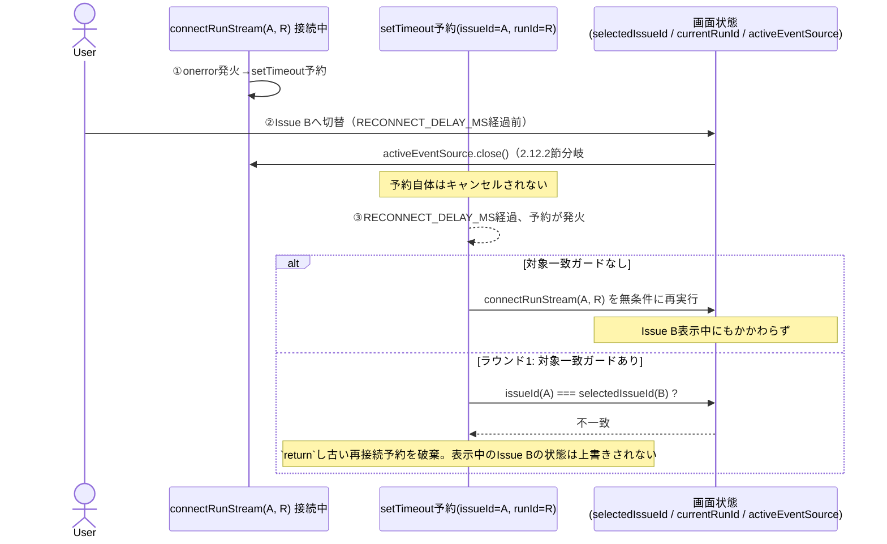
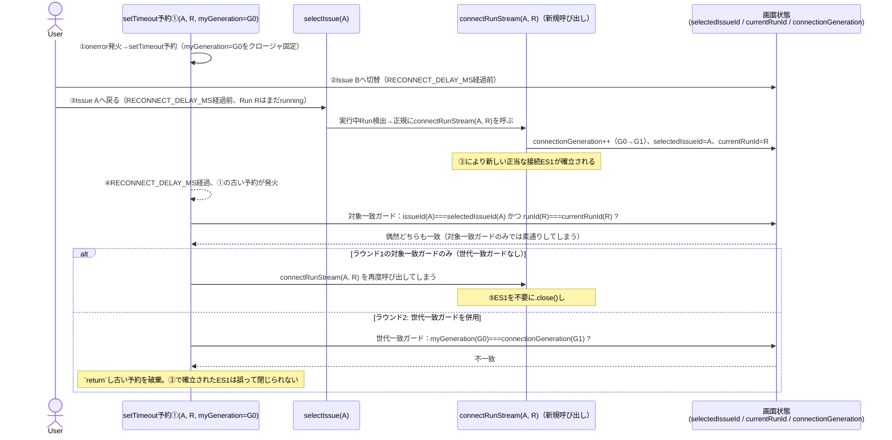

# COMP-12 SSE自動再接続・実行中Run検出（`app.js`）

**対象ファイル**: `src/ClaudeCodeGui/wwwroot/app.js`

**責務**: component_design.md 3.4節COMP-12（628〜659行目）を参照（シグネチャ・処理内容・対応IDは変更しない）。「runIdを指定してログ表示をやり直す」共通関数`connectRunStream`を実装し、①ページ再読込時の再接続、②接続断からの自動復帰、③新規Run開始時の初回接続の3経路を同じ関数に統合する。

既存の`startRun`（173〜209行目）が直接持っていた`EventSource`生成ロジックをここへ集約し、`selectIssue`（62〜68行目）にはRun一覧から実行中Runを検出して`connectRunStream`を呼ぶ判定を追加する。いずれもDOM操作・`EventSource`生成という副作用を伴うため、COMP-06のような純粋関数節ではなく、COMP-11同様「副作用を主とする節」として記載する。

#### 設計経緯（ラウンド1・ラウンド2レビュー指摘への対応、概要）

component_design.mdが確定した`connectRunStream`本体のシグネチャ・処理内容自体（628〜659行目）は変更しない。ラウンド1・ラウンド2のレビューでは、`onerror`ハンドラが予約する`setTimeout`の再帰呼び出しについて、以下2段階のガードを追加した（併用する理由・境界ケースの詳細なトレースは2.12.1節手順8・2.12.5節を参照）。

| ラウンド | 指摘内容（重大） | 追加したガード | 検出する境界ケース |
|---|---|---|---|
| 1 | `setTimeout`予約後にissueId/runIdの対象自体が切り替わっても、再接続が無条件に発火してしまう | 対象一致ガード：予約時点のissueId/runIdが現在表示中の対象と一致するかを確認する1行 | Issueを切り替えたまま戻らないケース（2.12.5節参照） |
| 2 | 対象一致ガードだけでは、Issue切替→復帰でissueId/runIdが偶然再一致するケースを検出できない | 世代一致ガード：`connectRunStream`呼び出しのたびにインクリメントするグローバルカウンタ`connectionGeneration`（2.12.4節で宣言）を、`onerror`予約時点の値でクロージャ固定し、発火時に現在値と比較する | Issue切替後、`RECONNECT_DELAY_MS`が経過しきる前に同じissueId/runIdへ戻るケース（2.12.5節参照） |

いずれのガードも、component_design.mdが確定した`connectRunStream`のシグネチャ・対応ID、およびREQ-07（3経路統合）・REQ-08（クリア→全量再描画）・REQ-09（遅延再接続、即座に諦めない）の中核契約には抵触しない、`setTimeout`コールバック内への追加的な一致確認にとどまる。**ラウンド1の対象一致ガードは廃止せず、ラウンド2の世代一致ガードと併用する**（両者が防ぐ抜け穴が異なるため。詳細は2.12.1節手順8を参照）。

```js
// 入力: issueId, runId  出力: なし（副作用としてEventSource接続・DOM更新）
function connectRunStream(issueId, runId) {
  const myGeneration = ++connectionGeneration;   // ラウンド2レビュー指摘への対応（2.12.5節）
  if (activeEventSource) activeEventSource.close();
  currentRunId = runId;
  const logView = document.getElementById("run-log");
  logView.textContent = "";              // REQ-08: クリアしてから再描画
  document.getElementById("run-start").disabled = true;
  document.getElementById("run-cancel").disabled = false;

  const es = new EventSource(`/api/runs/${runId}/stream`);
  activeEventSource = es;
  es.onmessage = (ev) => {
    appendLogLine(logView, ev.data);
    if (ev.data.includes('"type":"result"')) { es.close(); finishRun(issueId); }
  };
  es.onerror = () => {                    // REQ-09: 即座に諦めず遅延後に再接続
    es.close();
    setTimeout(() => {
      // 予約時点の世代・issueId/runIdが、いずれも現在の状態と一致する場合のみ再接続する
      // （2.12.5節「Issue切替時の後始末漏れ」への対策。世代一致はラウンド2、対象一致はラウンド1で追加。両方満たさない限り古い予約は破棄する）。
      if (myGeneration !== connectionGeneration || issueId !== selectedIssueId || runId !== currentRunId) return;
      connectRunStream(issueId, runId);
    }, RECONNECT_DELAY_MS);
  };
}
```

#### 2.12.1 `connectRunStream(issueId, runId)`

**副作用を伴う関数（DOM更新・`EventSource`接続・グローバル状態`activeEventSource`/`currentRunId`の変更。単体テスト対象外、手動確認・結合テストで検証）**。

**事前条件**:

- `issueId`: `string`。呼び出し元（`startRun`・`selectIssue`）が扱う`Issue.Id`をそのまま渡す。本関数自身はこの値の妥当性検証を行わない（`onmessage`/`onerror`内のクロージャとして`finishRun(issueId)`・再帰呼び出しに使うのみで、DOM要素IDの組み立てには使わない）。
- `runId`: `string`。`Run.Id`。`EventSource`のURL組み立て（`` `/api/runs/${runId}/stream` ``）とグローバル状態`currentRunId`への代入に使う。
- **DOM前提条件（重要）**: 呼び出し時点で`#run-log`・`#run-start`・`#run-cancel`の3要素がDOM上に存在すること。これは`renderIssueDetail`（70〜156行目）がIssue詳細画面のHTMLを`innerHTML`で構築済みであることを前提とする。`selectIssue`からの呼び出し（2.12.2節）は`renderIssueDetail(issue, runs)`呼び出し後に`connectRunStream`を呼ぶ順序を守ることで、この前提条件を満たす（`renderIssueDetail`は`innerHTML`代入のたびに新しいDOM要素を生成するため、`getElementById`は常に最新の要素を取得する。要素参照をキャッシュしないこの関数の実装は、この点で安全である）。
- グローバル変数`activeEventSource`・`currentRunId`（39行目・173行目、既存宣言のまま流用）が事前に存在すること。
- グローバル変数`selectedIssueId`（37行目、既存宣言のまま流用）が事前に存在すること。`onerror`ハンドラが予約する`setTimeout`コールバック内のガード（手順8参照）が、予約時点のissueIdと現在表示中のissueIdの一致確認に使う。
- グローバル変数`connectionGeneration`（2.12.4節で新規宣言）が事前に存在すること。`connectRunStream`が呼ばれるたび（`startRun`経由・`selectIssue`の実行中Run検出経由・`onerror`再接続経由のいずれでも、手順1）にインクリメントされ、`onerror`ハンドラが予約する`setTimeout`コールバック内のガード（手順8参照）が、予約時点の世代と現在の世代の一致確認に使う（ラウンド2レビュー指摘への対応）。

**事後条件・副作用**:

1. `connectionGeneration`をインクリメントし、その値をこの呼び出し内のローカル変数`myGeneration`として固定する（ラウンド2レビュー指摘への対応）。`connectRunStream`は3経路（`startRun`・`selectIssue`の実行中Run検出・`onerror`自身の再接続）のいずれから呼ばれてもこの手順を必ず通るため、`myGeneration`と`connectionGeneration`を比較するだけで「本呼び出しより後に、経路を問わず別の`connectRunStream`呼び出しが発生したか」を判定できる（詳細は手順8、2.12.5節「Issue切替時の後始末漏れ」参照）。
2. 呼び出し時点で`activeEventSource`が非nullなら`.close()`を呼んでから新規接続に進む（多重接続防止。詳細は2.12.5節）。
3. `currentRunId`を`runId`に更新する（`cancelRun`・`finishRun`が参照する値。旧`startRun`174〜192行目にあった`currentRunId = run.id;`の代入をここに集約）。
4. `#run-log`のテキストを空にしてから（REQ-08前段）、新規`EventSource`が返す行を`appendLogLine`で追記していく（REQ-08後段）。「クリアしてから全体再描画」で二重表示を防げる根拠は、下記「REQ-08成立の根拠（補足）」を参照。
5. `#run-start`を`disabled=true`、`#run-cancel`を`disabled=false`にする（実行中状態のボタン表示。ページ再読込直後の再接続・接続断からの自動復帰のいずれでも同じ表示になる）。
6. 新規`EventSource`を`` `/api/runs/${runId}/stream` ``へ張り、`activeEventSource`に代入する。
7. `onmessage`: 受信行を`appendLogLine`で追記する。行に`"type":"result"`という部分文字列が含まれる場合（COMP-06 2.6.2節が定義するJSON構造、モック実行・本番実行いずれも同一契約）、`es.close()`してから`finishRun(issueId)`を呼ぶ（Run終了検出→ボタン状態を戻す→履歴再読込。既存`finishRun`実装、232〜239行目は変更しない）。
8. `onerror`: `es.close()`してから`setTimeout(...)`で`RECONNECT_DELAY_MS`後に自分自身を再度呼び出す予約をする。**`finishRun`は呼ばない**点が、置き換え対象の既存実装（205〜208行目、後述2.12.3節）との最大の差分である。ボタンは「実行中」表示のまま据え置かれ、ユーザーからは接続断が見えない（REQ-09の意図どおり）。予約したコールバックが実際に再接続を実行するための条件は、下記「`setTimeout`コールバックのガード条件」を参照。

**REQ-08成立の根拠（補足）**: 「クリアしてから全体再描画」で二重表示を防げる根拠は、バックエンド`ClaudeRunEngine.StreamLogAsync`（`Services/ClaudeRunEngine.cs:188-210`）が接続のたびに`sentUpTo`を`0`から数え直し、`File.ReadAllLinesAsync`で既存ログ全行を毎回再送信してから`ctx.TailAsync(sentUpTo, ct)`で新規行に続ける実装になっているため（198〜209行目）。つまり「サーバー側が常に全量を送り直す」設計と「クライアント側が受信前に画面をクリアする」設計が対になって初めてREQ-08が成立する。**この対応関係はcomponent_design.md確定仕様のコード自体には明記されていないため、本節で補足として明記する**。

**`setTimeout`コールバックのガード条件**:

`setTimeout`のコールバックは、`connectRunStream(issueId, runId)`を無条件に呼ぶのではなく、以下2つのガードを**両方とも**満たす場合のみ実際に呼び出す。いずれか一方でも満たさなければ、古い再接続予約を静かに破棄して何もせず終える。

- **世代一致ガード**（`myGeneration === connectionGeneration`、ラウンド2レビュー指摘への対応・新規）: 予約後に（経路を問わず）新しい`connectRunStream`呼び出しが1回でも発生していれば`connectionGeneration`は`myGeneration`より大きくなっており、この予約は「もはや最新の接続試行を代表していない」と判定できる。issueId/runIdが偶然一致していても（2.12.1節境界値表#9、2.12.5節参照）この比較は動じない。
- **対象一致ガード**（`issueId === selectedIssueId && runId === currentRunId`、ラウンド1レビュー指摘への対応・維持）: 予約時点のissueId/runIdが、現在ユーザーが表示している対象と一致するかを確認する。

ガード式: `if (myGeneration !== connectionGeneration || issueId !== selectedIssueId || runId !== currentRunId) return;`

**両ガードを併用する理由（世代一致ガードだけでは不十分な理由）**: ユーザーがIssue Aから離脱したまま二度と戻らず、かつ切替先のIssueで新たに`connectRunStream`が呼ばれない場合（例: 切替先Issueに実行中Runがない場合、2.12.2節分岐#3）、`connectionGeneration`は加算されないため世代一致ガードだけでは古い予約を検出できない。この場合は対象一致ガード（`selectedIssueId`がもはやAでない）が古い予約を正しく破棄する。

逆に対象一致ガードだけでは、issueId/runIdの偶然の再一致（2.12.1節境界値表#9）を検出できない。両ガードはそれぞれ異なる抜け穴をふさぐため、**一方を他方に置き換えるのではなく併用**する。両ガードがそれぞれどのケースを検出するかは下表のとおり（発生手順の詳細なトレースは2.12.5節を参照）。

| ケース | 対象一致ガード（issueId/runId） | 世代一致ガード（generation） | 実際に検出・破棄するガード |
|---|---|---|---|
| Issue切替後、二度と戻らず、切替先で新たな`connectRunStream`呼び出しが発生しない（2.12.2節分岐#3） | 不一致→検出できる | `connectionGeneration`が加算されないため一致のまま→検出できない | 対象一致ガードのみ |
| Issue切替後、`RECONNECT_DELAY_MS`経過前に同じissueId/runIdへ戻り、正規の`connectRunStream`呼び出しが発生する（2.12.1節境界値表#9） | 偶然一致してしまう→検出できない | 正規呼び出しで加算済み→不一致→検出できる | 世代一致ガードのみ |
| 通常の接続断（対象・世代とも予約時点から変化なし） | 一致（誤って破棄しない） | 一致（誤って破棄しない） | いずれも通過させ再接続を実行する（REQ-09） |

**戻り値**: なし（`void`）。

##### `connectRunStream`の処理フロー（補足図）



**代表的な境界値・分岐条件**:

| # | 状況 | 挙動 |
|---|---|---|
| 1 | 初回呼び出し（`activeEventSource`が`null`、境界値） | `.close()`は呼ばれない（`if`ガードにより安全）。新規`EventSource`を生成 |
| 2 | 既に`activeEventSource`が存在する（再接続・Issue切替時の2回目以降） | 旧`EventSource`を`.close()`してから新規生成。多重接続を防止（2.12.5節） |
| 3 | `onmessage`で`"type":"result"`を含まない行を受信（`system`/`assistant`等） | `appendLogLine`で追記するのみ。接続は継続 |
| 4 | `onmessage`で`"type":"result"`を含む行を受信（Run正常終了・失敗終了いずれも） | `es.close()` → `finishRun(issueId)`。以後`onerror`は発火しない（接続が正常にcloseされているため） |
| 5 | `onerror`発火（サーバー再起動・一時的なネットワーク断など）、`RECONNECT_DELAY_MS`経過時点でも同じissueId/runIdを表示中（通常経路） | `es.close()` → `RECONNECT_DELAY_MS`後、ガードを通過して自分自身を再呼び出し。`finishRun`は呼ばれず、ボタンは「実行中」表示のまま |
| 6 | `onerror`が繰り返し発火し続ける（サーバーが長時間停止したままの場合、境界値） | `RECONNECT_DELAY_MS`間隔で無限に再試行する。設計上意図的な挙動（REQ-09）だが、リスクとして2.12.5節で検討する |
| 7 | `runId`に対応する`Run`がサーバー側に存在しない（境界値、通常発生しない想定） | `StreamLogAsync`側は`File.Exists(logPath)`が`false`のため空のログを返し、`isActive`も`false`のため`yield break`。SSE接続自体は張られるがデータが流れず、`onmessage`も`onerror`も発火しない静止状態になりうる。呼び出し元（`selectIssue`・`startRun`）がいずれも実在確認済みの`runId`のみを渡す設計のため、通常経路では到達しない。呼び出し元の契約として明記するに留め、本関数側に追加の防御コードは設けない |
| 8 | `onerror`発火後、`RECONNECT_DELAY_MS`経過前にユーザーが別Issueへ切り替える、または同一Issue内で新しいRunに切り替わり、そのまま戻らない（境界値、2.12.5節「Issue切替時の後始末漏れ」） | `RECONNECT_DELAY_MS`経過時点で`issueId !== selectedIssueId`または`runId !== currentRunId`となり対象一致ガードが不一致（世代一致ガードは、切替先で新たな`connectRunStream`呼び出しが発生しない限り一致したままだが、対象一致ガードの不一致だけで`return`は成立する）。`connectRunStream`は呼ばれず、古い再接続予約は何もせず終わる。表示中の別Issue・別Runの画面状態（`#run-log`・ボタン・`currentRunId`）は上書きされない |
| 9 | `onerror`発火→`setTimeout`予約後、`RECONNECT_DELAY_MS`経過前に別Issueへ切り替わり、さらに経過前に元のIssue・元のRunへ戻ってくる。戻った時点でそのRunがまだ`running`のため`selectIssue`の実行中Run検出が正規に`connectRunStream`を呼び直す（境界値、ラウンド2レビュー指摘「issueId/runIdの偶然の再一致」、2.12.5節） | 戻ってきた際の正規の`connectRunStream`呼び出しで`connectionGeneration`が加算され、新しい正当な接続（ES1）が張られる。この直後に元の`setTimeout`予約が発火すると、`issueId===selectedIssueId`・`runId===currentRunId`は対象が同じIssue/Runに戻っているため**偶然一致**してしまうが、`myGeneration !== connectionGeneration`（新しい呼び出しで加算済み）により世代一致ガードが不一致となり`return`する。直前に確立されたばかりの正当なES1は誤って`.close()`されない |

#### 2.12.2 `selectIssue`への実行中Run検出ロジック追加（REQ-27）

既存実装（62〜68行目）は、Run一覧取得後に`renderIssueDetail(issue, runs)`を呼ぶのみで終わる。ここに「実行中Runがあれば`connectRunStream`を呼ぶ」判定を追加する。

```js
async function selectIssue(id) {
  selectedIssueId = id;
  renderIssueList();
  const issue = await api(`/api/issues/${id}`);
  const runs = await api(`/api/issues/${id}/runs`);
  renderIssueDetail(issue, runs);

  const runningRun = runs.find((r) => r.status === "running");   // REQ-27
  if (runningRun) {
    connectRunStream(issue.id, runningRun.id);                    // REQ-07
  } else if (activeEventSource) {
    // 設計判断（component_design.md確定仕様には含まれない、本節での追加分）:
    // 直前に選択していた別Issueの再接続ループが残っている場合、切替先Issueに実行中Runがなければ確実に閉じる。
    activeEventSource.close();
    activeEventSource = null;
    currentRunId = null;
  }
}
```

**呼び出し順序についての事前条件**: `connectRunStream`は2.12.1節の事前条件どおり`#run-log`等のDOM要素の存在を前提とするため、`renderIssueDetail(issue, runs)`の**後**に呼ぶ。`renderIssueDetail`は非同期関数ではないため、`await`なしで呼び出し完了後に同期的にDOMへ反映される（`loadArtifactDir`の非同期処理はartifact欄に閉じており、`run-log`等の要素生成には関与しない）。

**`else if (activeEventSource)`分岐の位置づけ（設計判断）**: component_design.mdの確定仕様は「実行中Runがあれば`connectRunStream`を呼ぶ」という順方向の記載のみで、「実行中Runがない場合に何もしない」のか「明示的に後始末する」のかを規定していない。素直に読めば前者（何もしない）だが、その場合、直前に選択していたIssueで再接続ループ（`onerror`→`setTimeout`→再接続）が進行中だと、Issueを切り替えても古い`EventSource`・古い再接続ループが残り続ける（2.12.5節「Issue切替時の後始末漏れ」参照）。

この後始末は確定仕様の`connectRunStream`自体を変更するものではなく、`selectIssue`側（component_design.mdが処理内容を確定していない箇所）の追加であるため、本節の裁量で追加する設計判断として明記する。

**代表的な境界値・分岐条件**:

| # | `runs`の内容 | `activeEventSource`（切替前） | 挙動 |
|---|---|---|---|
| 1 | `status === "running"`のRunが1件ある | - | `connectRunStream(issue.id, runningRun.id)`を呼ぶ。REQ-08により`run-log`はクリアされてから全量再描画される |
| 2 | `status === "running"`のRunがない（`Runs`が空、または全て`succeeded`/`failed`/`canceled`） | `null`（初回選択、または既に閉じられている） | 何もしない。ボタンは`renderIssueDetail`が生成した既定状態（`run-start`有効・`run-cancel`無効）のまま |
| 3 | `status === "running"`のRunがない | 非null（直前のIssueの接続・再接続ループが残っている、境界値） | `.close()`して`activeEventSource`・`currentRunId`をリセットする（本節の追加分） |
| 4 | `status === "running"`のRunが理論上複数ある（REQ-10の排他制御が正しく機能していれば発生しない想定） | - | `Array.prototype.find`は先頭要素を返すため、2件目以降は無視される。COMP-05/08側のREQ-10〜12排他制御を前提とした割り切りであり、本関数側で複数件の存在チェックは行わない |

#### 2.12.3 `startRun`のリファクタリング（既存173〜209行目）

**変更前後の対応関係**:

| 既存コード（173〜209行目） | リファクタリング後の扱い |
|---|---|
| 174〜181行目（テンプレート・パーミッションモード読み取り、未選択時の`alert`） | **変更なし、そのまま残す** |
| 183〜186行目（`logView`クリア、ボタン活性切替） | **そのまま残す**（下記「二重発生の是非」参照） |
| 188〜191行目（`POST /api/issues/{issueId}/runs`呼び出し） | **変更なし、そのまま残す** |
| 192行目（`currentRunId = run.id;`） | **削除**。`connectRunStream`内部（2.12.1節手順3）に集約 |
| 194〜196行目（`activeEventSource`のclose・`new EventSource`生成・代入） | **削除**。`connectRunStream`内部（同手順2・6）に集約 |
| 198〜208行目（`onmessage`/`onerror`ハンドラ定義） | **削除**。`connectRunStream`内部（同手順7・8）に集約 |
| （新規） | 末尾に`connectRunStream(issueId, run.id);`の1行を追加 |

```js
async function startRun(issueId) {
  const templateId = document.getElementById("run-template").value;
  const permissionMode = document.getElementById("run-permission").value;
  if (!templateId) {
    alert("テンプレートがありません。先にプロンプトテンプレートを作成してください。");
    return;
  }

  // POST完了を待つ間の二重クリック防止のため、ボタン状態はここで即座に切り替える。
  // connectRunStream側でも同じDOM操作を行うが、同じ値の再代入なので実害はない（下記「二重発生の是非」参照）。
  const logView = document.getElementById("run-log");
  logView.textContent = "";
  document.getElementById("run-start").disabled = true;
  document.getElementById("run-cancel").disabled = false;

  const run = await api(`/api/issues/${issueId}/runs`, {
    method: "POST",
    body: JSON.stringify({ templateId, permissionMode }),
  });
  connectRunStream(issueId, run.id);   // REQ-07: EventSource生成ロジックの重複を排除（component_design.md確定仕様どおり）
}
```

**183〜186行目を`connectRunStream`側へ完全に移譲しなかった理由（二重発生の是非）**: `connectRunStream`自体も同じ3行（ログクリア・ボタン活性切替）を行う（2.12.1節手順4・5）ため、両方に置くと処理が二重に実行される。しかし以下の理由により、あえて`startRun`側にも残す設計とした。

- 既存実装は`POST`リクエストの**送信前**にボタンを`disabled`にすることで、応答待ちの間の二重クリック（同一Issueへの多重Run開始）を抑止していた（意図の有無は既存コードから読み取れないが、結果的にそう機能している）。
- `connectRunStream`は`POST`が成功して`run`オブジェクトを受け取った**後**にしか呼べない（`runId`が未確定のため）。もし183〜186行目を削除して`connectRunStream`呼び出しのみに一本化すると、`POST`のネットワーク往復中はボタンが有効なままになり、二重クリックで複数の`POST`が飛ぶ余地が生まれる（REQ-10/11のサーバー側排他制御により2件目は`409 Conflict`で拒否されるため実害は限定的だが、UXとしては後退する）。
- 二重実行される3行はいずれも同じ値へのべき等な再代入（`textContent = ""`、`disabled = true/false`）であり、副作用の重複によるDOM不整合は発生しない。

以上より、**この2箇所の重複はcomponent_design.mdが求める「EventSource生成ロジックの重複排除」とは別種の重複（DOM状態の初期化の重複）であり、意図的に許容する**設計判断として明記する。

**`POST`が例外を投げた場合（`409 Conflict`等）の挙動について（発見した確認事項、既存実装から変わらない範囲）**: `api()`ヘルパー（10〜21行目）は非`2xx`応答時に`Error`を`throw`する。`startRun`はこの例外を`try/catch`していないため、183〜186行目でボタンを`disabled`にした直後に`POST`が例外を投げると、`connectRunStream`まで到達せず、ボタンが「実行中」表示のまま固まる（`run-start`が`disabled`のまま復帰しない）。

**この挙動は既存実装（リファクタリング前の173〜209行目）から変わらない**（既存も185〜186行目でボタンを切り替えた後に188行目の`await api(...)`を呼んでおり、同じ経路で同じ問題が起こりうる）。REQ-13（拒否時の中止操作誘導）に対応するUXは別コンポーネント（component_design.mdの確定仕様上、COMP-12の対象外）が担う想定であり、本節ではこの`try/catch`未対応を新規の劣化ではなく既存からの申し送り事項として記録するに留める。

**代表的な境界値・分岐条件**:

| # | 状況 | 挙動 |
|---|---|---|
| 1 | `templateId`が空（テンプレート未選択） | `alert`を表示して`return`。`POST`は送信されない。ボタン状態・`logView`は変更しない |
| 2 | `POST`成功（通常経路） | ボタン・`logView`が2回（`startRun`内・`connectRunStream`内）べき等に更新された後、`connectRunStream`が新規`EventSource`を張る |
| 3 | `POST`が`409 Conflict`等で例外を投げる（境界値、REQ-12の排他拒否時） | `startRun`内でボタンを`disabled`にした直後に例外が送出され、`connectRunStream`は呼ばれない。ボタンが実行中表示のまま復帰しない（既存実装から変わらない挙動、上記参照） |

#### 2.12.4 `RECONNECT_DELAY_MS`の値についての設計判断

component_design.mdの確定仕様は`RECONNECT_DELAY_MS`という定数名のみを示し、具体的な値・宣言位置は確定していない。本節で以下のとおり確定する。

**宣言位置**: グローバル変数`activeEventSource`（39行目）の直後に、他のSSE関連状態と並べて追加する。`connectionGeneration`はラウンド2レビュー指摘への対応として新設する、`connectRunStream`の呼び出し世代を追跡するカウンタである（詳細は2.12.1節手順1・手順8、2.12.5節「Issue切替時の後始末漏れ」参照）。

```js
let activeEventSource = null;
const RECONNECT_DELAY_MS = 2000;   // COMP-12: SSE再接続までの遅延（REQ-09）
let connectionGeneration = 0;      // COMP-12: connectRunStream呼び出し世代カウンタ（ラウンド2レビュー指摘への対応）
```

**値: `2000`（2秒）とする。根拠**:

- 本アプリはローカル単一ユーザー向け（`localhost`上のASP.NET Coreサーバーに対する接続、CLAUDE.md「実行環境」節）であり、想定される接続断の主因は本番の分散環境のような長時間のネットワーク障害ではなく、開発中の`dotnet run`再起動や、サーバー側の一時的な処理詰まり（Runプロセスの起動待ち等）程度である。数秒以内に復旧するケースが大半と見積もれる。
- 短すぎる値（例: 数百ミリ秒）は、サーバーが本当に落ちている間（プロセスクラッシュ・ビルド待ち等、数秒〜十数秒続くケース）に`EventSource`の生成・即時`onerror`・再試行を高頻度で繰り返し、ブラウザ側のイベントループとサーバーへの接続試行の双方に無駄な負荷をかける。
- 長すぎる値（例: 10秒以上）は、一時的な瞬断からの復帰体感が悪化し、REQ-09が意図する「気づかれないうちに直っている」UXを損なう。
- ブラウザ標準の`EventSource`が`retry`フィールド未指定時に用いる既定の自動再接続間隔が3000ms程度であることも参考にしつつ、本アプリはログ全量再送信（2.12.1節手順4）を伴うため、これより短い間隔でも1回あたりのコストは小さい（ログファイルはIssue単位・Run単位の小規模なテキストファイルであり、`File.ReadAllLinesAsync`の負荷は無視できる規模、`ClaudeRunEngine.cs:196`参照）。
- 以上を踏まえ、標準的な既定値より若干短い**2000ms（2秒）**を採用する。テストしやすい値（1回のリトライが2秒で観測できる）でもある。

**代替案として検討したが採用しなかったもの**: 指数バックオフ（再試行のたびに間隔を延ばす方式）も検討したが、component_design.mdの確定仕様が`setTimeout(() => connectRunStream(issueId, runId), RECONNECT_DELAY_MS)`という**固定間隔**の呼び出しを明示しているため、これを変更する余地はない（変更するとcomponent_design.md確定仕様と矛盾するため、本節では固定値のみを採用し、指数バックオフは将来のレビュー指摘・要件変更があれば検討する事項として記録するに留める）。

#### 2.12.5 無限再接続によるリソースリーク・無限ループのリスクについての検討

**多重接続の防止について**: `connectRunStream`は呼び出しのたびに`if (activeEventSource) activeEventSource.close();`を実行するため（2.12.1節手順2）、同一の`activeEventSource`スロットに対して新旧2つの`EventSource`が同時に生きることはない。`EventSource.close()`は複数回呼んでも安全（冪等、[WHATWG仕様](https://html.spec.whatwg.org/)上`readyState`を`CLOSED`にするだけの操作）なため、`onmessage`・`onerror`のいずれの経路で`es.close()`を呼んだ後に`connectRunStream`が再度`activeEventSource.close()`を呼んでも問題は起きない。

**サーバーが長時間停止したままの場合の無限リトライについて（意図的に許容するリスク）**: 2.12.1節境界値#6のとおり、`onerror`が発火し続ける限り`RECONNECT_DELAY_MS`間隔での再試行が無限に続く。この挙動はREQ-09が明示的に要求するもの（「`es.close()`で即座に諦めない」）であり、上限回数や指数バックオフを設けない設計をcomponent_design.mdが確定している。以下のいずれかに該当する間は再試行が止まる自然な終了経路が存在するため、リソースリークとしては限定的なリスクと判断する。

- ユーザーがそのIssue詳細画面から離れる（別Issueを選択する）: 2.12.2節の追加分により`activeEventSource`が明示的に閉じられる。既に発火済みの`setTimeout`予約自体は`clearTimeout`等でキャンセルしないが、下記「Issue切替時の後始末漏れ」のガード（ラウンド1・ラウンド2の2段階で対応）により、`RECONNECT_DELAY_MS`後に予約が発火しても実害（画面の誤上書き）は生じない
- ページを再読込・タブを閉じる: ブラウザがJSの実行コンテキスト全体を破棄するため、`setTimeout`予約・`EventSource`ともに自動的に消滅する
- サーバーが復旧する: `onmessage`が発火するようになり、通常のRun完了経路（`finishRun`）または継続監視に戻る

**Issue切替時の後始末漏れ（ラウンド1レビュー指摘への対応）**: `connectRunStream`の`onerror`ハンドラ（確定仕様）は、呼び出し時点の`issueId`・`runId`を**クロージャで固定**した上で、`RECONNECT_DELAY_MS`後に自分自身を再帰的に呼び出す`setTimeout`を予約する。何もガードしなければ、この再帰呼び出しは`selectedIssueId`が現在どのIssueを指しているかを一切参照せず無条件に実行されるため、以下の順で操作すると、画面に表示されているIssue（B）のログ表示・ボタン状態・`currentRunId`が、既に離脱したはずのIssue（A）の再接続によって不意に上書きされる余地があった。

1. Issue Aの実行中Runに対して`connectRunStream`が接続中、`onerror`が発火し`setTimeout`が予約される
2. `RECONNECT_DELAY_MS`が経過しきる前に、ユーザーがIssue Bへ切り替える（2.12.2節の分岐#3により、その時点の`activeEventSource`＝Issue A用の接続は閉じられる。ただし予約済みの`setTimeout`自体はキャンセルされない）
3. `RECONNECT_DELAY_MS`経過後、予約されていた再接続がガードなしに発火すると、画面がIssue Bを表示中にもかかわらず`#run-log`をクリアし、Issue A用の`EventSource`を新規に張り、`currentRunId`をIssue AのrunIdへ書き換えてしまう。この状態でユーザーが「中止」ボタンを押すと、画面と無関係なIssue A側のRunを誤って中止してしまう

##### トレース図（ガードなしの場合の不整合とラウンド1対策）



**ラウンド1の対策**: 2.12.1節手順8のとおり、`setTimeout`コールバックの先頭で`if (issueId !== selectedIssueId || runId !== currentRunId) return;`によるガード（以下「対象一致ガード」）を追加し、予約時点の対象と現在表示中の対象が一致する場合のみ`connectRunStream`を実際に呼び出す。一致しない場合は何もせず終える（古い再接続予約を静かに破棄する）。`issueId`だけでなく`runId`も併せて比較するのは、同一Issue内で旧Runが中止され新しいRunが開始された場合（Issue自体は切り替わらないが対象Runが変わるケース）にも、旧Runの古い再接続予約が新Runの表示を上書きしないようにするためである。

**ラウンド2レビュー指摘: issueId/runIdの偶然の再一致（残存境界ケース）**: 対象一致ガードは「対象が変わっていないか」しか見ておらず、「その`setTimeout`予約が今なお最新の接続試行を代表しているか」（＝予約後に横入りする接続の発生有無）は区別できない。そのため、Issue Aへ**戻ってくる**操作を挟むと、以下の手順で対象一致ガードだけをすり抜けてしまう残存境界ケースが見つかった。

1. Issue Aの実行中Run Rで`onerror`が発火し、`setTimeout`が予約される（クロージャに`issueId=A, runId=R`を固定）
2. `RECONNECT_DELAY_MS`が経過する前に、ユーザーが別のIssue Bへ切り替える（Issue A用の`activeEventSource`はこの切替処理で閉じられる）
3. `RECONNECT_DELAY_MS`が経過する前に、ユーザーが再びIssue Aへ戻る。Run Rはまだ`running`のままなので、`selectIssue`の実行中Run検出ロジックが正規に`connectRunStream(A, R)`を呼び出し、新しい正当な接続ES1が確立される（`selectedIssueId=A`, `currentRunId=R`に設定される）
4. この直後（③より後、`RECONNECT_DELAY_MS`経過時点）に、①で予約されていた古い`setTimeout`コールバックが発火する。対象一致ガードの比較対象（`issueId===selectedIssueId` かつ `runId===currentRunId`）は、③によってどちらも偶然「A」「R」のまま一致してしまっているため、ガードを素通りしてしまう
5. 結果、`connectRunStream(A, R)`が再度呼ばれ、③で確立されたばかりの正当なES1を不必要に`.close()`し、`#run-log`を再クリアして新しい接続ES2を張り直してしまう（無駄な再接続・ログの瞬間的なクリア・再接続中のメッセージ欠落リスク）

**ラウンド2の対策（世代カウンタ方式）**: グローバル変数`connectionGeneration`（2.12.4節）を新設し、`connectRunStream`が呼ばれるたび（`startRun`経由・`selectIssue`の実行中Run検出経由・`onerror`再接続経由のいずれでも、2.12.1節手順1）にインクリメントする。`onerror`が`setTimeout`を予約する際、その時点の`connectionGeneration`の値を`myGeneration`としてクロージャで固定し、`RECONNECT_DELAY_MS`後にコールバックが発火した時点で`myGeneration === connectionGeneration`（以下「世代一致ガード」）を確認する。一致しなければ（＝予約後に、経路を問わず何らかの新しい`connectRunStream`呼び出しが発生している）、issueId/runIdの一致・不一致に関わらず古い予約を無条件に破棄する。

##### トレース図（issueId/runIdの偶然の再一致と、世代一致ガードによる保護）



上記の残存境界ケースにこの対策を当てはめてトレースすると、手順③の`connectRunStream(A, R)`呼び出しで`connectionGeneration`が加算されるため、手順④で古い`setTimeout`コールバックが発火した時点では`myGeneration`（①の予約時点の世代）と`connectionGeneration`（③で加算済みの新しい世代）が一致しなくなっている。したがって世代一致ガードが不一致と判定し、`connectRunStream`は呼ばれず、③で確立された正当なES1は誤って閉じられない（2.12.1節境界値表#9で詳細をトレース）。

**世代一致ガードは対象一致ガードを置き換えるのではなく併用する**: 世代一致ガードだけでは、「Issue Aから離脱したまま二度と戻らず、かつ切替先で新たに`connectRunStream`が呼ばれない」場合（2.12.2節分岐#3、切替先に実行中Runがない場合）を検出できない。この場合`connectionGeneration`は加算されないため、世代一致ガードは（古い予約であるにもかかわらず）一致したままになってしまう。この抜け穴は対象一致ガード（`selectedIssueId`がもはやAでない）がふさぐ。

逆に対象一致ガードだけでは今回の残存境界ケース（issueId/runIdの偶然の再一致）を検出できない。両ガードは異なる抜け穴をふさぐため（両ガードの検出範囲の対応関係は2.12.1節の比較表も参照）、2.12.1節手順8のガード式は両方をAND結合ではなく`||`で結んだ`return`条件として実装する（`if (myGeneration !== connectionGeneration || issueId !== selectedIssueId || runId !== currentRunId) return;`。すなわちいずれか一方でも不一致なら再接続を破棄する、という意味で「両方一致して初めて再接続を実行する」）。

これらの対策は、component_design.mdが確定する`connectRunStream`のシグネチャ・対応ID（628〜659行目）を変更するものではなく、`setTimeout`コールバックの中身に一致確認のガードを追加するだけの範囲にとどまる。REQ-07（3経路統合）・REQ-08（クリア→全量再描画）・REQ-09（遅延再接続、即座に諦めない）のいずれの中核契約にも抵触しない。

REQ-09が求める「サーバー復旧まで諦めず再試行し続ける」挙動は、対象（issueId/runId）・世代のいずれも変わらない通常の接続断シナリオでは引き続きそのまま成立する。

**代表的な境界値・分岐条件**:

| # | 状況 | 挙動 |
|---|---|---|
| 1 | `onmessage`/`onerror`いずれの経路でも、新規接続前に必ず`es.close()`を経由する | 多重接続は発生しない（上記「多重接続の防止について」） |
| 2 | ページ再読込・タブクローズ | JS実行コンテキストごと破棄され、`setTimeout`予約・`EventSource`とも消滅する |
| 3 | Issue切替（同一の実行中Runが継続している場合） | 2.12.2節分岐#1〜#3のいずれかで`activeEventSource`は正しく閉じ直される |
| 4 | Issue切替後（または同一Issue内で新Runへの切替後）、そのまま戻らずに直前の`onerror`由来`setTimeout`が事後に発火（境界値、上記「Issue切替時の後始末漏れ」ラウンド1対応分） | 対象一致ガードにより`issueId !== selectedIssueId`または`runId !== currentRunId`と判定され、`connectRunStream`は呼ばれない。表示中の別Issue・別Runの状態は上書きされない |
| 5 | Issue切替後、`RECONNECT_DELAY_MS`が経過しきる前に同じissueId/runIdへ戻り、戻った際の正規の`connectRunStream`呼び出しの直後に直前の`onerror`由来`setTimeout`が事後に発火（境界値、上記「ラウンド2レビュー指摘: issueId/runIdの偶然の再一致」） | 対象一致ガードは（issueId/runIdが偶然一致するため）通過してしまうが、世代一致ガードが`myGeneration !== connectionGeneration`により不一致と判定し`connectRunStream`は呼ばれない。戻った際に確立されたばかりの正当な接続は誤って閉じられない |

対応ID: REQ-07, REQ-08, REQ-09, REQ-27, CON-06

