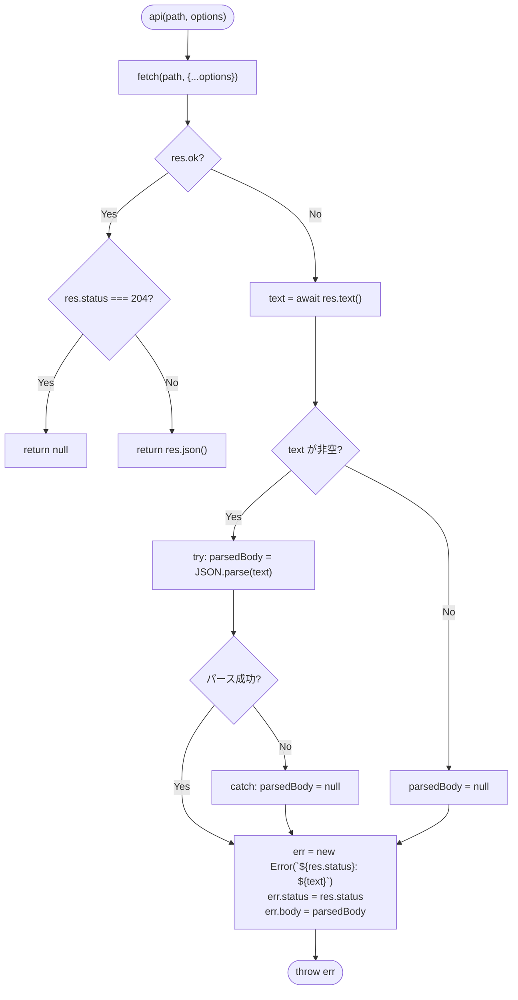
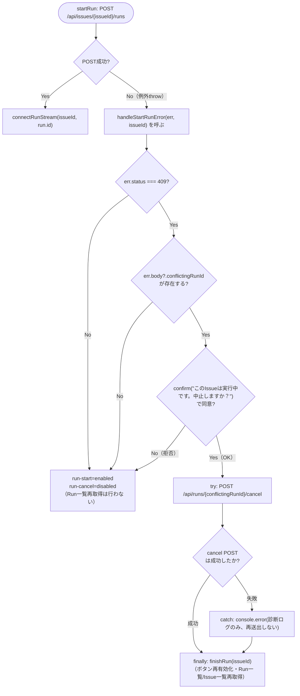

# COMP-13 排他制御拒否時のUX誘導（`app.js`）

**責務**（component_design.md 661〜667行目）: 同時実行が拒否された（`409 Conflict`）際、返された`conflictingRunId`を使って中止操作へ誘導する。`api()`ヘルパーを`status`/`body`付き例外を投げる形に拡張し、`startRun`（および将来のCOMP-14 `startLoop`）がこれを`catch`して`confirm`→中止POSTへ誘導する。

**事前条件**:
- 2.11.7〜2.11.9節（COMP-11）が確定済みのとおり、`POST /api/issues/{issueId}/runs`は排他拒否時に`409 Conflict`・body `{error, conflictingRunId, run}`を返す（本節はこのレスポンス形式を変更せず前提とする）。
- 2.12.3節（COMP-12）の`startRun`（`#run-log`クリア・`#run-start`/`#run-cancel`のボタン活性切替を`POST`送信前に行う構成）、および2.12.1節の`finishRun`（`#run-start`再有効化・`#run-cancel`再無効化・`currentRunId = null`・Run一覧再取得・`loadIssues()`）を前提とし、いずれも本節では変更しない（`finishRun`は2.13.2節から呼び出し元として再利用する）。
- `#run-start`・`#run-cancel`のDOM要素は`renderIssueDetail`（既存）が生成済みであることを前提とする（COMP-12と同じ前提）。

#### 2.13.1 `api()`ヘルパーの拡張（新規、既存関数の変更）

既存実装（`app.js` 10〜21行目）は非`2xx`応答時に`throw new Error(`${res.status}: ${body}`)`という文字列連結のみの`Error`を投げており、呼び出し元が`status`・パース済みレスポンスボディを個別に参照する手段がない。これを、`Error`インスタンスに`status`・`body`プロパティを追加で持たせる形に拡張する（`Error`を継承した専用クラスは設ける必要がない。プロパティの追加代入のみで足り、`instanceof Error`判定や`try/catch`の挙動に影響しないため）。

```js
async function api(path, options) {
  const res = await fetch(path, {
    headers: { "Content-Type": "application/json" },
    ...options,
  });
  if (!res.ok) {
    const text = await res.text();
    let parsedBody = null;
    if (text) {
      try {
        parsedBody = JSON.parse(text);
      } catch {
        parsedBody = null;   // 非JSON応答（プレーンテキストのエラー等）はnullのまま
      }
    }
    const err = new Error(`${res.status}: ${text}`);   // メッセージ書式は既存実装から変更しない（2.13.3節参照）
    err.status = res.status;
    err.body = parsedBody;
    throw err;
  }
  if (res.status === 204) return null;
  return res.json();
}
```

**`err.message`の書式を変更しない設計判断**: `${res.status}: ${text}`という既存の連結書式をそのまま維持する。既存呼び出し元のうち`loadArtifactFile`（277〜286行目）が`catch (e)`で`e.message`をユーザー向け`alert`に含めて表示しているため（詳細は2.13.3節）、書式を変えると無関係な表示文言が変化してしまう。`status`・`body`は新規プロパティとしての追加のみで、既存の`message`には手を加えない。

**`res.text()`が空文字列の場合にJSON.parseを呼ばない理由**: `JSON.parse("")`は`SyntaxError`を送出するため`try/catch`で捕捉自体は可能だが、空ボディ応答（例: 一部のミドルウェアが返す本文なしの`4xx`/`5xx`）は「JSONとして無効」というより「そもそも中身がない」ケースであり、`if (text)`で先に弾いておくことで意図を明確にする（挙動としてはどちらも`parsedBody = null`になり同じ）。

##### `api()`エラー処理のフロー（補足図）



**代表的な境界値・分岐条件**:

| # | 応答 | `text` | `parsedBody` | 備考 |
|---|---|---|---|---|
| 1 | `409 Conflict`、body `{"error":"...","conflictingRunId":"r-1","run":{...}}` | 非空・有効JSON | パース済みオブジェクト（`conflictingRunId`プロパティを含む） | 2.13.2節が判定に使う正常経路（REQ-13） |
| 2 | `404 Not Found`、body `{"error":"Issueが見つかりません。"}`等 | 非空・有効JSON | パース済みオブジェクト（`conflictingRunId`は含まない） | `err.body?.conflictingRunId`は`undefined` |
| 3 | 応答bodyが空文字列（境界値、本文なしの`4xx`/`5xx`） | `""` | `null` | `JSON.parse`は呼ばれない |
| 4 | 応答bodyが非JSONのプレーンテキスト（境界値、リバースプロキシ等が返すHTMLエラーページ等） | 非空・無効JSON | `null`（`JSON.parse`が`SyntaxError`→`catch`） | `err.message`には元のテキストがそのまま含まれる（互換性維持） |
| 5 | `res.status === 204`（既存分岐、変更なし） | - | - | `!res.ok`には該当しないため本節の変更は影響しない。従来どおり`null`を返す |
| 6 | `fetch`自体が例外を投げる（境界値、ネットワーク断・DNS解決失敗等） | - | - | `res.ok`の判定に到達せず、`fetch`が投げる`TypeError`がそのまま呼び出し元へ伝播する。この`TypeError`には`status`/`body`プロパティは付与されない（2.13.2節境界値表#6参照） |

#### 2.13.2 `startRun`の`catch`ロジック追加・新規関数`handleStartRunError`（COMP-12申し送り事項への対応）

2.12.3節「`POST`が例外を投げた場合（`409 Conflict`等）の挙動について」（2354〜2356行目）で申し送りとなっていた、「`POST`が例外を投げると`connectRunStream`まで到達せず、ボタンが『実行中』表示のまま固まる」バグに対応する。`startRun`の`POST`呼び出しを`try/catch`で囲み、例外発生時は新設のヘルパー関数`handleStartRunError`へ委譲する。

```js
async function startRun(issueId) {
  const templateId = document.getElementById("run-template").value;
  const permissionMode = document.getElementById("run-permission").value;
  if (!templateId) {
    alert("テンプレートがありません。先にプロンプトテンプレートを作成してください。");
    return;
  }

  const logView = document.getElementById("run-log");
  logView.textContent = "";
  document.getElementById("run-start").disabled = true;
  document.getElementById("run-cancel").disabled = false;

  let run;
  try {
    run = await api(`/api/issues/${issueId}/runs`, {
      method: "POST",
      body: JSON.stringify({ templateId, permissionMode }),
    });
  } catch (err) {
    await handleStartRunError(err, issueId);   // REQ-13: 409時の中止誘導、その他はボタン状態の復帰のみ
    return;
  }
  connectRunStream(issueId, run.id);
}

// 入力: err（api()が投げた拡張Error、status/bodyプロパティ付き）, issueId
// 出力: なし（副作用としてconfirm表示・cancel POST・DOM状態復帰。cancel POST自体が失敗した場合も例外を再送出しない設計、後述）
async function handleStartRunError(err, issueId) {
  const conflictingRunId = err.status === 409 ? err.body?.conflictingRunId : undefined;
  if (conflictingRunId && confirm("このIssueは実行中です。中止しますか？")) {
    try {
      await api(`/api/runs/${conflictingRunId}/cancel`, { method: "POST" });
    } catch (cancelErr) {
      // cancel POST自体の失敗はここで握りつぶし、呼び出し元（startRun）へは伝播させない設計判断（後述）。
      // ボタン復帰・一覧再取得は下のfinallyでfinishRunが継続して行うため、ここでは診断用ログのみ残す。
      console.error("中止対象Runの中止処理（cancel POST）に失敗しました:", cancelErr);
    } finally {
      await finishRun(issueId);   // 既存関数を再利用：ボタン再有効化・Run一覧再取得・Issue一覧再読込
    }
    return;
  }
  // 409以外の例外、conflictingRunId欠落（2.13.1節境界値#2）、confirm拒否のいずれも:
  // startRunがPOST送信前に切り替えたボタン状態を「実行中」表示から復帰させるのみ（COMP-12申し送りバグの解消）。
  // Run自体は開始されていない（またはconflictingRunIdの中止対象を中止しない選択をした）ため、
  // Run一覧・Issue一覧の再取得は行わない（状態が変化していないため）。
  document.getElementById("run-start").disabled = false;
  document.getElementById("run-cancel").disabled = true;
}
```

**cancel POST失敗時に例外を呼び出し元へ再送出しない設計判断（レビュー指摘対応）**: JavaScriptの`try { ... } finally { ... }`（`catch`節なし）は、`finally`ブロックの実行後に元の例外を必ず再送出する仕様である。

当初案はこの構造のまま`finally`のみで`await api(cancel)`を囲んでいたため、cancel POSTが失敗すると`finishRun`の成否に関わらず`handleStartRunError`自身が必ず例外を再送出（reject）してしまい、その伝播先である`startRun`側の`catch (err) { await handleStartRunError(err, issueId); return; }`（2569〜2572行目）にはこれを受け止める`try/catch`が存在しないため、`startRun`自身の戻り値Promiseが未処理rejection（unhandled rejection）になる帰結を招いていた。

この対応として、cancel POST呼び出しを`try/catch(cancelErr)/finally`に変更し、cancel POST自体の失敗は`catch (cancelErr)`でこの関数内に留め、`console.error`で診断ログのみ残して外へは伝播させない方針（選択肢(a)）を採る。理由は以下の2点:
- 直上のコメント「出力: なし（副作用のみ）」というこの関数の既存の契約と整合する。呼び出し元`startRun`に手を加える方針（選択肢(b)、`startRun`側に`try/catch`を追加してunhandled rejectionを防ぐ）も可能だが、`startRun`は2.12.3節が確定済みの構成であり、本節（COMP-13）の対応範囲をこの関数内に閉じることができる(a)の方が変更範囲が小さい。
- ボタン復帰・Run一覧再取得は`finally`内の`finishRun(issueId)`呼び出しにより、cancel POSTの成否と無関係に継続される（COMP-12申し送りバグの再発防止という本節の主目的は変わらず達成される）。cancel POST失敗は「対象Runが直前に既に終了していた」等の非致命的なケースが主であり、ユーザーへは`confirm`で表示した中止の意図に対する結果を再度知らせる追加UIまでは要求されていない（component_design.mdは`confirm`→中止POSTへの誘導のみを規定）。

この修正により、`finally`内`finishRun(issueId)`自身が投げる例外（`finishRun`内部の`api(...)`によるRun一覧取得の失敗）のみが、`handleStartRunError`の外（`startRun`側の未処理rejection）へ伝播しうる唯一の残存リスクとなる（2.13.2節境界値表#6参照。`finishRun`自体の防御は2.12節の対象外であり本節でも変更しない）。

**宣言位置**: `handleStartRunError`は`finishRun`（232〜239行目）の直後、`startRun`（175行目、2.12.3節によるリファクタリング後は`connectRunStream`定義以降）の直前に配置する想定。`startRun`が呼び出す前方参照になるが、`function`宣言（巻き上げ）のため呼び出し順に問題はない。

**`finishRun`を再利用する設計判断**: 中止確定後に必要な処理（ボタン再有効化、対象IssueのRun一覧再取得、Issue一覧再読込によるステータス反映）は、既存の`finishRun`（Run正常終了時の後処理、2.12.1節手順7経由で使用）と完全に一致する。`currentRunId`はこの経路では未設定（後述）のため`finishRun`内の`currentRunId = null`代入は冪等な上書きであり副作用の衝突はない。新規に同等のロジックを重複実装せず、既存関数をそのまま呼び出す。

**この経路で`currentRunId`が`null`のままである理由**: `currentRunId`は`connectRunStream`内部（2.12.1節手順3）でのみ`runId`に更新される。本経路は`POST`が失敗し`connectRunStream`に到達しない場合のみ通るため、`startRun`呼び出し時点で既に実行中の別Runを`currentRunId`が指していない限り（＝通常は`null`のまま）である。したがって`cancelRun`（既存、241〜244行目）がこの`conflictingRunId`を誤って対象にすることはない。

**同意後の自動再試行を行わない設計判断**: `conflictingRunId`の中止に成功しても、ユーザーが当初意図した新規Run開始を自動的に再実行することはしない。component_design.mdの確定仕様は「中止操作へ誘導する」（REQ-13）に留まり自動再試行を要求していないため、ユーザーが改めて「実行」ボタンを押す操作を要求する設計とする。

##### `startRun`の`catch`処理と`handleStartRunError`の分岐フロー（補足図）



**代表的な境界値・分岐条件**:

| # | `err.status` | `err.body` | `confirm`結果 | 挙動 |
|---|---|---|---|---|
| 1 | `409` | `{conflictingRunId: "r-1", ...}` | 同意（OK） | `POST /api/runs/r-1/cancel`実行後、`finishRun(issueId)`でボタン再有効化・履歴/Issue一覧再取得。元の新規Run開始は自動再試行しない |
| 2 | `409` | `{conflictingRunId: "r-1", ...}` | 拒否（キャンセル） | 中止POSTは送信しない。ボタンのみ即座に復帰（`run-start`有効・`run-cancel`無効）。履歴・Issue一覧の再取得は行わない |
| 3 | `409` | `null`または`conflictingRunId`欠落（境界値、2.13.1節境界値#2に相当するcontract違反ケース） | - | `confirm`は表示せず、ボタンのみ復帰する分岐へ落ちる |
| 4 | `409`以外（例: `404`「Issueが見つかりません」、`500`等） | - | - | `confirm`は表示せず、ボタンのみ復帰する |
| 5 | `undefined`（`fetch`自体が例外を投げた場合、2.13.1節境界値#6） | `undefined` | - | `err.status === 409`が`false`となり#4と同じ分岐（ボタンのみ復帰）。`TypeError`にも`status`プロパティが存在しないため安全に`undefined`として扱われる |
| 6 | `409` | `{conflictingRunId: "r-1", ...}` | 同意（OK）だが`POST /api/runs/r-1/cancel`自体が例外を投げる（境界値、対象Runが直前に既に終了していた等） | `catch (cancelErr)`で捕捉し`console.error`で診断ログのみ残す（呼び出し元`startRun`へは再送出しない）。その後`finally`により`finishRun(issueId)`が実行されボタンは復帰する（COMP-12申し送りバグの再発防止）。`handleStartRunError`はこのケースで例外を投げず正常終了する。ただし`finishRun`自身の内部（`api(...)`によるRun一覧取得）が別途例外を投げた場合は、それが`handleStartRunError`の外（`startRun`側の未処理rejection）へ伝播しうる唯一の残存リスクである（`finishRun`自体の防御は2.12節の対象外であり本節では変更しない。cancel POSTの成否とは独立したケース） |

#### 2.13.3 既存の`api()`呼び出し元への互換性影響

`app.js`内で`api()`を呼び出す全箇所（`loadIssues`・`selectIssue`・`issue-edit-form`submit・`startRun`・`finishRun`・`cancelRun`・`loadArtifactDir`・`loadArtifactFile`・`saveArtifact`・`issue-form`submit・`loadTemplates`・`selectTemplate`・`template-edit-form`submit・`te-delete`・`template-form`submit）を確認した。

| 呼び出し箇所 | `catch`での例外捕捉 | 挙動・互換性影響 |
|---|---|---|
| `loadArtifactFile`（277〜286行目） | あり（唯一） | `` `読み込みに失敗しました（バイナリファイルの可能性があります）: ${e.message}` ``という形で`e.message`をユーザーに表示している。2.13.1節の設計判断（`err.message`の書式を変更しない）により、この表示文言は変更されない。新規追加された`status`/`body`プロパティは未使用のまま無視されるだけで、追加の互換性影響はない |
| 上記以外の全箇所（`loadIssues`・`selectIssue`・`issue-edit-form`submit・`startRun`・`finishRun`・`cancelRun`・`loadArtifactDir`・`saveArtifact`・`issue-form`submit・`loadTemplates`・`selectTemplate`・`template-edit-form`submit・`te-delete`・`template-form`submit） | なし | `api()`の例外は未処理のまま呼び出し元関数のPromiseがrejectされ、ブラウザのコンソールにエラーとして表れる既存の挙動のまま変化しない。`Error`のサブクラス化ではなくプロパティの追加代入のみであるため、`instanceof Error`判定・未捕捉時の挙動（ブラウザのデフォルトのunhandled rejection処理）にも変化はない |

#### 2.13.4 COMP-14（`startLoop`）との依存関係について

component_design.md（665行目）は「`startRun`（およびCOMP-14の`startLoop`）はこの構造化エラーを`catch`し」と規定しており、2.13.1節の`api()`拡張はCOMP-14の`startLoop`からも共通で利用される前提である。ただし`startLoop`固有の分岐（`400 Bad Request`時の`err.body.error`を`alert`表示する処理、component_design.md 673行目）は本節の対象外であり、COMP-14自身の関数設計工程で設計する。

本節が提供するのは、COMP-14が再利用できる拡張済み`api()`ヘルパー（2.13.1節）と、409時の確認ダイアログ〜中止誘導という参考実装（`handleStartRunError`、2.13.2節）の存在のみである。`startLoop`が`handleStartRunError`をそのまま呼び出す設計にするか、同等のロジックを`startLoop`側に個別実装するかはCOMP-14側の裁量とし、本節では規定しない。

対応ID: REQ-13, CON-06

