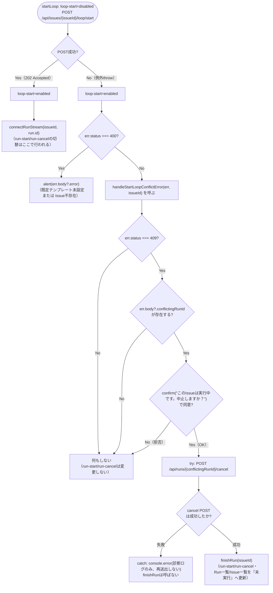

# COMP-14 自律ループ操作UI（`app.js`, `styles.css`）

**対象ファイル**: `src/ClaudeCodeGui/wwwroot/app.js`, `src/ClaudeCodeGui/wwwroot/styles.css`

**責務**（component_design.md 669〜688行目）: 「自律ループ開始」ボタン・ループ停止状態の表示・Issueごとの既定パーミッションモード選択UIを、既存の「実行」「中止」ボタンの構造を変えず`.run-controls`内への追加という形で実装する（CON-02準拠）。対応する機能・要件・実装方法は以下のとおり。

| 機能 | 対応要件 | 実装方法 |
|---|---|---|
| 「自律ループ開始」ボタン | REQ-19 | 独立した`POST /api/issues/{id}/loop/start`呼び出し。`400 Bad Request`時は`err.body.error`の`alert`表示のみで、COMP-13の409固有の中止誘導とは分岐する |
| 停止操作 | REQ-19 | 既存の「中止」ボタンを流用する |
| 既定パーミッションモード選択UI | REQ-18 | `#e-default-permission-mode`セレクトを追加し`PUT /api/issues/{id}`ペイロードに含める |
| 停止中表示（バッジ／インジケータ） | REQ-17, REQ-20 | `issue.loopStopReason`が非nullの場合にIssue詳細画面ヘッダとIssue一覧行の双方に表示する |

**事前条件**:

- `renderIssueDetail`（既存、70〜156行目）がIssue詳細画面のHTMLを`innerHTML`で構築済みであり、`#issue-edit-form`（82〜95行目）・`.run-controls`（97〜108行目、`run-start`/`run-cancel`を含む）が生成済みであること。本節はこの構造に要素を追加するのみで、CON-02が禁じる画面構造（縦一列配置）自体の変更は行わない。
- COMP-13（2.13節）が確定済みの`api()`拡張（`err.status`/`err.body`プロパティ付き例外、2.13.1節）が実装済みであること。本節はこれを変更せずそのまま再利用する（`handleStartRunError`自体は本節では再利用しない。理由は2.14.2節「409の扱い」参照。COMP-14ラウンド1レビュー指摘への対応）。
- COMP-12（2.12.1節）が確定済みの`finishRun`（既存、232〜239行目）が実装済みであること。本節も他コンポーネント同様、これを変更せずそのまま再利用する。
- COMP-11（2.11.5節・2.11.9節）が確定済みの`PUT /api/issues/{id}`ハンドラ（`UpdateIssueRequest`が`LoopEnabled`・`DefaultPermissionMode`を含む）・`POST /api/issues/{issueId}/loop/start`ハンドラ（成功時`202 Accepted`/`409 Conflict`、失敗時`400 Bad Request`、2.11.9節境界値表参照）が実装済みであること。
- COMP-01（2.1節）が確定済みの`Issue`追加プロパティ（`LoopEnabled`・`DefaultPermissionMode`・`LoopConsecutiveRunCount`・`LoopStopReason`）が、`GET /api/issues`・`GET /api/issues/{id}`のレスポンスにcamelCaseで含まれること。既存`Program.cs`（30〜34行目）はいずれも`Issue`オブジェクトをそのまま`Results.Ok`で返す実装であり、DTOによる投影を行っていないため、モデル側へのプロパティ追加のみで自動的にレスポンスへ反映される（本節側で追加のシリアライズ対応は不要）。
- CON-04（`bypassPermissions`を含む現状の3値プルダウンを維持）を踏まえ、`#run-permission`セレクト（既存、101〜105行目）自体は変更しない。`#e-default-permission-mode`は同じ3値（`acceptEdits`/`bypassPermissions`/`plan`）を持つ別要素として新設する。

#### 2.14.1 `#e-default-permission-mode`セレクトの追加とPUTペイロードへの反映（既存関数の変更）

`#issue-edit-form`（82〜95行目）の`#e-status`ラベルの直後・送信ボタンの直前に、既定パーミッションモード選択用の`<label>`を追加する。

```js
<label>既定パーミッションモード（自律ループ実行時に使用）
  <select id="e-default-permission-mode">${permissionModeOptionsHtml(issue.defaultPermissionMode)}</select>
</label>
```

選択肢の組み立てには新規ヘルパー`permissionModeOptionsHtml`を用いる。

```js
// 入力: selectedValue（issue.defaultPermissionModeの現在値。既知の3値・null・undefined・未知の文字列のいずれも許容）
// 出力: <option>タグを連結した文字列（3値固定。selectedValueと一致する項目にのみselected属性を付与）
function permissionModeOptionsHtml(selectedValue) {
  const options = [
    { value: "acceptEdits", label: "acceptEdits（編集は自動承認）" },
    { value: "bypassPermissions", label: "bypassPermissions（全許可・注意）" },
    { value: "plan", label: "plan（計画のみ）" },
  ];
  return options
    .map((o) => `<option value="${o.value}" ${o.value === selectedValue ? "selected" : ""}>${o.label}</option>`)
    .join("");
}
```

**`#run-permission`（既存、101〜105行目）と共通化しない設計判断**: `#run-permission`は選択肢が静的（毎回`acceptEdits`が既定選択）であるのに対し、`#e-default-permission-mode`は`issue.defaultPermissionMode`という動的な値を反映する必要があり、両者は要件が異なる。CON-04は`#run-permission`を「現状のまま残す」ことを求めており、これを`permissionModeOptionsHtml`呼び出しに置き換える改修はCON-04の対象外の変更（既存コードへの不要な手入れ）となるため行わない。3つの選択肢ラベルの文字列がこの2箇所に重複することにはなるが、CON-04の制約を守ることを優先する。

送信ハンドラ（既存、132〜146行目）を以下のとおり変更する。

```js
document.getElementById("issue-edit-form").addEventListener("submit", async (e) => {
  e.preventDefault();
  const updated = await api(`/api/issues/${issue.id}`, {
    method: "PUT",
    body: JSON.stringify({
      title: document.getElementById("e-title").value,
      description: document.getElementById("e-description").value,
      targetProjectPath: document.getElementById("e-target-path").value,
      currentStage: document.getElementById("e-stage").value,
      status: document.getElementById("e-status").value,
      loopEnabled: issue.loopEnabled,                                              // 新規（COMP-14）。理由は下記「discovered issue」参照
      defaultPermissionMode: document.getElementById("e-default-permission-mode").value,   // 新規（COMP-14、REQ-18）
    }),
  });
  await loadIssues();
  selectIssue(updated.id);
});
```

**発見した確認事項: `loopEnabled`をPUTペイロードへ含めない場合に生じるループの意図しない停止（discovered issue）**

COMP-11 2.11.5節（1903〜1905行目）が確定した`UpdateIssueRequest`レコードは`bool LoopEnabled`を含む。component_design.mdのCOMP-14責務記述（669〜688行目）は「`PUT /api/issues/{id}`のペイロードに`defaultPermissionMode`を含める」とのみ記載しており、`loopEnabled`をこのペイロードに含めるべきかには言及していない。

しかし、`System.Text.Json`はリクエストJSON側に存在しないプロパティを`bool`の既定値`false`として黙って埋める（COMP-11自身は`LoopEnabled`の必須検証を行っていない、2.11.5節参照）。

仮に本ペイロード構築で`loopEnabled`キーを送信しなければ常に`false`が送信されることになり、**ループが稼働中（`Issue.LoopEnabled=true`）のIssueに対して、無関係なフィールド（タイトル等）だけを変更する目的でIssue編集フォームを保存すると、副作用としてループが意図せず停止してしまう**。これはREQ-19が想定する明示的な中止操作（「中止」ボタン経由）でも、REQ-17が想定するRun失敗時の自動停止でもない、第三の予期しない停止経路になる。

**対応**: この抜け漏れを防ぐため、送信ハンドラで`loopEnabled: issue.loopEnabled`（`renderIssueDetail(issue, runs)`のクロージャに保持されている、Issue選択時点で取得済みのIssueオブジェクトの現在値）をそのままペイロードへ含める。新規のチェックボックス等のUI要素は追加しない。component_design.mdのCOMP-14責務記述にIssue編集フォームへの`LoopEnabled`用UI要素の追加は明記されておらず、追加するとCON-02（画面構造は現状維持）が禁じる構造変更に該当しうるためである。

**この対応の限界（申し送り事項）**: `issue`は`renderIssueDetail`呼び出し時点（`selectIssue`実行時）にサーバーから取得したスナップショットであり、フォーム表示中に`LoopEnabled`がサーバー側で変化しても（例: 表示中に自動実行が失敗しREQ-17によりループが自動停止した場合）追随しない。この状態でユーザーがIssue編集フォームを保存すると、既に停止済みのループの`LoopEnabled`を`true`へ誤って復帰させてしまう（上記とは逆方向の副作用）。

この競合はIssue詳細画面を再取得（`selectIssue`の再実行）しない限り解消されない、ポーリングを持たない本UI全般の設計上の限界（`Issue`オブジェクト自体の自動再取得はcomponent_design.md・COMP-12いずれも範囲外）に起因するものであり、COMP-14単体では解消できない。本節ではこの残存リスクを申し送るに留め、Issueオブジェクトの定期再取得等の追加対策は行わない。

#### 2.14.2 「自律ループ開始」ボタン・新規関数`startLoop`

`.run-controls`（97〜108行目）内、`#run-start`の直後・`#run-cancel`の直前に新規ボタンを追加する（開始系の2操作を隣接させ、停止系の「中止」を末尾に置く配置）。

```js
<button id="run-start">実行</button>
<button id="loop-start">自律ループ開始</button>
<button id="run-cancel" class="secondary" disabled>中止</button>
```

イベント登録（既存148〜149行目の直後に追加）:

```js
document.getElementById("loop-start").addEventListener("click", () => startLoop(issue.id));
```

`startLoop`本体（新規）:

```js
// 入力: issueId  出力: なし（副作用としてPOST送信・loop-startボタンのdisabled切替、
//        成功時はconnectRunStreamへの接続、失敗時はalertまたはhandleStartLoopConflictErrorへの委譲）
async function startLoop(issueId) {
  const loopStartBtn = document.getElementById("loop-start");
  loopStartBtn.disabled = true;   // POST送信中の二重クリック防止のみが目的（設計判断は下記参照）

  let run;
  try {
    run = await api(`/api/issues/${issueId}/loop/start`, { method: "POST" });
  } catch (err) {
    loopStartBtn.disabled = false;
    if (err.status === 400) {
      // 既定テンプレート未設定またはIssue不存在（2.11.9節）。
      // handleStartLoopConflictErrorは409固有の中止誘導ロジックのため、400では流用しない。
      alert(err.body?.error ?? "ループを開始できませんでした。");
      return;
    }
    // 409（同一Issueへの手動Run実行中等との排他拒否、2.11.9節境界値#4）およびそれ以外の例外は、
    // 専用の新規関数handleStartLoopConflictErrorへ委譲する（COMP-13のhandleStartRunErrorをそのまま流用しない
    // 理由は下記「409の扱い」参照）。
    await handleStartLoopConflictError(err, issueId);
    return;
  }
  loopStartBtn.disabled = false;
  connectRunStream(issueId, run.id);   // run-start/run-cancelの切替はCOMP-12のconnectRunStream内部で行われる
}
```

**宣言位置**: `cancelRun`（既存、241〜244行目）の直後に配置する。`startRun`・`handleStartLoopConflictError`と同じRun操作系のヘルパー群にまとめる。

**409の扱い（`handleStartRunError`をそのまま流用しない設計判断・新規関数`handleStartLoopConflictError`）**: component_design.mdのCOMP-14責務記述は400時の`alert`分岐のみを明記し、409の扱いは規定していない（2.13.4節参照、`startLoop`側の裁量とされている）。ここで、`POST /api/issues/{issueId}/loop/start`が409を返しうるかを確認した。

`StartLoopAsync`（COMP-08 2.8.6節）はIssue単位ロックの下で`Issue.LoopEnabled`等を初期化した後、`ClaudeRunEngine.StartAsync`（COMP-05の`_activeIssueRuns`による排他制御）を呼ぶ設計であり、対象Issueに対して既に別のRunが実行中であれば`StartAsync`が排他拒否系の`RunStartResult(rejectedRun, winningRunId)`を返す。この場合`ToRunStartResponse`（2.11.7節）は`409 Conflict`をそのまま返す（同一Issueへ「実行」ボタンで手動Run中に「自律ループ開始」を押した場合に発生しうる。この場合`conflictingRunId`は現に実行中の手動Runを指し、その時点で`run-cancel`は既に有効・`run-start`は既に無効な状態である）。

当初案は`startRun`と同型の排他拒否とみなし、COMP-13が確定済みの`handleStartRunError`（confirm→中止POST→`finishRun`、または復帰のみ）をそのまま流用していた。しかしレビュー（ラウンド1）で、この流用には`handleStartRunError`の設計前提との不整合があると指摘された。

`handleStartRunError`は`startRun`自身のPOST失敗（＝対象Runがまだ存在しない、または`conflictingRunId`側に実体がある）を想定して設計されており、`confirm`が拒否された場合・`conflictingRunId`が欠落していた場合のいずれも`document.getElementById("run-start").disabled = false; document.getElementById("run-cancel").disabled = true;`を無条件に実行してボタンを「未実行」状態へ戻す（2.13.2節）。

ところが`startLoop`起点の409では、この`run-start`/`run-cancel`は`startLoop`自身のPOSTとは無関係に、既に稼働中の別の手動Runを表している。`confirm`で拒否された場合（またはcontract違反で`conflictingRunId`が欠落した場合）、手動Runは中止されておらずまだ実際に稼働中であるにもかかわらず、`handleStartRunError`をそのまま呼ぶと`run-cancel`が`disabled=true`にされてしまい、ユーザーはUIから稼働中の手動Runを中止できなくなる（該当Issueを再選択し`selectIssue`の実行中Run検出が`connectRunStream`を再度呼ぶまで復旧しない）。

`handleStartRunError`自体はCOMP-13確定済みの関数であり、シグネチャ・契約を変更しない（本プロジェクトの制約）。呼び出し元で分岐させる方針（`startRun`か`startLoop`かを`handleStartRunError`自身に区別させる案）も、確定済み関数への手入れを伴い変更範囲が広がるため採らない。代わりに、`startLoop`専用の新規関数`handleStartLoopConflictError`を設け、`startLoop`の`catch`ではこちらを呼ぶ（`handleStartRunError`は本節では使用しない）。

```js
// 入力: err（api()が投げた拡張Error、status/bodyプロパティ付き）, issueId
// 出力: なし（副作用: 409かつconflictingRunIdありの場合のみconfirm表示。同意時は中止POSTを送信し、
//        中止POSTが成功した場合に限りfinishRunを呼ぶ。それ以外（409以外・conflictingRunId欠落・
//        confirm拒否・中止POST失敗）はrun-start/run-cancelの状態を一切変更しない）
async function handleStartLoopConflictError(err, issueId) {
  const conflictingRunId = err.status === 409 ? err.body?.conflictingRunId : undefined;
  if (!conflictingRunId || !confirm("このIssueは実行中です。中止しますか？")) {
    // 409以外の例外、conflictingRunId欠落（contract違反ケース）、confirm拒否のいずれも、
    // 稼働中の手動Run（connectRunStreamにより run-start=disabled/run-cancel=enabled に
    // 設定済み）のボタン状態には一切触れない。handleStartRunErrorと異なりここでは
    // finishRunを呼ばない（レビュー指摘対応：手動Runがまだ稼働中の可能性がある状態で
    // 「中止」ボタンを無効化しないため）。
    return;
  }
  try {
    await api(`/api/runs/${conflictingRunId}/cancel`, { method: "POST" });
  } catch (cancelErr) {
    // 中止POST自体が失敗した場合、手動Runはまだ稼働中の可能性が高い（対象Runが
    // 直前に既に終了していた等の非致命的なケースもあり得るが、いずれにせよ
    // このフロントエンド側からは稼働中か否かを判別できない）。ここでfinishRunを
    // 呼んでボタンを「未実行」表示に戻すと、稼働中の手動Runを中止不能にするという
    // レビュー指摘の再発になるため、finishRunは呼ばずボタン状態を維持する。
    console.error("中止対象Runの中止処理（cancel POST）に失敗しました:", cancelErr);
    return;
  }
  // 中止POST成功: 手動Runは実際に停止した。connectRunStreamのonerror（2.12.1節手順8）は
  // finishRunを呼ばず再接続予約のみを行う設計であり、その予約も対象一致ガード
  // （2.12.1節「setTimeoutコールバックのガード条件」、runId !== currentRunId）により
  // 破棄される想定であるため、この経路のボタン復帰・Run一覧/Issue一覧の再取得を
  // 通常の実行完了経路（onerror）に委ねることはできない。finishRunを明示的に呼び、
  // run-start/run-cancelおよびRun一覧・Issue一覧を正しい「未実行」状態へ更新する。
  await finishRun(issueId);
}
```

**宣言位置**: `handleStartLoopConflictError`は`startLoop`の直前、`cancelRun`（既存、241〜244行目）の直後に配置する（`startLoop`と同じRun操作系のヘルパー群）。COMP-13の`handleStartRunError`（2.13節）とは別関数として独立させ、COMP-13側のファイルには追加しない。

**`finishRun`を明示的に呼ぶ設計判断（`handleStartRunError`との差分）**: `handleStartRunError`は`finally`節で無条件に`finishRun`を呼ぶのに対し、本関数は中止POSTが成功した場合のみ`finishRun`を呼ぶ。中止POST失敗時にも呼んでしまうと、手動Runが実際にはまだ稼働中の可能性がある状況でボタンを「未実行」表示に戻してしまい、本節の指摘（ラウンド1）が問題視した「稼働中のRunを中止不能にする」ケースを再現することになるため、あえて非対称にしている。

**中止POSTが成功しても自律ループは自動的には開始されない設計判断**: 中止POSTが成功して`finishRun`が呼ばれても、ユーザーが当初意図した自律ループの開始を自動的に再実行することはしない。component_design.mdの確定仕様は「競合する実行中Runの中止へ誘導する」（REQ-13参照）に留まり自動再試行を要求していないため、ユーザーが改めて「自律ループ開始」ボタンを押す操作を要求する設計とする。

**loop-startボタンの無効化範囲を自身のPOST送信中のみに限定する設計判断**: component_design.mdはloop-startボタンの活性制御を明記していない。ここでは、`loop-start`の`disabled`をPOST送信中（数十〜数百ms程度）のみに限定し、Run/ループが実際に実行されている間は無効化し続けない設計とする。

理由: 実行中も`loop-start`を無効化し続ける設計を採ると、Run終了時にこれを再度有効化する処理が別途必要になり、既存の`finishRun`（232〜239行目）を変更しなければならない。しかし`finishRun`はCOMP-12 2.12.1節手順7が「既存`finishRun`実装、232〜239行目は変更しない」と明記済みの共有関数であり、この確定事項を覆さずに済む設計を優先した。

実行中に誤って`loop-start`が再度押されても、`POST /api/issues/{issueId}/loop/start`はバックエンド側の排他制御（`ClaudeRunEngine.StartAsync`の`_activeIssueRuns`、COMP-05）により`409 Conflict`で拒否され（2.11.9節境界値#4）、上記の`handleStartLoopConflictError`への委譲経路へ自然に合流する。この経路はCOMP-08 2.8.6節境界値#4が「二重開始そのものを拒否するガードはcomponent_design.mdに規定がなく本節でも追加しない」と明記した設計判断とも整合する（フロント側でも追加の相互排他ガードを設けない点で一貫している）。

この場合`conflictingRunId`は直前に開始されたばかりの自律ループ自身のRunを指すことになるが、`confirm`に同意されれば`handleStartLoopConflictError`はそのRunの中止POSTと`finishRun`呼び出しを行うのみであり、2.14.2節冒頭の想定（手動Runとの排他拒否）と異なりこのケースでは実際に対象Runが中止されるため、`run-start`/`run-cancel`を「未実行」へ戻すこと自体に矛盾はない。

**`startRun`との差分（意図的な非対称性）**: `startRun`（2.13.2節）はPOST送信前に`#run-log`をクリアし`run-start`/`run-cancel`を切り替えるのに対し、`startLoop`はPOST送信前に`#run-log`のクリアや`run-start`/`run-cancel`の切替を行わない。理由は、`startLoop`成功時は必ず`connectRunStream`（COMP-12）を呼び出し、そこで`#run-log`のクリア・`run-start`/`run-cancel`の切替が改めて行われるため（2.12.1節手順4・5）、POST送信前に同じ処理を先取りする必要がないためである。`startRun`側の先取り処理（2.13.2節が踏襲した既存実装由来の重複）まで本節で再現する必要はないと判断した。

##### `startLoop`の`catch`処理と`handleStartLoopConflictError`の分岐フロー（補足図）



#### 2.14.3 停止操作（既存`run-cancel`・`cancelRun`の流用、追加実装なし）

component_design.mdの確定方針（「既存の『中止』ボタンをそのまま流用（バックエンド側でループも止まるためフロント側の追加実装は不要）」）のとおり、起動済みRun・ループの停止は既存の`#run-cancel`ボタン・`cancelRun()`関数（既存、241〜244行目）をそのまま用いる。`Issue.LoopEnabled`を`false`へ戻す処理は`POST /api/runs/{id}/cancel`ハンドラが`ClaudeRunEngine.CancelAsync`成功後に`loopEngine.StopLoopAsync(issueId)`を呼ぶ形でバックエンド側（COMP-11 2.11.10節）が既に対応済みであり、`app.js`側に追加すべきコードはない。

2.14.2節の設計判断（`loop-start`の無効化をPOST送信中のみに限定）により、`cancelRun`・`finishRun`のいずれも`loop-start`の状態を一切参照・変更しない。両関数は変更不要である。

#### 2.14.4 停止中バッジ・インジケータ表示

`issue.loopStopReason`の値を日本語文言へ変換する新規関数を用意する。

```js
const LOOP_STOP_REASON_LABELS = {
  failed: "実行失敗",
  limit_reached: "連続実行上限到達",
  no_default_template: "既定テンプレート未設定",
};

// 入力: reason（issue.loopStopReasonの値。null/undefined、既知の3値、未知の文字列のいずれも許容）
// 出力: 日本語ラベル文字列。reasonがnull/undefinedならnullを返す（バッジ・インジケータ自体の出し分けは呼び出し元が行う）。
//        未知の文字列が来た場合は例外を投げず、値をそのまま埋め込んだフォールバック文言を返す。
function loopStopReasonLabel(reason) {
  if (reason === null || reason === undefined) return null;
  return LOOP_STOP_REASON_LABELS[reason] ?? `不明な停止理由（${reason}）`;
}
```

**宣言位置**: `stageLabel`（既存、8行目、同じく「コード値→日本語ラベル」変換を行う小関数）の直後に配置する。

**Issue詳細画面ヘッダへの反映（`renderIssueDetail`、既存77〜81行目の変更）**:

```js
const loopBadge = issue.loopStopReason
  ? `<span class="badge loop-stopped">ループ停止中（要確認）: ${escapeHtml(loopStopReasonLabel(issue.loopStopReason))}</span>`
  : "";
```

```js
<div class="detail-header">
  <h2>${escapeHtml(issue.title)}</h2>
  <span class="badge">${issue.status}</span>
  ${loopBadge}
</div>
```

`loopStopReasonLabel`の戻り値は既に日本語の固定文言かフォールバック文言（未知の値をテンプレートリテラルへ埋め込んだもの）であり、後者はサーバー側の`Issue.LoopStopReason`という文字列由来の値を含むため、他の`innerHTML`挿入箇所と同様に`escapeHtml`を通す。

**Issue一覧行への反映（`renderIssueList`、既存47〜60行目の変更）**:

```js
function renderIssueList() {
  const ul = document.getElementById("issue-list");
  ul.innerHTML = "";
  if (issues.length === 0) {
    ul.innerHTML = "<li class='hint'>Issueがありません</li>";
  }
  for (const issue of issues) {
    const li = document.createElement("li");
    li.className = issue.id === selectedIssueId ? "selected" : "";
    const loopIndicator = issue.loopStopReason
      ? `<span class="loop-indicator" title="ループ停止中（要確認）: ${escapeAttr(loopStopReasonLabel(issue.loopStopReason))}">⚠</span>`
      : "";
    li.innerHTML = `${escapeHtml(issue.title)}${loopIndicator}<span class="meta">${stageLabel(issue.currentStage)} / ${issue.status}</span>`;
    li.addEventListener("click", () => selectIssue(issue.id));
    ul.appendChild(li);
  }
}
```

`title`属性（ツールチップ）にも停止理由の文言を含めるため、`escapeAttr`（既存、391〜393行目）を通す。

#### 2.14.5 `styles.css`への追加

既存の`.badge`系ルール（65〜70行目）の直後、`.run-panel`（72行目）の直前に追加する。

```css
.badge.loop-stopped { background: #c93b3b; color: white; margin-left: 0.5rem; }
.loop-indicator { color: #c93b3b; margin-left: 0.25rem; cursor: default; }
```

`.badge.loop-stopped`は既存`.badge.failed`（69行目）と同系統の警告色（`#c93b3b`）を踏襲し、視覚的な一貫性を保つ。`.loop-indicator`はIssue一覧という限られた幅の中で目立たせるための単色テキスト（絵文字`⚠`自体が視覚的な警告表現を持つため、背景色は付けない）とする。

**代表的な境界値・分岐条件**:

| # | 状況 | 挙動 |
|---|---|---|
| 1 | `issue.defaultPermissionMode`が`"acceptEdits"`/`"bypassPermissions"`/`"plan"`のいずれか | `permissionModeOptionsHtml`が該当する`<option>`に`selected`を付与する |
| 2 | `issue.defaultPermissionMode`が`null`/`undefined`（境界値、移行前データ等） | どの`<option>`にも`selected`が付かず、ブラウザ既定で先頭の選択肢（`acceptEdits`）が表示される。この状態でフォームを保存すると`defaultPermissionMode: "acceptEdits"`が送信される |
| 3 | Issue編集フォーム保存時、対象Issueの`loopEnabled`が`true`（ループ稼働中に無関係な項目のみ変更して保存、discovered issue） | `loopEnabled: issue.loopEnabled`をペイロードへ含めることで`true`のまま送信され、無関係な編集保存によるループの意図しない停止を防ぐ（2.14.1節「discovered issue」参照） |
| 4 | `startLoop`のPOSTが`202 Accepted`で成功（正常経路） | `connectRunStream(issueId, run.id)`を呼ぶ。`run-start`/`run-cancel`の切替はconnectRunStream内部で行われる。`loop-start`は即座に再有効化される |
| 5 | `startLoop`のPOSTが`400 Bad Request`（既定テンプレート未設定、またはIssue不存在。2.11.9節境界値#1・#2） | `alert(err.body?.error)`を表示。`loop-start`のみ再有効化する（`run-start`/`run-cancel`は変更しない） |
| 6 | `startLoop`のPOSTが`409 Conflict`（同一Issueへの手動Run実行中等との排他拒否。2.11.9節境界値#4）で、`conflictingRunId`へ同意（`confirm`のOK）し、`POST /api/runs/{conflictingRunId}/cancel`が成功した場合 | `handleStartLoopConflictError(err, issueId)`（COMP-14新規関数）が`finishRun(issueId)`を呼び、`run-start`/`run-cancel`・Run一覧・Issue一覧を正しい「未実行」状態へ更新する（手動Runは実際に中止済みのため正当な復帰）。`loop-start`は`startLoop`自身の`catch`ブロックで独立して再有効化される |
| 7 | 同上（409・`conflictingRunId`あり・`confirm`同意）だが`POST /api/runs/{conflictingRunId}/cancel`自体が例外を投げる（境界値、対象Runが直前に既に終了していた等） | `catch (cancelErr)`で`console.error`のみ残し、`finishRun`は呼ばない。`run-start`/`run-cancel`は一切変更しない（手動Runがまだ稼働中の可能性がある状態でボタンを「未実行」表示に戻すレビュー指摘の再発を避けるため。COMP-13の`handleStartRunError`との最大の差分）。`loop-start`は`startLoop`側で独立して再有効化される |
| 8 | `startLoop`のPOSTが`409 Conflict`で、`confirm`が拒否された場合、または`conflictingRunId`が欠落している場合（境界値、2.13.1節境界値#2相当のcontract違反ケース） | 何もしない（`run-start`/`run-cancel`を一切変更しない）。稼働中の手動Runの「中止」ボタンは有効なまま維持され、レビュー指摘（ラウンド1）が懸念した「実際には稼働中の手動Runを画面から中止できなくなる」事態を防ぐ。`loop-start`は`startLoop`側で独立して再有効化される |
| 9 | `startLoop`のPOSTが`409`以外の例外、または`fetch`自体の例外等で`err.status`が`undefined`（境界値、2.13.1節境界値#6相当） | `conflictingRunId`は`undefined`となり#8と同じ分岐（何もしない）。この経路が発生する時点でバックエンドは手動Runとの排他拒否（409）を返していない＝この時点で当該Issueに稼働中の手動Runは存在しない（存在すれば409になるため）ため、ボタン状態を変更しなくても不整合は生じない。`loop-start`は`startLoop`側で再有効化される |
| 10 | `issue.loopStopReason`が`null` | Issue詳細画面ヘッダ・Issue一覧行のいずれにもバッジ・インジケータを表示しない |
| 11 | `issue.loopStopReason`が`"failed"`/`"limit_reached"`/`"no_default_template"` | それぞれ「実行失敗」「連続実行上限到達」「既定テンプレート未設定」の文言でバッジ・インジケータを表示する |
| 12 | `issue.loopStopReason`が未知の文字列（境界値、将来のサーバー側変更等） | `loopStopReasonLabel`がフォールバック文言`不明な停止理由（{値}）`を返し、バッジ・インジケータに表示する（`undefined`という文字列の表示や例外送出を避ける） |

対応ID: REQ-17, REQ-18, REQ-19, REQ-20
