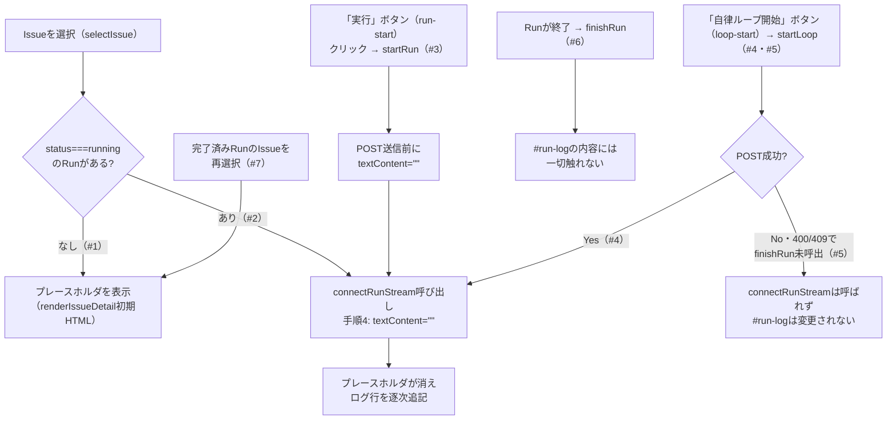

# COMP-15 GUI配置の改善（`app.js`, `styles.css`）

**対象ファイル**: `src/ClaudeCodeGui/wwwroot/app.js`, `src/ClaudeCodeGui/wwwroot/styles.css`

**責務**（component_design.md 680〜688行目）: Issue詳細画面（該当するUI要素が存在するのはこの画面のみ）における2件の表示改善を行う。

| 機能 | 対応要件 | 実装方法 |
|---|---|---|
| 実行ログビューの未実行時プレースホルダ | REQ-04 | `#run-log`の初期HTMLにプレースホルダ要素を含める。既存の`connectRunStream`（COMP-12）・`startRun`（COMP-13）が行う`logView.textContent = ""`で自然に消える |
| 成果物ブラウザの高さ統一 | REQ-05 | `styles.css`に`--browser-panel-height`CSS変数を追加し、`.artifact-tree`・`.artifact-editor textarea`の両方に適用する |

**事前条件**:

- `renderIssueDetail`（既存、70〜156行目）がIssue詳細画面のHTMLを`innerHTML`で構築済みであり、`#run-log`（既存、109行目、現状`<div id="run-log" class="log-view"></div>`）が生成済みであること。本節はこの1要素の初期HTMLに手を加えるのみで、CON-02が禁じる画面構造自体の変更は行わない。
- COMP-12（2.12.1節）が確定済みの`connectRunStream`（手順4、`logView.textContent = ""`でクリアしてから全量再描画）・COMP-12（2.12.2節）が確定済みの`selectIssue`（実行中Run検出時に`renderIssueDetail`直後で`connectRunStream`を呼ぶ）が実装済みであること。本節はいずれも変更せずそのまま再利用する。
- COMP-13（2.13.2節、既存183〜186行目相当）が確定済みの`startRun`（POST送信前に`logView.textContent = ""`を実行済み）が実装済みであること。本節は変更しない。
- COMP-14（2.14.2節）が確定済みの`startLoop`（POST送信前は`#run-log`を変更せず、成功時に`connectRunStream`経由でクリアされる設計）が実装済みであること。本節は変更しない。
- COMP-12（2.12.1節手順7）が明記した既存`finishRun`（232〜239行目、`#run-log`の内容には一切触れない）が実装済みであること。本節はこれも変更しない。
- `styles.css`の`:root`（1〜7行目）・`.artifact-tree`（既存、93行目、現状`max-height: 320px`固定値）・`.artifact-editor textarea`（既存、97行目、現状`height: 260px`固定値）が現状の記述のままであること。

#### 2.15.1 `#run-log`初期HTMLへのプレースホルダ追加（`renderIssueDetail`の変更、REQ-04）

`renderIssueDetail`（既存、109行目）の`#run-log`の初期HTMLを以下のとおり変更する。

```html
<!-- 変更前（既存109行目） -->
<div id="run-log" class="log-view"></div>

<!-- 変更後 -->
<div id="run-log" class="log-view"><div class="log-view-placeholder">まだ実行していません</div></div>
```

`renderIssueDetail`自体のシグネチャ・他の処理・呼び出し元（`selectIssue`）との関係は一切変更しない。新規のJS関数・イベントハンドラも不要である（静的な初期HTML文字列の変更のみ）。

**プレースホルダを消す新規ロジックを追加しない設計判断**:

- `logView.textContent = ""`という代入は、`#run-log`の子要素（プレースホルダの`<div class="log-view-placeholder">`を含む）をすべて破棄してから空文字列に置き換える標準的なDOM操作であり、対象がプレースホルダであろうと通常のログ行であろうと区別なく動作する。
- したがって、`connectRunStream`（COMP-12 2.12.1節手順4）・`startRun`（COMP-13 2.13.2節、既存183〜186行目相当）のいずれも変更する必要がなく、実際に変更しない。
- REQ-04が要求する「プレースホルダを消す」動作は、これら既存2箇所の`logView.textContent = ""`という副作用に完全に依存し、新規のクリア専用コードを追加しない設計とする。

#### 2.15.2 プレースホルダが消えるタイミングの整理

各契機とプレースホルダの状態遷移の関係を図示すると以下のとおり（`#`は下表の行番号に対応）。詳細な条件・根拠は表を参照。

##### プレースホルダが消えるタイミング（フロー図）



**代表的な境界値・分岐条件**:

| # | 状況 | 挙動 |
|---|---|---|
| 1 | Issueを初めて選択（`selectIssue`実行）、対象Issueに`status === "running"`のRunがない | `renderIssueDetail`が生成した`#run-log`のプレースホルダがそのまま表示される。`connectRunStream`は呼ばれない（2.12.2節境界値#2） |
| 2 | Issueを初めて選択、対象Issueに`status === "running"`のRunが1件ある（COMP-12 2.12.2節のREQ-27実行中Run検出） | `renderIssueDetail`が一旦プレースホルダ入りの`#run-log`を生成した直後、`selectIssue`が同期的に`connectRunStream(issue.id, runningRun.id)`を呼び出し、その手順4で`logView.textContent = ""`が実行される。プレースホルダはユーザーに知覚される前（同一の同期処理内）に消え、以後は受信したログ行が逐次追記される |
| 3 | ユーザーが「実行」ボタン（`run-start`）をクリックして`startRun`が呼ばれる | POST送信前（既存183〜186行目相当、2.13.2節）に`logView.textContent = ""`が実行され、プレースホルダは即座に消える。その後`connectRunStream`が呼ばれ、手順4のクリアが冪等に重ねて実行される（2.12.3節「二重発生の是非」参照、本節はこの既存の重複実行に手を加えない） |
| 4 | ユーザーが「自律ループ開始」ボタン（`loop-start`）をクリックして`startLoop`が呼ばれ、POSTが成功する（COMP-14 2.14.2節） | `startLoop`はPOST送信前に`#run-log`を変更しない（2.14.2節「`startRun`との差分」参照）。POST成功後に呼ばれる`connectRunStream`の手順4でプレースホルダが消える |
| 5 | `startLoop`のPOSTが`400`/`409`で失敗し、`handleStartLoopConflictError`が`finishRun`を呼ばずに終わる場合（2.14節境界値表#5・#8・#9） | `connectRunStream`が呼ばれないため、`#run-log`は変更されない。プレースホルダ表示中であればプレースホルダのまま、既にログ表示中であればログ表示のまま維持される |
| 6 | Runが正常終了・失敗終了して`finishRun`（既存232〜239行目）が呼ばれる | `finishRun`は`#run-log`の内容に一切触れない（2.12.1節手順7参照）。プレースホルダは既にケース2〜4のいずれかで消えている前提のため、Run終了によって再表示されることはない |
| 7 | Runが完了済み（`succeeded`/`failed`/`canceled`）のIssueを一覧から再選択する（境界値、ページ内でのIssue切替） | `selectIssue`が`renderIssueDetail`を再度呼び出すため`#run-log`は毎回新規のDOM要素として生成し直され、初期HTML（プレースホルダ入り）に戻る。かつ`status === "running"`のRunが存在しないため`connectRunStream`は呼ばれず、プレースホルダが再び表示される（完了済みRunの過去ログを`#run-log`へ再表示する仕組みはCOMP-12/13いずれにも存在しない既存の設計であり、本節が新たに導入する挙動ではない。過去の実行結果は`#run-history-body`のRun履歴テーブル側で確認する設計） |

#### 2.15.3 `styles.css`への`--browser-panel-height`変数追加（REQ-05）

`:root`（既存、1〜7行目）へ以下の1行を追加する。

```css
:root {
  color-scheme: light;
  --border: #d0d0d5;
  --bg-subtle: #f5f5f7;
  --accent: #3a5fd9;
  --bg: #ffffff;
  --browser-panel-height: 320px;   /* 新規（REQ-05） */
}
```

`.artifact-tree`（既存、93行目）・`.artifact-editor textarea`（既存、97行目）を以下のとおり変更する。

```css
/* 変更前 */
.artifact-tree { flex: 0 0 240px; border: 1px solid var(--border); border-radius: 8px; max-height: 320px; overflow-y: auto; }
.artifact-editor textarea { width: 100%; height: 260px; font-family: Consolas, monospace; font-size: 0.85rem; }

/* 変更後 */
.artifact-tree { flex: 0 0 240px; border: 1px solid var(--border); border-radius: 8px; max-height: var(--browser-panel-height); overflow-y: auto; }
.artifact-editor textarea { width: 100%; height: var(--browser-panel-height); font-family: Consolas, monospace; font-size: 0.85rem; }
```

`max-height`と`height`という異なるCSSプロパティ名のまま、値のみを共通変数に置き換える（`.artifact-tree`は内容量に応じて縮む余地を残す`max-height`、`textarea`は常に一定サイズを占める`height`という、既存の使い分け自体は変更しない）。

**値を320px（`.artifact-tree`側の既存値）に揃え、260px（`.artifact-editor textarea`側の既存値）に揃えない設計判断**:

- component_design.mdのCOMP-15責務記述（685行目）が例示する変数定義そのものが`--browser-panel-height: 320px;`であり、これは`.artifact-tree`の既存値と一致する。上流の確定仕様が示す具体的な値をそのまま採用することで、値の選定について本節独自の裁量判断を追加しない。
- `.log-view`（既存、74〜85行目）の`height`も同じ320pxであり、320pxへ揃えることで実行ログビュー・成果物ツリー・成果物エディタという画面内の主要な3つのパネルの高さがすべて一致する（副次的な視覚的一貫性）。
- 逆に260pxへ揃える案は採らない。260pxは現状の`.artifact-editor textarea`固有の値であり、`.artifact-tree`側をこれに合わせて320pxから260pxへ縮めると、成果物ツリー（ディレクトリ・ファイル一覧）の同時表示件数が現状より減り、スクロール操作が増える。REQ-05は「高さを揃える」ことを求めているのみで、揃えた結果として現状より表示領域を狭める挙動変化までは求めていないため、既存の広い方（320px）に統一する。

**副次的影響**:
`.artifact-editor textarea`のheightが60px拡大することで、`.artifact-panel`全体の高さも同程度増加し、Issue詳細画面全体のスクロール量がわずかに増える。ただしCON-02が禁じるのは画面構造そのもの（縦一列配置）であり、要素サイズの微増はこれに抵触しない。

#### 2.15.4 CON-02・CON-03・CON-04が本コンポーネントの範囲外である旨

component_design.mdの確定記載（686行目）のとおり、以下は本コンポーネントの検討対象外として明示的に対応不要とする。新たな検討・設計判断は行わない。

- **CON-02**（Issue詳細画面全体の構造は現状維持）: 「変更しない」という制約そのものが設計判断であり、2.15.1〜2.15.3節の変更（既存要素の初期HTML内容・CSS値の変更のみ）はいずれも画面構造（縦一列配置）自体には触れていない。
- **CON-03**（工程実行の操作列は対応不要）: `.run-controls`内のテンプレート選択・パーミッションモード選択・実行/中止ボタンの配置は本節で一切変更しない。
- **CON-04**（`bypassPermissions`を含む現状の3値プルダウンの現状維持）: `#run-permission`セレクトは本節で変更しない。

**代表的な境界値・分岐条件（CSS変数関連）**:

| # | 状況 | 挙動 |
|---|---|---|
| 1 | 通常のブラウザ（CSS変数`var()`をサポート）でIssue詳細画面を開く | `.artifact-tree`の`max-height`・`.artifact-editor textarea`の`height`がいずれも`--browser-panel-height`（320px）に解決され、高さが一致する |
| 2 | `--browser-panel-height`の値を将来変更する場合（保守時の想定） | `:root`の1箇所を変更するだけで両セレクタへ反映される（値の重複記載がないため、変更漏れによる再度の食い違いが起きない） |

対応ID: REQ-04, REQ-05, CON-02, CON-03, CON-04
