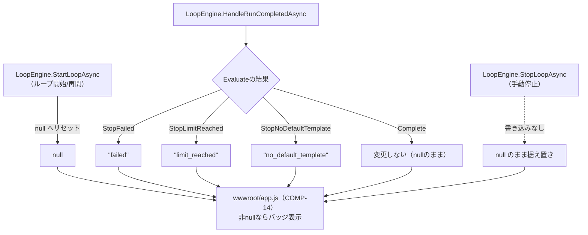
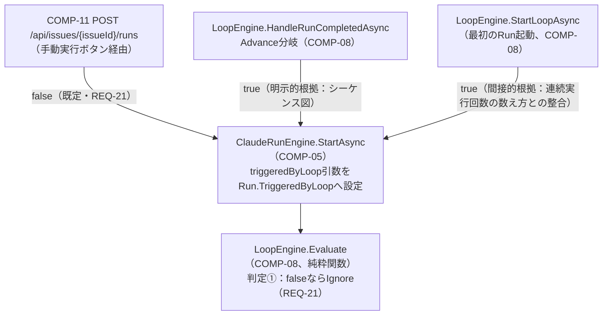
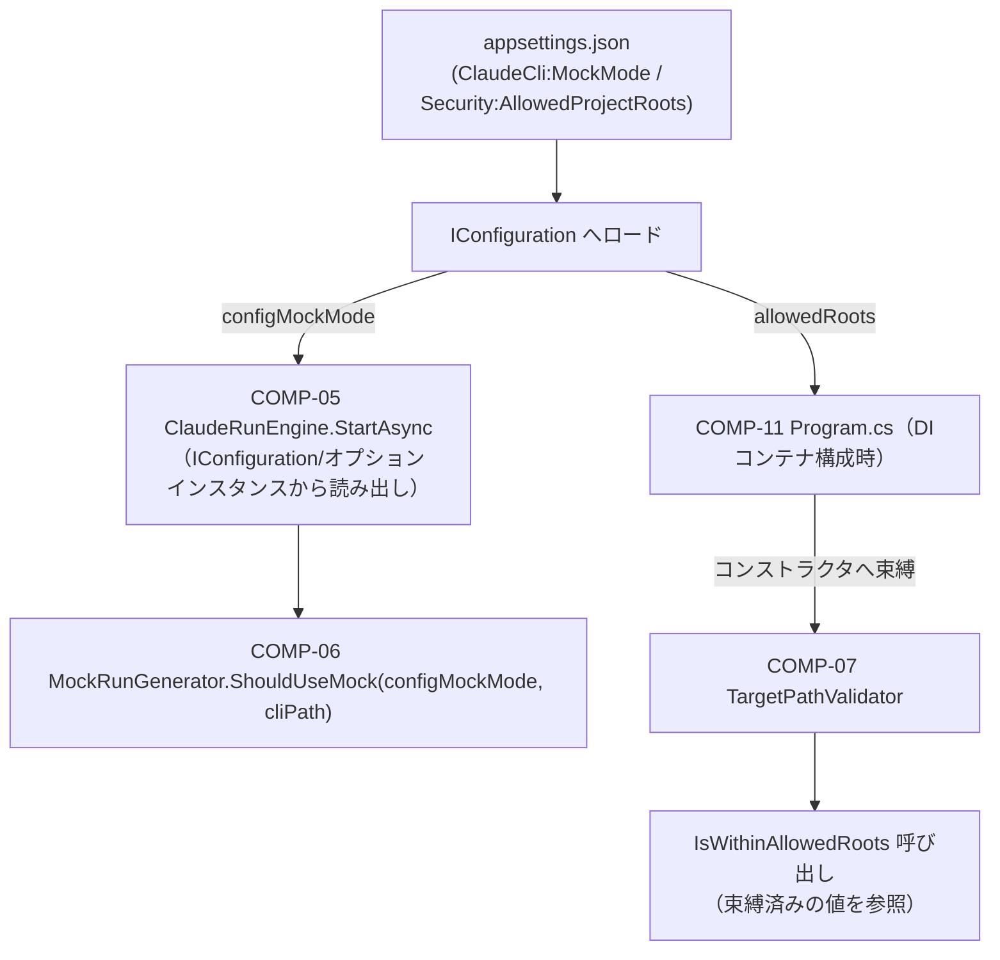
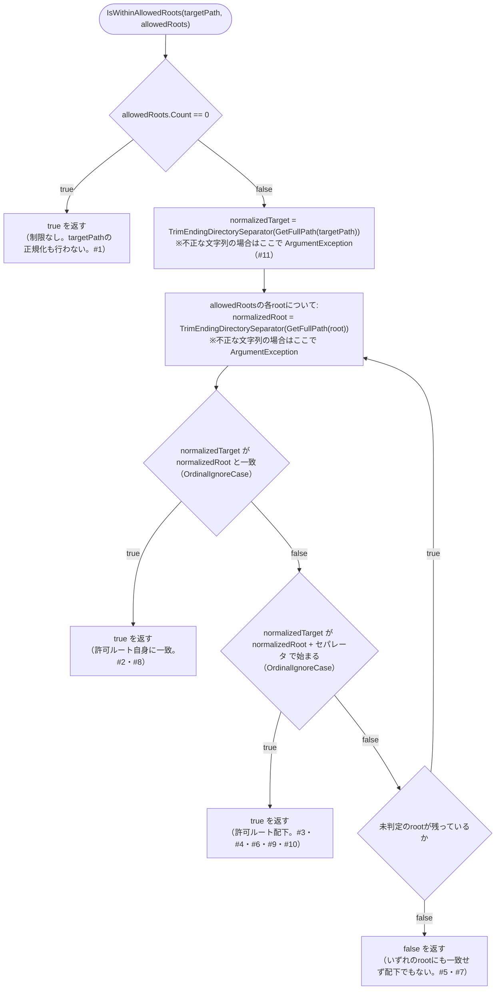
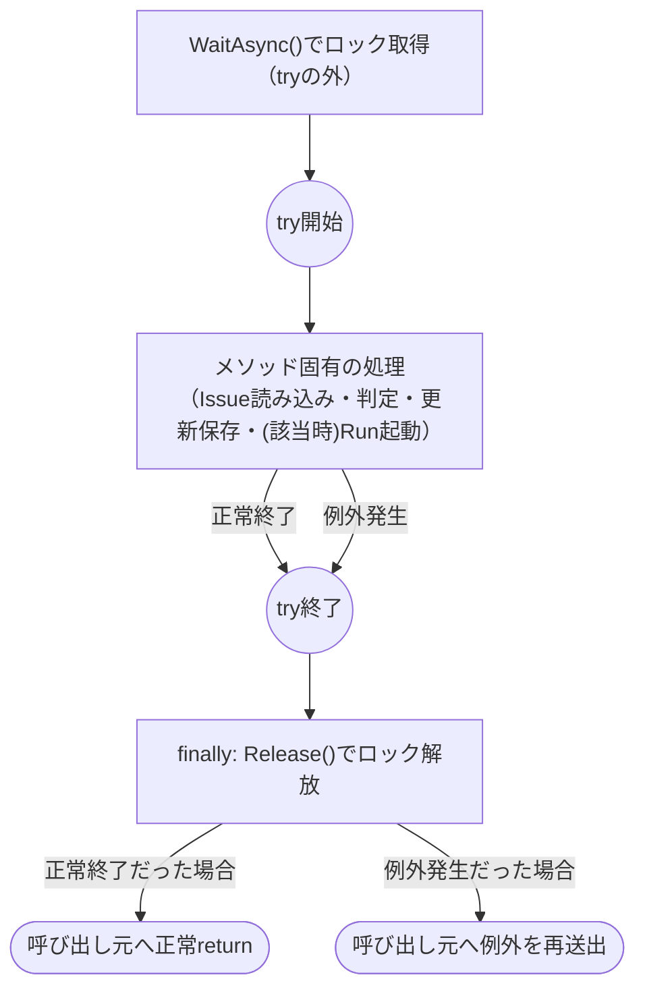
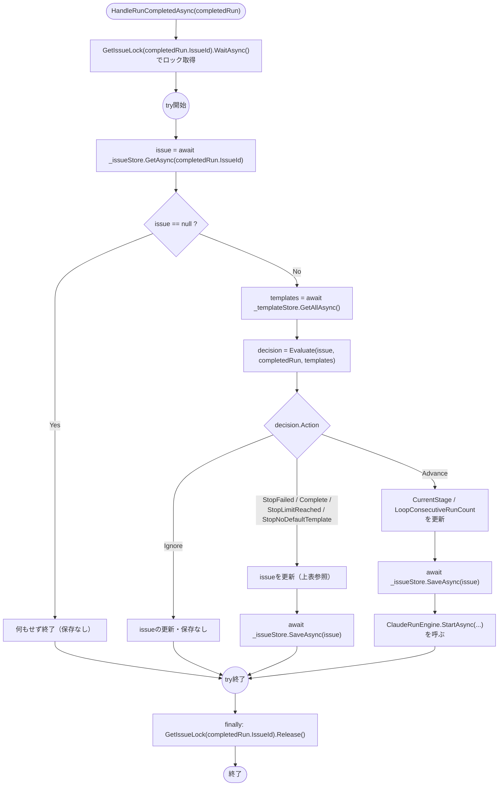
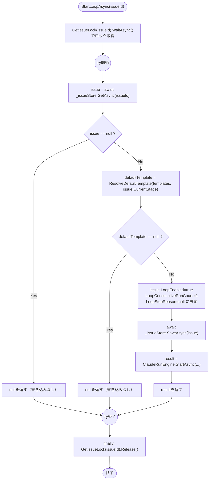
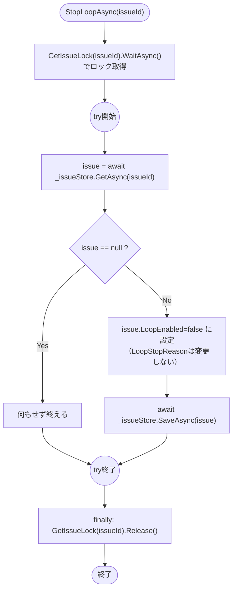
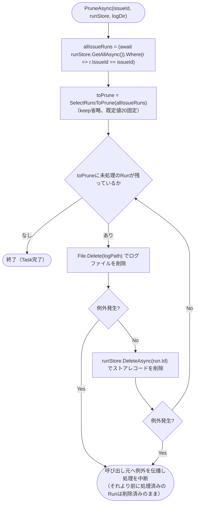
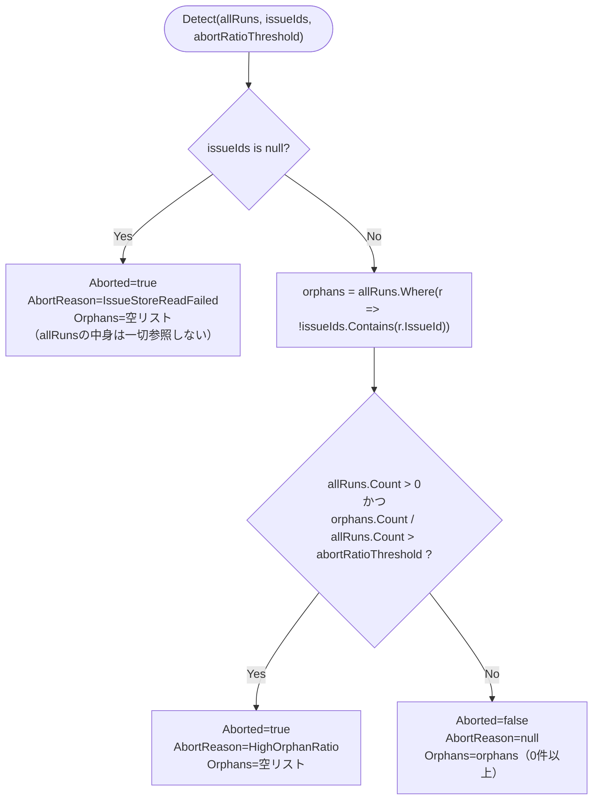

# claudeCodeGUI 関数設計書

## 0. 文書情報

| 項目 | 内容 |
|---|---|
| 版数 | 1.0 |
| 作成日 | 2026-08-25 |
| 作成者（サブエージェント） | 関数設計工程 開発サブエージェント（論理設計担当） |
| 対象範囲 | `docs/02_component_design/component_design.md` COMP-01〜17（コンポーネント設計工程完了順に、コンポーネント単位で開発→レビューサイクルを回しながら追記する） |
| 入力ドキュメント | `docs/02_component_design/component_design.md`、`docs/01_requirements/requirements.md`、`docs/traceability_matrix.md`、`src/ClaudeCodeGui/` 実装コード |

## 1. 設計方針

- 各関数の入出力仕様は、そのままテストケース設計に転用できる粒度で記載する（CLAUDE.md品質方針）。具体的には、シグネチャ（引数・戻り値の型）、事前条件、事後条件・戻り値の意味、代表的な境界値・分岐条件を明記する。
- 副作用（ファイルI/O・DI経由のストアアクセス等）とロジック（純粋関数）を分離する方針を踏襲する（`component_design.md`の既存パターン、および`ArtifactService.ResolveWithinRoot`が体現するパターンに準拠）。純粋関数には「純粋関数（ストア等への副作用なし、単体テスト対象）」の注記を付け、副作用を伴う関数とは節を分けて記載する。
- 各関数には対応するコンポーネントID（COMP-xx）を明記し、コンポーネント設計書3節の当該コンポーネント節との整合性を保つ。コンポーネント設計書側で既に確定しているシグネチャ・判定順序・境界値（例: COMP-08の`Evaluate`判定順序、オフバイワン修正、ロック解放方針）はそのまま踏襲し、関数設計工程で内容を変更しない（変更が必要と判断した場合はレビュー指摘として扱う）。
- 各COMP-xxごとに「## 2.N COMP-xx ...」の節を立て、コンポーネント設計工程完了順（COMP-01から）に並べる。1コンポーネント＝1つの開発→レビューサイクルとして追記していく（`waterfall-dev-workflow`スキル自律ループモード運用）。
- 振る舞いを持たないデータ構造（モデルクラスの単純なプロパティ追加等）で独立した関数が不要と判断した場合は、その旨と根拠を明記し、当該プロパティを読み書きする利用側コンポーネントの関数設計にその責務を委譲する。
- ID対応関係の一次情報源は`docs/traceability_matrix.md`とする。本書では各コンポーネント節の末尾に簡潔な対応ID一覧のみを記載し、非自明な対応関係のみ個別に理由を補足する。

## 2. コンポーネント別 関数設計

### 2.1 COMP-01 `Issue` モデル拡張

**対象ファイル**: `src/ClaudeCodeGui/Models/Issue.cs`

**関数設計の要否についての判断**: `Issue`はコンポーネント設計書3.1節で「振る舞いを持たないデータ構造」と位置づけられており、実装上もパブリックな自動実装プロパティ（`{ get; set; }`）のみを持つPOCOである。バリデーションや正規化などIssue自身が担うべきロジックは要件・設計のいずれにも存在しない（`TargetProjectPath`の範囲チェックはCOMP-07`TargetPathValidator`、テンプレート既定の一意性はCOMP-03`PromptTemplateDefaultResolver`が担い、いずれも`Issue`自身のメソッドにはしない設計）。既存3プロパティ（`Id`, `CreatedAt`, `UpdatedAt`）もコンストラクタ既定値の代入のみで、ファクトリメソッドや検証メソッドは実装されていない。

以上より、**本コンポーネントには独立した関数はなく、プロパティの読み書きは各利用コンポーネント（COMP-08, COMP-11, COMP-14等）の関数設計側で規定する**。以下は、その委譲関係を明確にするための「プロパティ×読み書き元」対応表である（`component_design.md`表の型・既定値・意味をそのまま転記するのではなく、関数設計書としてどの関数が読み書きするかの観点に変換したもの）。

#### 追加プロパティと読み書き元

| プロパティ | 型 / 既定値 | 書き込み元（副作用を伴う関数） | 読み取り元 |
|---|---|---|---|
| `LoopEnabled` | `bool` / `false` | ①`LoopEngine.StartLoopAsync`（COMP-08、`true`に設定）<br>②`LoopEngine.StopLoopAsync`（COMP-08、`false`に戻す。REQ-19の中止流用）<br>③`LoopEngine.HandleRunCompletedAsync`（COMP-08、`Evaluate`が`StopFailed`/`StopLimitReached`/`StopNoDefaultTemplate`/`Complete`を返した場合に`false`へ戻す）<br>④Issue編集フォーム経由で`Program.cs`の`PUT /api/issues/{id}`ハンドラ（COMP-11）が直接更新する経路もある | `LoopEngine.Evaluate`（COMP-08、純粋関数。判定①で`issue.LoopEnabled == false`なら`Ignore`）<br>`wwwroot/app.js`（COMP-14、ボタン活性状態の表示切り替え） |
| `DefaultPermissionMode` | `string` / `"acceptEdits"` | Issue編集フォーム経由で`PUT /api/issues/{id}`ハンドラ（COMP-11）が更新する。<br>値は`wwwroot/app.js`の`#e-default-permission-mode`セレクト（COMP-14）が生成する | `LoopEngine.StartLoopAsync`（COMP-08、次Run起動時のパーミッションモード引数として`ClaudeRunEngine.StartAsync`へ渡す） |
| `LoopConsecutiveRunCount` | `int` / `0` | ①`LoopEngine.StartLoopAsync`（COMP-08、ループ開始時に`1`へリセット）<br>②`LoopEngine.HandleRunCompletedAsync`（COMP-08、`Evaluate`が`Advance`を返すたびにインクリメント） | `LoopEngine.Evaluate`（COMP-08、純粋関数。判定⑤`issue.LoopConsecutiveRunCount > maxConsecutiveRuns`で参照。比較演算子は`>`であって`>=`ではない点に注意。コンポーネント設計書3.3節COMP-08「設計時に発見したオフバイワン」参照） |
| `LoopStopReason` | `string?` / `null` | ①`LoopEngine.StartLoopAsync`（COMP-08、ループ開始/再開時に`null`へリセット。詳細は下記「`LoopStopReason`の書き込み経路（補足）」を参照）<br>②`LoopEngine.HandleRunCompletedAsync`（COMP-08、`Evaluate`の結果に応じて停止理由文字列を設定。詳細は下記参照）<br>③**手動停止（`LoopEngine.StopLoopAsync`）ではこのプロパティを一切書き込まない**（＝`null`のまま据え置く設計。3.1節「設計判断」を踏襲） | `wwwroot/app.js`（COMP-14、`issue.loopStopReason`が非nullならIssue詳細画面ヘッダおよびIssue一覧行に「ループ停止中（要確認）」バッジを表示。値ごとの日本語文言マッピングはCOMP-14側で規定） |

##### `LoopStopReason`の書き込み経路（補足）

上表①②の書き込み条件は分岐が複雑なため、詳細を以下に補足する。

- `LoopEngine.StartLoopAsync`（COMP-08）: ループ開始/再開時に`LoopEnabled`・`LoopConsecutiveRunCount`とあわせて`null`へリセットする。コンポーネント設計書3.3節COMP-08のクラス定義コメント「直後からtry/finallyで囲んだ区間内でLoopEnabled/LoopConsecutiveRunCount/LoopStopReasonを初期化し」を参照。前回の停止理由が再開後も残らないようにする経路である。
- `LoopEngine.HandleRunCompletedAsync`（COMP-08）: `Evaluate`の結果に応じて`"failed"`｜`"limit_reached"`｜`"no_default_template"`のいずれかを設定する。`Complete`時は変更しない（＝`null`のまま）。
- `LoopEngine.StopLoopAsync`（手動停止、COMP-08）: このプロパティを一切書き込まない（＝`null`のまま据え置く設計。3.1節「設計判断」を踏襲）。



#### 競合状態対策との対応関係（関数設計上の確認事項）

3.1節が言及する「手動中止時の`LoopStopReason`競合状態」は、コンポーネント設計書3.3節COMP-08で対策が確定済み（`Evaluate`の判定順序に`completedRun.Status == "canceled" → Ignore`を独立分岐として追加、および`LoopEngine`のIssue単位ロック`SemaphoreSlim`による`StartLoopAsync`/`StopLoopAsync`/`HandleRunCompletedAsync`の排他）。本コンポーネント（`Issue`モデル自体）側での追加対応は不要であることを確認した。`Issue`はデータ保持のみを担い、到達順序に依存しない判定ロジックはCOMP-08の`Evaluate`（純粋関数）に閉じているため、モデル定義自体には変更を要しない。

#### 補助関数の要否

初期化用ファクトリメソッド・バリデーションメソッドについても検討したが、以下の理由により追加不要と判断した。

##### 理由1: 初期化の単純さ

4プロパティはいずれも単純な既定値（`false`/`"acceptEdits"`/`0`/`null`）で足り、既存3プロパティ同様プロパティ初期化子で完結する。相互に依存する初期化順序や複合的な不変条件（invariant）が存在しない。

##### 理由2: `DefaultPermissionMode`の妥当性検証について

`DefaultPermissionMode`が既知の値（`"acceptEdits"`等、CON-04が現状維持するプルダウンの選択肢）かどうかの妥当性検証について確認したところ、`component_design.md`の以下いずれの節にも、この値を検証する処理は存在しないことが分かった。

- COMP-05節: `ClaudeRunEngine.StartAsync`は`permissionMode`を単なる`string`引数として受け取り、検証なしにそのまま使用する
- COMP-08節: `LoopEngine.StartLoopAsync`は`issue.DefaultPermissionMode`を検証せずそのまま`ClaudeRunEngine.StartAsync`へ渡す
- COMP-11節: `PUT /api/issues/{id}`ハンドラも`DefaultPermissionMode`を検証なしでそのまま保存する

*経緯*: 本節の初版では「モデル自身に持たせるとロジック層と表現層の分離方針に反する」としてCOMP-05/COMP-08側の責務と記述していたが、関数設計（論理）レビューラウンド1の重大指摘により、実際にはCOMP-05/COMP-08のどちらの節にもそのような検証処理が規定されていない＝根拠のない記述だったことが判明した。

*結論*: `DefaultPermissionMode`の妥当性検証は、`Issue`モデル自身はもちろん、システムのどこにも現時点では実装されていない（設計上の欠落）。ただし`component_design.md`は本工程の上流で確定済みの文書であり、本関数設計工程からその記載内容を書き換えることはできない。

*今後の対応（申し送り）*: この欠落への対応は、`Issue`モデル自身に持たせず、値を実際に使用する側（`ClaudeRunEngine.StartAsync`寄りならCOMP-05、`LoopEngine.StartLoopAsync`寄りならCOMP-08、または`PUT /api/issues/{id}`ハンドラ寄りならCOMP-11）の関数設計時に、新規のバリデーション関数を追加するかどうかを含めて確定する。本節（COMP-01）ではこれ以上の判断は行わず、後続のCOMP-05/COMP-08/COMP-11関数設計時に検証関数の要否を確定する旨を申し送る。

対応ID: REQ-14, REQ-17, REQ-18, REQ-20

### 2.2 COMP-02 `Run` モデル拡張

**対象ファイル**: `src/ClaudeCodeGui/Models/Run.cs`

**関数設計の要否についての判断**: `Run`はコンポーネント設計書3.1節でCOMP-01（`Issue`）と同様「振る舞いを持たないデータ構造」の追加として位置づけられている（3.1節COMP-02の記載は責務・プロパティ表のみで、独立したメソッド・関数は一切定義されていない）。実装上も既存の`Run`（`src/ClaudeCodeGui/Models/Run.cs`）は`Id`/`IssueId`/`TemplateId`/`Stage`/`PermissionMode`/`Status`/`ExitCode`/`ResultSummary`/`IsError`/`StartedAt`/`FinishedAt`の11プロパティすべてが自動実装プロパティ（`{ get; set; }`）またはプロパティ初期化子のみで構成されており、ファクトリメソッド・バリデーションメソッドの類は存在しない。

追加される`IsMock`・`TriggeredByLoop`もいずれも単純な`bool`（既定値`false`）であり、相互依存や複合的な不変条件（invariant）を持たない。

以上より、**本コンポーネントには独立した関数はなく、プロパティの読み書きは各利用コンポーネント（COMP-05, COMP-08）の関数設計側で規定する**。以下は、その委譲関係を明確にするための「プロパティ×読み書き元」対応表である（COMP-01と同じ形式）。

#### 追加プロパティと読み書き元

| プロパティ | 型 / 既定値 | 書き込み元（副作用を伴う関数） | 読み取り元 |
|---|---|---|---|
| `IsMock` | `bool` / `false` | `ClaudeRunEngine.StartAsync`（COMP-05）。`MockRunGenerator.ShouldUseMock(configMockMode, cliPath)`（COMP-06、純粋関数）の判定結果を、Run生成後・保存前に`Run.IsMock`へ設定する（コンポーネント設計書3.3節COMP-05「処理フロー」手順3「Run.IsMock・TriggeredByLoopを設定して保存」を参照） | `wwwroot/app.js`の`renderRunHistory`（既存関数、Run一覧表示。REQ-03）。表示先の帰属は下記「`IsMock`表示先の割り当てに関する確認事項」を参照 |
| `TriggeredByLoop` | `bool` / `false` | `ClaudeRunEngine.StartAsync`（COMP-05）。呼び出し元が渡す`triggeredByLoop`引数（既定`false`）をそのまま`Run.TriggeredByLoop`へ設定する。呼び出し元ごとの値・根拠は下記「`TriggeredByLoop`の書き込み経路（補足）」を参照 | `LoopEngine.Evaluate`（COMP-08、純粋関数）。判定①`completedRun.TriggeredByLoop == false`で`Ignore`（手動実行はループ継続のトリガーにしない＝REQ-21） |

##### `TriggeredByLoop`の書き込み経路（補足）

上表の書き込み元は、呼び出し元によって渡す値と根拠の確度が異なるため、詳細を以下に補足する。

- 手動「実行」ボタン経由（COMP-11 `POST /api/issues/{issueId}/runs`ハンドラ）: 引数を指定しないため常に`false`（REQ-21）。
- `LoopEngine.HandleRunCompletedAsync`のAdvance分岐（COMP-08）: `triggeredByLoop: true`を明示的に渡す。component_design.md 4.1節のシーケンス図に明示的根拠あり。
- `LoopEngine.StartLoopAsync`（最初のRunを起動する経路、COMP-08）: `triggeredByLoop: true`を渡す必要があると判断したが、こちらはシーケンス図に明示的記載はなく、COMP-08「連続実行回数の数え方」節の記述〈`StartLoopAsync`が最初のRunを起動する時点で`LoopConsecutiveRunCount=1`とする〉と整合するには`TriggeredByLoop=true`を渡す必要がある、という間接的根拠による（`LoopConsecutiveRunCount`は`TriggeredByLoop=true`のRun数の上限としてカウントされるため）。



##### `IsMock`表示先の割り当てに関する確認事項

REQ-03は「Run**一覧・詳細表示**でモック実行を区別できるようにする」ことを求めている（requirements.md REQ-03、およびarchitecture-overview.md 4.1節#8「履歴上の区別」も同旨）。この「一覧」「詳細表示」の2箇所それぞれについて、`wwwroot/app.js`を確認し、担当する既存関数・箇所を特定した上で帰属先コンポーネントの有無を検討した。両者の比較は以下のとおり。

| 観点 | 一覧側（`renderRunHistory`） | 詳細表示側（`#run-log` ／ `appendLogLine`・`connectRunStream`） |
|---|---|---|
| 担当画面要素 | Issue詳細画面の「実行履歴」テーブル`#run-history-body` | `#run-log`（`renderIssueDetail`が生成するログビュー） |
| 該当関数（既存） | `renderRunHistory` | `appendLogLine`・`connectRunStream`・その呼び出し元`startRun`（実行中Run自動検出時は`selectIssue`も経路に含む） |
| component_design.md 3.5節（COMP-12〜16）上の帰属先 | いずれの節の責務にも該当しない | COMP-12が`connectRunStream(issueId, runId)`を新設する定義元だが、`isMock`をログビューへ反映する処理はいずれの節にも記載がない |
| 表示追加の規模 | `r.isMock`を参照する記述を足す程度の軽微な改修 | `isMock`が真の場合に`[mock] モック実行です`等の1行を追記する、または`#run-log`付近にバッジを1つ表示する程度の軽微な改修 |
| 実装工程での帰属候補の確度 | 「最も近い」既存改修コンポーネントを特定できない | COMP-12を「最も近い」既存改修コンポーネントとして扱うことは妥当な選択肢 |

以下、それぞれの確認経緯を補足する。

###### 一覧側（`renderRunHistory`）

`renderRunHistory`（既存関数、`wwwroot/app.js`。Issue詳細画面の「実行履歴」テーブル`#run-history-body`を描画する）が一覧表示を担う。component_design.md 3.5節（COMP-12〜16、いずれも`wwwroot/app.js`/`styles.css`が対象）を確認したところ、`renderRunHistory`へ`IsMock`表示列・バッジを追加する改修は、COMP-12（SSE自動再接続・実行中Run検出）、COMP-13（排他制御拒否時のUX誘導）、COMP-14（自律ループ操作UI）、COMP-15（GUI配置の改善。対応範囲はREQ-04・REQ-05に限定する旨が明記されている）、COMP-16（テンプレート既定フラグ編集UI）のいずれの責務にも該当しない。

*結論*: `renderRunHistory`への表示追加自体は、Run一覧行のテンプレート文字列に`r.isMock`を参照する記述を足す程度の軽微な改修であり、新規の関数・ロジックを要しない。ただしREQ-03のUI表示部分を担うコンポーネントがcomponent_design.md上に明示的に存在しないことを確認した（COMP-01の関数設計レビューラウンド1で発覚した`DefaultPermissionMode`妥当性検証の帰属先欠落と同種の、上流ドキュメントの記載欠落）。

###### 詳細表示側（実行ログビュー `#run-log` ／ `appendLogLine`・`connectRunStream`）

`wwwroot/app.js`を確認したところ、Run一覧のテーブル行には過去Runの詳細を開くクリックハンドラ等は実装されておらず、Run単位の詳細な内容（`type:"system"`/`type:"assistant"`/`type:"result"`の各行）を表示する画面要素は、`#run-log`（`renderIssueDetail`が生成する`<div id="run-log" class="log-view">`）のみである。この`#run-log`への描画は、SSEで届いた1行を整形して追記する`appendLogLine`（既存関数）と、それを呼び出す既存の`startRun`が担っている。

component_design.md 3.5節COMP-12は、この`startRun`のEventSource接続部分を`connectRunStream(issueId, runId)`という新設関数へ切り出すリファクタリングを規定している（「既存の`startRun`は、Run開始APIの成功後に`connectRunStream(issue.id, run.id)`を呼ぶ形へリファクタリングする」）。すなわち実装工程後は、`#run-log`への描画は`appendLogLine`と`connectRunStream`（およびその呼び出し元`startRun`、実行中Run自動検出時は`selectIssue`）が担う設計である。

しかし、COMP-12の`connectRunStream(issueId, runId)`は引数に`issueId`と`runId`のみを取り、`Run`オブジェクト（`isMock`を含む）を受け取らない設計になっている。呼び出し元の`startRun`はRun開始APIのレスポンスとして`isMock`を含む`Run`オブジェクトを既に取得しているため情報自体は呼び出し元に存在するが、component_design.md 3.5節（COMP-12〜16）のいずれの記載にも、`appendLogLine`・`connectRunStream`・`startRun`に`IsMock`をログビューへ反映させる処理は含まれていない。実行中Run自動検出（`selectIssue`が`runs.find(r => r.status === "running")`から`connectRunStream`を呼ぶ経路）についても同様に、検出した`runningRun.isMock`を表示へ反映する記述はない。すなわち一覧側と同種の帰属先欠落が詳細表示側にも存在することを確認した。

*結論*: 詳細表示側についても、一覧側と同じくREQ-03のUI表示部分を担うコンポーネントがcomponent_design.md上に明示的に存在しない。表示追加自体は、Runの`isMock`が真の場合に`appendLogLine`呼び出しの前後で`[mock] モック実行です`等の1行をログビューへ追記する、または`#run-log`付近にバッジを1つ表示する程度の軽微な改修であり、新規の関数・ロジックを要しない。

###### component_design.mdの扱い・今後の対応（一覧側・詳細表示側 共通）

*結論（component_design.mdの扱い）*: component_design.mdは本工程の上流で確定済みの文書であり、本関数設計工程からその記載内容（新規コンポーネントの追加やCOMP-12〜16の責務範囲変更）を書き換えることはできない。

*今後の対応（申し送り）*: 実装工程で`renderRunHistory`（一覧側）・`appendLogLine`/`connectRunStream`/`startRun`（詳細表示側）を改修する際、これらの表示追加をどのコンポーネントの実装範囲に含めるか、独立した軽微な改修として扱うかを実装時点で確定する。ただし一覧側と詳細表示側とでは、帰属先候補の根拠の強さが異なる点に注意すること。

- 詳細表示側: component_design.md 3.5節COMP-12（責務「SSE自動再接続・実行中Run検出」）は`connectRunStream(issueId, runId)`自体を新設する定義元であるため、COMP-12を「最も近い」既存改修コンポーネントとして実装範囲に含めることは妥当な選択肢である。
- 一覧側: `renderRunHistory`はCOMP-12〜16（本節上の「一覧側」で確認済みのとおり、COMP-12を含むいずれの節にも明示的に含まれない）のいずれの責務にも含まれておらず、component_design.md上に「最も近い」既存改修コンポーネントは特定できない。実装工程では、便宜上COMP-12へ含めるか、独立した軽微な改修として扱うかを別途確定する必要がある。

本節（COMP-02）ではこれ以上の判断は行わない。

#### 補助関数の要否

初期化用ファクトリメソッド・バリデーションメソッドについても検討したが、以下の理由により追加不要と判断した。

##### 理由1: 初期化の単純さ

追加2プロパティはいずれも単純な既定値（`false`）で足り、既存11プロパティ同様プロパティ初期化子で完結する。相互に依存する初期化順序や複合的な不変条件（invariant）が存在しない。

##### 理由2: 値の妥当性検証について

`IsMock`・`TriggeredByLoop`はいずれも`bool`型であり、C#の型システム自体が取りうる値を`true`/`false`の2値に制約するため、`DefaultPermissionMode`（`string`、COMP-01参照）のような追加の妥当性検証（既知の文字列集合に含まれるかのチェック）は原理的に不要である。COMP-01で発覚したような「検証ロジックの帰属先が上流ドキュメントに存在しない」という欠落は、本コンポーネントの追加プロパティ自体には該当しない（上記の表示先の帰属先欠落とは別種の論点である）。

対応ID: REQ-03, REQ-21

### 2.3 COMP-03 `PromptTemplate` モデル拡張 / `TemplateSeeder` 変更

**対象ファイル**: `src/ClaudeCodeGui/Models/PromptTemplate.cs`, `src/ClaudeCodeGui/Data/TemplateSeeder.cs`, `src/ClaudeCodeGui/Services/PromptTemplateDefaultResolver.cs`（新規）

**COMP-01/02との違い**: COMP-01（`Issue`）・COMP-02（`Run`）はいずれも「振る舞いを持たないデータ構造の追加のみ」で独立した関数が不要だったのに対し、COMP-03はモデル拡張（`PromptTemplate.IsDefaultForStage`）に加え、「Stageごとに既定は1つまで」という不変条件を担保する副作用のないロジック関数`PromptTemplateDefaultResolver.ResolveDemotions`（component_design.md 3.1節、レビューラウンド3でHTTPハンドラ内実装の選択肢を削除しロジック層へ一本化）を新規に持つ。以下、モデル拡張部分（2.3.1）とロジック関数部分（2.3.2）を分けて記載する。

#### 2.3.1 モデル拡張: `PromptTemplate.IsDefaultForStage`

**関数設計の要否についての判断**: `IsDefaultForStage`自体は`Id`/`Name`/`Stage`/`Body`等の既存4プロパティ同様、自動実装プロパティ（`{ get; set; }`）として追加するのみであり、`PromptTemplate`モデル自身にファクトリメソッド・バリデーションメソッドは不要（COMP-01/02と同じ判断根拠）。ただし、この値が満たすべき不変条件（Stageごとに唯一）の判定ロジックはモデル自身ではなく`PromptTemplateDefaultResolver`（2.3.2節）が担う設計であり、COMP-01の`DefaultPermissionMode`のように「検証ロジックの帰属先が存在しない」欠落には該当しない（component_design.md 3.1節で明示的にCOMP-03自身の責務として切り出し済み）。

##### 追加プロパティと読み書き元

| プロパティ | 型 / 既定値 | 書き込み元（副作用を伴う関数） | 読み取り元 |
|---|---|---|---|
| `IsDefaultForStage` | `bool` / `false` | ①`TemplateSeeder.SeedDefaultsAsync`（本節2.3.3、初回起動時に5件全てを`true`で作成）<br>②COMP-11 `POST /api/templates`・`PUT /api/templates/{id}`ハンドラ（リクエストDTOの値をcandidateへ設定。`true`の場合は保存前に`PromptTemplateDefaultResolver.ResolveDemotions`（2.3.2）の戻り値に基づき他テンプレートを`false`へ降格してから、candidate自身を保存する。手順はcomponent_design.md 157〜165行目のフロー図のとおり） | `PromptTemplateDefaultResolver.ResolveDemotions`（COMP-03自身、2.3.2。同一Stageの他テンプレートの現在値を判定に使う）<br>`LoopEngine.ResolveDefaultTemplate`（COMP-08、純粋関数。指定Stageで`IsDefaultForStage == true`の1件を検索する。関数設計はCOMP-08の関数設計工程で確定する）<br>`wwwroot/app.js`（COMP-16、テンプレート作成/編集フォームの「この工程の既定テンプレートにする」チェックボックスへ初期状態を反映） |

`ResolveDefaultTemplate`（COMP-08所属）は`IsDefaultForStage`の主要な読み取り元だが、関数自体の入出力仕様（シグネチャ・事前条件・事後条件・境界値）はCOMP-08の関数設計節で確定する（本節では重複記載しない。1節「設計方針」の対応ID一次情報源の方針に準拠）。

#### 2.3.2 ロジック関数: `PromptTemplateDefaultResolver.ResolveDemotions`

**責務**: 「Stageごとに既定は1つまで」という不変条件を、保存前にどのテンプレートを降格（`IsDefaultForStage = false`へ）すべきかという形で判定する。component_design.md 3.1節で確定済みのシグネチャ・コメントをそのまま踏襲し、変更しない。

```csharp
public static class PromptTemplateDefaultResolver
{
    public static IReadOnlyList<PromptTemplate> ResolveDemotions(
        IReadOnlyList<PromptTemplate> allTemplates, PromptTemplate candidate);
}
```

**純粋関数（ストア等への副作用なし、単体テスト対象、NFR-03）**。

**事前条件**:

- `allTemplates`: null不可。呼び出し元（COMP-11のPOST/PUTハンドラ）が`JsonFileStore<PromptTemplate>.GetAllAsync()`の結果をそのまま渡す。0件（空リスト）は許容する。
- `candidate`: null不可。POST時はリクエストDTOから構築した未保存の新規テンプレート（`Id`は新規採番済み、`allTemplates`にはまだ含まれない）。PUT時は更新後の値を反映したテンプレート（`Id`は`allTemplates`中の対象テンプレートと同一）。いずれの経路でも呼び出し元が`Id`・`Stage`・`IsDefaultForStage`を確定させた状態で渡す。

**事後条件・戻り値の意味**:

- `candidate.IsDefaultForStage == false`の場合、一意性への影響がないため常に空リスト（`allTemplates`の内容に関わらず判定不要。component_design.md 150行目のコメントのとおり）。
- `candidate.IsDefaultForStage == true`の場合、`allTemplates`のうち「`Id`が`candidate.Id`と異なる」かつ「`Stage`が`candidate.Stage`と等しい」かつ「`IsDefaultForStage == true`」の全件を返す（0件以上）。これらが保存前に`false`へ降格されるべき「後勝ち方式の負け側」。
- `candidate`自身は`Id`一致により判定対象から常に除外する（PUT時に`allTemplates`へ含まれる自分自身を誤って降格対象に含めない設計上必須の条件。POST時は`candidate.Id`が新規採番でありそもそも`allTemplates`中に一致するIdが存在しないため、この除外条件は実害を生まないが、POST/PUT両経路で同一ロジックを共有できるようあえて条件から外さない）。
- `allTemplates`・`candidate`いずれも変更しない（副作用なし）。新しいリストを構築して返す。
- 同一Stageに`IsDefaultForStage == true`のテンプレートが（データ不整合等により）2件以上existingですでに存在するケースでも、`candidate`以外の該当するもの全てを返す（1件のみを返す設計にはしない）。呼び出し元がこれら全てを`false`へ更新して保存すれば、結果的に不変条件（Stageごとに既定は1つまで）が自己修復される。

##### `ResolveDemotions`のアルゴリズム（補足図）

上記の事後条件をフローチャートで整理すると以下のとおり。`candidate`自身はId一致により判定対象から常に除外される点、および`candidate.IsDefaultForStage`が`true`のときのみ`allTemplates`側のフィルタリングが行われる点が要点である。


##### 代表的な境界値・分岐条件

`candidate.IsDefaultForStage`の値によって分岐が大きく二分される（`false`なら`allTemplates`の内容によらず常に空リスト、`true`なら`allTemplates`側の状態に応じて戻り値が変わる）ため、以下では値ごとに表を分けて示す（#は元の8パターンの通し番号）。

###### `candidate.IsDefaultForStage == false`の場合

| # | `allTemplates` | 期待される戻り値 |
|---|---|---|
| 2 | 空リスト | 空リスト |
| 8 | 任意 | 空リスト（`allTemplates`の内容に関わらず） |

###### `candidate.IsDefaultForStage == true`の場合

| # | `allTemplates` | 期待される戻り値 |
|---|---|---|
| 1 | 空リスト | 空リスト（対象が存在しないため） |
| 3 | 同一Stageの既存default trueがcandidate自身のみ（PUTで他に競合なし） | 空リスト（Id一致で自己除外され、他に該当なし） |
| 4 | 同一Stageに他テンプレート1件が`IsDefaultForStage=true` | その1件を含むリスト（1件） |
| 5 | 異なるStageに`IsDefaultForStage=true`のテンプレートが存在 | 空リスト（Stage不一致のため対象外） |
| 6 | 同一Stageに他テンプレートが複数あるが全て`IsDefaultForStage=false` | 空リスト（降格対象なし、`false`のテンプレートは元々対象外） |
| 7 | 同一Stageに（データ不整合により）`IsDefaultForStage=true`が2件以上存在（candidate以外） | 該当する全件（2件以上） |

**呼び出し元（COMP-11、副作用担当）との関係**: COMP-11のテンプレートPOST/PUTハンドラは、①リクエストDTOからcandidateを構築→②`GetAllAsync()`で全件取得→③`ResolveDemotions(allTemplates, candidate)`を呼ぶ→④返ってきた降格対象それぞれの`IsDefaultForStage`を`false`にして保存→⑤candidate自身を保存、という手順を踏むだけであり（component_design.md 159〜165行目のフロー図のとおり）、一意性の判定ロジック自体はハンドラ側に一切持たない。この呼び出し手順自体はcomponent_design.md側で確定済みのため、本関数設計工程では変更しない。

#### 2.3.3 既存関数の変更: `TemplateSeeder.SeedDefaultsAsync`

**対象ファイル**: `src/ClaudeCodeGui/Data/TemplateSeeder.cs`（既存ファイル）

**シグネチャ**: `public static async Task SeedDefaultsAsync(JsonFileStore<PromptTemplate> store)`（変更なし）。副作用（`store.GetAllAsync()`・`store.SaveAsync()`呼び出し）を伴うため純粋関数ではない。

**変更内容**: 初回起動時に投入する5件（`requirements`/`design`/`implementation`/`testing`/`deployment`の各Stage1件ずつ）の既定テンプレートのオブジェクト初期化子に、それぞれ`IsDefaultForStage = true`を追加する（component_design.md 169行目）。

**事前条件**: `store`は初期化済みの`JsonFileStore<PromptTemplate>`インスタンス（既存のまま変更なし）。

**事後条件**:

- 呼び出し時点で`store`が空でない場合（`existing.Count > 0`）: 何もせず即座に戻る（既存の冪等性ガードをそのまま維持。既存テンプレートの`IsDefaultForStage`は一切変更しない）。
- 呼び出し時点で`store`が空の場合: 5件のテンプレートをStageごとに1件ずつ生成し、それぞれ`IsDefaultForStage = true`を設定して`SaveAsync`する。結果として5つのStage全てに、唯一の`IsDefaultForStage = true`テンプレートが存在する状態になる（COMP-08 `LoopEngine`が起動できるための前提条件。component_design.md 169行目「既定テンプレートが1つも設定されていない状態だと自律ループが起動できないため」）。

**代表的な境界値・分岐条件**:

| # | 呼び出し時点の`store`の状態 | 結果 |
|---|---|---|
| 1 | 空（`existing.Count == 0`） | 5件seed。各Stage1件ずつ、いずれも`IsDefaultForStage = true` |
| 2 | 1件以上既存 | 早期return。既存データは一切変更しない |

**`ResolveDemotions`（2.3.2）を呼ばない理由**: seed実行時は`store`が空であることが呼び出し条件（分岐#1）であり、5件のStageは互いに異なるため、同一Stage内で複数の`IsDefaultForStage = true`が競合する状況がそもそも発生しない。したがって一意性解決ロジックを介さず直接`SaveAsync`する設計で不変条件（Stageごとに既定は1つまで）は保たれる。一意性解決が必要になるのは、seed後にCOMP-11経由でテンプレートが追加・変更される実行時経路（2.3.2「呼び出し元」参照）のみである。

対応ID: REQ-15

### 2.4 COMP-04 `appsettings.json` 拡張

**対象ファイル**: `src/ClaudeCodeGui/appsettings.json`

**関数設計の要否についての判断**: COMP-04はコンポーネント設計書3.2節で「設定値の追加のみ」と位置づけられている。追加される`ClaudeCli:MockMode`・`Security:AllowedProjectRoots`の2設定項目は、`ClaudeCli:Path`と同じくアプリ起動時の設定オブジェクトへ読み込まれるだけの単純な構成設定値であり、POCOまたはレコード型のプロパティとして定義・読み取りされる。`appsettings.json`自体には振る舞いロジックは存在しない。

本コンポーネントには独立した関数はなく、各設定値の読み取りは利用側コンポーネント（COMP-05, COMP-06, COMP-07）の関数設計側で規定する。以下は、その依存関係を明確にするための「設定値×読み取り元」対応表である（COMP-01「プロパティ×読み書き元」表と同じ形式を転用したもので、設定値を読み書きする関数を特定する）。

#### 追加設定値と読み取り元

| 設定値 | 型 | 既定値 | 意味 | 読み取り元 |
|---|---|---|---|---|
| `ClaudeCli:MockMode` | `bool` | `false` | モック実行モードの有効化（REQ-01, CON-01） | `COMP-06 MockRunGenerator.ShouldUseMock(configMockMode, cliPath)`（純粋関数。`COMP-05 ClaudeRunEngine.StartAsync`が呼び出す） |
| `Security:AllowedProjectRoots` | `string[]` | `[]`（空配列） | `TargetProjectPath`許可ルート群。空＝制限なし（REQ-06） | `AllowedProjectRoots`の値はCOMP-11のDI構成時に`TargetPathValidator`のコンストラクタへ一度だけ束縛され、以降各リクエストでの`IsAllowed(targetPath)`呼び出し時は既に束縛済みの値が参照される |

#### 補足: 構成値の読み取り箇所（実装段階で確定される詳細）

ASP.NET Core の標準設定解決（`appsettings.json` → `IConfiguration` → `IOptions<T>`）により、上記2設定値は下図の流れで読み込まれる。関数設計段階では型・意味のみを規定し、具体的な`AddOptions`/`Configure`の実装形態はCOMP-11の実装工程で確定する。



- `ClaudeCli:MockMode`: `COMP-06 MockRunGenerator.ShouldUseMock`が`bool configMockMode`引数として受け取る。値そのものは呼び出し側の`COMP-05 ClaudeRunEngine.StartAsync`が`IConfiguration`またはオプションインスタンスから読み出し、そのまま渡す。
- `Security:AllowedProjectRoots`: `COMP-07 TargetPathValidator`がコンストラクタ時にDI経由で`IReadOnlyList<string> allowedRoots`を受け取り、以後の`IsWithinAllowedRoots`呼び出しに使用する。設定値の読み込み自体はDIコンテナ側（`COMP-11 Program.cs`）が行い、本コンポーネントは受け取った値を利用するのみである。

対応ID: REQ-01, CON-01, REQ-06

### 2.5 COMP-05 `ClaudeRunEngine` 拡張

**対象ファイル**: `src/ClaudeCodeGui/Services/ClaudeRunEngine.cs`

**責務**: component_design.md 3.3節COMP-05（195〜304行目）を参照（内容は変更しない）。本節はそこで確定済みの排他制御方式（`_activeIssueRuns`・`GetOrAdd`）・モック分岐・完了通知イベント・`IsCanceled`競合修正を、関数単位の入出力仕様・境界値・分岐条件までテストケース設計に転用できる粒度で具体化する。COMP-01〜04と異なり既存クラス内の複数メソッドにまたがる変更のため、対象メソッドごとに2.5.1〜2.5.5節へ分けて記載する。

小節構成は以下のとおり。

| 小節 | 対象メソッド／要素 | 内容 |
|---|---|---|
| 2.5.1 | `StartAsync`（新シグネチャ） | Issue単位の排他制御（`_activeIssueRuns`）、ロック解放方針 |
| 2.5.2 | `ExecuteAsync`のモック分岐 | `isMock`による処理・副作用の違い |
| 2.5.3 | `CancelAsync`と`ExecuteAsync`の`finally` | `IsCanceled`をめぐる競合の解消 |
| 2.5.4 | `RunContext` | `IsCanceled`フィールドの追加 |
| 2.5.5 | `RunCompleted`イベント | Run完了通知イベントの入出力 |

#### 2.5.1 `StartAsync`（新シグネチャ）

```csharp
public async Task<RunStartResult> StartAsync(
    Issue issue, PromptTemplate template, string permissionMode, bool triggeredByLoop = false)
```

新規record: `public record RunStartResult(Run Run, string? ConflictingRunId);`

**事前条件**:

| 引数 | 制約 |
|---|---|
| `issue` | null不可。`Id`・`TargetProjectPath`が設定済みの既存`Issue` |
| `template` | null不可。`Id`・`Stage`・`Body`が設定済みの既存`PromptTemplate` |
| `permissionMode` | null不可の`string`。値の妥当性検証は行わない（既存動作維持。COMP-01「補助関数の要否」節で申し送り済みの未解決欠落であり、本節では新規のバリデーション関数を追加しない） |
| `triggeredByLoop` | 既定`false`。手動実行系（COMP-11 `POST /api/issues/{issueId}/runs`ハンドラ）は指定しない＝常に`false`（REQ-21）。`LoopEngine`（COMP-08）が`true`を指定する経路の詳細はCOMP-02関数設計2.2節「`TriggeredByLoop`の書き込み経路」参照 |

**処理の骨格**（component_design.md 228〜260行目の処理フロー・ロック解放方針をそのまま踏襲）:

1. `run = new Run { IssueId = issue.Id, TemplateId = template.Id, Stage = template.Stage, PermissionMode = permissionMode }` を構築する（`Run.Id`はプロパティ初期化子で採番済み・まだ未保存）。
2. `var prompt = BuildPrompt(template.Body, issue);` でプロンプト文字列を構築する（既存の静的メソッド、変更なし）。
3. `var winningRunId = _activeIssueRuns.GetOrAdd(issue.Id, run.Id);` を呼ぶ（Issue単位ロックのアトミックな獲得試行）。
4. `winningRunId != run.Id` なら「排他拒否系」（2.5.1-A）、`winningRunId == run.Id` なら「正常系」（2.5.1-B）へ分岐する。

##### 2.5.1-A 排他拒否系（ロック獲得失敗）の入出力

| 項目 | 内容 |
|---|---|
| 入力 | 上記1〜3の分岐条件（`winningRunId != run.Id`）が成立した状態。`winningRunId`は既に実行中の別Runの`RunId` |
| 出力 | `RunStartResult(rejectedRun, winningRunId)`。`rejectedRun`は`run`インスタンスに`Status="failed"`, `IsError=true`, `ResultSummary`に競合`RunId`（`winningRunId`）を含む文言, `FinishedAt=DateTimeOffset.UtcNow`を設定したもの（正確な文言は実装工程で確定してよい） |
| 副作用 | `rejectedRun`を`_runStore.SaveAsync`で保存する。**`_activeIssueRuns`へは一切書き込まない**（`GetOrAdd`が不成立だった時点で追加操作は発生しないため、明示的な解放処理も不要） |
| CLI起動 | 行わない |

##### 2.5.1-B 正常系（ロック獲得成功）の入出力

| 項目 | 内容 |
|---|---|
| 入力 | 上記1〜3の分岐条件（`winningRunId == run.Id`）が成立した状態 |
| 出力（対象ディレクトリ存在時） | `RunStartResult(run, null)`。`run`は`Status="running"`のまま（`ApplyResult`未実行、`ExecuteAsync`完了まで確定しない） |
| 出力（対象ディレクトリ不在時、境界値） | `RunStartResult(run, null)`。`run`は`Status="failed"`, `IsError=true`, `ResultSummary=$"対象ディレクトリが存在しません: {issue.TargetProjectPath}"`, `FinishedAt`設定済み（既存実装のメッセージ文言を維持）。**`ConflictingRunId`は`null`**（排他拒否とは無関係の失敗理由のため。REQ-12の`ConflictingRunId`は同時実行拒否時専用） |
| 副作用（対象ディレクトリ不在時） | `run`を`_runStore.SaveAsync`で保存（1回のみ） |
| 副作用（対象ディレクトリ存在時） | 下記「副作用（対象ディレクトリ存在時）の手順」のとおり、手順1〜6を順に実行する |
| ロック解放（`_activeIssueRuns`） | `backgroundStarted`が`true`になった場合は`ExecuteAsync`側の`finally`（2.5.3節）が解放を担当し、本メソッドの`finally`では何もしない。対象ディレクトリ不在等`backgroundStarted`到達前に早期returnした場合は、本メソッドの`finally`で`_activeIssueRuns.TryRemove(issue.Id, out _)`を実行する（component_design.md「ロック解放の設計方針」節参照。個別分岐ごとの解放コード追加は不要） |

###### 副作用（対象ディレクトリ存在時）の手順

上表「副作用（対象ディレクトリ存在時）」欄の詳細な処理順序は以下のとおり。

1. `MockRunGenerator.ShouldUseMock(configMockMode, _claudeCliPath)`（COMP-06）を呼び`run.IsMock`へ設定、`run.TriggeredByLoop = triggeredByLoop`を設定する。
2. その状態の`run`を`_runStore.SaveAsync`で保存する（1回のみ。component_design.md 232行目・本設計書2.2節「`IsMock`」行の「Run生成後・保存前に設定」と整合させ、`IsMock`/`TriggeredByLoop`未設定のまま`run`が永続化される中間状態を作らない）。
3. `RetentionPruner.PruneAsync(...)`（COMP-09）を呼び出す。
4. `_active[run.Id] = new RunContext(LogPathFor(run.Id))`へ登録する。
5. `_ = Task.Run(() => ExecuteAsync(run, issue, prompt, permissionMode, ctx, run.IsMock))`でバックグラウンド起動する。
6. 呼び出し成功直後に`backgroundStarted = true`を設定する。

**境界値・分岐条件**（テストケース設計への転用を想定）:

| # | 状況 | `winningRunId == run.Id`か | 対象ディレクトリ | 結果 |
|---|---|---|---|---|
| 1 | Issueへの初回・単独呼び出し | Yes | 存在 | 正常起動。`RunStartResult(run, null)`、CLI起動またはモック実行が開始される |
| 2 | Issueへの初回・単独呼び出し | Yes | 不在 | `RunStartResult(failedRun, null)`。CLI起動なし。`_activeIssueRuns`は`finally`で解放される |
| 3 | 同一Issueへ実行中に2回目の呼び出し | No | - | `RunStartResult(rejectedRun, winningRunId)`。CLI起動なし。既存の実行中Runには影響しない（REQ-12） |
| 4 | 同一Issueへほぼ同時に3件以上の呼び出しが到達 | 1件のみYes、残り全てNo | - | `GetOrAdd`はアトミックなため、勝者は必ずちょうど1件に定まる。敗者は全て#3と同じ扱い（勝者の`RunId`が共通の`winningRunId`として返る） |
| 5 | 1回目のRunが完了（成功/失敗/キャンセル問わず）した後、同一Issueへ再度呼び出し | Yes | - | `ExecuteAsync`の`finally`（2.5.3節）で既に`_activeIssueRuns`が解放済みのため、新規呼び出しは通常どおりロックを獲得できる（連続実行が阻害されない） |
| 6 | `_runStore.SaveAsync`のI/O例外・`RetentionPruner.PruneAsync`内の例外等、正常系のtry区間内で発生した予期しない例外 | Yes（区間には入った） | - | `backgroundStarted=false`のまま`finally`に到達し`_activeIssueRuns`を解放した上で、例外はそのまま呼び出し元へ再送出される（`catch`を設けない設計。component_design.md 258行目） |

#### 2.5.2 `ExecuteAsync`のモック分岐

```csharp
private async Task ExecuteAsync(
    Run run, Issue issue, string prompt, string permissionMode, RunContext ctx, bool isMock)
```

`isMock`は`StartAsync`側で既に確定済みの`run.IsMock`の値をそのまま渡す（`ShouldUseMock`の再計算はしない）。`MockRunGenerator.GenerateLines`（COMP-06）呼び出しに必要なStage情報は、`template`を新たな引数として受け取らず、`run.Stage`（`StartAsync`が`Run`構築時に`template.Stage`から複写済み）を使う（値は等価であり、引数を増やさない実装上の簡略化。component_design.mdの記載内容と矛盾しない）。

**`isMock`値ごとの入出力・副作用の違い**:

| 項目 | `isMock = false`（本番） | `isMock = true`（モック） |
|---|---|---|
| プロセス起動 | 既存どおり`ProcessStartInfo`構築〜`Process.Start`〜`PumpAsync`によるstdout/stderr読み取り〜`WaitForExitAsync`（変更なし） | 行わない |
| ログ生成元 | `claude` CLIサブプロセスの実際の標準出力（stream-json形式） | `MockRunGenerator.GenerateLines(run.Stage)`（COMP-06、純粋関数）が返す3行 |
| `ctx.Append`呼び出し | stdout/stderrの各行に対し既存どおり呼ぶ | `GenerateLines`が返す各行に対し同じ経路で呼ぶ（`ctx.Append`自体はSSE配信・ログファイル追記を伴う既存実装のまま） |
| `lastResultLine`の捕捉 | 既存どおり`line.Contains("\"type\":\"result\"")`で判定 | 同一判定ロジックをモック行に対しても適用（3行中1行が`type:"result"`） |
| `exitCode` | `process.ExitCode`（実プロセスの終了コード） | `0`固定（ローカル変数、実プロセスが存在しないため） |
| `ApplyResult(run, lastResultLine, exitCode)`呼び出し | 呼ぶ（2.5.3節のキャンセル判定でガードされる点は共通） | 同様に呼ぶ（同一コードパス、REQ-02の「共通経路」要件） |
| 対象プロジェクトへの実ファイル書き込み | claude CLI経由で発生しうる | 一切発生しない（REQ-02） |
| SSE配信・`_runStore.SaveAsync`・`ctx.Complete()`・`_active`/`_activeIssueRuns`からの除去・`RunCompleted`発火 | 共通（`isMock`の値によらず同一の`finally`を通る） | 同左 |

**境界値・分岐条件**:

| # | `isMock` | 備考 |
|---|---|---|
| 1 | `false` | 既存実装の経路をそのまま維持。回帰確認の基準ケース |
| 2 | `true` | `GenerateLines`が返す行数は常に3行（COMP-06側で確定済み）。3行全てに対し`ctx.Append`を呼ぶため、SSE購読側からは本番実行と区別できない配信形式になる（REQ-02） |

#### 2.5.3 `CancelAsync`と`ExecuteAsync`の`finally`の競合解消

**背景（既存バグ）**: component_design.md 274〜280行目参照（変更しない）。`CancelAsync`が保存する`Status="canceled"`を、`ExecuteAsync`の`finally`が`ApplyResult`の判定結果（`"failed"`等）で上書きしてしまう競合。

**`CancelAsync`側の変更点**:

```csharp
public async Task<bool> CancelAsync(string runId)
{
    if (!_active.TryGetValue(runId, out var ctx) || ctx.Process is null) return false;
    try
    {
        ctx.Process.Kill(entireProcessTree: true);
        lock (ctx._lock) { ctx.IsCanceled = true; }   // 追加: Kill成功と同時にフラグを立てる
    }
    catch (InvalidOperationException)
    {
        return false; // 既に終了している。IsCanceledは立てない
    }

    var run = await _runStore.GetAsync(runId);
    if (run is not null && run.Status == "running")
    {
        run.Status = "canceled";
        run.FinishedAt = DateTimeOffset.UtcNow;
        await _runStore.SaveAsync(run);
    }
    return true;
}
```

`RunContext`は`ClaudeRunEngine`の`private`なネスト型であり、そのメンバー（`_lock`含む）は外側の型`ClaudeRunEngine`のメソッドから直接アクセス可能（C#の入れ子型アクセス規則）である。そのため`CancelAsync`・`ExecuteAsync`はいずれも`RunContext`側に新規publicメソッドを追加せず、`lock (ctx._lock) { ... }`を直接記述できる。

**`ExecuteAsync`側の変更点**: `ApplyResult`呼び出しを`ctx.IsCanceled`でガードし、`finally`で最終的な`Status`を確定する。

```csharp
private async Task ExecuteAsync(Run run, Issue issue, string prompt, string permissionMode, RunContext ctx, bool isMock)
{
    string? lastResultLine = null;
    try
    {
        int exitCode;
        // isMockに応じて exitCode / lastResultLine を決定する処理（2.5.2節）

        run.ExitCode = exitCode;

        bool canceledBeforeApply;
        lock (ctx._lock) { canceledBeforeApply = ctx.IsCanceled; }
        if (!canceledBeforeApply)
        {
            ApplyResult(run, lastResultLine, exitCode);
        }
    }
    catch (Exception ex)
    {
        run.Status = "failed";
        run.IsError = true;
        run.ResultSummary = $"実行エラー: {ex.Message}";
        ctx.Append($"[error] {ex.Message}");
    }
    finally
    {
        bool wasCanceled;
        lock (ctx._lock) { wasCanceled = ctx.IsCanceled; }
        if (wasCanceled)
        {
            run.Status = "canceled";   // ApplyResult・catch側の設定に関わらず最終的に上書き
        }
        run.FinishedAt = DateTimeOffset.UtcNow;
        await _runStore.SaveAsync(run);
        ctx.Complete();
        _active.TryRemove(run.Id, out _);
        _activeIssueRuns.TryRemove(run.IssueId, out _);
        if (RunCompleted is not null) await RunCompleted.Invoke(run);
    }
}
```

`try`区間内の判定（`canceledBeforeApply`）は「`ApplyResult`を呼ばない」（component_design.md 278行目）を実現するためのガードである。一方、`finally`区間内の判定（`wasCanceled`）は「`run.Status`を明示的に`"canceled"`へ設定してから保存する」（同280行目）を実現するための、独立した2回目の判定である。両者は同じ`ctx.IsCanceled`を`lock (ctx._lock)`越しに読むが、`catch`ブロック経由で`try`側の判定を通らずに`finally`へ到達した場合（下表#5）にも`finally`側の判定が独立して機能するよう、あえて1回にまとめず2箇所で読む設計とする。

**入出力仕様**:

| 項目 | 内容 |
|---|---|
| 入力（`IsCanceled`の観測値） | `ctx.IsCanceled`（`CancelAsync`が`lock (ctx._lock)`越しに書き込んだ値を、`ExecuteAsync`が同じロック越しに読む） |
| 出力（最終的な`run.Status`） | `IsCanceled == true`なら常に`"canceled"`。`IsCanceled == false`なら`ApplyResult`の判定結果（`"succeeded"`／`"failed"`）または`catch`ブロックが設定する`"failed"` |
| 副作用 | `_runStore.SaveAsync(run)`（`finally`内、`CancelAsync`側の`SaveAsync`とは別インスタンス・別タイミングで実行されるが、最終的な永続化結果は一致する。保存順序に依存しない。component_design.md 280〜296行目のシーケンス図参照） |

**境界値・分岐条件**:

| # | 経路 | `finally`到達時の`ctx.IsCanceled` | `ApplyResult`呼び出し | 保存される`run.Status` |
|---|---|---|---|---|
| 1 | `try`が正常完了（`exitCode=0`, `IsError=false`） | `false` | 呼ぶ | `"succeeded"` |
| 2 | `try`が正常完了（`exitCode≠0`または`IsError=true`、キャンセル以外の失敗） | `false` | 呼ぶ | `"failed"` |
| 3 | `try`が正常完了（`CancelAsync`によるKillが原因で`exitCode≠0`） | `true` | 呼ばない（ガードでスキップ） | `"canceled"`（`finally`で明示設定） |
| 4 | `catch (Exception ex)`経路（CLI起動失敗等、キャンセルと無関係の実行時エラー） | `false` | 呼ばれない（`catch`が直接`Status="failed"`を設定済み） | `"failed"` |
| 5 | `catch (Exception ex)`経路かつ`CancelAsync`がほぼ同時に`IsCanceled`を立てたレアケース | `true` | 呼ばれない | `"canceled"`（`finally`が`catch`側の`"failed"`設定を上書き） |
| 6 | `CancelAsync`が呼ばれたが対象プロセスが既に終了していた（`InvalidOperationException`） | `false`（`IsCanceled`は立てられない） | 通常どおり呼ぶ | `ApplyResult`の判定結果どおり（通常は正常終了として`"succeeded"`または`"failed"`） |

#### 2.5.4 `RunContext`への`IsCanceled`フィールド追加

| 項目 | 内容 |
|---|---|
| 型 | `bool`（自動実装プロパティ、`{ get; set; }`） |
| 初期値 | `false`（既定値。C#の`bool`既定値をそのまま使い、コンストラクタでの明示初期化は不要） |
| 書き込み元 | `ClaudeRunEngine.CancelAsync`。`ctx.Process.Kill(entireProcessTree: true)`成功直後、同じ`lock (ctx._lock)`ブロック内で`true`に設定する（2.5.3節参照）。それ以外の書き込み元はない（`false`へ戻す経路は存在しない＝Runごとに使い捨ての`RunContext`インスタンスであるため再利用時のリセットを考慮する必要がない） |
| 読み取り元 | `ClaudeRunEngine.ExecuteAsync`。`try`区間内（`ApplyResult`呼び出し直前）と`finally`区間内（最終`Status`確定直前）の2箇所、いずれも`lock (ctx._lock)`越しに読む（2.5.3節参照） |
| スレッド間可視性 | `RunContext`が既に保持する`private readonly object _lock = new();`（`_lines`/`_completed`/`_signal`の保護に既存利用）を`IsCanceled`にも流用する。新設の`volatile`修飾子・別ロックは追加しない（component_design.md 298〜300行目の方針をそのまま踏襲） |

#### 2.5.5 `RunCompleted`イベント

```csharp
public event Func<Run, Task>? RunCompleted;
```

| 項目 | 内容 |
|---|---|
| 発火タイミング | `ExecuteAsync`の`finally`内、`_runStore.SaveAsync(run)`・`ctx.Complete()`・`_active.TryRemove(run.Id, out _)`・`_activeIssueRuns.TryRemove(run.IssueId, out _)`が全て完了した直後（2.5.3節のコード例、最終行）。すなわちRunの永続化・ロック解放が全て終わった後に発火するため、購読側が`RunCompleted`ハンドラ内で当該Issueへの新規`StartAsync`を呼んでも排他制御と矛盾しない |
| 引数 | `run`（`Models.Run`、`finally`到達時点で`Status`が最終確定した後のインスタンス）。手動キャンセルされたRunであれば2.5.3節の保証により`Status == "canceled"`が確定済み |
| 戻り値 | `Task`（購読側ハンドラが非同期処理を行えるようにするための型。`ExecuteAsync`側は`RunCompleted is not null`の場合に限り`await RunCompleted.Invoke(run)`する） |
| 購読者 | `LoopEngine`（COMP-08）。`HandleRunCompletedAsync`を`ClaudeRunEngine`インスタンス生成後に`+=`で購読する想定（購読タイミング・購読解除の要否はCOMP-08側の関数設計工程で確定する。本節では`ClaudeRunEngine`が「誰が購読しているか」を一切知らない疎結合設計であることのみを規定する） |
| 未購読時の挙動 | `RunCompleted`が`null`（誰も購読していない）の場合は何もしない。COMP-08未実装の段階でも`ClaudeRunEngine`単体として動作する |
| 例外時の扱い | 購読先ハンドラが例外を投げた場合の扱いはCOMP-08側の責務とする（`ClaudeRunEngine`側で`try/catch`はしない）。`ExecuteAsync`自体は`_ = Task.Run(...)`でfire-and-forget起動されているため、ここで未処理例外が発生した場合の扱いは既存実装からの変更点ではない |

対応ID: REQ-01, REQ-02, REQ-03, REQ-10, REQ-11, REQ-12, CON-05, CON-08

### 2.6 COMP-06 `MockRunGenerator`（新規）

**対象ファイル**: `src/ClaudeCodeGui/Services/MockRunGenerator.cs`（新規）

**責務**: component_design.md 3.3節COMP-06（306〜328行目）を参照（内容は変更しない）。モック実行の要否判定（`ShouldUseMock`）と、Stage別サンプル出力の生成（`GenerateLines`）を担う、いずれも**副作用のない静的関数・純粋関数**（NFR-03、単体テスト対象）。COMP-05 `ClaudeRunEngine.StartAsync`（2.5.1節手順1）・`ExecuteAsync`（2.5.2節）が呼び出し元となる。

```csharp
public static class MockRunGenerator
{
    public static bool ShouldUseMock(bool configMockMode, string cliPath);
    public static IReadOnlyList<string> GenerateLines(string stage);
}
```

#### 2.6.1 `ShouldUseMock(bool configMockMode, string cliPath)`

**純粋関数（副作用なし、単体テスト対象、NFR-03）**。

**事前条件**:

- `configMockMode`: `appsettings.json`の`ClaudeCli:MockMode`から読み出された値（COMP-04 2.4節）。制約なし（`true`/`false`いずれも許容）。
- `cliPath`: `ClaudeRunEngine`が保持する`_claudeCliPath`（`appsettings.json`の`ClaudeCli:Path` ?? `"claude"`）。本関数自体はnull/空文字列も許容し例外を投げない（下記境界値#4・#8参照）。

**判定に用いるAPIの候補と選定**: 「`cliPath`が絶対パスかどうか」の判定には`System.IO.Path.IsPathRooted(string?)`を用いる（`null`・空文字列を渡しても例外を投げず`false`を返す、.NET標準の仕様）。代替候補として`Path.IsPathFullyQualified`も検討したが、こちらはWindows上でドライブレター必須などより厳密な判定になる。`"claude"`のようなコマンド名指定と絶対パス指定を区別するという本関数の目的に対しては`Path.IsPathRooted`で十分であり、既存実装（`ClaudeRunEngine`コンストラクタの`_claudeCliPath`既定値`"claude"`）との整合も取りやすいため、`Path.IsPathRooted`を採用する。

**事後条件・戻り値の意味**:

- `configMockMode == true`の場合、`cliPath`の値によらず常に`true`を返す（設定値が最優先。REQ-01「明示的にON/OFFできる」）。
- `configMockMode == false`の場合のみ、`cliPath`の実行可否判定に進む。
  - `Path.IsPathRooted(cliPath) == true`（絶対パス指定）かつ`File.Exists(cliPath) == false`（ファイル不在）の場合のみ`true`（自動フォールバック、REQ-01後段）。
  - `Path.IsPathRooted(cliPath) == true`かつ`File.Exists(cliPath) == true`の場合は`false`（実CLIをそのまま使用）。
  - `Path.IsPathRooted(cliPath) == false`（コマンド名指定など、PATH解決に依存する形）の場合は`File.Exists`による判定を行わず、常に`false`を返す。これは、PATH解決に依存するコマンド名指定は`File.Exists`では実行可否を判定できないため対象外とする、という制約による（component_design.md注記のとおり）。この場合の実行可否の最終判断は、`ExecuteAsync`側の実プロセス起動失敗時の`catch`節（2.5.2節、既存の例外処理経路）に委ねる。

##### `ShouldUseMock`の判定フロー（補足図）

上記の事後条件（`configMockMode`優先→絶対パス判定→ファイル存在確認、の順に評価する分岐構造）をフローチャートで整理すると以下のとおり。各終端の分岐条件・戻り値は、後述の真理値表（境界値・分岐条件）の該当パターンと対応している。


**参考実装（アルゴリズム）**:

```csharp
public static bool ShouldUseMock(bool configMockMode, string cliPath)
{
    if (configMockMode) return true;
    return Path.IsPathRooted(cliPath) && !File.Exists(cliPath);
}
```

**境界値・分岐条件（真理値表）**:

| # | `configMockMode` | `cliPath`の分類 | `Path.IsPathRooted` | `File.Exists`判定 | 戻り値 | 備考 |
|---|---|---|---|---|---|---|
| 1 | `true` | 絶対パス・実在（例: `C:\...\claude.exe`が存在） | `true` | 判定しない | `true` | 設定値が最優先 |
| 2 | `true` | 絶対パス・不在 | `true` | 判定しない | `true` | 同上 |
| 3 | `true` | コマンド名指定（例: `"claude"`） | `false` | 対象外 | `true` | 同上 |
| 4 | `true` | `null`または空文字列（境界値） | `false`（例外を投げない） | 対象外 | `true` | 同上。`configMockMode`分岐で確定するため`cliPath`の値を評価する前に返る |
| 5 | `false` | 絶対パス・実在 | `true` | `true` | `false` | 実CLIが使用可能と判定、モック不要 |
| 6 | `false` | 絶対パス・不在 | `true` | `false` | `true` | 自動フォールバック（REQ-01後段） |
| 7 | `false` | コマンド名指定（PATH解決依存） | `false` | 判定しない（対象外） | `false` | `File.Exists`で判定できないための制約。実行時にCLI起動を試み、失敗時は`ExecuteAsync`の既存`catch`節に委ねる |
| 8 | `false` | `null`または空文字列（境界値） | `false`（例外を投げない） | 判定しない | `false` | `Path.IsPathRooted(null)`/`Path.IsPathRooted("")`はいずれも`false`を返すため、#7のコマンド名指定と同じ扱いになる |

#### 2.6.2 `GenerateLines(string stage)`

**純粋関数（副作用なし、単体テスト対象、NFR-03）**。Issueの実データには一切依存しない（REQ-02）。

**事前条件**:

- `stage`: `PromptTemplate.Stage`相当の文字列。COMP-03（`TemplateSeeder.SeedDefaultsAsync`、2.3.3節）が定義する既知の5値（`"requirements"`/`"design"`/`"implementation"`/`"testing"`/`"deployment"`）を主な想定入力とするが、本関数はこれらの値による分岐処理を一切行わない（下記「`stage`引数による変化の範囲」参照）。`null`・空文字列・未知の文字列も含め、あらゆる`string`値を受け付け例外を投げない（C#の文字列補間は`null`を空文字列として展開するため、これらの値でも呼び出しが失敗しない）。

**`stage`引数による変化の範囲**: component_design.md 318行目の「Stageごとの汎用サンプル」は、既知のStage名ごとに文面を出し分ける分岐処理を要求するものではなく、**返す3行のテキスト中に`stage`の値をそのまま埋め込む**程度の違いにとどめる（COMP-06の責務は「Issueの実データに依存しない汎用サンプルであること」の担保であり、Stage名自体による細かな文面の作り込みは要件の対象外）。そのため未知のStage文字列・`null`・空文字列が渡された場合も、分岐エラーや例外は発生せず、同じ構造の3行がそのまま返る（下記境界値#4参照）。

**返す3行の正確なJSON構造**: 戻り値は要素数3の`IReadOnlyList<string>`で、各要素は改行を含まない1行のJSON文字列（stream-json形式）。`wwwroot/app.js`の`appendLogLine`（211〜230行目）が要求する必須フィールドとの対応は以下のとおり。

| # | `type` | JSON構造（例、`{stage}`は引数の値をそのまま埋め込み） | `appendLogLine`側の対応処理 |
|---|---|---|---|
| 1 | `"system"` | `{"type":"system","session_id":"mock-session-{stage}"}` | `obj.type === "system"`分岐で`obj.session_id`を`[system] session=...`として表示 |
| 2 | `"assistant"` | `{"type":"assistant","message":{"content":[{"type":"text","text":"[mock] {stage}工程のモック実行サンプル出力です。"}]}}` | `obj.type === "assistant"`分岐で`obj.message.content[].text`を収集し`[assistant] ...`として表示（`content`配列は要素数1、`text`は空文字列にしない。空にすると`appendLogLine`のフォールバック分岐＝生JSON行がそのまま表示される経路に落ちるため） |
| 3 | `"result"` | `{"type":"result","is_error":false,"result":"モック実行が完了しました（stage: {stage}）"}` | `obj.type === "result"`分岐で`obj.is_error`・`obj.result`を`[result] is_error=false ...`として表示。`ApplyResult`（COMP-05）も同一行から`is_error`・`result`を読み取る |

**`IsError`/`result`（`ApplyResult`が読み取るフィールド）の値**: モック実行は常に成功として扱う。3行目（`type:"result"`）は`is_error`を常に`false`、`result`を常に非null・非空の完了メッセージ文字列とする。COMP-05 2.5.2節の設計により、モック実行時の`exitCode`は`0`固定であるため、`ApplyResult`到達時の`run.Status`は`exitCode == 0 && !run.IsError`の判定により常に`"succeeded"`になる（`GenerateLines`側が失敗ケースを模擬する必要はない。REQ-02は成功パスの共通経路検証を目的としており、異常系のモックはCOMP-06の責務に含まれない）。

**`"type":"result"`の部分文字列一致制約**: `ExecuteAsync`（COMP-05、既存実装134行目・2.5.2節）は、モック実行時も本番実行時と同じ`line.Contains("\"type\":\"result\"")`判定で`lastResultLine`を捕捉する。この判定はキーと値の間にスペースを含まない厳密な部分文字列一致であるため、`GenerateLines`が返す3行目のJSON文字列は、`"type"`キーと`"result"`値の間に空白を含めない形（`"type":"result"`）で構成する必要がある。`System.Text.Json.JsonSerializer`の既定設定（インデントなし）はコロン後にスペースを挿入しないためこの制約を満たすが、文字列リテラルで直接組み立てる実装を選ぶ場合は、この部分文字列が崩れないよう注意する（実装工程での申し送り事項）。

**境界値・分岐条件**:

| # | `stage`の値 | 戻り値 |
|---|---|---|
| 1 | 既知のStage名（例: `"requirements"`） | 3行（system/assistant/result）。テキスト中の`{stage}`部分に`"requirements"`が埋め込まれる |
| 2 | 既知の別のStage名（例: `"deployment"`） | 同様に3行。分岐処理はなく、埋め込まれる文字列のみが異なる |
| 3 | 未知のStage文字列（例: `"unknown-stage"`、境界値） | 例外を投げず、同じ構造の3行を返す（`{stage}`部分に`"unknown-stage"`がそのまま埋め込まれる） |
| 4 | `null`または空文字列（境界値） | 例外を投げず、同じ構造の3行を返す（`{stage}`部分は空文字列として展開される） |
| 5 | 常に共通 | 戻り値の要素数は常に3、`type`の並びは常に`system`→`assistant`→`result`固定（COMP-05側が3行全てに`ctx.Append`を呼ぶ前提と整合、2.5.2節） |

対応ID: REQ-01, REQ-02

### 2.7 COMP-07 `TargetPathValidator`（新規）

**対象ファイル**: `src/ClaudeCodeGui/Services/TargetPathValidator.cs`（新規）

**責務**: component_design.md 3.3節COMP-07（330〜360行目）を参照（内容は変更しない）。`Issue.TargetProjectPath`が運用者の許可した作業用ルートフォルダ群のいずれか配下にあるかを検証する。COMP-06 `MockRunGenerator`と同様、判定ロジック本体（`IsWithinAllowedRoots`）は**副作用のない静的純粋関数**（NFR-03、単体テスト対象）とし、インスタンス側（`IsAllowed`）は構成値を束縛して渡すだけの薄いラッパーとする。

```csharp
public class TargetPathValidator
{
    public TargetPathValidator(IReadOnlyList<string> allowedRoots);
    public bool IsAllowed(string targetPath);

    // 純粋関数本体（単体テスト対象）
    public static bool IsWithinAllowedRoots(string targetPath, IReadOnlyList<string> allowedRoots);
}
```

#### 2.7.1 既存`ArtifactService.ResolveWithinRoot`の比較ロジックの確認（設計の前提）

`IsWithinAllowedRoots`の比較ロジックを設計するにあたり、まず既存実装`ArtifactService.ResolveWithinRoot`（`src/ClaudeCodeGui/Services/ArtifactService.cs` 49〜58行目）の大文字小文字・セパレータの扱いを確認した。

```csharp
private static string ResolveWithinRoot(string rootPath, string relativePath)
{
    var root = Path.GetFullPath(rootPath);
    var combined = Path.GetFullPath(Path.Combine(root, relativePath ?? ""));
    if (combined != root && !combined.StartsWith(root + Path.DirectorySeparatorChar, StringComparison.OrdinalIgnoreCase))
    {
        throw new UnauthorizedAccessException("対象プロジェクトディレクトリの外にはアクセスできません。");
    }
    return combined;
}
```

**確認事項（重要な発見）**: この既存コードは、同一メソッド内で大文字小文字の扱いが**不統一**になっている。

| 判定対象 | 比較方法 | 大文字小文字 |
|---|---|---|
| ルート自身との一致（`combined != root`） | 既定の`!=`演算子 | 区別する（`Ordinal`相当） |
| 配下判定（`StartsWith`） | `StringComparison.OrdinalIgnoreCase`を明示指定 | 区別しない |

この不統一を踏まえ、既存コード・`TargetPathValidator`それぞれでの扱いを整理する。

- **既存`ResolveWithinRoot`でこの不統一が実害を生まない理由**: `combined`は`root`自身を`Path.Combine`の第1引数に使って構築されるため、`combined`の`root`部分の文字列（大文字小文字を含む）は常に`root`と同一になる。したがって`relativePath`が`""`または`"."`等でルート自身を指す場合、`combined`と`root`は常に同一の大文字小文字で一致し、`!=`判定でも問題が生じない。
- **`TargetPathValidator`ではこの前提が成り立たない**: `IsWithinAllowedRoots`が比較する`targetPath`と`allowedRoots`の各要素は、一方から他方を`Path.Combine`で構築したものではなく、**独立に入力される2つの文字列**である（`targetPath`はIssue登録時に運用者が入力した`TargetProjectPath`、`allowedRoots`は`appsettings.json`の`Security:AllowedProjectRoots`）。そのため、同じフォルダを指していても大文字小文字表記が一致しない組み合わせ（例: 許可ルート`C:\Projects`、対象パス`C:\projects`）が現実に起こり得る。

**結論（大文字小文字の扱い）**: `IsWithinAllowedRoots`では、ルート自身に一致する場合の判定・配下判定の**両方**に`StringComparison.OrdinalIgnoreCase`を用いる。既存`ResolveWithinRoot`の実装をそのまま模倣するのではなく、上記の不統一を引き継がない（本PCで過去に発生したWindowsの大文字小文字非区別によるフォルダ衝突事故を踏まえ、NFR-01の趣旨＝意図しないフォルダへのアクセス防止に照らして、大文字小文字の違いだけで許可判定が変わることは避けるべきと判断した）。Windowsの既定ファイルシステム（NTFS）・SMB共有はいずれも大文字小文字を区別しないため、`OrdinalIgnoreCase`の採用はファイルシステムの実際の挙動とも整合する。

#### 2.7.2 `IsWithinAllowedRoots(string targetPath, IReadOnlyList<string> allowedRoots)`

**純粋関数（副作用なし、単体テスト対象、NFR-03）**。

**事前条件**:

| 引数 | 意味・由来 | null許容 | 不正な文字列（空文字列・ホワイトスペースのみ・不正な文字を含む場合等）の扱い |
|---|---|---|---|
| `targetPath` | `Issue.TargetProjectPath`相当の文字列 | 不可（呼び出し元がnullを渡す経路はない） | `Path.GetFullPath`が`ArgumentException`を送出する（例外を投げずプロセスのカレントディレクトリを返すわけではない）。本関数はこれを捕捉しない（呼び出し元がこの例外を処理する前提とする）。この場合の扱いは下記境界値#11参照 |
| `allowedRoots` | `appsettings.json`の`Security:AllowedProjectRoots`から読み出された値（COMP-04 2.4節）。要素が絶対パスであることを前提とする | 不可（呼び出し元は空配列`[]`を既定値として渡す） | 本関数自体は相対パス文字列が混入していても例外を投げない（`Path.GetFullPath`が呼び出し元プロセスのカレントディレクトリを基準に解決するため。運用者の設定ミスに対する追加の入力検証は行わない）。ただし要素が空文字列・ホワイトスペースのみ・不正な文字を含む文字列の場合は、`targetPath`と同様にループ内の`Path.GetFullPath(root)`で`ArgumentException`を送出する |

**例外契約（まとめ）**: 本関数は`targetPath`・`allowedRoots`の要素が不正な文字列（空文字列・ホワイトスペースのみ・Windowsで使用できない文字を含む場合等）であった場合に`Path.GetFullPath`由来の`ArgumentException`を送出しうる。本関数自身はこれを捕捉・変換しないため、呼び出し元（COMP-11）が例外処理の要否を実装工程で判断する。

**判定ロジック（正規化・比較）**:

1. `allowedRoots.Count == 0`の場合、常に`true`を返す（制限なし。component_design.md 345行目、COMP-04の設計判断）。この分岐が最優先であり、`targetPath`の正規化すら行わない。
2. `allowedRoots.Count > 0`の場合、以下を各要素について判定し、いずれか1つでも条件を満たせば`true`を返す（1件も満たさなければ`false`）。
   - `normalizedTarget = Path.TrimEndingDirectorySeparator(Path.GetFullPath(targetPath))`
   - 各`root`について`normalizedRoot = Path.TrimEndingDirectorySeparator(Path.GetFullPath(root))`
   - `string.Equals(normalizedTarget, normalizedRoot, StringComparison.OrdinalIgnoreCase)`（許可ルート自身に一致する場合）、または
   - `normalizedTarget.StartsWith(normalizedRoot + Path.DirectorySeparatorChar, StringComparison.OrdinalIgnoreCase)`（許可ルート配下にある場合）

##### `IsWithinAllowedRoots`の判定フロー（補足図）

上記の判定ロジック（`allowedRoots`が空かどうか→各`root`について「ルート自身か」「配下か」の順に評価する分岐構造）をフローチャートで整理すると以下のとおり。各終端の分岐条件・戻り値は、後述の境界値表（境界値・分岐条件）の該当パターン番号と対応している。



**`Path.TrimEndingDirectorySeparator`を用いる理由（セパレータの扱い）**: `allowedRoots`は運用者が`appsettings.json`に手入力する値であるため、末尾にセパレータが付く表記（例: `C:\Projects\`）・付かない表記（例: `C:\Projects`）の両方が入力され得る。`Path.GetFullPath`だけでは末尾セパレータの有無が保持されてしまい（`GetFullPath("C:\\Projects\\")`は末尾の`\`を保持する）、素朴に`root + Path.DirectorySeparatorChar`を組み立てると`C:\Projects\\`のような二重セパレータになり配下判定が常に失敗する不具合を生む。.NET標準の`Path.TrimEndingDirectorySeparator`は、末尾セパレータを除去しつつドライブルート（`C:\`）はそのまま維持する（除去すると`C:`という非ルートの相対パス表記になってしまうことを防ぐ）ため、`targetPath`・`allowedRoots`双方に一律で適用することで、入力表記の揺れを吸収する。`targetPath`側も同様に末尾セパレータが付いている可能性があるため、同じ処理を適用する。

**`../`を含む相対パス表記の扱い**: `targetPath`に`C:\Projects\..\Other`のような表記が含まれる場合も、`Path.GetFullPath`が`..`セグメントを解決してから比較するため（例: `C:\Other`に正規化）、意図せず許可ルート配下と誤判定されることはない。これは`ArtifactService.ResolveWithinRoot`が`../`によるディレクトリトラバーサルを防ぐのと同じ`Path.GetFullPath`の性質を利用している。

**相対パスの`targetPath`が渡された場合の限界（申し送り）**: `targetPath`自体が絶対パスでなく相対パス表記だった場合、`Path.GetFullPath`はASP.NET Coreプロセスのカレントディレクトリを基準に解決するため、結果はプロセスの起動条件に依存し呼び出しごとに一定しない可能性がある。`TargetPathValidator`自体はこれを検知・拒否しない（`allowedRoots`が空でない限り、解決結果が偶然いずれかのルート配下に一致しなければ`false`となり結果的に拒否されるが、意図した「相対パス表記そのものを拒否する」動作ではない）。この限界はcomponent_design.md 358行目が言及する「NFR-01への対応」の限界（`bypassPermissions`実行中のCLIプロセス自体のアクセス制御はしない）とは別種の限界であり、実装工程で`docs/architecture-overview.md`「7. 既知の制約」節へ追記する際にあわせて記載することを申し送る。

##### アルゴリズム（参考実装）

```csharp
public static bool IsWithinAllowedRoots(string targetPath, IReadOnlyList<string> allowedRoots)
{
    if (allowedRoots.Count == 0) return true;

    var normalizedTarget = Path.TrimEndingDirectorySeparator(Path.GetFullPath(targetPath));
    foreach (var root in allowedRoots)
    {
        var normalizedRoot = Path.TrimEndingDirectorySeparator(Path.GetFullPath(root));
        if (string.Equals(normalizedTarget, normalizedRoot, StringComparison.OrdinalIgnoreCase))
            return true;
        if (normalizedTarget.StartsWith(normalizedRoot + Path.DirectorySeparatorChar, StringComparison.OrdinalIgnoreCase))
            return true;
    }
    return false;
}
```

##### 境界値・分岐条件

| # | `allowedRoots` | `targetPath` | 判定の要点 | 戻り値 |
|---|---|---|---|---|
| 1 | 空配列 | 任意（例: `C:\Anything`） | 分岐1が最優先、正規化すら行わない | `true` |
| 2 | `["C:\Projects"]` | `C:\Projects`（許可ルート自身、完全一致） | `Equals`分岐で一致 | `true` |
| 3 | `["C:\Projects"]` | `C:\Projects\foo`（配下） | `StartsWith("C:\Projects\\")`分岐で一致 | `true` |
| 4 | `["C:\Projects\"]`（末尾セパレータあり） | `C:\Projects\foo` | `TrimEndingDirectorySeparator`により`allowedRoots`が#3と同じ`C:\Projects`に正規化される | `true` |
| 5 | `["C:\Projects"]` | `C:\Projects2\foo`（兄弟フォルダ、前方一致するが配下ではない、境界値） | `Equals`不一致。`StartsWith("C:\Projects\\")`も「`C:\Projects2`の12文字目が`\`ではなく`2`」のため不一致 | `false` |
| 6 | `["C:\Projects"]` | `C:\projects\foo`（大文字小文字が異なる） | `OrdinalIgnoreCase`により`3`と同一視される | `true` |
| 7 | `["C:\Projects"]` | `C:\Projects\..\Other`（`..`を含む表記） | `Path.GetFullPath`が`C:\Other`に正規化してから判定するため、実際には許可ルート外と判定される | `false` |
| 8 | `["C:\Projects"]` | `C:\Projects\sub\..`（配下から`..`で許可ルート自身へ戻る表記） | `Path.GetFullPath`が`C:\Projects`に正規化し、`Equals`分岐で一致 | `true` |
| 9 | `["C:\Projects", "D:\Work"]`（複数ルート） | `D:\Work\foo` | 1件目`Equals`/`StartsWith`とも不一致→2件目で`StartsWith`一致 | `true` |
| 10 | `["\\\\server\\share"]`（UNCパス） | `\\server\share\foo` | UNCパスも`Path.GetFullPath`・`StartsWith`の対象として同様に扱える（SMB共有も大文字小文字非区別のため`OrdinalIgnoreCase`と整合） | `true` |
| 11 | `["C:\Projects"]` | `""`（空文字列、境界値） | `Path.GetFullPath("")`は`ArgumentException`を送出する（`false`は返らない）。本関数はこれを捕捉しないため、呼び出し元に例外が伝播する | 例外（`ArgumentException`） |

#### 2.7.3 `IsAllowed(string targetPath)`

**薄いラッパー（副作用なし。コンストラクタで束縛した`allowedRoots`をそのまま`IsWithinAllowedRoots`へ渡すのみ）**。

```csharp
public class TargetPathValidator
{
    private readonly IReadOnlyList<string> _allowedRoots;

    public TargetPathValidator(IReadOnlyList<string> allowedRoots)
    {
        _allowedRoots = allowedRoots;
    }

    public bool IsAllowed(string targetPath) => IsWithinAllowedRoots(targetPath, _allowedRoots);
}
```

**事前条件**: `targetPath`は`IsWithinAllowedRoots`と同一（2.7.2節参照）。コンストラクタ引数`allowedRoots`はDIコンテナ構成時（COMP-11、Program.cs）に`appsettings.json`の`Security:AllowedProjectRoots`から一度だけ束縛される（component_design.md 2.4節「補足: 構成値の読み取り箇所」のシーケンスのとおり）。

**事後条件・戻り値の意味**: `IsWithinAllowedRoots(targetPath, _allowedRoots)`の戻り値をそのまま返す。本メソッド自身は正規化・比較ロジックを一切持たない（ロジックの二重実装を避け、単体テストは静的関数`IsWithinAllowedRoots`側に集約する。`IsAllowed`自体のテストは「コンストラクタに渡した値がそのまま静的関数へ渡ること」の確認に留める）。

**境界値・分岐条件**: 2.7.2節の境界値表がそのまま適用される（`allowedRoots`をコンストラクタ引数`allowedRoots`に読み替える）。`IsAllowed`固有の追加の境界値はない。

#### 2.7.4 呼び出し元との関係（COMP-11への依存関係の記載に留める）

`TargetPathValidator.IsAllowed`は、Issue作成・更新エンドポイント（`Program.cs`の`POST /api/issues`・`PUT /api/issues/{id}`ハンドラ、COMP-11）から呼び出される想定である。現状（本節作成時点）の`Program.cs`（28〜61行目）を確認したところ、両ハンドラはリクエストDTO（`CreateIssueRequest`/`UpdateIssueRequest`）が持つ`TargetProjectPath`を検証なしにそのまま`Issue.TargetProjectPath`へ設定しており、`TargetPathValidator`は未組み込みである。

- `TargetPathValidator`自体のDI登録（`builder.Services.AddSingleton<TargetPathValidator>(...)`等、コンストラクタへ`Security:AllowedProjectRoots`の値をどう束縛するか）、および`IsAllowed`が`false`を返した場合のHTTPレスポンス（例: `400 Bad Request`）の具体的な実装は、COMP-11自身の関数設計・実装工程で確定する。本節ではCOMP-07がCOMP-11から呼ばれるという依存関係の記載に留め、COMP-11の実装詳細には踏み込まない（1節「設計方針」の対応ID一次情報源の方針、およびCOMP-03 2.3.1節末尾の記載方針に準拠）。

対応ID: REQ-06, NFR-01

### 2.8 COMP-08 `LoopEngine`

**対象ファイル**: `src/ClaudeCodeGui/Services/LoopEngine.cs`（新規）

**責務**: component_design.md 3.3節COMP-08（362〜533行目）を参照（内容は変更しない）。「工程のRunが成功したら次工程を自動的に起動する」シーケンサー（CON-07のスコープ限定）。

判定ロジック（`Evaluate`/`GetNextStage`/`ResolveDefaultTemplate`、いずれも副作用のない純粋関数、単体テスト対象・NFR-03）と、実際のストア読み書き・Run起動という副作用（`HandleRunCompletedAsync`/`StartLoopAsync`/`StopLoopAsync`）を分離する方針（品質方針）は、COMP-05/06/07と同様に本節でも踏襲する。

**依存関係**: `JsonFileStore<Issue>`, `JsonFileStore<PromptTemplate>`, `ClaudeRunEngine`（`StartAsync`呼び出しと`RunCompleted`購読の両方）。

小節構成は以下のとおり（純粋関数3つ→ロック解放方針→副作用あり関数3つの順）。

| 小節 | 対象関数／要素 | 純粋関数／副作用 |
|---|---|---|
| 2.8.1 | `Evaluate` | 純粋関数 |
| 2.8.2 | `GetNextStage` | 純粋関数 |
| 2.8.3 | `ResolveDefaultTemplate` | 純粋関数 |
| 2.8.4 | ロック解放の設計方針（3メソッド共通） | — |
| 2.8.5 | `HandleRunCompletedAsync` | 副作用あり |
| 2.8.6 | `StartLoopAsync`（`DefaultPermissionMode`検証の結論を含む） | 副作用あり |
| 2.8.7 | `StopLoopAsync` | 副作用あり |

#### 2.8.1 `Evaluate(Issue issue, Run completedRun, IReadOnlyList<PromptTemplate> templates, int maxConsecutiveRuns = MaxConsecutiveRuns)`

**純粋関数（ストア等への副作用なし、単体テスト対象、NFR-03）**。ストアやファイルには一切触れない（component_design.md 386行目）。

**シグネチャ**:

```csharp
public static LoopDecision Evaluate(
    Issue issue, Run completedRun, IReadOnlyList<PromptTemplate> templates,
    int maxConsecutiveRuns = MaxConsecutiveRuns);

public enum LoopAction { Ignore, StopFailed, StopLimitReached, StopNoDefaultTemplate, Complete, Advance }
public record LoopDecision(LoopAction Action, string? NextStage, PromptTemplate? NextTemplate);
```

**事前条件**:

| 引数 | 制約 |
|---|---|
| `issue` | null不可。`CurrentStage`（5値のいずれか。下記「`GetNextStage`との事前条件の共有」参照）・`LoopEnabled`・`LoopConsecutiveRunCount`が設定済みの既存`Issue` |
| `completedRun` | null不可。`TriggeredByLoop`・`Status`が確定済みの完了Run（`ClaudeRunEngine.ExecuteAsync`の`finally`到達時点で`Status`は最終確定している。本節2.5.5節参照）。`completedRun.IssueId == issue.Id`であることは呼び出し元（`HandleRunCompletedAsync`）が保証する前提とし、本関数自身は突き合わせを行わない |
| `templates` | null不可。0件（空リスト）を許容する |
| `maxConsecutiveRuns` | 既定`MaxConsecutiveRuns`（4）。任意の`int`を受け付け、値の妥当性検証（負値等）は行わない（呼び出し元は既定値をそのまま使う想定で、component_design.mdもこの引数の検証を要求していない） |

**事後条件・戻り値の意味**: `LoopDecision(Action, NextStage, NextTemplate)`を返す。`Action`はcomponent_design.md 454〜462行目の7分岐の判定順序（①〜⑦）どおりに決定する（判定順序・分岐条件は変更しない）。

**`NextStage`/`NextTemplate`フィールドの分岐ごとの値（本関数設計工程で確定した詳細）**: component_design.mdの`LoopDecision`レコード定義は`NextStage`/`NextTemplate`の型のみを規定しており、各`Action`ごとにどちらのフィールドが設定されるかは明記されていない（テストケース設計に転用するには曖昧なため、本関数設計工程で以下のとおり確定する。判定順序・分岐条件自体への変更ではない）。

| `Action` | `NextStage` | `NextTemplate` | 備考 |
|---|---|---|---|
| `Ignore`（①②） | `null` | `null` | 早期returnのため`GetNextStage`すら呼ばない |
| `StopFailed`（③） | `null` | `null` | 同上 |
| `Complete`（④） | `null` | `null` | `GetNextStage(issue.CurrentStage)`が`null`を返した、その値そのもの |
| `StopLimitReached`（⑤） | `GetNextStage(issue.CurrentStage)`の値（非null） | `null` | ④を通過済みのため`NextStage`は非nullだが、⑤で停止するため`ResolveDefaultTemplate`はまだ呼ばない |
| `StopNoDefaultTemplate`（⑥） | 同上（非null） | `null` | `ResolveDefaultTemplate(templates, nextStage)`が`null`を返した、その値そのもの |
| `Advance`（⑦） | 同上（非null） | `ResolveDefaultTemplate(templates, nextStage)`の値（非null） | 呼び出し元（`HandleRunCompletedAsync`）が次Run起動に使う実体 |

**`Evaluate`内部での`GetNextStage`/`ResolveDefaultTemplate`の呼び出しタイミング**: 上表のとおり、`Evaluate`は判定④で`GetNextStage(issue.CurrentStage)`を、判定⑥で`ResolveDefaultTemplate(templates, nextStage)`をそれぞれ1回だけ呼び出し、結果をローカル変数として判定⑤〜⑦で使い回す（再計算しない）。両関数とも純粋関数であるため、`Evaluate`から呼び出しても副作用は生じない。

**`GetNextStage`との事前条件の共有（発見した確認事項・軽微）**: `issue.CurrentStage`が5値（`requirements`/`design`/`implementation`/`testing`/`deployment`）のいずれかであることは、`TemplateSeeder.SeedDefaultsAsync`（2.3.3節）が定義する既定Stage集合、および`Issue`の通常のライフサイクル（`HandleRunCompletedAsync`のAdvance分岐が`GetNextStage`の戻り値のみを`CurrentStage`へ設定する）から成り立つ暗黙の前提であり、component_design.mdはこれを明示的な事前条件として書き下していない。

この前提が破られた場合（例: データ不整合により`CurrentStage`が未知の文字列になっている）、`GetNextStage`は`null`を返し、`Evaluate`の判定④はこれを「`deployment`が成功した」場合と区別なく`Complete`と判定してしまう（`Issue.Status="done"`という誤った状態遷移）。

CON-07が定める「シンプルなシーケンサーに限定する」というスコープを踏まえ、本関数設計では新たな検証関数を追加せず、`issue.CurrentStage`が常に5値のいずれかであることを`Evaluate`・`GetNextStage`共通の事前条件として明記するにとどめる（2.8.2節参照）。

実際には`Issue.CurrentStage`を書き込む経路は本コンポーネント自身（`HandleRunCompletedAsync`のAdvance分岐、および`StartLoopAsync`のループ開始時の初期化）だけでなく、既存の`PUT /api/issues/{id}`ハンドラ（`src/ClaudeCodeGui/Program.cs` 48〜61行目、特に56行目`issue.CurrentStage = req.CurrentStage;`）にも存在する。このハンドラはリクエストDTO（`UpdateIssueRequest`）由来の任意の文字列を妥当性検証なしにそのまま書き込む経路であり、5値以外の文字列がここから混入しうる（COMP-01 2.1節「`DefaultPermissionMode`の妥当性検証について」が指摘した欠落と同型の欠落）。この検証追加の要否は、値を実際に書き込む側であるCOMP-11（`PUT /api/issues/{id}`ハンドラ、本書ではまだ関数設計未着手）の関数設計時に判断することとし、本節（COMP-08）ではこれ以上の判断は行わず、その旨を申し送る。

**代表的な境界値・分岐条件**: 下表は7分岐の判定順序（component_design.md 466〜481行目のフローチャート）、オフバイワン修正（同483〜499行目）、手動中止時のパターンA/B競合トレース（同501〜521行目）を踏まえ、単体テストのケース設計にそのまま転用できる粒度で個別の入力値の組み合わせに展開したもの（`maxConsecutiveRuns`は既定の4を用いる場合と、引数を変えた境界確認の場合の両方を含む）。

| # | `TriggeredByLoop` | `LoopEnabled` | `completedRun.Status` | `GetNextStage(CurrentStage)` | `LoopConsecutiveRunCount` vs `maxConsecutiveRuns` | `ResolveDefaultTemplate`結果 | `Action` |
|---|---|---|---|---|---|---|---|
| 1 | `false` | 任意 | 任意 | - | - | - | `Ignore`（①。手動実行はトリガーにしない＝REQ-21） |
| 2 | `true` | `false` | 任意 | - | - | - | `Ignore`（①。既にループが止まっている） |
| 3 | `true` | `true` | `"canceled"` | - | - | - | `Ignore`（②。手動中止由来。パターンA/Bいずれの到達順序でも成立、501〜521行目参照） |
| 4 | `true` | `true` | `"failed"` | - | - | - | `StopFailed`（③） |
| 5 | `true` | `true` | `"succeeded"` | `null`（`deployment`完了） | - | - | `Complete`（④） |
| 6 | `true` | `true` | `"succeeded"` | 非null（例: `design`） | `4 > 4`（偽） | - | ⑤通過→⑦へ進む（下記#9参照） |
| 7 | `true` | `true` | `"succeeded"` | 非null | `5 > 4`（真） | - | `StopLimitReached`（⑤。オフバイワン: 比較は`>`であって`>=`ではない） |
| 8 | `true` | `true` | `"succeeded"` | 非null | `1 > 0`（真、カスタム`maxConsecutiveRuns=0`指定時の境界） | - | `StopLimitReached`（⑤。`maxConsecutiveRuns`引数を変えた場合の境界確認） |
| 9 | `true` | `true` | `"succeeded"` | 非null | 上限以内（偽） | `null`（既定テンプレートなし） | `StopNoDefaultTemplate`（⑥） |
| 10 | `true` | `true` | `"succeeded"` | 非null | 上限以内（偽） | 非null | `Advance`（⑦） |
| 11 | `true` | `true` | `"succeeded"` | `null`（`GetNextStage`が未知の`CurrentStage`により`null`を返す境界値、上記「発見した確認事項」参照） | - | - | `Complete`（④相当。`Complete`と本来の「`deployment`完了」を`Evaluate`は区別しない） |

上記#6は「④・⑤を通過し⑦へ進む中間状態」を示す行であり、単体では`Action`が確定しない（#9・#10のいずれかに枝分かれする）ため参考として残すが、実際のテストケースとしては#9・#10のように`ResolveDefaultTemplate`の結果まで確定させた行を使う。#7・#8は同一の`Action`（`StopLimitReached`）に対し、既定値・カスタム値それぞれで超過側の境界（`>`が真になる側）を確認するテストケースを示す。等号側の境界（`>`が偽になる側）は#6で示されている。

オフバイワン修正の経緯・5工程完走時の詳細なトレース（`requirements`→`design`→…→`deployment`の各段階での`LoopConsecutiveRunCount`の値）はcomponent_design.md 489〜499行目の表をそのまま参照する（本表では重複記載しない）。

##### `Evaluate`の判定フロー（補足図）

上記の判定順序・`NextStage`/`NextTemplate`の確定タイミングを合わせて図示すると以下のとおり（component_design.md 466〜481行目のフローチャートに、本節で確定した`NextStage`/`NextTemplate`の代入タイミングを追記したもの）。

```mermaid
flowchart TD
    Start(["Evaluate(issue, completedRun, templates, maxConsecutiveRuns)"]) --> Q1{"①TriggeredByLoop==false\nまたはLoopEnabled==false ?"}
    Q1 -->|Yes| R1["Ignore(null, null)"]
    Q1 -->|No| Q2{"②Status==\"canceled\" ?"}
    Q2 -->|Yes| R2["Ignore(null, null)"]
    Q2 -->|No| Q3{"③Status!=\"succeeded\" ?"}
    Q3 -->|Yes| R3["StopFailed(null, null)"]
    Q3 -->|No| Calc1["nextStage = GetNextStage(issue.CurrentStage)"]
    Calc1 --> Q4{"④nextStage == null ?"}
    Q4 -->|Yes| R4["Complete(null, null)"]
    Q4 -->|No| Q5{"⑤LoopConsecutiveRunCount\n> maxConsecutiveRuns ?"}
    Q5 -->|Yes| R5["StopLimitReached(nextStage, null)"]
    Q5 -->|No| Calc2["nextTemplate = ResolveDefaultTemplate(templates, nextStage)"]
    Calc2 --> Q6{"⑥nextTemplate == null ?"}
    Q6 -->|Yes| R6["StopNoDefaultTemplate(nextStage, null)"]
    Q6 -->|No| R7["⑦Advance(nextStage, nextTemplate)"]
```

#### 2.8.2 `GetNextStage(string currentStage)`

**純粋関数（ストア等への副作用なし、単体テスト対象、NFR-03）**。

**シグネチャ**: `public static string? GetNextStage(string currentStage);`

**事前条件**: `currentStage`は`Issue.CurrentStage`相当の文字列。5値（`requirements`/`design`/`implementation`/`testing`/`deployment`）のいずれかであることを前提とするが、本関数自身は`null`・空文字列・未知の文字列を渡されても例外を投げない（下記境界値#6・#7参照。この前提の位置づけは2.8.1節「`GetNextStage`との事前条件の共有」を参照）。

**事後条件・戻り値の意味**: 5工程の定義順（`requirements`→`design`→`implementation`→`testing`→`deployment`）で次工程のStage名を返す。`currentStage == "deployment"`（最終工程）の場合は`null`を返す。

**代表的な境界値・分岐条件**:

| # | `currentStage` | 戻り値 |
|---|---|---|
| 1 | `"requirements"` | `"design"` |
| 2 | `"design"` | `"implementation"` |
| 3 | `"implementation"` | `"testing"` |
| 4 | `"testing"` | `"deployment"` |
| 5 | `"deployment"`（最終工程） | `null` |
| 6 | 未知の文字列（例: `"unknown-stage"`、境界値） | `null`（例外は投げない。2.8.1節「発見した確認事項」参照） |
| 7 | `null`または空文字列（境界値） | `null`（同上。`switch`式等での既定分岐として扱う想定） |

#### 2.8.3 `ResolveDefaultTemplate(IReadOnlyList<PromptTemplate> templates, string stage)`

**純粋関数（ストア等への副作用なし、単体テスト対象、NFR-03）**。

**シグネチャ**: `public static PromptTemplate? ResolveDefaultTemplate(IReadOnlyList<PromptTemplate> templates, string stage);`

**事前条件**: `templates`はnull不可、0件（空リスト）を許容する。`stage`は`GetNextStage`の戻り値または`Issue.CurrentStage`を想定するが、本関数自身は`null`・空文字列・未知の文字列を渡されても例外を投げない（該当するテンプレートが見つからないだけで、通常どおり`null`を返す）。

**事後条件・戻り値の意味**: `templates`のうち「`Stage == stage`」かつ「`IsDefaultForStage == true`」の条件を満たす1件を返す（該当なしなら`null`）。同一`stage`に`IsDefaultForStage == true`が（データ不整合により）2件以上存在する場合も、例外は投げず`templates`内の並び順で最初に見つかった1件を返す（`PromptTemplateDefaultResolver.ResolveDemotions`、2.3.2節により通常この状態は起こらないはずだが、既定テンプレート起動判定という重要経路を止めないための防御的設計とする）。

**代表的な境界値・分岐条件**:

| # | `templates` | `stage` | 戻り値 |
|---|---|---|---|
| 1 | 空リスト | 任意 | `null` |
| 2 | 該当`stage`に`IsDefaultForStage=true`が1件 | 該当`stage` | その1件 |
| 3 | `IsDefaultForStage=true`のテンプレートは存在するが別の`stage` | 該当しない`stage` | `null`（Stage不一致） |
| 4 | 該当`stage`のテンプレートは存在するが全て`IsDefaultForStage=false` | 該当`stage` | `null` |
| 5 | 該当`stage`に`IsDefaultForStage=true`が2件以上（データ不整合、境界値） | 該当`stage` | 並び順で最初の1件（例外を投げない。上記「事後条件」参照） |
| 6 | 任意 | `null`または空文字列（境界値） | `null`（一致するテンプレートがないため通常どおり。例外は投げない） |

#### 2.8.4 ロック解放の設計方針（`HandleRunCompletedAsync`/`StartLoopAsync`/`StopLoopAsync`共通）

component_design.md 418〜452行目で確定済みの方針（COMP-05の`_activeIssueRuns`との違いの整理を含む）をそのまま踏襲する。3メソッドいずれも、Issue単位の`SemaphoreSlim(1,1)`（`GetOrAdd`で取得）を用い、次の単純な形（1段の`try/finally`のみ、成功フラグ不要）でロック解放を保証する。

```csharp
private readonly ConcurrentDictionary<string, SemaphoreSlim> _issueLocks = new();
private SemaphoreSlim GetIssueLock(string issueId) =>
    _issueLocks.GetOrAdd(issueId, _ => new SemaphoreSlim(1, 1));

public async Task HandleRunCompletedAsync(Run completedRun)
{
    await GetIssueLock(completedRun.IssueId).WaitAsync();
    try
    {
        // Issue読み込み → Evaluate呼び出し → Issue更新・保存 → (Advanceなら)StartAsync呼び出し
        // Ignore等、早期リターンする分岐もすべてこのtry内で完結させる
    }
    finally
    {
        GetIssueLock(completedRun.IssueId).Release();
    }
}
```

`StartLoopAsync`・`StopLoopAsync`も同型（対象キーは引数の`issueId`そのもの）。`WaitAsync()`自体は`try`の外で呼ぶ（ロック未取得の状態で`finally`から`Release()`を呼ぶと`SemaphoreFullException`になるため）。

`try`ブロック本体で発生しうる例外（`JsonFileStore`のI/O例外、`ClaudeRunEngine.StartAsync`内の予期しない例外等）は`catch`を設けず`finally`でのロック解放後にそのまま呼び出し元へ再送出する（COMP-05の(b)経路と同様。component_design.md 450行目）。

3メソッドいずれも「ロック取得からIssue更新完了（および`StartLoopAsync`でのRun起動呼び出し）までが同一の`async`メソッドの呼び出しスタック内で完結する」ため、この1段の`try/finally`が解放保証として必要十分である（根拠の詳細はcomponent_design.md 452行目を参照。本節では変更しない）。

`GetIssueLock`のエントリは`GetOrAdd`で作成後も明示的には破棄しない（Issue数がローカルツールの規模で少数にとどまるため許容する設計判断、component_design.md 512行目）。

##### ロック区間の共通パターン（補足図）

上記の`try/finally`によるロック解放保証を、3メソッド共通のパターンとして図示すると以下のとおり（正常終了・例外発生いずれの経路でも`finally`でのロック解放を通ることを示す）。



#### 2.8.5 `HandleRunCompletedAsync(Run completedRun)`

**副作用あり**（`JsonFileStore<Issue>`・`JsonFileStore<PromptTemplate>`の読み書き、`ClaudeRunEngine.StartAsync`呼び出し）。

**シグネチャ**: `public Task HandleRunCompletedAsync(Run completedRun);`

**事前条件**: `completedRun`はnull不可（`ClaudeRunEngine.RunCompleted`イベントの購読ハンドラとして呼ばれるため、`ExecuteAsync`の`finally`が構築した確定済みの`Run`インスタンスを受け取る。2.5.5節参照）。

**処理の骨格**（component_design.md 397〜401行目・434〜448行目のコード例を踏襲）:

1. `GetIssueLock(completedRun.IssueId).WaitAsync()`でロックを取得する。
2. `try`区間内:
   1. `issue = await _issueStore.GetAsync(completedRun.IssueId)`でIssueを読み込む。
   2. `issue is null`の場合（下記「`issue`が見つからない場合の扱い（発見した確認事項・軽微）」参照）、以降の処理を行わずreturnする（保存なし）。
   3. `templates = await _templateStore.GetAllAsync()`でテンプレート一覧を取得する。
   4. `decision = Evaluate(issue, completedRun, templates)`（既定の`MaxConsecutiveRuns`を用いる）。
   5. `decision.Action`に応じて下表のとおり`issue`を更新し、`Advance`の場合のみ`ClaudeRunEngine.StartAsync`を呼ぶ。
3. `finally`区間で`GetIssueLock(completedRun.IssueId).Release()`を呼ぶ。

**`issue`が見つからない場合の扱い（発見した確認事項・軽微）**: component_design.mdは`HandleRunCompletedAsync`が読み込む`Issue`が存在しない場合の扱いを明記していない（通常はIssue削除とRun完了イベントがほぼ同時に発生する稀なケースのみで起こりうる。COMP-10の孤児Run退避とは別の、ライブでの競合シナリオ）。

本関数設計では、例外を投げず・何も保存せず処理を打ち切る（ログ出力の要否は実装工程で判断）という防御的な扱いとする。CON-07のスコープ（シンプルなシーケンサー）を踏まえ、新たな検知・通知の仕組みは追加しない。

**`decision.Action`ごとのIssue更新・Run起動**:

| `Action` | `issue`の更新内容 | `ClaudeRunEngine.StartAsync`呼び出し |
|---|---|---|
| `Ignore` | なし（保存も行わない） | なし |
| `StopFailed` | `LoopEnabled=false`, `LoopStopReason="failed"` | なし |
| `Complete` | `LoopEnabled=false`, `Status="done"`（`LoopStopReason`は変更しない＝`null`のまま。2.1節「`LoopStopReason`の書き込み経路」参照） | なし |
| `StopLimitReached` | `LoopEnabled=false`, `LoopStopReason="limit_reached"` | なし |
| `StopNoDefaultTemplate` | `LoopEnabled=false`, `LoopStopReason="no_default_template"` | なし |
| `Advance` | `CurrentStage=decision.NextStage`, `LoopConsecutiveRunCount`をインクリメント | `StartAsync(issue, decision.NextTemplate, issue.DefaultPermissionMode, triggeredByLoop: true)`（`try`区間内、`Issue`の保存完了後に呼ぶ。呼び出し自体は`Task.Run`によるバックグラウンド実行の開始のみを待ち、Run本体の完了までは待たない。2.5.1節手順5参照） |

`Ignore`以外はいずれも更新後に`await _issueStore.SaveAsync(issue)`を1回呼ぶ（`Advance`の場合は`SaveAsync`の後に`StartAsync`を呼ぶ順序を厳守する。component_design.mdコード例のコメント「Issue更新・保存 → (Advanceなら)StartAsync呼び出し」のとおり）。

**代表的な境界値・分岐条件**:

| # | 状況 | 結果 |
|---|---|---|
| 1〜6 | `Evaluate`が返す6種類の`Action`（`Ignore`/`StopFailed`/`Complete`/`StopLimitReached`/`StopNoDefaultTemplate`/`Advance`） | 上表のとおり（`Evaluate`自体の分岐条件は2.8.1節の境界値表を参照。本節では`Action`確定後のIssue更新・Run起動側の挙動のみを扱う） |
| 7 | `completedRun.IssueId`に対応する`Issue`が存在しない（境界値） | 何もせず`finally`でロック解放して終了（上記「発見した確認事項」参照） |
| 8 | `Advance`分岐で`ClaudeRunEngine.StartAsync`がさらに同一Issueへの実行中Runと衝突する（理論上は起こらないはずだが、`_activeIssueRuns`と`LoopEngine`のIssueロックは別物であるための確認） | `StartAsync`は2.5.1節の排他拒否系（`RunStartResult(rejectedRun, winningRunId)`）を返す。`HandleRunCompletedAsync`はこの戻り値を特別扱いせずそのまま終える（`Advance`分岐が呼ばれる時点で、当該Issueの前Runは`ExecuteAsync`の`finally`で既に`_activeIssueRuns`から除去済みのため、実際にはこの衝突は通常発生しない。2.5.1節境界値#5参照） |
| 9 | `_issueStore.SaveAsync`・`ClaudeRunEngine.StartAsync`内で予期しない例外が発生 | `catch`を設けず`finally`でロック解放後に呼び出し元（`RunCompleted`イベント発火元）へ再送出（2.8.4節） |

##### `HandleRunCompletedAsync`の処理フロー（補足図）

上記「処理の骨格」と`decision.Action`ごとのIssue更新・Run起動（上表）を合わせて図示すると以下のとおり。



#### 2.8.6 `StartLoopAsync(string issueId)`

**副作用あり**（`JsonFileStore<Issue>`・`JsonFileStore<PromptTemplate>`の読み書き、`ClaudeRunEngine.StartAsync`呼び出し）。

**シグネチャ**: `public Task<RunStartResult?> StartLoopAsync(string issueId);`

**事前条件**: `issueId`はnull不可（`POST /api/issues/{issueId}/loop/start`のルートパラメータ、COMP-11から渡される）。`issueId`に対応する`Issue`が実在するかどうかは本関数の事前条件ではなく、下記「`issueId`に対応する`Issue`が存在しない場合の扱い」で戻り値として扱う。

**処理の骨格**（component_design.md 403〜409行目・523〜527行目を踏襲）:

1. `GetIssueLock(issueId).WaitAsync()`でロックを取得する。
2. `try`区間内:
   1. `issue = await _issueStore.GetAsync(issueId)`。
   2. `issue is null`の場合（下記「発見した確認事項」参照）、書き込みを行わず`null`を返す。
   3. `defaultTemplate = ResolveDefaultTemplate(await _templateStore.GetAllAsync(), issue.CurrentStage)`。
   4. `defaultTemplate is null`の場合、`issue`への書き込みを一切行わず`null`を返す（component_design.md 523行目「更新前に判定するため書き込みは発生しない」）。
   5. 上記2つのガードを通過した場合のみ、`issue.LoopEnabled = true`, `issue.LoopConsecutiveRunCount = 1`, `issue.LoopStopReason = null`に設定し`await _issueStore.SaveAsync(issue)`する。
   6. `result = await _claudeRunEngine.StartAsync(issue, defaultTemplate, issue.DefaultPermissionMode, triggeredByLoop: true)`を呼び、`result`を返す。
3. `finally`区間で`GetIssueLock(issueId).Release()`を呼ぶ。

**`issueId`に対応する`Issue`が存在しない場合の扱い（発見した確認事項・軽微）**: component_design.md・COMP-11節のいずれにも、`StartLoopAsync(issueId)`呼び出し前に`Issue`の存在を確認する処理は規定されていない。既存の他のIssueスコープエンドポイント（`Program.cs`の`GET /api/issues/{id}`等、`issue is null → Results.NotFound()`のパターン）とは異なり、`POST /api/issues/{issueId}/loop/start`のエンドポイント定義（component_design.md 613行目）は「`loopEngine.StartLoopAsync(issueId)`の戻り値が`null`なら`400 Bad Request`」とのみ記載しており、`Issue`不存在時の`404 NotFound`パターンとの整理がなされていない。

本関数設計では、シグネチャが`Task<RunStartResult?>`（`null`許容の1種類の失敗表現のみ）に確定済みであることを踏まえ、`Issue`が見つからない場合も「既定テンプレート不在」と同じ`null`を返す形に統一する（意味的には`404`の方が正確だが、`null`の使い分けのために戻り値型を変更することはcomponent_design.mdの確定事項の変更に当たるため本工程では行わない）。

この結果、COMP-11側のHTTPレスポンスは`Issue`不存在・既定テンプレート不在のいずれも`400 Bad Request`として扱われる（本来`404`が意味的に正確な`Issue`不存在ケースも`400`に丸められる点は軽微な指摘として申し送る）。

**事後条件・戻り値の意味**:

- `Issue`不存在、または既定テンプレート不在の場合: `null`を返す。`Issue`への書き込みは一切発生しない。
- それ以外: `issue.LoopEnabled`/`LoopConsecutiveRunCount`/`LoopStopReason`を初期化・保存した上で、`ClaudeRunEngine.StartAsync`の戻り値（`RunStartResult`。正常起動または排他拒否のいずれか、2.5.1節参照）をそのまま返す。

**代表的な境界値・分岐条件**:

| # | `issueId`→`Issue`取得 | `CurrentStage`の既定テンプレート | 結果 |
|---|---|---|---|
| 1 | 存在する | 存在する | `LoopEnabled=true`, `LoopConsecutiveRunCount=1`, `LoopStopReason=null`を保存後、`StartAsync`を呼びその戻り値（`RunStartResult(run, null)`または`RunStartResult(rejectedRun, winningRunId)`）を返す |
| 2 | 存在する | 存在しない | `Issue`書き込みなし、`StartAsync`も呼ばず`null`を返す（component_design.md 523行目、400扱い） |
| 3 | 存在しない（境界値） | - | `null`を返す（上記「発見した確認事項」参照。400扱い） |
| 4 | 存在する。既に`LoopEnabled=true`で稼働中のIssueへ再度呼び出し（多重開始、境界値） | 存在する | 既存の`LoopEnabled`値等は無視して常に初期化し直す（`LoopConsecutiveRunCount`は`1`へリセットされる。二重開始そのものを拒否するガードはcomponent_design.mdに規定がなく本節でも追加しない）。ただし`StartAsync`側の`_activeIssueRuns`排他制御（COMP-05、`LoopEngine`のIssueロックとは別物）により、既にRunが実行中であれば`StartAsync`は排他拒否系（`RunStartResult(rejectedRun, winningRunId)`）を返す。この場合`issue.LoopConsecutiveRunCount`は`1`にリセットされた状態のまま保存済みとなる点に注意（`StartAsync`失敗時のロールバックは行わない設計） |
| 5 | `HandleRunCompletedAsync`・`StopLoopAsync`が同一Issueへ同時にアクセス（排他確認） | - | `GetIssueLock`により直列化され、Lost Updateは発生しない（2.8.4節） |

##### `StartLoopAsync`の処理フロー（補足図）

上記「処理の骨格」を図示すると以下のとおり（2つのガード条件はいずれも`issue`への書き込み前に判定するため、`null`を返す経路では書き込みが発生しない）。



##### `DefaultPermissionMode`の妥当性検証についての結論（COMP-01からの申し送り事項への回答）

`function_design.md` 2.1節（89〜91行目）は、`Issue.DefaultPermissionMode`の妥当性検証（既知の値かどうかのチェック）がシステムのどこにも実装されていない設計上の欠落を指摘し、「COMP-05/COMP-08/COMP-11いずれかの関数設計時に検証関数の要否を確定する」よう申し送っていた。本節（COMP-08）の作成にあたり、以下の3点を確認した上で結論を出す。

1. **COMP-05側の既存決定（本節2.5.1節）**: `ClaudeRunEngine.StartAsync`の`permissionMode`引数について、「値の妥当性検証は行わない（既存動作維持。COMP-01『補助関数の要否』節で申し送り済みの未解決欠落であり、本節では新規のバリデーション関数を追加しない）」とすでに明記済みである。
2. **COMP-11側の現状**: `docs/02_component_design/component_design.md` 3.4節COMP-11（593〜622行目）を確認したところ、`PUT /api/issues/{id}`ハンドラの変更内容は「`LoopEnabled`・`DefaultPermissionMode`をリクエストDTOに追加」とのみ記載され、値の検証には一切言及がない。COMP-11自体の関数設計はまだ着手されていない（本タスク時点）。
3. **`StartLoopAsync`自身の設計**: component_design.md 523行目付近が確定させている`StartLoopAsync`の処理は、`issue.DefaultPermissionMode`を検証せずそのまま`ClaudeRunEngine.StartAsync`へ渡す設計であり、本節の処理の骨格（上記手順6）もこれをそのまま踏襲している。

**結論**: `DefaultPermissionMode`の妥当性検証は、**COMP-08（`LoopEngine`）には追加しない**。理由は以下のとおり。

- component_design.mdが確定させた`StartLoopAsync`の設計（検証なしでそのまま渡す）を、本関数設計工程で覆すことはスコープ外である。
- 値を実際に書き込む唯一の経路は`PUT /api/issues/{id}`ハンドラ（COMP-11、Issue編集フォーム経由。本節2.1節「追加プロパティと読み書き元」表参照）であり、`DefaultPermissionMode`を消費する側（`ClaudeRunEngine.StartAsync`＝COMP-05、`LoopEngine.StartLoopAsync`＝COMP-08）双方に同じ検証ロジックを重複実装するよりも、値が生成・書き込まれる入力境界（COMP-11）で一度だけ検証する方が、CON-07が定める「LoopEngineはシンプルなシーケンサーに限定する」というスコープにも整合する。
- UIを介する通常経路では、値はCOMP-14が生成する`#e-default-permission-mode`セレクトの固定の選択肢（CON-04が現状維持を定める既知の値集合）から来るため、UIを介する限り不正値が入る余地は本来小さい。リスクが生じるのはAPIを直接叩く等UIを介さない経路に限られ、これは入力境界（COMP-11）での検証で防ぐのが最も筋が良い。

**申し送り（COMP-11の関数設計工程へ）**: 本申し送り事項は解消済みとし、COMP-01・COMP-05・COMP-08いずれにも検証ロジックは追加しないことを確定する。新規バリデーション関数を追加するかどうか（`PUT /api/issues/{id}`ハンドラ内でのインライン検証、または独立した`static`検証関数のいずれの形にするか）は、COMP-11自身の関数設計工程で確定する。追加しないという判断（既存動作維持のまま据え置く）も選択肢として排除しない。

#### 2.8.7 `StopLoopAsync(string issueId)`

**副作用あり**（`JsonFileStore<Issue>`の読み書きのみ。`ClaudeRunEngine`呼び出しはない）。

**シグネチャ**: `public Task StopLoopAsync(string issueId);`

**事前条件**: `issueId`はnull不可（`POST /api/runs/{id}/cancel`ハンドラが、対象Runの`IssueId`を取得した上で呼ぶ。COMP-11、component_design.md 614行目）。

**処理の骨格**（component_design.md 411〜414行目を踏襲）:

1. `GetIssueLock(issueId).WaitAsync()`でロックを取得する。
2. `try`区間内:
   1. `issue = await _issueStore.GetAsync(issueId)`。
   2. `issue is null`の場合（下記「発見した確認事項」参照）、何もせず終える。
   3. それ以外の場合、`issue.LoopEnabled = false`に設定し`await _issueStore.SaveAsync(issue)`する。**`LoopStopReason`は一切変更しない**（`null`のまま据え置く。手動停止と自動停止を区別する設計。2.1節「`LoopStopReason`の書き込み経路」参照）。
3. `finally`区間で`GetIssueLock(issueId).Release()`を呼ぶ。

**`issueId`に対応する`Issue`が存在しない場合の扱い（発見した確認事項・軽微）**: `StopLoopAsync`は`CancelAsync(id)`が`true`を返した直後に呼ばれる経路（COMP-11、component_design.md 614行目）が唯一の想定呼び出し元であり、通常は対象`Issue`が存在するはずである。ただし理論上、`CancelAsync`成功と`StopLoopAsync`呼び出しの間にIssueが削除される極めて稀な競合が起こりうる（Issue削除機能自体の詳細はCOMP-11・4.8節の範囲であり本節では扱わない）。`HandleRunCompletedAsync`（2.8.5節）・`StartLoopAsync`（2.8.6節）と一貫させ、例外を投げず何もせず終える防御的な扱いとする。

**事後条件・戻り値の意味**: `Issue`が存在する場合、`LoopEnabled=false`を保存する（`LoopStopReason`は不変）。`Issue`が存在しない場合、何もしない。戻り値は`Task`（成功・失敗を区別する戻り値は持たない。呼び出し元も戻り値を判定しない設計、component_design.md 411〜414行目に準拠）。

**代表的な境界値・分岐条件**:

| # | `issue`取得 | 呼び出し前の`LoopEnabled` | 結果 |
|---|---|---|---|
| 1 | 存在、`true` | `true` | `LoopEnabled=false`を保存。`LoopStopReason`は変更しない |
| 2 | 存在、`false`（多重停止・冪等性、境界値） | `false` | `LoopEnabled=false`のまま再度保存（値は変わらないが`SaveAsync`自体は実行される）。エラーにはしない |
| 3 | 存在しない（境界値） | - | 何もせず正常終了（上記「発見した確認事項」参照） |
| 4 | `HandleRunCompletedAsync`・`StartLoopAsync`が同一Issueへ同時にアクセス（パターンA/B、2.8.1節#3・component_design.md 501〜521行目） | - | `GetIssueLock`により直列化される。到達順序に関わらず`LoopStopReason`が誤って書き換わらないことは`Evaluate`判定②（2.8.1節#3）と本メソッドの排他により保証される |

##### `StopLoopAsync`の処理フロー（補足図）

上記「処理の骨格」を図示すると以下のとおり。



対応ID: REQ-14, REQ-15, REQ-16, REQ-17, REQ-18, REQ-19, REQ-20, REQ-21, CON-07, CON-08

### 2.9 COMP-09 `RetentionPruner`（新規）

**対象ファイル**: `src/ClaudeCodeGui/Services/RetentionPruner.cs`（新規）

**責務**: component_design.md 3.3節COMP-09（535〜553行目）を参照（シグネチャ・削除トリガーのタイミングは変更しない）。Issueごとに直近20件のRun（およびログファイル）のみ残し、それより古いものを完全に削除する（REQ-22）。COMP-06/07/08と同様、判定ロジック本体（`SelectRunsToPrune`）は**副作用のない静的純粋関数**（NFR-03、単体テスト対象）とし、実際のストア・ファイル削除を行う`PruneAsync`は**副作用あり**の薄いラッパー処理とする。

```csharp
public static class RetentionPruner
{
    public static IReadOnlyList<Run> SelectRunsToPrune(IReadOnlyList<Run> issueRuns, int keep = 20);
    public static async Task PruneAsync(string issueId, JsonFileStore<Run> runStore, string logDir);
}
```

**呼び出し元との関係**: `PruneAsync`は`ClaudeRunEngine.StartAsync`（COMP-05、2.5.1節手順3）から、新規Run保存直後・バックグラウンド実行開始前に呼ばれる（component_design.md 551行目の「新規Run作成の都度」チェック方式）。

2.5.1節境界値#6が既に確定させているとおり、`PruneAsync`内で発生した例外は`ClaudeRunEngine.StartAsync`側で`catch`されず、そのまま呼び出し元（HTTPハンドラ等）へ再送出される。本節の設計（後述「削除中に一部ファイルの削除が失敗した場合の扱い」）はこの既存決定を前提として組み立てる。

COMP-09は`REQ-24`（孤児Runの退避）のような復元可能性の担保を要求されていない点でCOMP-10 `OrphanSweepService`と異なる（component_design.md 537行目は「削除する」であり「退避する」ではない）。そのため監査ログ・quarantineフォルダへの移動は行わず、単純な完全削除とする。

#### 2.9.1 `SelectRunsToPrune(IReadOnlyList<Run> issueRuns, int keep = 20)`

**純粋関数（ストア等への副作用なし、単体テスト対象、NFR-03）**。

**事前条件**:

| 引数 | 意味・由来 | null許容 | 不正値の扱い |
|---|---|---|---|
| `issueRuns` | 対象Issueに紐づくRun一覧（`PruneAsync`が`runStore.GetAllAsync()`を`IssueId`でフィルタしたもの。呼び出し元がフィルタ済みの値を渡す前提で、本関数自身は`IssueId`の突き合わせを行わない） | 不可。`null`が渡された場合、本関数内部の`issueRuns.OrderByDescending(...)`呼び出し時点で`ArgumentNullException(nameof(source))`を送出する（LINQ`OrderByDescending`の標準仕様。本関数はこれを捕捉・変換しない） | 空リスト（0件）は正常な入力として許容する（下記境界値#1） |
| `keep` | 保持件数。既定値20（REQ-22のN=20） | - | `int`型のため`null`は入力できない。0・負数も例外を投げず受け付ける（下記「`keep`が0または負数の場合」参照） |

**`keep`が0または負数の場合の扱い**: 本関数は`Skip(keep)`（LINQ標準）を用いる設計とする。.NET標準の`Enumerable.Skip`は`count`が0以下の場合、要素を1つもスキップせず全要素をそのまま返す仕様であるため、`keep <= 0`の場合は`issueRuns`の全件（並び替え後の全件）が削除対象として返る。

これは「保持件数0＝全件削除」という自然な解釈と一致するため、本関数はこの標準挙動をそのまま採用し、`keep`の妥当性検証（負数を拒否する等）は追加しない（`PruneAsync`は`keep`を省略し既定値20のみを使うため、実際にこの分岐が実運用で使われるのは単体テストでの境界確認が主）。

**`StartedAt`が同一値のRunが複数件ある場合の順序の扱い**: `OrderByDescending`（LINQ標準）は**安定ソート**である（キーが等しい要素同士は入力`issueRuns`内の元の相対順序を保つ、.NET公式仕様）。そのため`StartedAt`の同値が複数件存在する場合、どちらが「保持される`keep`件」側に入りどちらが「削除対象」側に入るかは、`issueRuns`が渡された時点での並び順（＝`PruneAsync`が`JsonFileStore<Run>.GetAllAsync()`から得る順序。`Directory.EnumerateFiles`のファイル列挙順に依存し、.NET標準では特定の順序を保証しない）によって決まる。

`StartedAt`はRun開始時に`DateTimeOffset.UtcNow`で払い出される値であり、同一ミリ秒単位での複数Run開始は本アプリの単一Issue直列実行制約（COMP-05の同時実行排他制御、REQ-10〜13）の下では通常発生しないが、理論上の境界条件として本節で扱いを明記する（`SelectRunsToPrune`自身の不具合ではなく、入力順序が不定な場合の自然な帰結であり、component_design.mdの確定事項と矛盾するものではない）。

**事後条件・戻り値の意味**: `issueRuns`を`StartedAt`降順（新しい順）に並べ替えた上で、先頭`keep`件を除いた残り（＝保持件数からあふれた、削除すべき古いRun）をそのまま返す。戻り値の並び順は「`StartedAt`降順に並べた列の`keep`件目より後ろ」であり、結果自体も`StartedAt`降順のままである（`PruneAsync`はこの順序のまま逐次削除する。順序自体は削除処理の正しさに影響しない）。本関数はストア・ファイルには一切触れない。

**代表的な境界値・分岐条件**:

| # | `issueRuns`件数 | `keep` | 戻り値 |
|---|---|---|---|
| 1 | 0件（空リスト） | 20（既定） | 空リスト |
| 2 | 20件未満（例: 5件） | 20（既定） | 空リスト（保持件数に満たないため削除対象なし） |
| 3 | ちょうど20件 | 20（既定） | 空リスト（`Skip(20)`が20件全てをスキップ） |
| 4 | 21件 | 20（既定） | 1件（`StartedAt`が最も古い1件） |
| 5 | 25件 | 20（既定） | 5件（`StartedAt`が古い順の5件。並び順は降順のまま＝新しい方から数えて21〜25番目） |
| 6 | 5件 | `0` | 5件（全件が削除対象。「`keep`が0または負数の場合」参照） |
| 7 | 5件 | `-1`（負数、境界値） | 5件（同上、`Skip`の標準挙動により0と同じ扱い） |
| 8 | 25件のうち`StartedAt`が同一値のRunが複数（20件目と21件目の境界に同値が含まれる、境界値） | 20（既定） | 安定ソートにより`issueRuns`内の元の並び順で先頭20件・残り5件に分かれる（「`StartedAt`が同一値のRunが複数件ある場合の順序の扱い」参照。どちらが保持されるかは入力順序に依存し、本関数の不具合ではない） |
| 9 | `null`（境界値） | 任意 | `ArgumentNullException`（LINQ標準、本関数は捕捉しない） |

**参考実装（アルゴリズム）**:

```csharp
public static IReadOnlyList<Run> SelectRunsToPrune(IReadOnlyList<Run> issueRuns, int keep = 20)
{
    return issueRuns
        .OrderByDescending(r => r.StartedAt)
        .Skip(keep)
        .ToList();
}
```

#### 2.9.2 `PruneAsync(string issueId, JsonFileStore<Run> runStore, string logDir)`

**副作用あり**（`JsonFileStore<Run>`からのRunレコード削除、ログファイルの削除）。

**事前条件**:

| 引数 | 意味・由来 | null許容 | 不正値の扱い |
|---|---|---|---|
| `issueId` | 対象Issueの`Id`。`ClaudeRunEngine.StartAsync`が保持する`issue.Id`をそのまま渡す想定 | 不可（呼び出し元がnullを渡す経路はない）。仮に`null`が渡された場合も、`Where(r => r.IssueId == issueId)`は`Run.IssueId`が常に非null文字列（既定値`""`）であるため単に0件マッチとなり、例外は発生しない（下記境界値#6参照） | 空文字列は「該当Issueなし」として0件マッチになるだけで例外にはならない |
| `runStore` | DIで束縛される`JsonFileStore<Run>`インスタンス | 不可 | - |
| `logDir` | ログファイルの格納ディレクトリの絶対パス。`ClaudeRunEngine`が保持する`_logDir`（`Path.Combine(dataRoot, "run-logs")`）と同一の値を呼び出し元が渡す想定 | 不可 | 本関数自体はディレクトリの存在確認を行わない。存在しないディレクトリを渡された場合も、配下の各ログファイルパスに対する`File.Delete`は「ファイルが見つからない」場合と同様に例外を投げない（.NET`File.Delete`の仕様。パス自体が不正な形式の場合は`ArgumentException`等が伝播しうるが、本関数はこれを捕捉しない） |

**処理の骨格**:

1. `allIssueRuns = (await runStore.GetAllAsync()).Where(r => r.IssueId == issueId).ToList()`で対象Issueの全Runを取得する（`Program.cs`の`GET /api/issues/{issueId}/runs`ハンドラ、103〜106行目と同一のフィルタパターン）。
2. `toPrune = SelectRunsToPrune(allIssueRuns)`（既定`keep=20`を用いる。`PruneAsync`のシグネチャに`keep`引数はなく、component_design.mdの確定シグネチャどおりREQ-22のN=20固定とする）。
3. `toPrune`の各Runについて、**この順序で**削除する（順序の設計判断は下記参照）。
   1. `logPath = Path.Combine(logDir, $"{run.Id}.log")`を`File.Delete(logPath)`で削除する。
   2. `await runStore.DeleteAsync(run.Id)`でRunストアからレコードを削除する。
4. 途中で例外が発生した場合は`catch`せず、その時点で処理を打ち切り呼び出し元へ伝播する（下記「削除中に一部ファイルの削除が失敗した場合の扱い」参照）。

##### `PruneAsync`の処理フロー（補足図）

上記「処理の骨格」（対象Run取得→削除対象の選定→各Runについて「ログファイル削除→ストアレコード削除」の順に削除→途中の例外は伝播して中断）を図示すると以下のとおり。削除順序の根拠は次項「削除順序の設計判断」を参照。



**削除順序の設計判断（ログファイル→Runストアレコードの順とする根拠）**: component_design.mdはRunストア・ログファイルどちらを先に削除するかを規定していないため、以下の理由により「ログファイル→Runストアレコード」の順を採用する。

`JsonFileStore<Run>.DeleteAsync`（`src/ClaudeCodeGui/Data/JsonFileStore.cs` 65〜70行目）は`File.Exists`確認後に削除する実装であり、対象ファイルが既に存在しない場合は例外を投げず何もしない（冪等）。同様に.NET標準の`File.Delete`も、対象ファイルが存在しない場合は例外を投げない仕様であり、ログファイル削除も冪等になる。

この冪等性を踏まえて削除順序ごとの失敗時の挙動を比較すると、以下のとおりである。

| 削除順序 | 途中で例外が発生した場合の挙動 |
|---|---|
| ログファイル→Runストアレコード（採用） | ログファイル削除で例外が発生した場合、Runストアレコードはまだ削除されず残る。この場合、当該Runは次回以降の`PruneAsync`呼び出し（次の新規Run作成時）でも引き続き`SelectRunsToPrune`の削除対象として選定され続けるため、削除は自然に再試行される（次回はログファイルが既に削除済みなら`File.Delete`は無処理で成功し、Runストアレコードの削除まで完了する） |
| Runストアレコード→ログファイル（不採用） | レコード削除が先に成功してしまうと、その後のログファイル削除が失敗しても当該Runは`runStore.GetAllAsync()`の結果から既に消えているため、以降`SelectRunsToPrune`の対象に二度と現れず、ログファイルだけが永久に削除されずに残る（REQ-22が求める「対応するログファイルも削除する」という趣旨に反する孤立ファイルが発生する） |

以上より、失敗時に自己修復可能な「ログファイル→Runストアレコード」の順を採用する。

**削除対象のRunがログファイルを持たない場合（あるいは既に手動削除されている場合）の扱い**: 上記のとおり.NET標準の`File.Delete`は対象ファイルが存在しない場合に例外を投げない（`FileNotFoundException`・`DirectoryNotFoundException`のいずれも発生しない、.NET公式の既定動作）。したがって、ログファイルが最初から存在しない場合・運用者が手動で先に削除済みの場合のいずれも、特別な分岐なしにそのまま「削除済みとみなして次のステップ（Runストアレコード削除）へ進む」という通常経路で扱われる。

**削除中に一部ファイルの削除が失敗した場合の扱い（例外を送出するか・スキップして続行するか）**: **例外を送出し、その時点で処理を中断する（個別の失敗を捕捉してスキップし続行する設計は採らない）**。判断根拠は以下のとおり。

1. **既存決定との整合**: 2.5.1節境界値#6が既に確定させているとおり、`ClaudeRunEngine.StartAsync`は`RetentionPruner.PruneAsync`呼び出しを含む区間で`catch`を設けず、発生した例外をそのまま呼び出し元へ再送出する設計になっている。COMP-08（2.8.4節）の`try/finally`方針も同様に「予期しない例外は`catch`せずそのまま再送出する」という本システム全体で一貫したパターンである。`PruneAsync`内部だけが「個別失敗を捕捉してログ出力しつつ続行する」という異なる方針を採ると、この一貫性が崩れる。
2. **部分実行を許容しても実害が小さい**: 上記「削除順序の設計判断」のとおり、`SelectRunsToPrune`が返す削除対象は`PruneAsync`が新規Run作成の都度呼ばれる限り、未処理分は次回呼び出しで再度選定され削除が再試行される（自己修復）。一度の呼び出しで全件を削除しきれなくても、保持件数の超過が無制限に拡大し続けるわけではなく、次にRunが作成されるたびに1件ずつでも削除が進む。
3. **本関数の呼び出しタイミング（新規Run作成のホットパス）を踏まえた選択**: 個別失敗を握りつぶして継続する実装は、一見「Run作成処理を止めない」という点で有利に見えるが、component_design.md 551行目が確定させている削除トリガーのタイミング（新規Run作成の都度チェック）自体は変更対象外であり、例外を再送出した場合の呼び出し元の挙動（Run作成自体が失敗として扱われるか等）は2.5.1節・2.5.2節側の既存決定に委ねられている。`PruneAsync`側で独自に例外を握りつぶすと、削除失敗（例: ログファイルが他プロセスにロックされている等のディスクI/O異常）が呼び出し元に一切伝わらなくなり、運用上の異常検知の機会を失う。CLAUDE.mdの品質方針が求める「副作用とロジックを混在させない」設計とも整合的に、`PruneAsync`は削除処理をそのまま行い、異常系のハンドリング方針は呼び出し元（COMP-05）の既存決定に一元化する。

なお、この設計により`toPrune`のうち例外発生Run以降（`SelectRunsToPrune`の戻り順で後続のもの）は当該呼び出しでは一切処理されない。これは意図した挙動であり、ロールバック（既に削除済みの分を復元する処理）も行わない。

**事後条件・戻り値の意味**: 戻り値は`Task`（成功・失敗を区別する戻り値は持たない）。全ての削除が成功した場合、`SelectRunsToPrune(allIssueRuns)`が返した各Runは、Runストア・ログファイルの両方から削除された状態になる。途中で例外が発生した場合、それより前に処理済みのRunは削除済みのまま、それ以降のRunは未削除のまま残り、呼び出し元に例外が伝播する。

**代表的な境界値・分岐条件**:

| # | 状況 | 結果 |
|---|---|---|
| 1 | 対象Issueの全Run件数が20件以下 | `SelectRunsToPrune`が空リストを返すため、`GetAllAsync`以降のファイル・ストア削除処理は一切実行されない |
| 2 | 対象Issueの全Run件数が21件以上、全削除が成功 | 古い方から溢れた分（件数-20件）がRunストア・ログファイルの両方から削除される |
| 3 | 削除対象Runのログファイルが既に存在しない（手動削除済み等、境界値） | `File.Delete`が無処理で成功扱いとなり、後続の`runStore.DeleteAsync`まで正常に完了する（上記「ログファイルを持たない場合の扱い」参照） |
| 4 | 削除対象Runのストアレコードが既に存在しない（境界値。ログファイルのみ残っている等） | `runStore.DeleteAsync`が`File.Exists`確認により無処理で成功する（`JsonFileStore.DeleteAsync`の既存実装、冪等） |
| 5 | 削除対象Runのログファイル削除中に例外（ロック中・権限エラー等のI/O異常、境界値） | 例外が呼び出し元へ伝播し処理を中断する。当該Runのストアレコードは削除されない（未処理のまま残り次回再試行される）。それより前に処理済みのRunは削除済みのまま（上記「削除中に一部ファイルの削除が失敗した場合の扱い」参照） |
| 6 | `issueId`に一致するRunが1件も存在しない（新規Issue等、境界値） | `allIssueRuns`が空リストとなり、`SelectRunsToPrune`も空リストを返すため何もしない |
| 7 | `logDir`が実在しないディレクトリを指す（構成不整合、境界値） | 各ログファイルパスに対する`File.Delete`は「ファイルが見つからない」場合と同様に例外を投げず無処理で成功する（実運用では`ClaudeRunEngine`と同じ`logDir`を渡す想定のため通常は発生しない） |

**参考実装（アルゴリズム）**:

```csharp
public static async Task PruneAsync(string issueId, JsonFileStore<Run> runStore, string logDir)
{
    var allIssueRuns = (await runStore.GetAllAsync())
        .Where(r => r.IssueId == issueId)
        .ToList();

    var toPrune = SelectRunsToPrune(allIssueRuns);

    foreach (var run in toPrune)
    {
        var logPath = Path.Combine(logDir, $"{run.Id}.log");
        File.Delete(logPath);              // 存在しなければ無処理（.NET標準仕様）
        await runStore.DeleteAsync(run.Id); // 存在しなければ無処理（JsonFileStore既存実装）
    }
}
```

対応ID: REQ-22

### 2.10 COMP-10 `OrphanSweepService`（新規）

**対象ファイル**: `src/ClaudeCodeGui/Services/OrphanSweepService.cs`（新規）

**責務**: component_design.md 3.3節COMP-10（555〜591行目）を参照（シグネチャ・判定順序・退避先・実行タイミングは変更しない）。Issueが存在しないRun（孤児Run）を検出し、`runtime-data/orphaned/`へ退避する（REQ-23, REQ-24, REQ-25）。COMP-06〜09と同様、判定ロジック本体（`OrphanDetection.Detect`）は**副作用のない静的純粋関数**（NFR-03、単体テスト対象）とし、実際のストア読み取り・ファイル移動・監査ログ追記を行う`OrphanSweepService.SweepAsync`は**副作用あり**の薄いラッパー処理とする（COMP-09の`RetentionPruner.SelectRunsToPrune`／`PruneAsync`と同じ「純粋関数＋薄い副作用ラッパー」構成）。

```csharp
public enum SweepAbortReason { IssueStoreReadFailed, HighOrphanRatio }
public record OrphanDetectionResult(bool Aborted, SweepAbortReason? AbortReason, IReadOnlyList<Run> Orphans);

public static class OrphanDetection
{
    public static OrphanDetectionResult Detect(
        IReadOnlyList<Run> allRuns, IReadOnlySet<string>? issueIds, double abortRatioThreshold = 0.5);
}

public class OrphanSweepService
{
    public Task SweepAsync();
}
```

**COMP-09との違い（NFR-02）**: COMP-09（`RetentionPruner`）は「保持件数からあふれたRunを完全削除する」だけの処理であり、誤判定に対する安全弁を持たない。これに対しCOMP-10は、「Issueが見つからない＝削除された」という判定が誤判定（IssueストアI/Oの一時的失敗等）である可能性を要件自体が明示的に警戒しており（NFR-02）、`OrphanDetection.Detect`の判定１・２（後述）という形で安全弁がロジックの一部として組み込まれている点がCOMP-09と本質的に異なる。この違いは、後述「削除中に一部ファイルの移動が失敗した場合の扱い」でのCOMP-09との異同判断にも影響する。

**呼び出し元との関係**: `SweepAsync`は`Program.cs`（COMP-11）の起動シーケンス内、`TemplateSeeder.SeedDefaultsAsync`呼び出し直後に`await orphanSweepService.SweepAsync();`として1回だけ呼ばれる（component_design.md 589行目、601〜603行目）。

#### 2.10.0 `OrphanSweepService`のコンストラクタ（関数設計工程での具体化）

component_design.md 571〜576行目のクラス定義はメソッド（`SweepAsync`）のみを規定しており、コンストラクタの引数は確定していない。COMP-07 `TargetPathValidator`（2.7節）と同様、関数設計工程でコンストラクタを具体化する。

```csharp
public class OrphanSweepService
{
    public OrphanSweepService(
        JsonFileStore<Issue> issueStore,
        JsonFileStore<Run> runStore,
        string dataRoot,
        ILogger<OrphanSweepService> logger);
}
```

- `issueStore` / `runStore`: 既存のDI登録済みインスタンス（`Program.cs` 10, 12行目）をそのまま注入する。`ClaudeRunEngine`（COMP-05）のコンストラクタが`JsonFileStore<Run> runStore`をDI経由で受け取るのと同じパターン。
- `dataRoot`: `ClaudeRunEngine(IConfiguration config, string dataRoot, JsonFileStore<Run> runStore)`（既存コンストラクタ、`Program.cs` 13〜14行目で`dataRoot`変数を直接渡している）と同じパターンで、`runtime-data`のルートパスを受け取る。コンストラクタ内で以下のサブディレクトリパスを導出し、退避先ディレクトリ（`orphaned/`以下）は`Directory.CreateDirectory`で事前に作成しておく（`ClaudeRunEngine`が`_logDir`を`Directory.CreateDirectory(_logDir)`するのと同じ方針。`SweepAsync`実行のたびに存在確認する必要をなくす）。

  | フィールド | パス | 用途 |
  |---|---|---|
  | `_runsDir` | `Path.Combine(dataRoot, "runs")` | 移動元。Runレコードjsonの格納先（`JsonFileStore<Run>`のcollectionName`"runs"`と同一パス規則） |
  | `_logDir` | `Path.Combine(dataRoot, "run-logs")` | 移動元。Runログファイルの格納先（`ClaudeRunEngine._logDir`と同一パス） |
  | `_orphanedRunsDir` | `Path.Combine(dataRoot, "orphaned", "runs")` | 移動先（component_design.md 587行目`runtime-data/orphaned/runs/{runId}.json`） |
  | `_orphanedLogsDir` | `Path.Combine(dataRoot, "orphaned", "run-logs")` | 移動先（同587行目`runtime-data/orphaned/run-logs/{runId}.log`） |
  | `_auditLogPath` | `Path.Combine(dataRoot, "orphaned", "audit.log")` | 監査ログの追記先（同587行目） |

- `logger`: NFR-02が求める「ログに警告を出す」（中断時）を実現するための標準的なASP.NET Core DIの`ILogger<T>`。既存コードベースにはログ出力の前例がないため、本コンポーネントで新たに導入する（標準的な選択であり、代替手段を要件・設計書のいずれも指定していない）。

#### 2.10.1 `OrphanDetection.Detect(IReadOnlyList<Run> allRuns, IReadOnlySet<string>? issueIds, double abortRatioThreshold = 0.5)`

**純粋関数（ストア等への副作用なし、単体テスト対象、NFR-03）**。

**事前条件**:

| 引数 | 意味・由来 | null許容 | 不正値の扱い |
|---|---|---|---|
| `allRuns` | 全Run一覧（`SweepAsync`が`runStore.GetAllAsync()`の結果をそのまま渡す） | 不可。`null`が渡された場合（`issueIds`が`null`でない場合）、`allRuns.Where(...)`（LINQ拡張メソッド`Enumerable.Where`）呼び出し時点で`ArgumentNullException(nameof(source))`を送出する（.NET標準の`Enumerable.Where`は`source == null`の場合にこの例外を送出する仕様であり、`NullReferenceException`にはならない。`source`は`Enumerable.Where`拡張メソッド自身の仮引数名であり、呼び出し側の実引数名`allRuns`ではない点に注意。COMP-09 2.9.1節の`issueRuns`と同じLINQ null渡しパターン）。`issueIds`が`null`の場合は判定１が先に確定するため`allRuns`へは一切アクセスせず例外は発生しない（下記境界値#9参照）。呼び出し元（`SweepAsync`）が`null`を渡す経路は存在しない | 空リスト（0件）は正常な入力として許容する（下記境界値#1・#2） |
| `issueIds` | 正常に取得できたIssueId集合。**取得に失敗した場合は`null`を渡す設計**（component_design.md 565行目のコメントのとおり。`SweepAsync`側が例外を`null`へ変換する。2.10.2節参照） | 許容する。`null`＝Issueストア読み取り失敗を表す、本関数の入力インターフェース上の正式な状態（エラーコードではなくデータ型として表現する設計） | - |
| `abortRatioThreshold` | 孤児割合の中断閾値。既定値`0.5`（50%） | - | `double`型のため`null`は入力できない。本関数は範囲検証（`0.0`〜`1.0`であることの確認）を行わない。呼び出し元（`SweepAsync`）は既定値をそのまま使う想定であり、実運用でこの分岐が使われるのは単体テストでの境界確認が主（COMP-09 2.9.1節「`keep`が0または負数の場合」と同じ考え方）。負数や`1.0`超を渡した場合の挙動は下記境界値#8参照 |

**事後条件・戻り値の意味（判定の優先順位）**: component_design.md 579〜583行目の3分岐を、この順序で評価する（**上から順に確定し、該当した時点で以降の判定は行わない**）。

1. `issueIds is null`（Issueストアの一覧取得が失敗） → `OrphanDetectionResult(true, IssueStoreReadFailed, 空リスト)`。**`allRuns`が空かどうかに関わらず、`issueIds is null`であればこの判定が最優先で確定する**（`allRuns`へは一切アクセスしない。下記「`allRuns`が空かつ`issueIds`が`null`の場合の優先順位」参照）。
2. （判定１に該当しない場合）`orphans = allRuns.Where(r => !issueIds.Contains(r.IssueId)).ToList()`を計算した上で、`allRuns.Count > 0 かつ (double)orphans.Count / allRuns.Count > abortRatioThreshold` → `OrphanDetectionResult(true, HighOrphanRatio, 空リスト)`。`allRuns.Count > 0`のガードにより、`allRuns`が空の場合はこの判定に該当しない（0/0の不定形を避ける。下記境界値#1参照）。
3. （いずれにも該当しない場合） → `OrphanDetectionResult(false, null, orphans)`。`orphans`は`allRuns`のうち`IssueId`が`issueIds`に含まれない全件（0件以上）。

**`allRuns`が空かつ`issueIds`が`null`の場合の優先順位**: 上記のとおり判定１は`issueIds is null`のみで確定し`allRuns`の中身を一切参照しないため、`allRuns`が空リストであっても`issueIds is null`であれば必ず`IssueStoreReadFailed`で中断する。「孤児Runが1件も存在しない（`allRuns`が空）から安全」という理由で判定２・３側に流れることはない。これは、Issueストアの読み取りに失敗した時点でRunストア側の状態にかかわらず判断を保留する、というNFR-02の安全弁の趣旨（読み取り失敗＝判断材料が信頼できない状態）に沿った設計である。

**判定２の閾値比較が`>`（`>=`ではない）であることの確認**: component_design.md 582行目の記載「孤児と判定されるRunの割合 > abortRatioThreshold」をそのまま踏襲し、**厳密に上回った場合のみ中断**する（ちょうど閾値と一致する場合は中断しない）。下記境界値#5参照。COMP-08 `LoopEngine.Evaluate`の「オフバイワン」修正（`>`であって`>=`ではない、component_design.md 3.3節）と同種の、比較演算子の等号有無を明示すべき論点であるため本節でも同様に明記する。

##### 判定フロー（補足図）



##### 代表的な境界値・分岐条件

| # | `allRuns` | `issueIds` | `abortRatioThreshold` | 孤児割合 | 結果 |
|---|---|---|---|---|---|
| 1 | 空リスト（0件） | 非null（空集合含む） | 0.5（既定） | - （`allRuns.Count > 0`が不成立） | `Aborted=false`, `Orphans=空リスト` |
| 2 | 空リスト（0件） | `null`（読み取り失敗） | 0.5（既定） | - | `Aborted=true`, `IssueStoreReadFailed`（判定１優先。上記「`allRuns`が空かつ`issueIds`が`null`の場合の優先順位」参照） |
| 3 | 非空（例: 10件） | `null`（読み取り失敗） | 0.5（既定） | - | `Aborted=true`, `IssueStoreReadFailed`（`allRuns`の中身に関わらず） |
| 4 | 非空（例: 10件） | 非null | 0.5（既定） | 0%（孤児0件、全Runの`IssueId`が`issueIds`に含まれる） | `Aborted=false`, `Orphans=空リスト` |
| 5 | 非空（例: 10件） | 非null | 0.5（既定） | ちょうど50%（10件中5件が孤児、境界値） | `Aborted=false`, `Orphans=孤児5件`（`>`であって`>=`ではないため中断しない） |
| 6 | 非空（例: 10件） | 非null | 0.5（既定） | 50%をわずかに超過（10件中6件が孤児） | `Aborted=true`, `HighOrphanRatio`, `Orphans=空リスト` |
| 7 | 非空（例: 10件） | 非null（空集合、Issueが1件も存在しない状態） | 0.5（既定） | 100%（全件が孤児） | `Aborted=true`, `HighOrphanRatio`, `Orphans=空リスト` |
| 8 | 非空（例: 10件、孤児3件=30%） | 非null | `1.0`超（境界値、例: `1.5`） | 30% | `Aborted=false`（`orphans.Count / allRuns.Count`の最大値は`1.0`であり`1.0`超の閾値を上回ることは原理的にないため、判定２は常に不成立。事前条件の範囲検証は行わない設計の帰結） |
| 9 | `null`（境界値、`issueIds`が`null`でない場合のみ到達） | 非null | 0.5（既定） | - | `ArgumentNullException(nameof(source))`（LINQ標準`Enumerable.Where`の仕様。本関数は捕捉しない。呼び出し元がこの組み合わせで渡す経路は存在しない） |
| 10 | 非空（1件のみ） | 非null | 0.5（既定） | 0%または100%（1件しかないため50%という割合は取り得ない） | 0%なら`Aborted=false, Orphans=空`、100%なら`Aborted=true, HighOrphanRatio`（`N`が小さいほど閾値ちょうど＝境界値#5のケースを実際には取りにくい点に注意。テストケース設計では`N=10`のような閾値をちょうど跨ぐ件数を用いること） |

**参考実装（アルゴリズム）**:

```csharp
public static OrphanDetectionResult Detect(
    IReadOnlyList<Run> allRuns, IReadOnlySet<string>? issueIds, double abortRatioThreshold = 0.5)
{
    if (issueIds is null)
        return new OrphanDetectionResult(true, SweepAbortReason.IssueStoreReadFailed, Array.Empty<Run>());

    var orphans = allRuns.Where(r => !issueIds.Contains(r.IssueId)).ToList();

    if (allRuns.Count > 0 && (double)orphans.Count / allRuns.Count > abortRatioThreshold)
        return new OrphanDetectionResult(true, SweepAbortReason.HighOrphanRatio, Array.Empty<Run>());

    return new OrphanDetectionResult(false, null, orphans);
}
```

#### 2.10.2 `OrphanSweepService.SweepAsync()`

**副作用あり**（Issueストア・Runストアの読み取り、孤児Runのjson・ログファイルの移動、監査ログファイルへの追記）。

**事前条件**: 引数なし。コンストラクタで束縛済みの`issueStore`・`runStore`・各パス（2.10.0節）・`logger`を用いる。`Program.cs`起動シーケンス内で1回だけ呼ばれる想定（component_design.md 589行目）だが、`SweepAsync`自身は複数回呼ばれても安全な設計とする（下記「処理の骨格」参照。将来手動トリガーUIを追加する場合に備え、component_design.md 589行目が言及する「単体で呼び出し可能な設計」を満たす）。

**処理の骨格**:

1. Issueストアから`issueIds`を構築する。`issueStore.GetAllAsync()`を呼び、成功すれば`issues.Select(i => i.Id).ToHashSet()`を`issueIds`とする。**この呼び出しのみ例外を捕捉し**、例外が発生した場合は`issueIds = null`とする（下記「`issueStore.GetAllAsync()`の例外を捕捉する設計判断」参照）。
2. `allRuns = await runStore.GetAllAsync()`で全Runを取得する。**この呼び出しは例外を捕捉しない**（下記同項目参照）。
3. `result = OrphanDetection.Detect(allRuns, issueIds, abortRatioThreshold: 0.5)`を呼ぶ（`abortRatioThreshold`は既定値をそのまま使う。呼び出し元固有の値を渡す経路はない）。
4. `result.Aborted == true`の場合: `logger.LogWarning(...)`で`result.AbortReason`を含む警告を1行出力し、削除・退避処理を一切行わずそのまま終了する（component_design.md 585行目）。
5. `result.Aborted == false`の場合: `result.Orphans`の各Runについて、**この順序で**退避する（順序の設計判断は下記「移動順序の設計判断」参照）。
   1. `logSrc = Path.Combine(_logDir, $"{run.Id}.log")`が存在すれば（`File.Exists`）、`logDst = Path.Combine(_orphanedLogsDir, $"{run.Id}.log")`へ`File.Move`する。存在しなければ何もしない（下記「ログファイルが存在しない場合の扱い」参照）。
   2. `runSrc = Path.Combine(_runsDir, $"{run.Id}.json")`を`runDst = Path.Combine(_orphanedRunsDir, $"{run.Id}.json")`へ`File.Move`する（`runStore.DeleteAsync`は使わない。`DeleteAsync`は削除のみでファイルを退避先へ運べないため、本メソッドは`File.Move`を直接使う。下記「`JsonFileStore.DeleteAsync`を使わない理由」参照）。
   3. 上記2手順が両方成功した後、監査ログ1行を`_auditLogPath`へ追記する（`{timestamp, runId, issueId, reason:"issue_not_found"}`形式、component_design.md 587行目。追記タイミングは下記「監査ログへの追記タイミング・フォーマット」参照。この追記自体が失敗した場合の扱いは下記「監査ログ追記が失敗した場合の扱い」参照。ログ移動・jsonレコード移動の例外とは扱いが異なる）。
6. 上記5-1・5-2（ログファイル・Runレコードjsonの`File.Move`）で途中に例外が発生した場合は`catch`せず、その時点で処理を打ち切り呼び出し元へ伝播する（下記「退避中に一部ファイルの移動が失敗した場合の扱い」参照）。上記5-3（監査ログ追記）で例外が発生した場合は、この方針とは異なり`catch`して警告ログを出力した上で次のRunの処理を継続する（下記「監査ログ追記が失敗した場合の扱い」参照。ファイル移動失敗とは性質が異なるため扱いを分けている）。

##### `SweepAsync`の処理フロー（補足図）

```mermaid
flowchart TD
    Start(["SweepAsync()"]) --> ReadIssues["issueStore.GetAllAsync() を呼ぶ\n（例外を捕捉する）"]
    ReadIssues -->|成功| SetIds["issueIds = 取得したIssueIdのHashSet"]
    ReadIssues -->|例外| SetNull["issueIds = null"]
    SetIds --> ReadRuns
    SetNull --> ReadRuns["allRuns = await runStore.GetAllAsync()\n（例外を捕捉しない＝伝播する）"]
    ReadRuns --> Detect["OrphanDetection.Detect(allRuns, issueIds)"]
    Detect --> Q{"result.Aborted"}
    Q -->|true| Warn["logger.LogWarning(result.AbortReason)\n退避処理は一切行わず終了"]
    Q -->|false| Loop{"result.Orphansに\n未処理のRunが残っているか"}
    Loop -->|なし| Done(["終了（Task完了）"])
    Loop -->|あり| MoveLog["ログファイルが存在すれば\norphaned/run-logs/ へ File.Move"]
    MoveLog --> MoveRun["runs/{runId}.json を\norphaned/runs/ へ File.Move"]
    MoveRun --> Audit["audit.log に1行追記\n{timestamp, runId, issueId, reason:\"issue_not_found\"}"]
    Audit -->|成功| Loop
    Audit -.->|例外| AuditWarn["logger.LogWarning\n（監査ログ追記のみ失敗。\nRun自体は退避済みのまま次のRunへ継続）"]
    AuditWarn --> Loop
    MoveLog -.->|例外| Propagate(["呼び出し元へ例外を伝播し処理を中断\n（それより前に処理済みのRunは移動済みのまま）"])
    MoveRun -.->|例外| Propagate
```

##### `issueStore.GetAllAsync()`の例外を捕捉する設計判断（COMP-09との異同）

**設計判断: `SweepAsync`のうち`issueStore.GetAllAsync()`の呼び出しに限り例外を捕捉し`issueIds = null`へ変換する。それ以外（`runStore.GetAllAsync()`、退避処理の各`File.Move`）は捕捉せず伝播させる。**

COMP-09 `RetentionPruner.PruneAsync`（2.9.2節）は「予期しない例外はキャッチせず再送出する」という本システム全体で一貫した方針を採っており、本節でも既定ではこれを踏襲する。しかし`issueStore.GetAllAsync()`の呼び出しに限っては、以下の理由によりこの既定方針の**意図的な例外**として、あえて例外を捕捉する設計とする。

1. **NFR-02自体が要求する挙動である**: NFR-02は「ディスクI/O異常等でIssueストア読み取りが一時的に失敗するケース」を名指しし、「Issueストアの一覧取得が失敗した場合...処理を中断してログに警告を出すだけとし、削除・退避を実行しない」ことを明示的に求めている。またcomponent_design.md 565行目は`OrphanDetection.Detect`の`issueIds`引数について「正常に取得できたIssueId集合（取得失敗時はnull）」と、失敗を`null`という値で表現するインターフェースをすでに確定させている。この`null`を生成する変換処理（例外→`null`）は`SweepAsync`が担う以外の場所がなく、`SweepAsync`が例外を捕捉すること自体がNFR-02の実装そのものである（COMP-09のような「捕捉しない」という一般方針からの逸脱ではなく、COMP-10固有の要件を満たすための必須の実装）。
2. **COMP-09にはこの種の安全弁の対象となる要件が存在しない**: COMP-09（Runの保持件数超過削除）には、判定材料の取得失敗を区別して安全側に倒すという要求がそもそも存在しない（NFR-02はCOMP-10のみに対応するID）。したがって「COMP-09は捕捉しない」という決定と「COMP-10のIssueストア読み取りは捕捉する」という決定は、対応する要件が異なる以上、矛盾しない。むしろ両者とも「各コンポーネントが自身に課された要件の要求どおりに振る舞う」という一貫した原則の表れである。
3. **捕捉範囲を`issueStore.GetAllAsync()`の呼び出し1箇所に限定し、それ以外へは広げない**: `runStore.GetAllAsync()`の読み取り失敗や、退避処理中の`File.Move`失敗は、NFR-02が名指しする「Issueストアの一覧取得」の失敗ではなく、また`OrphanDetection.Detect`の安全弁（判定１・２）が対象とする種類の「誤判定リスク」でもない、純然たる予期しないI/O異常である。これらはCOMP-09・COMP-05・COMP-08と同じ本システム全体の既定方針（捕捉せず伝播させる）に従う。`SweepAsync`は`Program.cs`の起動シーケンス内で1回だけ同期的に呼ばれる（component_design.md 601〜603行目）ため、ここで例外が伝播した場合はアプリ起動自体が失敗する。これは`TemplateSeeder.SeedDefaultsAsync`（起動シーケンス内の隣接する処理）が例外を投げた場合と同じ挙動であり、起動時初期化処理における失敗の可視化という既存の思想と整合する（黙って握りつぶし、運用者が異常に気づけないまま起動を継続させることは避ける）。

以上より、**COMP-09の「キャッチせず再送出」方針とCOMP-10は、大部分（`runStore.GetAllAsync()`・退避処理の`File.Move`）で一致するが、`issueStore.GetAllAsync()`の1箇所に限り、NFR-02という上位要件の直接の要求により意図的に異なる（例外を捕捉する）**。これは方針のブレではなく、要件が明示的に要求する例外的取り扱いであることを、単体テスト設計時にも区別できるよう本節に明記する。

##### 移動順序の設計判断（ログファイル→Runレコードjsonの順とする根拠）

component_design.mdは退避対象（json・ログ）2ファイルの移動順序を規定していないため、COMP-09 2.9.2節「削除順序の設計判断」と同じ考え方で決定する。

`File.Move`は移動元ファイルが存在しない場合`FileNotFoundException`を送出する（COMP-09の`File.Delete`・`JsonFileStore.DeleteAsync`とは異なり、**移動は削除と違って冪等ではない**点に注意。この非対称性を踏まえ、ログファイル側は移動前に`File.Exists`で存在確認するガードを設ける、2手順目「ログファイルが存在しない場合の扱い」参照）。

削除順序ごとの失敗時の挙動を比較すると以下のとおり。

| 移動順序 | 途中で例外が発生した場合の挙動 |
|---|---|
| ログファイル→Runレコードjson（採用） | ログファイル移動で例外が発生した場合、Runレコードjsonは`runs/`ディレクトリに残ったままとなる。次回`SweepAsync`実行時、`runStore.GetAllAsync()`は当該Runを引き続き返すため`Detect`の孤児判定対象に再び現れ、退避が自然に再試行される（次回はログファイルが既に移動済みなら`File.Exists`が`false`を返し無処理でスキップされ、Runレコードjsonの移動まで完了する） |
| Runレコードjson→ログファイル（不採用） | Runレコードjsonの移動が先に成功してしまうと、当該jsonは`runs/`ディレクトリから既に消えているため、以降`runStore.GetAllAsync()`の結果に二度と現れず`Detect`の孤児判定対象からも外れる。その後ログファイルの移動が失敗すると、ログファイルだけが元の`run-logs/`に永久に取り残される（REQ-24が求める「復元可能な状態を保つ」退避が、ログ側だけ果たされない孤立ファイルを生む） |

以上より、COMP-09と同じ「失敗時に自己修復可能な順序」という判断基準により、ログファイル→Runレコードjsonの順を採用する。

**ログファイルが存在しない場合の扱い**: モック実行のRunや、運用者が手動でログファイルのみ先に削除済みのケース等、ログファイルが最初から存在しない場合を想定し、移動前に`File.Exists(logSrc)`で確認し、存在しない場合は例外を発生させず単に移動をスキップしてRunレコードjsonの移動へ進む（`File.Move`自体は存在しないファイルに対し`FileNotFoundException`を送出するため、COMP-09の`File.Delete`のような自然な冪等性がなく、本メソッド側で明示的にガードする必要がある点がCOMP-09との実装上の相違点）。

**`JsonFileStore<Run>.DeleteAsync`を使わない理由**: `DeleteAsync`（`src/ClaudeCodeGui/Data/JsonFileStore.cs` 65〜70行目）は対象ファイルを削除するのみで、退避先へ内容を運ぶ機能を持たない。REQ-24は「即座に完全削除せず退避する」ことを求めており、単純な削除では要件を満たさないため、`SweepAsync`は`_runsDir`・`_orphanedRunsDir`のパスを自前で構築し`File.Move`を直接呼ぶ（2.10.0節のパス導出を参照。`JsonFileStore<Run>`の内部ファイル配置規則＝`Path.Combine(dataRoot, "runs", $"{id}.json")`と一致させる必要があるが、これは`JsonFileStore`のコンストラクタが`Path.Combine(dataRoot, collectionName)`という規則的な命名を用いているため、既存のPublicメンバーからは導出できないパスを本コンポーネント側で複製している。COMP-11のDI構成時、`collectionName`のリテラル値（`"runs"`）が変わった場合は本コンポーネントのパス構築も追従して変更する必要がある点に注意）。

**監査ログへの追記タイミング・フォーマット**: 1件のRunにつき、ログファイル・Runレコードjsonの両方の移動が成功した**直後**（他のRunの処理を待たず、Runごとに逐次）追記する。理由は以下のとおり。

- 移動前に追記すると、移動が途中で失敗した場合に「実際には退避されていないRunの監査ログ記録が残る」という、ログの正確性を損なう不整合が生じる。
- 全Run処理後にまとめて追記する（バッチ化）と、後続のRunで例外が発生した場合、既に退避済みの先行Runについても監査ログが一切記録されないまま処理が打ち切られてしまう（退避自体は完了しているのに、REQ-25が求める監査証跡が欠落する）。
- Runごとの逐次追記であれば、途中で例外が発生しても、それより前に処理済みのRunは「ファイル移動済み・監査ログ記録済み」の両方が整合した状態で残る。

フォーマットはcomponent_design.md 587行目の`{timestamp, runId, issueId, reason:"issue_not_found"}`をそのまま踏襲し、1行1レコードのJSON Lines形式で`_auditLogPath`へ追記する（`File.AppendAllTextAsync`等で改行区切り）。`timestamp`は`DateTimeOffset.UtcNow`（追記時点の値、Runの`StartedAt`等の過去の時刻は使わない）、`runId`は`run.Id`、`issueId`は`run.IssueId`（存在しないIssueのId文字列そのもの。孤児と判定された根拠を監査ログ上でも追跡できるようにするため、変換や匿名化はしない）、`reason`は常に固定文字列`"issue_not_found"`（component_design.md 587行目のとおり、本コンポーネントが扱う退避理由は現状この1種類のみであり、`SweepAbortReason`とは別の概念であることに注意。`SweepAbortReason`は中断理由、`reason:"issue_not_found"`は個々のRun退避の理由）。

**退避中に一部ファイルの移動が失敗した場合の扱い（①ログファイル・②Runレコードjsonの`File.Move`が失敗した場合。③監査ログ追記の失敗は性質が異なるため次項「監査ログ追記が失敗した場合の扱い」で別途扱う）（例外を送出するか・スキップして続行するか）**: **例外を送出し、その時点で処理を中断する（個別の失敗を捕捉してスキップし続行する設計は採らない）**。COMP-09 2.9.2節「削除中に一部ファイルの削除が失敗した場合の扱い」と同じ判断根拠（既存決定との整合、部分実行を許容しても実害が小さい＝次回`SweepAsync`実行時に自己修復される、副作用とロジックを混在させない設計方針）がそのまま当てはまる。相違点は、COMP-10の場合「次回の`SweepAsync`実行」が次回のアプリ起動時である点（COMP-09の`PruneAsync`は新規Run作成の都度呼ばれるためより頻繁に再試行される）。本アプリは「稀にしか再起動しないローカルツール」（component_design.md 551行目、COMP-09節）であるため、退避漏れの再試行間隔はCOMP-09より長くなりうるが、これは実行タイミング自体の設計判断（component_design.md 589行目で確定済み、本節では変更しない）に起因するものであり、`SweepAsync`単体の例外処理方針をこの理由で変える必要はないと判断した。

**監査ログ追記自体が失敗した場合の扱い（設計判断）**: **`File.AppendAllTextAsync`が失敗した場合は例外を`catch`し、`logger.LogWarning`で警告を出力した上で、当該Runは退避済みとして扱い（例外を伝播させず）次のRunの処理を継続する。**上記①②の`File.Move`失敗時（例外を伝播し処理中断）とは異なる方針である。

理由:

1. **File.Move失敗時とは前提が異なる**: `File.Move`失敗時に例外を伝播させ処理を打ち切るのは、まだ退避が完了していないRunが存在するため、それ以上不整合な状態で処理を進めないための判断である。これに対し監査ログ追記の時点では、当該Runのログファイル・Runレコードjsonは**既に両方とも`orphaned/`への移動が完了している**（処理の骨格5-1・5-2が両方成功した後にのみ5-3が実行される）。すなわち監査ログ追記の失敗は、REQ-24が求める「復元可能な状態での退避」自体には影響しない、監査証跡（REQ-25）のみに関わる問題である。
2. **例外を伝播させた場合の実害の方が大きい**: 仮に監査ログ追記の例外を伝播させると、`SweepAsync`は`Program.cs`起動シーケンス内で呼ばれるため（component_design.md 589行目）、アプリ起動自体が失敗する。「監査ログ1行が書けなかった」という事象に対し、アプリ全体を起動不能にするのは不釣り合いに大きい代償である。また伝播させた場合、`result.Orphans`に残る他の孤児Runの退避処理も一切実行されなくなり、監査ログ追記が失敗した1件以外の退避まで巻き添えで止まってしまう。
3. **「次回`SweepAsync`実行時の自己修復」に頼れない**: 当該Runのjsonは既に`orphaned/runs/`へ移動済みのため、以降`runStore.GetAllAsync()`の対象から外れ、`OrphanDetection.Detect`の孤児判定対象には二度と現れない。COMP-09や本節①②の失敗ケースが前提とする「次回実行時に再試行され自己修復される」という安全網が、この監査ログ追記失敗のケースには存在しない。捕捉せず伝播させても自己修復は起きないため、伝播させる設計上のメリットがない。
4. **残存リスクの明示（NFR-02の対象外）**: 上記の結果、監査ログ追記が失敗したRunについては、`orphaned/runs/`・`orphaned/run-logs/`へのファイル自体は正しく退避済み（REQ-24は満たす）だが、`orphaned/audit.log`への該当行が永久に欠落する可能性が残る。これはNFR-02が対象とする「Issueストア読み取り失敗時の誤判定防止」とは異なる種類のリスクであり、本節ではNFR-02の安全弁の対象外として明示する。運用上は`logger.LogWarning`が出力されるため、アプリケーションログを確認すれば当該Runの退避自体は完了していたことを事後的に把握できる（監査ログ本体には残らないが、アプリケーションログには痕跡が残る）。

比較のため、退避時の3手順それぞれの失敗時挙動を以下にまとめる。

| 手順 | 失敗時の挙動 | 自己修復可能性 | 判断根拠 |
|---|---|---|---|
| ①ログファイル`File.Move` | 例外を伝播し処理中断 | あり（jsonが`runs/`に残るため次回`SweepAsync`で再試行） | 「移動順序の設計判断」参照 |
| ②Runレコードjson `File.Move` | 例外を伝播し処理中断 | あり（①は成功済みだが②未完了のRunは孤児判定対象に残り続けるため次回再試行される） | 「退避中に一部ファイルの移動が失敗した場合の扱い」参照 |
| ③監査ログ`File.AppendAllTextAsync` | 例外を`catch`し警告ログを出力、当該Runは退避済み扱いのまま次Runへ継続 | **なし**（①②は成功済みでjsonが`orphaned/`へ移動済みのため孤児判定対象から恒久的に外れ、再試行されない） | 本節（監査ログ追記が失敗した場合の扱い）参照。自己修復できないからこそ、伝播による道連れ被害（アプリ起動失敗・他の孤児Runの退避巻き添え停止）を避け、実害を「当該1件の監査ログ欠落」に限定する方針を採る |

**事後条件・戻り値の意味**: 戻り値は`Task`（成功・失敗を区別する戻り値は持たない）。中断（`Aborted=true`）の場合、ストア・ファイルは一切変更されない（監査ログへの追記も行わない）。正常終了の場合、`result.Orphans`の各Runについて、`runs/{runId}.json`・（存在すれば）`run-logs/{runId}.log`が`orphaned/`配下へ移動済みとなる。監査ログについては、通常は`orphaned/audit.log`に対応する1行が追記済みとなるが、追記自体が失敗したRunに限り（「監査ログ追記が失敗した場合の扱い」参照）、ファイル移動は完了しているにもかかわらず例外を伝播させず`logger.LogWarning`で警告するのみとするため、`audit.log`への該当行が欠落する可能性がある。途中で①ログファイル・②Runレコードjsonの`File.Move`のいずれかで例外が発生した場合、それより前に処理済みのRunは退避（および監査ログ追記が成功していれば記録）済みのまま、それ以降のRunは未処理のまま残り、呼び出し元（`Program.cs`起動シーケンス）に例外が伝播する。

**代表的な境界値・分岐条件**:

| # | 状況 | 結果 |
|---|---|---|
| 1 | `issueStore.GetAllAsync()`が正常終了し、`OrphanDetection.Detect`が`Aborted=false`・`Orphans`空リストを返す（孤児なし） | `runStore.GetAllAsync()`以降のファイル移動・監査ログ処理は一切実行されない（`result.Orphans`が空のためループ本体に入らない） |
| 2 | `issueStore.GetAllAsync()`が例外を送出（ディスクI/O異常等） | `issueIds = null`となり`Detect`が`IssueStoreReadFailed`で中断。`logger.LogWarning`のみでファイル移動・監査ログ追記は一切行わない（NFR-02） |
| 3 | `Detect`が`HighOrphanRatio`で中断（孤児割合が閾値超過） | `logger.LogWarning`のみでファイル移動・監査ログ追記は一切行わない（NFR-02） |
| 4 | 孤児Runが1件以上あり、全件の移動・監査ログ追記が成功 | 該当する全Runのjson・（存在すれば）ログファイルが`orphaned/`配下へ移動され、`audit.log`に同数の行が追記される |
| 5 | 孤児Runのログファイルが最初から存在しない（モック実行のRun等、境界値） | `File.Exists`判定によりログ移動はスキップされ、Runレコードjsonの移動・監査ログ追記は通常どおり完了する（上記「ログファイルが存在しない場合の扱い」参照） |
| 6 | 孤児Runのログファイル移動中に例外（ロック中・権限エラー等のI/O異常、境界値） | 例外が呼び出し元へ伝播し処理を中断する。当該Runのレコードjsonは移動されない（未処理のまま残り次回`SweepAsync`実行時に再試行される）。それより前に処理済みのRunは退避済みのまま（上記「退避中に一部ファイルの移動が失敗した場合の扱い」参照） |
| 7 | `runStore.GetAllAsync()`自体が例外を送出（Runストア側の破損等） | 捕捉されず呼び出し元（`Program.cs`起動シーケンス）へ伝播する。アプリ起動が失敗する（上記「`issueStore.GetAllAsync()`の例外を捕捉する設計判断」参照。NFR-02の対象は明示的に「Issueストアの一覧取得」の失敗のみであり、Runストア側の失敗は対象外） |
| 8 | 孤児Runのログファイル・Runレコードjson両方の移動が成功した直後、監査ログ`File.AppendAllTextAsync`が失敗（ディスク容量不足・ロック中等のI/O異常、境界値） | 例外を`catch`し`logger.LogWarning`で警告を出力、当該Runは退避済み扱いのまま次のRunの処理へ継続する（例外は伝播しない）。当該Runのjson・ログファイルは`orphaned/`へ移動済みだが`audit.log`への該当行は欠落する（「監査ログ追記が失敗した場合の扱い」参照。自己修復されない残存リスクとして明示） |

**参考実装（アルゴリズム）**:

```csharp
public async Task SweepAsync()
{
    IReadOnlySet<string>? issueIds;
    try
    {
        var issues = await _issueStore.GetAllAsync();
        issueIds = issues.Select(i => i.Id).ToHashSet();
    }
    catch (Exception ex)
    {
        _logger.LogWarning(ex, "Issueストアの一覧取得に失敗したため孤児Run掃除を中断します。");
        issueIds = null;
    }

    var allRuns = await _runStore.GetAllAsync(); // 例外は捕捉せず伝播させる

    var result = OrphanDetection.Detect(allRuns, issueIds);
    if (result.Aborted)
    {
        _logger.LogWarning("孤児Run掃除を中断しました。理由: {Reason}", result.AbortReason);
        return;
    }

    foreach (var run in result.Orphans)
    {
        var logSrc = Path.Combine(_logDir, $"{run.Id}.log");
        if (File.Exists(logSrc))
        {
            File.Move(logSrc, Path.Combine(_orphanedLogsDir, $"{run.Id}.log"));
        }

        var runSrc = Path.Combine(_runsDir, $"{run.Id}.json");
        File.Move(runSrc, Path.Combine(_orphanedRunsDir, $"{run.Id}.json"));

        try
        {
            var entry = new { timestamp = DateTimeOffset.UtcNow, runId = run.Id, issueId = run.IssueId, reason = "issue_not_found" };
            await File.AppendAllTextAsync(_auditLogPath, JsonSerializer.Serialize(entry) + Environment.NewLine);
        }
        catch (Exception ex)
        {
            // 上記2件のFile.Moveは既に成功済み（Runは退避済み）。この時点でjsonはorphaned/へ
            // 移動済みのため例外を伝播させても次回SweepAsyncで再試行されず自己修復は起きない
            // （「監査ログ追記が失敗した場合の扱い」参照）。警告のみ出し次のRunへ継続する。
            _logger.LogWarning(ex, "孤児Run {RunId} の監査ログ追記に失敗しました（退避自体は完了）。", run.Id);
        }
    }
}
```

対応ID: REQ-23, REQ-24, REQ-25, NFR-02
