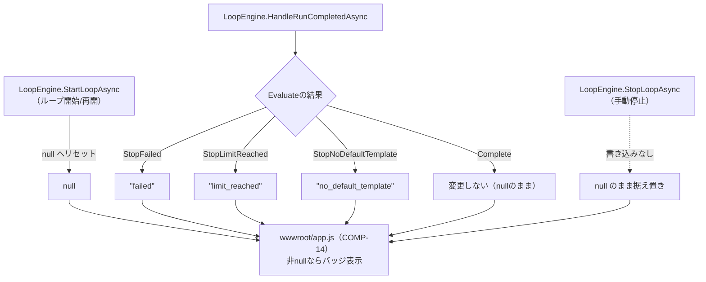

# claudeCodeGUI 関数設計書

## 0. 文書情報

| 項目 | 内容 |
|---|---|
| 版数 | 1.0 |
| 作成日 | 2026-08-25 |
| 作成者（サブエージェント） | 関数設計工程 開発サブエージェント（論理設計担当） |
| 対象範囲 | `docs/02_component_design/component_design.md` COMP-01〜17（コンポーネント設計工程完了順に、コンポーネント単位で開発→レビューサイクルを回しながら追記する） |
| 入力ドキュメント | `docs/02_component_design/component_design.md`、`docs/01_requirements/requirements.md`、`docs/traceability_matrix.md`、`src/ClaudeCodeGui/` 実装コード |

## 1. 設計方針

- 各関数の入出力仕様は、そのままテストケース設計に転用できる粒度で記載する（CLAUDE.md品質方針）。具体的には、シグネチャ（引数・戻り値の型）、事前条件、事後条件・戻り値の意味、代表的な境界値・分岐条件を明記する。
- 副作用（ファイルI/O・DI経由のストアアクセス等）とロジック（純粋関数）を分離する方針を踏襲する（`component_design.md`の既存パターン、および`ArtifactService.ResolveWithinRoot`が体現するパターンに準拠）。純粋関数には「純粋関数（ストア等への副作用なし、単体テスト対象）」の注記を付け、副作用を伴う関数とは節を分けて記載する。
- 各関数には対応するコンポーネントID（COMP-xx）を明記し、コンポーネント設計書3節の当該コンポーネント節との整合性を保つ。コンポーネント設計書側で既に確定しているシグネチャ・判定順序・境界値（例: COMP-08の`Evaluate`判定順序、オフバイワン修正、ロック解放方針）はそのまま踏襲し、関数設計工程で内容を変更しない（変更が必要と判断した場合はレビュー指摘として扱う）。
- 各COMP-xxごとに「## 2.N COMP-xx ...」の節を立て、コンポーネント設計工程完了順（COMP-01から）に並べる。1コンポーネント＝1つの開発→レビューサイクルとして追記していく（`waterfall-dev-workflow`スキル自律ループモード運用）。
- 振る舞いを持たないデータ構造（モデルクラスの単純なプロパティ追加等）で独立した関数が不要と判断した場合は、その旨と根拠を明記し、当該プロパティを読み書きする利用側コンポーネントの関数設計にその責務を委譲する。
- ID対応関係の一次情報源は`docs/traceability_matrix.md`とする。本書では各コンポーネント節の末尾に簡潔な対応ID一覧のみを記載し、非自明な対応関係のみ個別に理由を補足する。

## 2. コンポーネント別 関数設計

### 2.1 COMP-01 `Issue` モデル拡張

**対象ファイル**: `src/ClaudeCodeGui/Models/Issue.cs`

**関数設計の要否についての判断**: `Issue`はコンポーネント設計書3.1節で「振る舞いを持たないデータ構造」と位置づけられており、実装上もパブリックな自動実装プロパティ（`{ get; set; }`）のみを持つPOCOである。バリデーションや正規化などIssue自身が担うべきロジックは要件・設計のいずれにも存在しない（`TargetProjectPath`の範囲チェックはCOMP-07`TargetPathValidator`、テンプレート既定の一意性はCOMP-03`PromptTemplateDefaultResolver`が担い、いずれも`Issue`自身のメソッドにはしない設計）。既存3プロパティ（`Id`, `CreatedAt`, `UpdatedAt`）もコンストラクタ既定値の代入のみで、ファクトリメソッドや検証メソッドは実装されていない。

以上より、**本コンポーネントには独立した関数はなく、プロパティの読み書きは各利用コンポーネント（COMP-08, COMP-11, COMP-14等）の関数設計側で規定する**。以下は、その委譲関係を明確にするための「プロパティ×読み書き元」対応表である（`component_design.md`表の型・既定値・意味をそのまま転記するのではなく、関数設計書としてどの関数が読み書きするかの観点に変換したもの）。

#### 追加プロパティと読み書き元

| プロパティ | 型 / 既定値 | 書き込み元（副作用を伴う関数） | 読み取り元 |
|---|---|---|---|
| `LoopEnabled` | `bool` / `false` | ①`LoopEngine.StartLoopAsync`（COMP-08、`true`に設定） ②`LoopEngine.StopLoopAsync`（COMP-08、`false`に戻す。REQ-19の中止流用） ③`LoopEngine.HandleRunCompletedAsync`（COMP-08、`Evaluate`が`StopFailed`/`StopLimitReached`/`StopNoDefaultTemplate`/`Complete`を返した場合に`false`へ戻す） ④Issue編集フォーム経由で`Program.cs`の`PUT /api/issues/{id}`ハンドラ（COMP-11）が直接更新する経路もある | `LoopEngine.Evaluate`（COMP-08、純粋関数。判定①で`issue.LoopEnabled == false`なら`Ignore`） `wwwroot/app.js`（COMP-14、ボタン活性状態の表示切り替え） |
| `DefaultPermissionMode` | `string` / `"acceptEdits"` | Issue編集フォーム経由で`PUT /api/issues/{id}`ハンドラ（COMP-11）が更新する。 値は`wwwroot/app.js`の`#e-default-permission-mode`セレクト（COMP-14）が生成する | `LoopEngine.StartLoopAsync`（COMP-08、次Run起動時のパーミッションモード引数として`ClaudeRunEngine.StartAsync`へ渡す） |
| `LoopConsecutiveRunCount` | `int` / `0` | ①`LoopEngine.StartLoopAsync`（COMP-08、ループ開始時に`1`へリセット） ②`LoopEngine.HandleRunCompletedAsync`（COMP-08、`Evaluate`が`Advance`を返すたびにインクリメント） | `LoopEngine.Evaluate`（COMP-08、純粋関数。判定⑤`issue.LoopConsecutiveRunCount > maxConsecutiveRuns`で参照。比較演算子は`>`であって`>=`ではない点に注意。コンポーネント設計書3.3節COMP-08「設計時に発見したオフバイワン」参照） |
| `LoopStopReason` | `string?` / `null` | ①`LoopEngine.StartLoopAsync`（COMP-08、ループ開始/再開時に`null`へリセット。詳細は下記「`LoopStopReason`の書き込み経路（補足）」を参照） ②`LoopEngine.HandleRunCompletedAsync`（COMP-08、`Evaluate`の結果に応じて停止理由文字列を設定。詳細は下記参照） ③**手動停止（`LoopEngine.StopLoopAsync`）ではこのプロパティを一切書き込まない**（＝`null`のまま据え置く設計。3.1節「設計判断」を踏襲） | `wwwroot/app.js`（COMP-14、`issue.loopStopReason`が非nullならIssue詳細画面ヘッダおよびIssue一覧行に「ループ停止中（要確認）」バッジを表示。値ごとの日本語文言マッピングはCOMP-14側で規定） |

##### `LoopStopReason`の書き込み経路（補足）

上表①②の書き込み条件は分岐が複雑なため、詳細を以下に補足する。

- `LoopEngine.StartLoopAsync`（COMP-08）: ループ開始/再開時に`LoopEnabled`・`LoopConsecutiveRunCount`とあわせて`null`へリセットする。コンポーネント設計書3.3節COMP-08のクラス定義コメント「直後からtry/finallyで囲んだ区間内でLoopEnabled/LoopConsecutiveRunCount/LoopStopReasonを初期化し」を参照。前回の停止理由が再開後も残らないようにする経路である。
- `LoopEngine.HandleRunCompletedAsync`（COMP-08）: `Evaluate`の結果に応じて`"failed"`｜`"limit_reached"`｜`"no_default_template"`のいずれかを設定する。`Complete`時は変更しない（＝`null`のまま）。
- `LoopEngine.StopLoopAsync`（手動停止、COMP-08）: このプロパティを一切書き込まない（＝`null`のまま据え置く設計。3.1節「設計判断」を踏襲）。

#### 競合状態対策との対応関係（関数設計上の確認事項）

3.1節が言及する「手動中止時の`LoopStopReason`競合状態」は、コンポーネント設計書3.3節COMP-08で対策が確定済み（`Evaluate`の判定順序に`completedRun.Status == "canceled" → Ignore`を独立分岐として追加、および`LoopEngine`のIssue単位ロック`SemaphoreSlim`による`StartLoopAsync`/`StopLoopAsync`/`HandleRunCompletedAsync`の排他）。本コンポーネント（`Issue`モデル自体）側での追加対応は不要であることを確認した。`Issue`はデータ保持のみを担い、到達順序に依存しない判定ロジックはCOMP-08の`Evaluate`（純粋関数）に閉じているため、モデル定義自体には変更を要しない。

#### 補助関数の要否

初期化用ファクトリメソッド・バリデーションメソッドについても検討したが、以下の理由により追加不要と判断した。

##### 理由1: 初期化の単純さ

4プロパティはいずれも単純な既定値（`false`/`"acceptEdits"`/`0`/`null`）で足り、既存3プロパティ同様プロパティ初期化子で完結する。相互に依存する初期化順序や複合的な不変条件（invariant）が存在しない。

##### 理由2: `DefaultPermissionMode`の妥当性検証について

`DefaultPermissionMode`が既知の値（`"acceptEdits"`等、CON-04が現状維持するプルダウンの選択肢）かどうかの妥当性検証について確認したところ、`component_design.md`の以下いずれの節にも、この値を検証する処理は存在しないことが分かった。

- COMP-05節: `ClaudeRunEngine.StartAsync`は`permissionMode`を単なる`string`引数として受け取り、検証なしにそのまま使用する
- COMP-08節: `LoopEngine.StartLoopAsync`は`issue.DefaultPermissionMode`を検証せずそのまま`ClaudeRunEngine.StartAsync`へ渡す
- COMP-11節: `PUT /api/issues/{id}`ハンドラも`DefaultPermissionMode`を検証なしでそのまま保存する

*経緯*: 本節の初版では「モデル自身に持たせるとロジック層と表現層の分離方針に反する」としてCOMP-05/COMP-08側の責務と記述していたが、関数設計（論理）レビューラウンド1の重大指摘により、実際にはCOMP-05/COMP-08のどちらの節にもそのような検証処理が規定されていない＝根拠のない記述だったことが判明した。

*結論*: `DefaultPermissionMode`の妥当性検証は、`Issue`モデル自身はもちろん、システムのどこにも現時点では実装されていない（設計上の欠落）。ただし`component_design.md`は本工程の上流で確定済みの文書であり、本関数設計工程からその記載内容を書き換えることはできない。

*今後の対応（申し送り）*: この欠落への対応は、`Issue`モデル自身に持たせず、値を実際に使用する側（`ClaudeRunEngine.StartAsync`寄りならCOMP-05、`LoopEngine.StartLoopAsync`寄りならCOMP-08、または`PUT /api/issues/{id}`ハンドラ寄りならCOMP-11）の関数設計時に、新規のバリデーション関数を追加するかどうかを含めて確定する。本節（COMP-01）ではこれ以上の判断は行わず、後続のCOMP-05/COMP-08/COMP-11関数設計時に検証関数の要否を確定する旨を申し送る。

対応ID: REQ-14, REQ-17, REQ-18, REQ-20

### 2.2 COMP-02 `Run` モデル拡張

**対象ファイル**: `src/ClaudeCodeGui/Models/Run.cs`

**関数設計の要否についての判断**: `Run`はコンポーネント設計書3.1節でCOMP-01（`Issue`）と同様「振る舞いを持たないデータ構造」の追加として位置づけられている（3.1節COMP-02の記載は責務・プロパティ表のみで、独立したメソッド・関数は一切定義されていない）。実装上も既存の`Run`（`src/ClaudeCodeGui/Models/Run.cs`）は`Id`/`IssueId`/`TemplateId`/`Stage`/`PermissionMode`/`Status`/`ExitCode`/`ResultSummary`/`IsError`/`StartedAt`/`FinishedAt`の11プロパティすべてが自動実装プロパティ（`{ get; set; }`）またはプロパティ初期化子のみで構成されており、ファクトリメソッド・バリデーションメソッドの類は存在しない。追加される`IsMock`・`TriggeredByLoop`もいずれも単純な`bool`（既定値`false`）であり、相互依存や複合的な不変条件（invariant）を持たない。

以上より、**本コンポーネントには独立した関数はなく、プロパティの読み書きは各利用コンポーネント（COMP-05, COMP-08）の関数設計側で規定する**。以下は、その委譲関係を明確にするための「プロパティ×読み書き元」対応表である（COMP-01と同じ形式）。

#### 追加プロパティと読み書き元

| プロパティ | 型 / 既定値 | 書き込み元（副作用を伴う関数） | 読み取り元 |
|---|---|---|---|
| `IsMock` | `bool` / `false` | `ClaudeRunEngine.StartAsync`（COMP-05）。`MockRunGenerator.ShouldUseMock(configMockMode, cliPath)`（COMP-06、純粋関数）の判定結果を、Run生成後・保存前に`Run.IsMock`へ設定する（コンポーネント設計書3.3節COMP-05「処理フロー」手順3「Run.IsMock・TriggeredByLoopを設定して保存」を参照） | `wwwroot/app.js`の`renderRunHistory`（既存関数、Run一覧表示。REQ-03）。ただし下記「`IsMock`表示先の割り当てに関する確認事項」を参照 |
| `TriggeredByLoop` | `bool` / `false` | `ClaudeRunEngine.StartAsync`（COMP-05）。呼び出し元が渡す`triggeredByLoop`引数（既定`false`）をそのまま`Run.TriggeredByLoop`へ設定する。手動「実行」ボタン経由（COMP-11 `POST /api/issues/{issueId}/runs`ハンドラ）は引数を指定しないため常に`false`（REQ-21）。ループ由来の起動のうち、`LoopEngine.HandleRunCompletedAsync`のAdvance分岐は`triggeredByLoop: true`を明示的に渡す（component_design.md 4.1節のシーケンス図に明示的根拠あり）。`LoopEngine.StartLoopAsync`（最初のRunを起動する経路）についても同様に`triggeredByLoop: true`を渡す必要があると判断したが、こちらはシーケンス図に明示的記載はなく、COMP-08「連続実行回数の数え方」節の記述〈`StartLoopAsync`が最初のRunを起動する時点で`LoopConsecutiveRunCount=1`とする〉と整合するには`TriggeredByLoop=true`を渡す必要がある、という間接的根拠による（`LoopConsecutiveRunCount`は`TriggeredByLoop=true`のRun数の上限としてカウントされるため） | `LoopEngine.Evaluate`（COMP-08、純粋関数）。判定①`completedRun.TriggeredByLoop == false`で`Ignore`（手動実行はループ継続のトリガーにしない＝REQ-21） |

##### `IsMock`表示先の割り当てに関する確認事項

REQ-03は「Run**一覧・詳細表示**でモック実行を区別できるようにする」ことを求めている（requirements.md REQ-03、およびarchitecture-overview.md 4.1節#8「履歴上の区別」も同旨）。この「一覧」「詳細表示」の2箇所それぞれについて、`wwwroot/app.js`を確認し、担当する既存関数・箇所を特定した上で帰属先コンポーネントの有無を検討する。

###### 一覧側（`renderRunHistory`）

`renderRunHistory`（既存関数、`wwwroot/app.js`。Issue詳細画面の「実行履歴」テーブル`#run-history-body`を描画する）が一覧表示を担う。component_design.md 3.5節（COMP-12〜16、いずれも`wwwroot/app.js`/`styles.css`が対象）を確認したところ、`renderRunHistory`へ`IsMock`表示列・バッジを追加する改修は、COMP-12（SSE自動再接続・実行中Run検出）、COMP-13（排他制御拒否時のUX誘導）、COMP-14（自律ループ操作UI）、COMP-15（GUI配置の改善。対応範囲はREQ-04・REQ-05に限定する旨が明記されている）、COMP-16（テンプレート既定フラグ編集UI）のいずれの責務にも該当しない。

*結論*: `renderRunHistory`への表示追加自体は、Run一覧行のテンプレート文字列に`r.isMock`を参照する記述を足す程度の軽微な改修であり、新規の関数・ロジックを要しない。ただしREQ-03のUI表示部分を担うコンポーネントがcomponent_design.md上に明示的に存在しないことを確認した（COMP-01の関数設計レビューラウンド1で発覚した`DefaultPermissionMode`妥当性検証の帰属先欠落と同種の、上流ドキュメントの記載欠落）。

###### 詳細表示側（実行ログビュー `#run-log` ／ `appendLogLine`・`connectRunStream`）

`wwwroot/app.js`を確認したところ、Run一覧のテーブル行には過去Runの詳細を開くクリックハンドラ等は実装されておらず、Run単位の詳細な内容（`type:"system"`/`type:"assistant"`/`type:"result"`の各行）を表示する画面要素は、`#run-log`（`renderIssueDetail`が生成する`
`）のみである。この`#run-log`への描画は、SSEで届いた1行を整形して追記する`appendLogLine`（既存関数）と、それを呼び出す既存の`startRun`が担っている。

component_design.md 3.5節COMP-12は、この`startRun`のEventSource接続部分を`connectRunStream(issueId, runId)`という新設関数へ切り出すリファクタリングを規定している（「既存の`startRun`は、Run開始APIの成功後に`connectRunStream(issue.id, run.id)`を呼ぶ形へリファクタリングする」）。すなわち実装工程後は、`#run-log`への描画は`appendLogLine`と`connectRunStream`（およびその呼び出し元`startRun`、実行中Run自動検出時は`selectIssue`）が担う設計である。

しかし、COMP-12の`connectRunStream(issueId, runId)`は引数に`issueId`と`runId`のみを取り、`Run`オブジェクト（`isMock`を含む）を受け取らない設計になっている。呼び出し元の`startRun`はRun開始APIのレスポンスとして`isMock`を含む`Run`オブジェクトを既に取得しているため情報自体は呼び出し元に存在するが、component_design.md 3.5節（COMP-12〜16）のいずれの記載にも、`appendLogLine`・`connectRunStream`・`startRun`に`IsMock`をログビューへ反映させる処理は含まれていない。実行中Run自動検出（`selectIssue`が`runs.find(r => r.status === "running")`から`connectRunStream`を呼ぶ経路）についても同様に、検出した`runningRun.isMock`を表示へ反映する記述はない。すなわち一覧側と同種の帰属先欠落が詳細表示側にも存在することを確認した。

*結論*: 詳細表示側についても、一覧側と同じくREQ-03のUI表示部分を担うコンポーネントがcomponent_design.md上に明示的に存在しない。表示追加自体は、Runの`isMock`が真の場合に`appendLogLine`呼び出しの前後で`[mock] モック実行です`等の1行をログビューへ追記する、または`#run-log`付近にバッジを1つ表示する程度の軽微な改修であり、新規の関数・ロジックを要しない。

*結論（component_design.mdの扱い）*: component_design.mdは本工程の上流で確定済みの文書であり、本関数設計工程からその記載内容（新規コンポーネントの追加やCOMP-12〜16の責務範囲変更）を書き換えることはできない。

*今後の対応（申し送り）*: 実装工程で`renderRunHistory`（一覧側）・`appendLogLine`/`connectRunStream`/`startRun`（詳細表示側）を改修する際、これらの表示追加をCOMP-12（Run一覧描画・ログビュー描画のいずれにも最も近い既存改修コンポーネント）の実装範囲に含めるか、独立した軽微な改修として扱うかを実装時点で確定する。本節（COMP-02）ではこれ以上の判断は行わない。

#### 補助関数の要否

初期化用ファクトリメソッド・バリデーションメソッドについても検討したが、以下の理由により追加不要と判断した。

##### 理由1: 初期化の単純さ

追加2プロパティはいずれも単純な既定値（`false`）で足り、既存11プロパティ同様プロパティ初期化子で完結する。相互に依存する初期化順序や複合的な不変条件（invariant）が存在しない。

##### 理由2: 値の妥当性検証について

`IsMock`・`TriggeredByLoop`はいずれも`bool`型であり、C#の型システム自体が取りうる値を`true`/`false`の2値に制約するため、`DefaultPermissionMode`（`string`、COMP-01参照）のような追加の妥当性検証（既知の文字列集合に含まれるかのチェック）は原理的に不要である。COMP-01で発覚したような「検証ロジックの帰属先が上流ドキュメントに存在しない」という欠落は、本コンポーネントの追加プロパティ自体には該当しない（上記の表示先の帰属先欠落とは別種の論点である）。

対応ID: REQ-03, REQ-21
