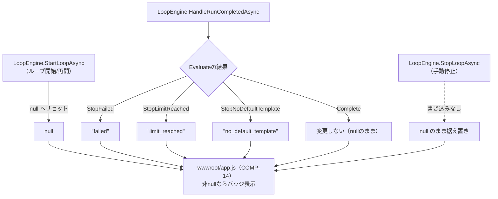
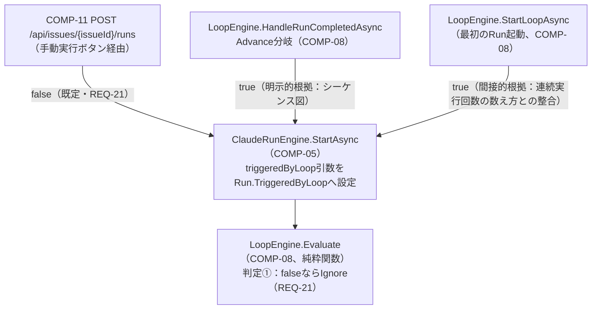
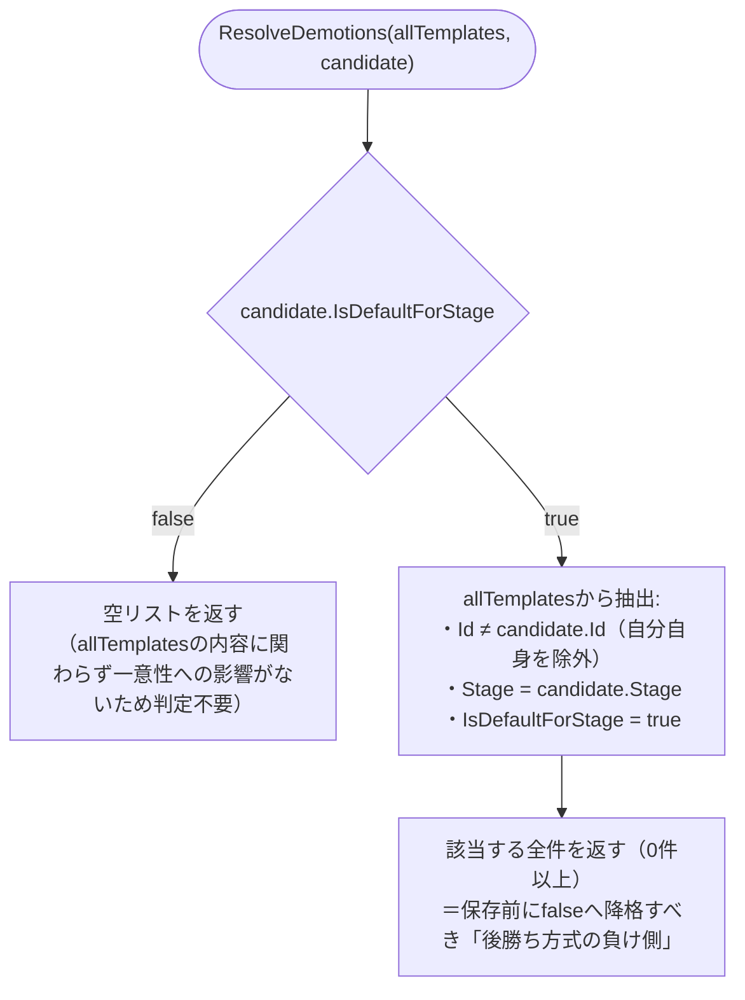
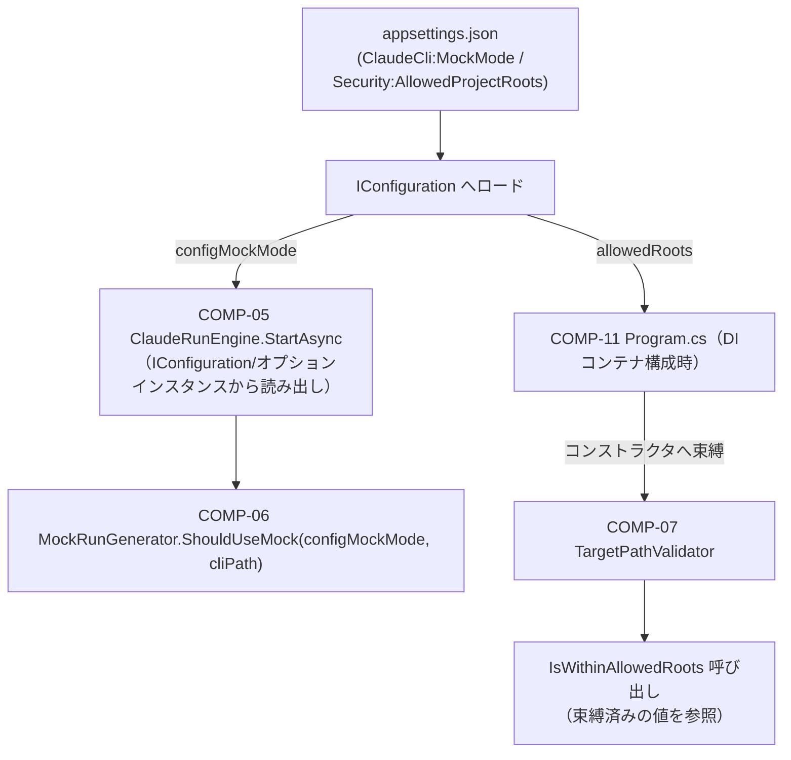
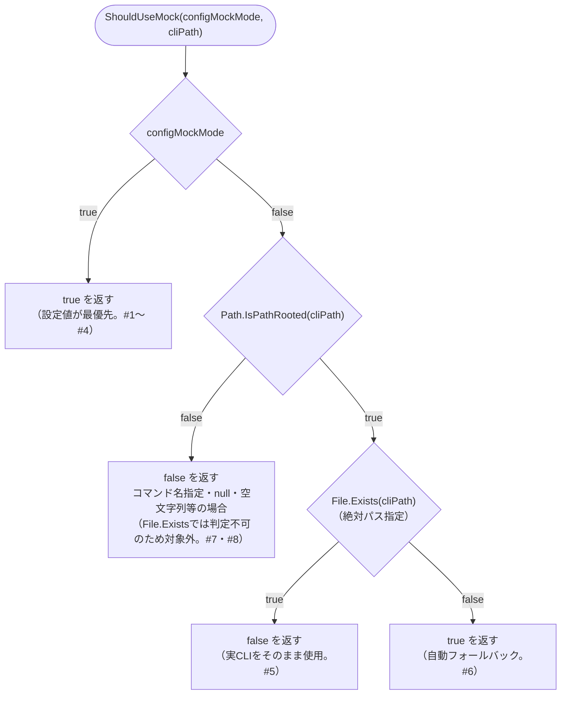

# claudeCodeGUI 関数設計書

## 0. 文書情報

| 項目 | 内容 |
|---|---|
| 版数 | 1.0 |
| 作成日 | 2026-08-25 |
| 作成者（サブエージェント） | 関数設計工程 開発サブエージェント（論理設計担当） |
| 対象範囲 | `docs/02_component_design/component_design.md` COMP-01〜17（コンポーネント設計工程完了順に、コンポーネント単位で開発→レビューサイクルを回しながら追記する） |
| 入力ドキュメント | `docs/02_component_design/component_design.md`、`docs/01_requirements/requirements.md`、`docs/traceability_matrix.md`、`src/ClaudeCodeGui/` 実装コード |

## 1. 設計方針

- 各関数の入出力仕様は、そのままテストケース設計に転用できる粒度で記載する（CLAUDE.md品質方針）。具体的には、シグネチャ（引数・戻り値の型）、事前条件、事後条件・戻り値の意味、代表的な境界値・分岐条件を明記する。
- 副作用（ファイルI/O・DI経由のストアアクセス等）とロジック（純粋関数）を分離する方針を踏襲する（`component_design.md`の既存パターン、および`ArtifactService.ResolveWithinRoot`が体現するパターンに準拠）。純粋関数には「純粋関数（ストア等への副作用なし、単体テスト対象）」の注記を付け、副作用を伴う関数とは節を分けて記載する。
- 各関数には対応するコンポーネントID（COMP-xx）を明記し、コンポーネント設計書3節の当該コンポーネント節との整合性を保つ。コンポーネント設計書側で既に確定しているシグネチャ・判定順序・境界値（例: COMP-08の`Evaluate`判定順序、オフバイワン修正、ロック解放方針）はそのまま踏襲し、関数設計工程で内容を変更しない（変更が必要と判断した場合はレビュー指摘として扱う）。
- 各COMP-xxごとに「## 2.N COMP-xx ...」の節を立て、コンポーネント設計工程完了順（COMP-01から）に並べる。1コンポーネント＝1つの開発→レビューサイクルとして追記していく（`waterfall-dev-workflow`スキル自律ループモード運用）。
- 振る舞いを持たないデータ構造（モデルクラスの単純なプロパティ追加等）で独立した関数が不要と判断した場合は、その旨と根拠を明記し、当該プロパティを読み書きする利用側コンポーネントの関数設計にその責務を委譲する。
- ID対応関係の一次情報源は`docs/traceability_matrix.md`とする。本書では各コンポーネント節の末尾に簡潔な対応ID一覧のみを記載し、非自明な対応関係のみ個別に理由を補足する。

## 2. コンポーネント別 関数設計

### 2.1 COMP-01 `Issue` モデル拡張

**対象ファイル**: `src/ClaudeCodeGui/Models/Issue.cs`

**関数設計の要否についての判断**: `Issue`はコンポーネント設計書3.1節で「振る舞いを持たないデータ構造」と位置づけられており、実装上もパブリックな自動実装プロパティ（`{ get; set; }`）のみを持つPOCOである。バリデーションや正規化などIssue自身が担うべきロジックは要件・設計のいずれにも存在しない（`TargetProjectPath`の範囲チェックはCOMP-07`TargetPathValidator`、テンプレート既定の一意性はCOMP-03`PromptTemplateDefaultResolver`が担い、いずれも`Issue`自身のメソッドにはしない設計）。既存3プロパティ（`Id`, `CreatedAt`, `UpdatedAt`）もコンストラクタ既定値の代入のみで、ファクトリメソッドや検証メソッドは実装されていない。

以上より、**本コンポーネントには独立した関数はなく、プロパティの読み書きは各利用コンポーネント（COMP-08, COMP-11, COMP-14等）の関数設計側で規定する**。以下は、その委譲関係を明確にするための「プロパティ×読み書き元」対応表である（`component_design.md`表の型・既定値・意味をそのまま転記するのではなく、関数設計書としてどの関数が読み書きするかの観点に変換したもの）。

#### 追加プロパティと読み書き元

| プロパティ | 型 / 既定値 | 書き込み元（副作用を伴う関数） | 読み取り元 |
|---|---|---|---|
| `LoopEnabled` | `bool` / `false` | ①`LoopEngine.StartLoopAsync`（COMP-08、`true`に設定）<br>②`LoopEngine.StopLoopAsync`（COMP-08、`false`に戻す。REQ-19の中止流用）<br>③`LoopEngine.HandleRunCompletedAsync`（COMP-08、`Evaluate`が`StopFailed`/`StopLimitReached`/`StopNoDefaultTemplate`/`Complete`を返した場合に`false`へ戻す）<br>④Issue編集フォーム経由で`Program.cs`の`PUT /api/issues/{id}`ハンドラ（COMP-11）が直接更新する経路もある | `LoopEngine.Evaluate`（COMP-08、純粋関数。判定①で`issue.LoopEnabled == false`なら`Ignore`）<br>`wwwroot/app.js`（COMP-14、ボタン活性状態の表示切り替え） |
| `DefaultPermissionMode` | `string` / `"acceptEdits"` | Issue編集フォーム経由で`PUT /api/issues/{id}`ハンドラ（COMP-11）が更新する。<br>値は`wwwroot/app.js`の`#e-default-permission-mode`セレクト（COMP-14）が生成する | `LoopEngine.StartLoopAsync`（COMP-08、次Run起動時のパーミッションモード引数として`ClaudeRunEngine.StartAsync`へ渡す） |
| `LoopConsecutiveRunCount` | `int` / `0` | ①`LoopEngine.StartLoopAsync`（COMP-08、ループ開始時に`1`へリセット）<br>②`LoopEngine.HandleRunCompletedAsync`（COMP-08、`Evaluate`が`Advance`を返すたびにインクリメント） | `LoopEngine.Evaluate`（COMP-08、純粋関数。判定⑤`issue.LoopConsecutiveRunCount > maxConsecutiveRuns`で参照。比較演算子は`>`であって`>=`ではない点に注意。コンポーネント設計書3.3節COMP-08「設計時に発見したオフバイワン」参照） |
| `LoopStopReason` | `string?` / `null` | ①`LoopEngine.StartLoopAsync`（COMP-08、ループ開始/再開時に`null`へリセット。詳細は下記「`LoopStopReason`の書き込み経路（補足）」を参照）<br>②`LoopEngine.HandleRunCompletedAsync`（COMP-08、`Evaluate`の結果に応じて停止理由文字列を設定。詳細は下記参照）<br>③**手動停止（`LoopEngine.StopLoopAsync`）ではこのプロパティを一切書き込まない**（＝`null`のまま据え置く設計。3.1節「設計判断」を踏襲） | `wwwroot/app.js`（COMP-14、`issue.loopStopReason`が非nullならIssue詳細画面ヘッダおよびIssue一覧行に「ループ停止中（要確認）」バッジを表示。値ごとの日本語文言マッピングはCOMP-14側で規定） |

##### `LoopStopReason`の書き込み経路（補足）

上表①②の書き込み条件は分岐が複雑なため、詳細を以下に補足する。

- `LoopEngine.StartLoopAsync`（COMP-08）: ループ開始/再開時に`LoopEnabled`・`LoopConsecutiveRunCount`とあわせて`null`へリセットする。コンポーネント設計書3.3節COMP-08のクラス定義コメント「直後からtry/finallyで囲んだ区間内でLoopEnabled/LoopConsecutiveRunCount/LoopStopReasonを初期化し」を参照。前回の停止理由が再開後も残らないようにする経路である。
- `LoopEngine.HandleRunCompletedAsync`（COMP-08）: `Evaluate`の結果に応じて`"failed"`｜`"limit_reached"`｜`"no_default_template"`のいずれかを設定する。`Complete`時は変更しない（＝`null`のまま）。
- `LoopEngine.StopLoopAsync`（手動停止、COMP-08）: このプロパティを一切書き込まない（＝`null`のまま据え置く設計。3.1節「設計判断」を踏襲）。



#### 競合状態対策との対応関係（関数設計上の確認事項）

3.1節が言及する「手動中止時の`LoopStopReason`競合状態」は、コンポーネント設計書3.3節COMP-08で対策が確定済み（`Evaluate`の判定順序に`completedRun.Status == "canceled" → Ignore`を独立分岐として追加、および`LoopEngine`のIssue単位ロック`SemaphoreSlim`による`StartLoopAsync`/`StopLoopAsync`/`HandleRunCompletedAsync`の排他）。本コンポーネント（`Issue`モデル自体）側での追加対応は不要であることを確認した。`Issue`はデータ保持のみを担い、到達順序に依存しない判定ロジックはCOMP-08の`Evaluate`（純粋関数）に閉じているため、モデル定義自体には変更を要しない。

#### 補助関数の要否

初期化用ファクトリメソッド・バリデーションメソッドについても検討したが、以下の理由により追加不要と判断した。

##### 理由1: 初期化の単純さ

4プロパティはいずれも単純な既定値（`false`/`"acceptEdits"`/`0`/`null`）で足り、既存3プロパティ同様プロパティ初期化子で完結する。相互に依存する初期化順序や複合的な不変条件（invariant）が存在しない。

##### 理由2: `DefaultPermissionMode`の妥当性検証について

`DefaultPermissionMode`が既知の値（`"acceptEdits"`等、CON-04が現状維持するプルダウンの選択肢）かどうかの妥当性検証について確認したところ、`component_design.md`の以下いずれの節にも、この値を検証する処理は存在しないことが分かった。

- COMP-05節: `ClaudeRunEngine.StartAsync`は`permissionMode`を単なる`string`引数として受け取り、検証なしにそのまま使用する
- COMP-08節: `LoopEngine.StartLoopAsync`は`issue.DefaultPermissionMode`を検証せずそのまま`ClaudeRunEngine.StartAsync`へ渡す
- COMP-11節: `PUT /api/issues/{id}`ハンドラも`DefaultPermissionMode`を検証なしでそのまま保存する

*経緯*: 本節の初版では「モデル自身に持たせるとロジック層と表現層の分離方針に反する」としてCOMP-05/COMP-08側の責務と記述していたが、関数設計（論理）レビューラウンド1の重大指摘により、実際にはCOMP-05/COMP-08のどちらの節にもそのような検証処理が規定されていない＝根拠のない記述だったことが判明した。

*結論*: `DefaultPermissionMode`の妥当性検証は、`Issue`モデル自身はもちろん、システムのどこにも現時点では実装されていない（設計上の欠落）。ただし`component_design.md`は本工程の上流で確定済みの文書であり、本関数設計工程からその記載内容を書き換えることはできない。

*今後の対応（申し送り）*: この欠落への対応は、`Issue`モデル自身に持たせず、値を実際に使用する側（`ClaudeRunEngine.StartAsync`寄りならCOMP-05、`LoopEngine.StartLoopAsync`寄りならCOMP-08、または`PUT /api/issues/{id}`ハンドラ寄りならCOMP-11）の関数設計時に、新規のバリデーション関数を追加するかどうかを含めて確定する。本節（COMP-01）ではこれ以上の判断は行わず、後続のCOMP-05/COMP-08/COMP-11関数設計時に検証関数の要否を確定する旨を申し送る。

対応ID: REQ-14, REQ-17, REQ-18, REQ-20

### 2.2 COMP-02 `Run` モデル拡張

**対象ファイル**: `src/ClaudeCodeGui/Models/Run.cs`

**関数設計の要否についての判断**: `Run`はコンポーネント設計書3.1節でCOMP-01（`Issue`）と同様「振る舞いを持たないデータ構造」の追加として位置づけられている（3.1節COMP-02の記載は責務・プロパティ表のみで、独立したメソッド・関数は一切定義されていない）。実装上も既存の`Run`（`src/ClaudeCodeGui/Models/Run.cs`）は`Id`/`IssueId`/`TemplateId`/`Stage`/`PermissionMode`/`Status`/`ExitCode`/`ResultSummary`/`IsError`/`StartedAt`/`FinishedAt`の11プロパティすべてが自動実装プロパティ（`{ get; set; }`）またはプロパティ初期化子のみで構成されており、ファクトリメソッド・バリデーションメソッドの類は存在しない。

追加される`IsMock`・`TriggeredByLoop`もいずれも単純な`bool`（既定値`false`）であり、相互依存や複合的な不変条件（invariant）を持たない。

以上より、**本コンポーネントには独立した関数はなく、プロパティの読み書きは各利用コンポーネント（COMP-05, COMP-08）の関数設計側で規定する**。以下は、その委譲関係を明確にするための「プロパティ×読み書き元」対応表である（COMP-01と同じ形式）。

#### 追加プロパティと読み書き元

| プロパティ | 型 / 既定値 | 書き込み元（副作用を伴う関数） | 読み取り元 |
|---|---|---|---|
| `IsMock` | `bool` / `false` | `ClaudeRunEngine.StartAsync`（COMP-05）。`MockRunGenerator.ShouldUseMock(configMockMode, cliPath)`（COMP-06、純粋関数）の判定結果を、Run生成後・保存前に`Run.IsMock`へ設定する（コンポーネント設計書3.3節COMP-05「処理フロー」手順3「Run.IsMock・TriggeredByLoopを設定して保存」を参照） | `wwwroot/app.js`の`renderRunHistory`（既存関数、Run一覧表示。REQ-03）。表示先の帰属は下記「`IsMock`表示先の割り当てに関する確認事項」を参照 |
| `TriggeredByLoop` | `bool` / `false` | `ClaudeRunEngine.StartAsync`（COMP-05）。呼び出し元が渡す`triggeredByLoop`引数（既定`false`）をそのまま`Run.TriggeredByLoop`へ設定する。呼び出し元ごとの値・根拠は下記「`TriggeredByLoop`の書き込み経路（補足）」を参照 | `LoopEngine.Evaluate`（COMP-08、純粋関数）。判定①`completedRun.TriggeredByLoop == false`で`Ignore`（手動実行はループ継続のトリガーにしない＝REQ-21） |

##### `TriggeredByLoop`の書き込み経路（補足）

上表の書き込み元は、呼び出し元によって渡す値と根拠の確度が異なるため、詳細を以下に補足する。

- 手動「実行」ボタン経由（COMP-11 `POST /api/issues/{issueId}/runs`ハンドラ）: 引数を指定しないため常に`false`（REQ-21）。
- `LoopEngine.HandleRunCompletedAsync`のAdvance分岐（COMP-08）: `triggeredByLoop: true`を明示的に渡す。component_design.md 4.1節のシーケンス図に明示的根拠あり。
- `LoopEngine.StartLoopAsync`（最初のRunを起動する経路、COMP-08）: `triggeredByLoop: true`を渡す必要があると判断したが、こちらはシーケンス図に明示的記載はなく、COMP-08「連続実行回数の数え方」節の記述〈`StartLoopAsync`が最初のRunを起動する時点で`LoopConsecutiveRunCount=1`とする〉と整合するには`TriggeredByLoop=true`を渡す必要がある、という間接的根拠による（`LoopConsecutiveRunCount`は`TriggeredByLoop=true`のRun数の上限としてカウントされるため）。



##### `IsMock`表示先の割り当てに関する確認事項

REQ-03は「Run**一覧・詳細表示**でモック実行を区別できるようにする」ことを求めている（requirements.md REQ-03、およびarchitecture-overview.md 4.1節#8「履歴上の区別」も同旨）。この「一覧」「詳細表示」の2箇所それぞれについて、`wwwroot/app.js`を確認し、担当する既存関数・箇所を特定した上で帰属先コンポーネントの有無を検討した。両者の比較は以下のとおり。

| 観点 | 一覧側（`renderRunHistory`） | 詳細表示側（`#run-log` ／ `appendLogLine`・`connectRunStream`） |
|---|---|---|
| 担当画面要素 | Issue詳細画面の「実行履歴」テーブル`#run-history-body` | `#run-log`（`renderIssueDetail`が生成するログビュー） |
| 該当関数（既存） | `renderRunHistory` | `appendLogLine`・`connectRunStream`・その呼び出し元`startRun`（実行中Run自動検出時は`selectIssue`も経路に含む） |
| component_design.md 3.5節（COMP-12〜16）上の帰属先 | いずれの節の責務にも該当しない | COMP-12が`connectRunStream(issueId, runId)`を新設する定義元だが、`isMock`をログビューへ反映する処理はいずれの節にも記載がない |
| 表示追加の規模 | `r.isMock`を参照する記述を足す程度の軽微な改修 | `isMock`が真の場合に`[mock] モック実行です`等の1行を追記する、または`#run-log`付近にバッジを1つ表示する程度の軽微な改修 |
| 実装工程での帰属候補の確度 | 「最も近い」既存改修コンポーネントを特定できない | COMP-12を「最も近い」既存改修コンポーネントとして扱うことは妥当な選択肢 |

以下、それぞれの確認経緯を補足する。

###### 一覧側（`renderRunHistory`）

`renderRunHistory`（既存関数、`wwwroot/app.js`。Issue詳細画面の「実行履歴」テーブル`#run-history-body`を描画する）が一覧表示を担う。component_design.md 3.5節（COMP-12〜16、いずれも`wwwroot/app.js`/`styles.css`が対象）を確認したところ、`renderRunHistory`へ`IsMock`表示列・バッジを追加する改修は、COMP-12（SSE自動再接続・実行中Run検出）、COMP-13（排他制御拒否時のUX誘導）、COMP-14（自律ループ操作UI）、COMP-15（GUI配置の改善。対応範囲はREQ-04・REQ-05に限定する旨が明記されている）、COMP-16（テンプレート既定フラグ編集UI）のいずれの責務にも該当しない。

*結論*: `renderRunHistory`への表示追加自体は、Run一覧行のテンプレート文字列に`r.isMock`を参照する記述を足す程度の軽微な改修であり、新規の関数・ロジックを要しない。ただしREQ-03のUI表示部分を担うコンポーネントがcomponent_design.md上に明示的に存在しないことを確認した（COMP-01の関数設計レビューラウンド1で発覚した`DefaultPermissionMode`妥当性検証の帰属先欠落と同種の、上流ドキュメントの記載欠落）。

###### 詳細表示側（実行ログビュー `#run-log` ／ `appendLogLine`・`connectRunStream`）

`wwwroot/app.js`を確認したところ、Run一覧のテーブル行には過去Runの詳細を開くクリックハンドラ等は実装されておらず、Run単位の詳細な内容（`type:"system"`/`type:"assistant"`/`type:"result"`の各行）を表示する画面要素は、`#run-log`（`renderIssueDetail`が生成する`<div id="run-log" class="log-view">`）のみである。この`#run-log`への描画は、SSEで届いた1行を整形して追記する`appendLogLine`（既存関数）と、それを呼び出す既存の`startRun`が担っている。

component_design.md 3.5節COMP-12は、この`startRun`のEventSource接続部分を`connectRunStream(issueId, runId)`という新設関数へ切り出すリファクタリングを規定している（「既存の`startRun`は、Run開始APIの成功後に`connectRunStream(issue.id, run.id)`を呼ぶ形へリファクタリングする」）。すなわち実装工程後は、`#run-log`への描画は`appendLogLine`と`connectRunStream`（およびその呼び出し元`startRun`、実行中Run自動検出時は`selectIssue`）が担う設計である。

しかし、COMP-12の`connectRunStream(issueId, runId)`は引数に`issueId`と`runId`のみを取り、`Run`オブジェクト（`isMock`を含む）を受け取らない設計になっている。呼び出し元の`startRun`はRun開始APIのレスポンスとして`isMock`を含む`Run`オブジェクトを既に取得しているため情報自体は呼び出し元に存在するが、component_design.md 3.5節（COMP-12〜16）のいずれの記載にも、`appendLogLine`・`connectRunStream`・`startRun`に`IsMock`をログビューへ反映させる処理は含まれていない。実行中Run自動検出（`selectIssue`が`runs.find(r => r.status === "running")`から`connectRunStream`を呼ぶ経路）についても同様に、検出した`runningRun.isMock`を表示へ反映する記述はない。すなわち一覧側と同種の帰属先欠落が詳細表示側にも存在することを確認した。

*結論*: 詳細表示側についても、一覧側と同じくREQ-03のUI表示部分を担うコンポーネントがcomponent_design.md上に明示的に存在しない。表示追加自体は、Runの`isMock`が真の場合に`appendLogLine`呼び出しの前後で`[mock] モック実行です`等の1行をログビューへ追記する、または`#run-log`付近にバッジを1つ表示する程度の軽微な改修であり、新規の関数・ロジックを要しない。

###### component_design.mdの扱い・今後の対応（一覧側・詳細表示側 共通）

*結論（component_design.mdの扱い）*: component_design.mdは本工程の上流で確定済みの文書であり、本関数設計工程からその記載内容（新規コンポーネントの追加やCOMP-12〜16の責務範囲変更）を書き換えることはできない。

*今後の対応（申し送り）*: 実装工程で`renderRunHistory`（一覧側）・`appendLogLine`/`connectRunStream`/`startRun`（詳細表示側）を改修する際、これらの表示追加をどのコンポーネントの実装範囲に含めるか、独立した軽微な改修として扱うかを実装時点で確定する。ただし一覧側と詳細表示側とでは、帰属先候補の根拠の強さが異なる点に注意すること。

- 詳細表示側: component_design.md 3.5節COMP-12（責務「SSE自動再接続・実行中Run検出」）は`connectRunStream(issueId, runId)`自体を新設する定義元であるため、COMP-12を「最も近い」既存改修コンポーネントとして実装範囲に含めることは妥当な選択肢である。
- 一覧側: `renderRunHistory`はCOMP-12〜16（本節上の「一覧側」で確認済みのとおり、COMP-12を含むいずれの節にも明示的に含まれない）のいずれの責務にも含まれておらず、component_design.md上に「最も近い」既存改修コンポーネントは特定できない。実装工程では、便宜上COMP-12へ含めるか、独立した軽微な改修として扱うかを別途確定する必要がある。

本節（COMP-02）ではこれ以上の判断は行わない。

#### 補助関数の要否

初期化用ファクトリメソッド・バリデーションメソッドについても検討したが、以下の理由により追加不要と判断した。

##### 理由1: 初期化の単純さ

追加2プロパティはいずれも単純な既定値（`false`）で足り、既存11プロパティ同様プロパティ初期化子で完結する。相互に依存する初期化順序や複合的な不変条件（invariant）が存在しない。

##### 理由2: 値の妥当性検証について

`IsMock`・`TriggeredByLoop`はいずれも`bool`型であり、C#の型システム自体が取りうる値を`true`/`false`の2値に制約するため、`DefaultPermissionMode`（`string`、COMP-01参照）のような追加の妥当性検証（既知の文字列集合に含まれるかのチェック）は原理的に不要である。COMP-01で発覚したような「検証ロジックの帰属先が上流ドキュメントに存在しない」という欠落は、本コンポーネントの追加プロパティ自体には該当しない（上記の表示先の帰属先欠落とは別種の論点である）。

対応ID: REQ-03, REQ-21

### 2.3 COMP-03 `PromptTemplate` モデル拡張 / `TemplateSeeder` 変更

**対象ファイル**: `src/ClaudeCodeGui/Models/PromptTemplate.cs`, `src/ClaudeCodeGui/Data/TemplateSeeder.cs`, `src/ClaudeCodeGui/Services/PromptTemplateDefaultResolver.cs`（新規）

**COMP-01/02との違い**: COMP-01（`Issue`）・COMP-02（`Run`）はいずれも「振る舞いを持たないデータ構造の追加のみ」で独立した関数が不要だったのに対し、COMP-03はモデル拡張（`PromptTemplate.IsDefaultForStage`）に加え、「Stageごとに既定は1つまで」という不変条件を担保する副作用のないロジック関数`PromptTemplateDefaultResolver.ResolveDemotions`（component_design.md 3.1節、レビューラウンド3でHTTPハンドラ内実装の選択肢を削除しロジック層へ一本化）を新規に持つ。以下、モデル拡張部分（2.3.1）とロジック関数部分（2.3.2）を分けて記載する。

#### 2.3.1 モデル拡張: `PromptTemplate.IsDefaultForStage`

**関数設計の要否についての判断**: `IsDefaultForStage`自体は`Id`/`Name`/`Stage`/`Body`等の既存4プロパティ同様、自動実装プロパティ（`{ get; set; }`）として追加するのみであり、`PromptTemplate`モデル自身にファクトリメソッド・バリデーションメソッドは不要（COMP-01/02と同じ判断根拠）。ただし、この値が満たすべき不変条件（Stageごとに唯一）の判定ロジックはモデル自身ではなく`PromptTemplateDefaultResolver`（2.3.2節）が担う設計であり、COMP-01の`DefaultPermissionMode`のように「検証ロジックの帰属先が存在しない」欠落には該当しない（component_design.md 3.1節で明示的にCOMP-03自身の責務として切り出し済み）。

##### 追加プロパティと読み書き元

| プロパティ | 型 / 既定値 | 書き込み元（副作用を伴う関数） | 読み取り元 |
|---|---|---|---|
| `IsDefaultForStage` | `bool` / `false` | ①`TemplateSeeder.SeedDefaultsAsync`（本節2.3.3、初回起動時に5件全てを`true`で作成）<br>②COMP-11 `POST /api/templates`・`PUT /api/templates/{id}`ハンドラ（リクエストDTOの値をcandidateへ設定。`true`の場合は保存前に`PromptTemplateDefaultResolver.ResolveDemotions`（2.3.2）の戻り値に基づき他テンプレートを`false`へ降格してから、candidate自身を保存する。手順はcomponent_design.md 157〜165行目のフロー図のとおり） | `PromptTemplateDefaultResolver.ResolveDemotions`（COMP-03自身、2.3.2。同一Stageの他テンプレートの現在値を判定に使う）<br>`LoopEngine.ResolveDefaultTemplate`（COMP-08、純粋関数。指定Stageで`IsDefaultForStage == true`の1件を検索する。関数設計はCOMP-08の関数設計工程で確定する）<br>`wwwroot/app.js`（COMP-16、テンプレート作成/編集フォームの「この工程の既定テンプレートにする」チェックボックスへ初期状態を反映） |

`ResolveDefaultTemplate`（COMP-08所属）は`IsDefaultForStage`の主要な読み取り元だが、関数自体の入出力仕様（シグネチャ・事前条件・事後条件・境界値）はCOMP-08の関数設計節で確定する（本節では重複記載しない。1節「設計方針」の対応ID一次情報源の方針に準拠）。

#### 2.3.2 ロジック関数: `PromptTemplateDefaultResolver.ResolveDemotions`

**責務**: 「Stageごとに既定は1つまで」という不変条件を、保存前にどのテンプレートを降格（`IsDefaultForStage = false`へ）すべきかという形で判定する。component_design.md 3.1節で確定済みのシグネチャ・コメントをそのまま踏襲し、変更しない。

```csharp
public static class PromptTemplateDefaultResolver
{
    public static IReadOnlyList<PromptTemplate> ResolveDemotions(
        IReadOnlyList<PromptTemplate> allTemplates, PromptTemplate candidate);
}
```

**純粋関数（ストア等への副作用なし、単体テスト対象、NFR-03）**。

**事前条件**:

- `allTemplates`: null不可。呼び出し元（COMP-11のPOST/PUTハンドラ）が`JsonFileStore<PromptTemplate>.GetAllAsync()`の結果をそのまま渡す。0件（空リスト）は許容する。
- `candidate`: null不可。POST時はリクエストDTOから構築した未保存の新規テンプレート（`Id`は新規採番済み、`allTemplates`にはまだ含まれない）。PUT時は更新後の値を反映したテンプレート（`Id`は`allTemplates`中の対象テンプレートと同一）。いずれの経路でも呼び出し元が`Id`・`Stage`・`IsDefaultForStage`を確定させた状態で渡す。

**事後条件・戻り値の意味**:

- `candidate.IsDefaultForStage == false`の場合、一意性への影響がないため常に空リスト（`allTemplates`の内容に関わらず判定不要。component_design.md 150行目のコメントのとおり）。
- `candidate.IsDefaultForStage == true`の場合、`allTemplates`のうち「`Id`が`candidate.Id`と異なる」かつ「`Stage`が`candidate.Stage`と等しい」かつ「`IsDefaultForStage == true`」の全件を返す（0件以上）。これらが保存前に`false`へ降格されるべき「後勝ち方式の負け側」。
- `candidate`自身は`Id`一致により判定対象から常に除外する（PUT時に`allTemplates`へ含まれる自分自身を誤って降格対象に含めない設計上必須の条件。POST時は`candidate.Id`が新規採番でありそもそも`allTemplates`中に一致するIdが存在しないため、この除外条件は実害を生まないが、POST/PUT両経路で同一ロジックを共有できるようあえて条件から外さない）。
- `allTemplates`・`candidate`いずれも変更しない（副作用なし）。新しいリストを構築して返す。
- 同一Stageに`IsDefaultForStage == true`のテンプレートが（データ不整合等により）2件以上existingですでに存在するケースでも、`candidate`以外の該当するもの全てを返す（1件のみを返す設計にはしない）。呼び出し元がこれら全てを`false`へ更新して保存すれば、結果的に不変条件（Stageごとに既定は1つまで）が自己修復される。

##### `ResolveDemotions`のアルゴリズム（補足図）

上記の事後条件をフローチャートで整理すると以下のとおり。`candidate`自身はId一致により判定対象から常に除外される点、および`candidate.IsDefaultForStage`が`true`のときのみ`allTemplates`側のフィルタリングが行われる点が要点である。



##### 代表的な境界値・分岐条件

`candidate.IsDefaultForStage`の値によって分岐が大きく二分される（`false`なら`allTemplates`の内容によらず常に空リスト、`true`なら`allTemplates`側の状態に応じて戻り値が変わる）ため、以下では値ごとに表を分けて示す（#は元の8パターンの通し番号）。

###### `candidate.IsDefaultForStage == false`の場合

| # | `allTemplates` | 期待される戻り値 |
|---|---|---|
| 2 | 空リスト | 空リスト |
| 8 | 任意 | 空リスト（`allTemplates`の内容に関わらず） |

###### `candidate.IsDefaultForStage == true`の場合

| # | `allTemplates` | 期待される戻り値 |
|---|---|---|
| 1 | 空リスト | 空リスト（対象が存在しないため） |
| 3 | 同一Stageの既存default trueがcandidate自身のみ（PUTで他に競合なし） | 空リスト（Id一致で自己除外され、他に該当なし） |
| 4 | 同一Stageに他テンプレート1件が`IsDefaultForStage=true` | その1件を含むリスト（1件） |
| 5 | 異なるStageに`IsDefaultForStage=true`のテンプレートが存在 | 空リスト（Stage不一致のため対象外） |
| 6 | 同一Stageに他テンプレートが複数あるが全て`IsDefaultForStage=false` | 空リスト（降格対象なし、`false`のテンプレートは元々対象外） |
| 7 | 同一Stageに（データ不整合により）`IsDefaultForStage=true`が2件以上存在（candidate以外） | 該当する全件（2件以上） |

**呼び出し元（COMP-11、副作用担当）との関係**: COMP-11のテンプレートPOST/PUTハンドラは、①リクエストDTOからcandidateを構築→②`GetAllAsync()`で全件取得→③`ResolveDemotions(allTemplates, candidate)`を呼ぶ→④返ってきた降格対象それぞれの`IsDefaultForStage`を`false`にして保存→⑤candidate自身を保存、という手順を踏むだけであり（component_design.md 159〜165行目のフロー図のとおり）、一意性の判定ロジック自体はハンドラ側に一切持たない。この呼び出し手順自体はcomponent_design.md側で確定済みのため、本関数設計工程では変更しない。

#### 2.3.3 既存関数の変更: `TemplateSeeder.SeedDefaultsAsync`

**対象ファイル**: `src/ClaudeCodeGui/Data/TemplateSeeder.cs`（既存ファイル）

**シグネチャ**: `public static async Task SeedDefaultsAsync(JsonFileStore<PromptTemplate> store)`（変更なし）。副作用（`store.GetAllAsync()`・`store.SaveAsync()`呼び出し）を伴うため純粋関数ではない。

**変更内容**: 初回起動時に投入する5件（`requirements`/`design`/`implementation`/`testing`/`deployment`の各Stage1件ずつ）の既定テンプレートのオブジェクト初期化子に、それぞれ`IsDefaultForStage = true`を追加する（component_design.md 169行目）。

**事前条件**: `store`は初期化済みの`JsonFileStore<PromptTemplate>`インスタンス（既存のまま変更なし）。

**事後条件**:

- 呼び出し時点で`store`が空でない場合（`existing.Count > 0`）: 何もせず即座に戻る（既存の冪等性ガードをそのまま維持。既存テンプレートの`IsDefaultForStage`は一切変更しない）。
- 呼び出し時点で`store`が空の場合: 5件のテンプレートをStageごとに1件ずつ生成し、それぞれ`IsDefaultForStage = true`を設定して`SaveAsync`する。結果として5つのStage全てに、唯一の`IsDefaultForStage = true`テンプレートが存在する状態になる（COMP-08 `LoopEngine`が起動できるための前提条件。component_design.md 169行目「既定テンプレートが1つも設定されていない状態だと自律ループが起動できないため」）。

**代表的な境界値・分岐条件**:

| # | 呼び出し時点の`store`の状態 | 結果 |
|---|---|---|
| 1 | 空（`existing.Count == 0`） | 5件seed。各Stage1件ずつ、いずれも`IsDefaultForStage = true` |
| 2 | 1件以上既存 | 早期return。既存データは一切変更しない |

**`ResolveDemotions`（2.3.2）を呼ばない理由**: seed実行時は`store`が空であることが呼び出し条件（分岐#1）であり、5件のStageは互いに異なるため、同一Stage内で複数の`IsDefaultForStage = true`が競合する状況がそもそも発生しない。したがって一意性解決ロジックを介さず直接`SaveAsync`する設計で不変条件（Stageごとに既定は1つまで）は保たれる。一意性解決が必要になるのは、seed後にCOMP-11経由でテンプレートが追加・変更される実行時経路（2.3.2「呼び出し元」参照）のみである。

対応ID: REQ-15

### 2.4 COMP-04 `appsettings.json` 拡張

**対象ファイル**: `src/ClaudeCodeGui/appsettings.json`

**関数設計の要否についての判断**: COMP-04はコンポーネント設計書3.2節で「設定値の追加のみ」と位置づけられている。追加される`ClaudeCli:MockMode`・`Security:AllowedProjectRoots`の2設定項目は、`ClaudeCli:Path`と同じくアプリ起動時の設定オブジェクトへ読み込まれるだけの単純な構成設定値であり、POCOまたはレコード型のプロパティとして定義・読み取りされる。`appsettings.json`自体には振る舞いロジックは存在しない。

本コンポーネントには独立した関数はなく、各設定値の読み取りは利用側コンポーネント（COMP-05, COMP-06, COMP-07）の関数設計側で規定する。以下は、その依存関係を明確にするための「設定値×読み取り元」対応表である（COMP-01「プロパティ×読み書き元」表と同じ形式を転用したもので、設定値を読み書きする関数を特定する）。

#### 追加設定値と読み取り元

| 設定値 | 型 | 既定値 | 意味 | 読み取り元 |
|---|---|---|---|---|
| `ClaudeCli:MockMode` | `bool` | `false` | モック実行モードの有効化（REQ-01, CON-01） | `COMP-06 MockRunGenerator.ShouldUseMock(configMockMode, cliPath)`（純粋関数。`COMP-05 ClaudeRunEngine.StartAsync`が呼び出す） |
| `Security:AllowedProjectRoots` | `string[]` | `[]`（空配列） | `TargetProjectPath`許可ルート群。空＝制限なし（REQ-06） | `AllowedProjectRoots`の値はCOMP-11のDI構成時に`TargetPathValidator`のコンストラクタへ一度だけ束縛され、以降各リクエストでの`IsAllowed(targetPath)`呼び出し時は既に束縛済みの値が参照される |

#### 補足: 構成値の読み取り箇所（実装段階で確定される詳細）

ASP.NET Core の標準設定解決（`appsettings.json` → `IConfiguration` → `IOptions<T>`）により、上記2設定値は下図の流れで読み込まれる。関数設計段階では型・意味のみを規定し、具体的な`AddOptions`/`Configure`の実装形態はCOMP-11の実装工程で確定する。



- `ClaudeCli:MockMode`: `COMP-06 MockRunGenerator.ShouldUseMock`が`bool configMockMode`引数として受け取る。値そのものは呼び出し側の`COMP-05 ClaudeRunEngine.StartAsync`が`IConfiguration`またはオプションインスタンスから読み出し、そのまま渡す。
- `Security:AllowedProjectRoots`: `COMP-07 TargetPathValidator`がコンストラクタ時にDI経由で`IReadOnlyList<string> allowedRoots`を受け取り、以後の`IsWithinAllowedRoots`呼び出しに使用する。設定値の読み込み自体はDIコンテナ側（`COMP-11 Program.cs`）が行い、本コンポーネントは受け取った値を利用するのみである。

対応ID: REQ-01, CON-01, REQ-06

### 2.5 COMP-05 `ClaudeRunEngine` 拡張

**対象ファイル**: `src/ClaudeCodeGui/Services/ClaudeRunEngine.cs`

**責務**: component_design.md 3.3節COMP-05（195〜304行目）を参照（内容は変更しない）。本節はそこで確定済みの排他制御方式（`_activeIssueRuns`・`GetOrAdd`）・モック分岐・完了通知イベント・`IsCanceled`競合修正を、関数単位の入出力仕様・境界値・分岐条件までテストケース設計に転用できる粒度で具体化する。COMP-01〜04と異なり既存クラス内の複数メソッドにまたがる変更のため、対象メソッドごとに2.5.1〜2.5.5節へ分けて記載する。

小節構成は以下のとおり。

| 小節 | 対象メソッド／要素 | 内容 |
|---|---|---|
| 2.5.1 | `StartAsync`（新シグネチャ） | Issue単位の排他制御（`_activeIssueRuns`）、ロック解放方針 |
| 2.5.2 | `ExecuteAsync`のモック分岐 | `isMock`による処理・副作用の違い |
| 2.5.3 | `CancelAsync`と`ExecuteAsync`の`finally` | `IsCanceled`をめぐる競合の解消 |
| 2.5.4 | `RunContext` | `IsCanceled`フィールドの追加 |
| 2.5.5 | `RunCompleted`イベント | Run完了通知イベントの入出力 |

#### 2.5.1 `StartAsync`（新シグネチャ）

```csharp
public async Task<RunStartResult> StartAsync(
    Issue issue, PromptTemplate template, string permissionMode, bool triggeredByLoop = false)
```

新規record: `public record RunStartResult(Run Run, string? ConflictingRunId);`

**事前条件**:

| 引数 | 制約 |
|---|---|
| `issue` | null不可。`Id`・`TargetProjectPath`が設定済みの既存`Issue` |
| `template` | null不可。`Id`・`Stage`・`Body`が設定済みの既存`PromptTemplate` |
| `permissionMode` | null不可の`string`。値の妥当性検証は行わない（既存動作維持。COMP-01「補助関数の要否」節で申し送り済みの未解決欠落であり、本節では新規のバリデーション関数を追加しない） |
| `triggeredByLoop` | 既定`false`。手動実行系（COMP-11 `POST /api/issues/{issueId}/runs`ハンドラ）は指定しない＝常に`false`（REQ-21）。`LoopEngine`（COMP-08）が`true`を指定する経路の詳細はCOMP-02関数設計2.2節「`TriggeredByLoop`の書き込み経路」参照 |

**処理の骨格**（component_design.md 228〜260行目の処理フロー・ロック解放方針をそのまま踏襲）:

1. `run = new Run { IssueId = issue.Id, TemplateId = template.Id, Stage = template.Stage, PermissionMode = permissionMode }` を構築する（`Run.Id`はプロパティ初期化子で採番済み・まだ未保存）。
2. `var prompt = BuildPrompt(template.Body, issue);` でプロンプト文字列を構築する（既存の静的メソッド、変更なし）。
3. `var winningRunId = _activeIssueRuns.GetOrAdd(issue.Id, run.Id);` を呼ぶ（Issue単位ロックのアトミックな獲得試行）。
4. `winningRunId != run.Id` なら「排他拒否系」（2.5.1-A）、`winningRunId == run.Id` なら「正常系」（2.5.1-B）へ分岐する。

##### 2.5.1-A 排他拒否系（ロック獲得失敗）の入出力

| 項目 | 内容 |
|---|---|
| 入力 | 上記1〜3の分岐条件（`winningRunId != run.Id`）が成立した状態。`winningRunId`は既に実行中の別Runの`RunId` |
| 出力 | `RunStartResult(rejectedRun, winningRunId)`。`rejectedRun`は`run`インスタンスに`Status="failed"`, `IsError=true`, `ResultSummary`に競合`RunId`（`winningRunId`）を含む文言, `FinishedAt=DateTimeOffset.UtcNow`を設定したもの（正確な文言は実装工程で確定してよい） |
| 副作用 | `rejectedRun`を`_runStore.SaveAsync`で保存する。**`_activeIssueRuns`へは一切書き込まない**（`GetOrAdd`が不成立だった時点で追加操作は発生しないため、明示的な解放処理も不要） |
| CLI起動 | 行わない |

##### 2.5.1-B 正常系（ロック獲得成功）の入出力

| 項目 | 内容 |
|---|---|
| 入力 | 上記1〜3の分岐条件（`winningRunId == run.Id`）が成立した状態 |
| 出力（対象ディレクトリ存在時） | `RunStartResult(run, null)`。`run`は`Status="running"`のまま（`ApplyResult`未実行、`ExecuteAsync`完了まで確定しない） |
| 出力（対象ディレクトリ不在時、境界値） | `RunStartResult(run, null)`。`run`は`Status="failed"`, `IsError=true`, `ResultSummary=$"対象ディレクトリが存在しません: {issue.TargetProjectPath}"`, `FinishedAt`設定済み（既存実装のメッセージ文言を維持）。**`ConflictingRunId`は`null`**（排他拒否とは無関係の失敗理由のため。REQ-12の`ConflictingRunId`は同時実行拒否時専用） |
| 副作用（対象ディレクトリ不在時） | `run`を`_runStore.SaveAsync`で保存（1回のみ） |
| 副作用（対象ディレクトリ存在時） | 下記「副作用（対象ディレクトリ存在時）の手順」のとおり、手順1〜6を順に実行する |
| ロック解放（`_activeIssueRuns`） | `backgroundStarted`が`true`になった場合は`ExecuteAsync`側の`finally`（2.5.3節）が解放を担当し、本メソッドの`finally`では何もしない。対象ディレクトリ不在等`backgroundStarted`到達前に早期returnした場合は、本メソッドの`finally`で`_activeIssueRuns.TryRemove(issue.Id, out _)`を実行する（component_design.md「ロック解放の設計方針」節参照。個別分岐ごとの解放コード追加は不要） |

###### 副作用（対象ディレクトリ存在時）の手順

上表「副作用（対象ディレクトリ存在時）」欄の詳細な処理順序は以下のとおり。

1. `MockRunGenerator.ShouldUseMock(configMockMode, _claudeCliPath)`（COMP-06）を呼び`run.IsMock`へ設定、`run.TriggeredByLoop = triggeredByLoop`を設定する。
2. その状態の`run`を`_runStore.SaveAsync`で保存する（1回のみ。component_design.md 232行目・本設計書2.2節「`IsMock`」行の「Run生成後・保存前に設定」と整合させ、`IsMock`/`TriggeredByLoop`未設定のまま`run`が永続化される中間状態を作らない）。
3. `RetentionPruner.PruneAsync(...)`（COMP-09）を呼び出す。
4. `_active[run.Id] = new RunContext(LogPathFor(run.Id))`へ登録する。
5. `_ = Task.Run(() => ExecuteAsync(run, issue, prompt, permissionMode, ctx, run.IsMock))`でバックグラウンド起動する。
6. 呼び出し成功直後に`backgroundStarted = true`を設定する。

**境界値・分岐条件**（テストケース設計への転用を想定）:

| # | 状況 | `winningRunId == run.Id`か | 対象ディレクトリ | 結果 |
|---|---|---|---|---|
| 1 | Issueへの初回・単独呼び出し | Yes | 存在 | 正常起動。`RunStartResult(run, null)`、CLI起動またはモック実行が開始される |
| 2 | Issueへの初回・単独呼び出し | Yes | 不在 | `RunStartResult(failedRun, null)`。CLI起動なし。`_activeIssueRuns`は`finally`で解放される |
| 3 | 同一Issueへ実行中に2回目の呼び出し | No | - | `RunStartResult(rejectedRun, winningRunId)`。CLI起動なし。既存の実行中Runには影響しない（REQ-12） |
| 4 | 同一Issueへほぼ同時に3件以上の呼び出しが到達 | 1件のみYes、残り全てNo | - | `GetOrAdd`はアトミックなため、勝者は必ずちょうど1件に定まる。敗者は全て#3と同じ扱い（勝者の`RunId`が共通の`winningRunId`として返る） |
| 5 | 1回目のRunが完了（成功/失敗/キャンセル問わず）した後、同一Issueへ再度呼び出し | Yes | - | `ExecuteAsync`の`finally`（2.5.3節）で既に`_activeIssueRuns`が解放済みのため、新規呼び出しは通常どおりロックを獲得できる（連続実行が阻害されない） |
| 6 | `_runStore.SaveAsync`のI/O例外・`RetentionPruner.PruneAsync`内の例外等、正常系のtry区間内で発生した予期しない例外 | Yes（区間には入った） | - | `backgroundStarted=false`のまま`finally`に到達し`_activeIssueRuns`を解放した上で、例外はそのまま呼び出し元へ再送出される（`catch`を設けない設計。component_design.md 258行目） |

#### 2.5.2 `ExecuteAsync`のモック分岐

```csharp
private async Task ExecuteAsync(
    Run run, Issue issue, string prompt, string permissionMode, RunContext ctx, bool isMock)
```

`isMock`は`StartAsync`側で既に確定済みの`run.IsMock`の値をそのまま渡す（`ShouldUseMock`の再計算はしない）。`MockRunGenerator.GenerateLines`（COMP-06）呼び出しに必要なStage情報は、`template`を新たな引数として受け取らず、`run.Stage`（`StartAsync`が`Run`構築時に`template.Stage`から複写済み）を使う（値は等価であり、引数を増やさない実装上の簡略化。component_design.mdの記載内容と矛盾しない）。

**`isMock`値ごとの入出力・副作用の違い**:

| 項目 | `isMock = false`（本番） | `isMock = true`（モック） |
|---|---|---|
| プロセス起動 | 既存どおり`ProcessStartInfo`構築〜`Process.Start`〜`PumpAsync`によるstdout/stderr読み取り〜`WaitForExitAsync`（変更なし） | 行わない |
| ログ生成元 | `claude` CLIサブプロセスの実際の標準出力（stream-json形式） | `MockRunGenerator.GenerateLines(run.Stage)`（COMP-06、純粋関数）が返す3行 |
| `ctx.Append`呼び出し | stdout/stderrの各行に対し既存どおり呼ぶ | `GenerateLines`が返す各行に対し同じ経路で呼ぶ（`ctx.Append`自体はSSE配信・ログファイル追記を伴う既存実装のまま） |
| `lastResultLine`の捕捉 | 既存どおり`line.Contains("\"type\":\"result\"")`で判定 | 同一判定ロジックをモック行に対しても適用（3行中1行が`type:"result"`） |
| `exitCode` | `process.ExitCode`（実プロセスの終了コード） | `0`固定（ローカル変数、実プロセスが存在しないため） |
| `ApplyResult(run, lastResultLine, exitCode)`呼び出し | 呼ぶ（2.5.3節のキャンセル判定でガードされる点は共通） | 同様に呼ぶ（同一コードパス、REQ-02の「共通経路」要件） |
| 対象プロジェクトへの実ファイル書き込み | claude CLI経由で発生しうる | 一切発生しない（REQ-02） |
| SSE配信・`_runStore.SaveAsync`・`ctx.Complete()`・`_active`/`_activeIssueRuns`からの除去・`RunCompleted`発火 | 共通（`isMock`の値によらず同一の`finally`を通る） | 同左 |

**境界値・分岐条件**:

| # | `isMock` | 備考 |
|---|---|---|
| 1 | `false` | 既存実装の経路をそのまま維持。回帰確認の基準ケース |
| 2 | `true` | `GenerateLines`が返す行数は常に3行（COMP-06側で確定済み）。3行全てに対し`ctx.Append`を呼ぶため、SSE購読側からは本番実行と区別できない配信形式になる（REQ-02） |

#### 2.5.3 `CancelAsync`と`ExecuteAsync`の`finally`の競合解消

**背景（既存バグ）**: component_design.md 274〜280行目参照（変更しない）。`CancelAsync`が保存する`Status="canceled"`を、`ExecuteAsync`の`finally`が`ApplyResult`の判定結果（`"failed"`等）で上書きしてしまう競合。

**`CancelAsync`側の変更点**:

```csharp
public async Task<bool> CancelAsync(string runId)
{
    if (!_active.TryGetValue(runId, out var ctx) || ctx.Process is null) return false;
    try
    {
        ctx.Process.Kill(entireProcessTree: true);
        lock (ctx._lock) { ctx.IsCanceled = true; }   // 追加: Kill成功と同時にフラグを立てる
    }
    catch (InvalidOperationException)
    {
        return false; // 既に終了している。IsCanceledは立てない
    }

    var run = await _runStore.GetAsync(runId);
    if (run is not null && run.Status == "running")
    {
        run.Status = "canceled";
        run.FinishedAt = DateTimeOffset.UtcNow;
        await _runStore.SaveAsync(run);
    }
    return true;
}
```

`RunContext`は`ClaudeRunEngine`の`private`なネスト型であり、そのメンバー（`_lock`含む）は外側の型`ClaudeRunEngine`のメソッドから直接アクセス可能（C#の入れ子型アクセス規則）である。そのため`CancelAsync`・`ExecuteAsync`はいずれも`RunContext`側に新規publicメソッドを追加せず、`lock (ctx._lock) { ... }`を直接記述できる。

**`ExecuteAsync`側の変更点**: `ApplyResult`呼び出しを`ctx.IsCanceled`でガードし、`finally`で最終的な`Status`を確定する。

```csharp
private async Task ExecuteAsync(Run run, Issue issue, string prompt, string permissionMode, RunContext ctx, bool isMock)
{
    string? lastResultLine = null;
    try
    {
        int exitCode;
        // isMockに応じて exitCode / lastResultLine を決定する処理（2.5.2節）

        run.ExitCode = exitCode;

        bool canceledBeforeApply;
        lock (ctx._lock) { canceledBeforeApply = ctx.IsCanceled; }
        if (!canceledBeforeApply)
        {
            ApplyResult(run, lastResultLine, exitCode);
        }
    }
    catch (Exception ex)
    {
        run.Status = "failed";
        run.IsError = true;
        run.ResultSummary = $"実行エラー: {ex.Message}";
        ctx.Append($"[error] {ex.Message}");
    }
    finally
    {
        bool wasCanceled;
        lock (ctx._lock) { wasCanceled = ctx.IsCanceled; }
        if (wasCanceled)
        {
            run.Status = "canceled";   // ApplyResult・catch側の設定に関わらず最終的に上書き
        }
        run.FinishedAt = DateTimeOffset.UtcNow;
        await _runStore.SaveAsync(run);
        ctx.Complete();
        _active.TryRemove(run.Id, out _);
        _activeIssueRuns.TryRemove(run.IssueId, out _);
        if (RunCompleted is not null) await RunCompleted.Invoke(run);
    }
}
```

`try`区間内の判定（`canceledBeforeApply`）は「`ApplyResult`を呼ばない」（component_design.md 278行目）を実現するためのガードである。一方、`finally`区間内の判定（`wasCanceled`）は「`run.Status`を明示的に`"canceled"`へ設定してから保存する」（同280行目）を実現するための、独立した2回目の判定である。両者は同じ`ctx.IsCanceled`を`lock (ctx._lock)`越しに読むが、`catch`ブロック経由で`try`側の判定を通らずに`finally`へ到達した場合（下表#5）にも`finally`側の判定が独立して機能するよう、あえて1回にまとめず2箇所で読む設計とする。

**入出力仕様**:

| 項目 | 内容 |
|---|---|
| 入力（`IsCanceled`の観測値） | `ctx.IsCanceled`（`CancelAsync`が`lock (ctx._lock)`越しに書き込んだ値を、`ExecuteAsync`が同じロック越しに読む） |
| 出力（最終的な`run.Status`） | `IsCanceled == true`なら常に`"canceled"`。`IsCanceled == false`なら`ApplyResult`の判定結果（`"succeeded"`／`"failed"`）または`catch`ブロックが設定する`"failed"` |
| 副作用 | `_runStore.SaveAsync(run)`（`finally`内、`CancelAsync`側の`SaveAsync`とは別インスタンス・別タイミングで実行されるが、最終的な永続化結果は一致する。保存順序に依存しない。component_design.md 280〜296行目のシーケンス図参照） |

**境界値・分岐条件**:

| # | 経路 | `finally`到達時の`ctx.IsCanceled` | `ApplyResult`呼び出し | 保存される`run.Status` |
|---|---|---|---|---|
| 1 | `try`が正常完了（`exitCode=0`, `IsError=false`） | `false` | 呼ぶ | `"succeeded"` |
| 2 | `try`が正常完了（`exitCode≠0`または`IsError=true`、キャンセル以外の失敗） | `false` | 呼ぶ | `"failed"` |
| 3 | `try`が正常完了（`CancelAsync`によるKillが原因で`exitCode≠0`） | `true` | 呼ばない（ガードでスキップ） | `"canceled"`（`finally`で明示設定） |
| 4 | `catch (Exception ex)`経路（CLI起動失敗等、キャンセルと無関係の実行時エラー） | `false` | 呼ばれない（`catch`が直接`Status="failed"`を設定済み） | `"failed"` |
| 5 | `catch (Exception ex)`経路かつ`CancelAsync`がほぼ同時に`IsCanceled`を立てたレアケース | `true` | 呼ばれない | `"canceled"`（`finally`が`catch`側の`"failed"`設定を上書き） |
| 6 | `CancelAsync`が呼ばれたが対象プロセスが既に終了していた（`InvalidOperationException`） | `false`（`IsCanceled`は立てられない） | 通常どおり呼ぶ | `ApplyResult`の判定結果どおり（通常は正常終了として`"succeeded"`または`"failed"`） |

#### 2.5.4 `RunContext`への`IsCanceled`フィールド追加

| 項目 | 内容 |
|---|---|
| 型 | `bool`（自動実装プロパティ、`{ get; set; }`） |
| 初期値 | `false`（既定値。C#の`bool`既定値をそのまま使い、コンストラクタでの明示初期化は不要） |
| 書き込み元 | `ClaudeRunEngine.CancelAsync`。`ctx.Process.Kill(entireProcessTree: true)`成功直後、同じ`lock (ctx._lock)`ブロック内で`true`に設定する（2.5.3節参照）。それ以外の書き込み元はない（`false`へ戻す経路は存在しない＝Runごとに使い捨ての`RunContext`インスタンスであるため再利用時のリセットを考慮する必要がない） |
| 読み取り元 | `ClaudeRunEngine.ExecuteAsync`。`try`区間内（`ApplyResult`呼び出し直前）と`finally`区間内（最終`Status`確定直前）の2箇所、いずれも`lock (ctx._lock)`越しに読む（2.5.3節参照） |
| スレッド間可視性 | `RunContext`が既に保持する`private readonly object _lock = new();`（`_lines`/`_completed`/`_signal`の保護に既存利用）を`IsCanceled`にも流用する。新設の`volatile`修飾子・別ロックは追加しない（component_design.md 298〜300行目の方針をそのまま踏襲） |

#### 2.5.5 `RunCompleted`イベント

```csharp
public event Func<Run, Task>? RunCompleted;
```

| 項目 | 内容 |
|---|---|
| 発火タイミング | `ExecuteAsync`の`finally`内、`_runStore.SaveAsync(run)`・`ctx.Complete()`・`_active.TryRemove(run.Id, out _)`・`_activeIssueRuns.TryRemove(run.IssueId, out _)`が全て完了した直後（2.5.3節のコード例、最終行）。すなわちRunの永続化・ロック解放が全て終わった後に発火するため、購読側が`RunCompleted`ハンドラ内で当該Issueへの新規`StartAsync`を呼んでも排他制御と矛盾しない |
| 引数 | `run`（`Models.Run`、`finally`到達時点で`Status`が最終確定した後のインスタンス）。手動キャンセルされたRunであれば2.5.3節の保証により`Status == "canceled"`が確定済み |
| 戻り値 | `Task`（購読側ハンドラが非同期処理を行えるようにするための型。`ExecuteAsync`側は`RunCompleted is not null`の場合に限り`await RunCompleted.Invoke(run)`する） |
| 購読者 | `LoopEngine`（COMP-08）。`HandleRunCompletedAsync`を`ClaudeRunEngine`インスタンス生成後に`+=`で購読する想定（購読タイミング・購読解除の要否はCOMP-08側の関数設計工程で確定する。本節では`ClaudeRunEngine`が「誰が購読しているか」を一切知らない疎結合設計であることのみを規定する） |
| 未購読時の挙動 | `RunCompleted`が`null`（誰も購読していない）の場合は何もしない。COMP-08未実装の段階でも`ClaudeRunEngine`単体として動作する |
| 例外時の扱い | 購読先ハンドラが例外を投げた場合の扱いはCOMP-08側の責務とする（`ClaudeRunEngine`側で`try/catch`はしない）。`ExecuteAsync`自体は`_ = Task.Run(...)`でfire-and-forget起動されているため、ここで未処理例外が発生した場合の扱いは既存実装からの変更点ではない |

対応ID: REQ-01, REQ-02, REQ-03, REQ-10, REQ-11, REQ-12, CON-05, CON-08

### 2.6 COMP-06 `MockRunGenerator`（新規）

**対象ファイル**: `src/ClaudeCodeGui/Services/MockRunGenerator.cs`（新規）

**責務**: component_design.md 3.3節COMP-06（306〜328行目）を参照（内容は変更しない）。モック実行の要否判定（`ShouldUseMock`）と、Stage別サンプル出力の生成（`GenerateLines`）を担う、いずれも**副作用のない静的関数・純粋関数**（NFR-03、単体テスト対象）。COMP-05 `ClaudeRunEngine.StartAsync`（2.5.1節手順1）・`ExecuteAsync`（2.5.2節）が呼び出し元となる。

```csharp
public static class MockRunGenerator
{
    public static bool ShouldUseMock(bool configMockMode, string cliPath);
    public static IReadOnlyList<string> GenerateLines(string stage);
}
```

#### 2.6.1 `ShouldUseMock(bool configMockMode, string cliPath)`

**純粋関数（副作用なし、単体テスト対象、NFR-03）**。

**事前条件**:

- `configMockMode`: `appsettings.json`の`ClaudeCli:MockMode`から読み出された値（COMP-04 2.4節）。制約なし（`true`/`false`いずれも許容）。
- `cliPath`: `ClaudeRunEngine`が保持する`_claudeCliPath`（`appsettings.json`の`ClaudeCli:Path` ?? `"claude"`）。本関数自体はnull/空文字列も許容し例外を投げない（下記境界値#4・#8参照）。

**判定に用いるAPIの候補と選定**: 「`cliPath`が絶対パスかどうか」の判定には`System.IO.Path.IsPathRooted(string?)`を用いる（`null`・空文字列を渡しても例外を投げず`false`を返す、.NET標準の仕様）。代替候補として`Path.IsPathFullyQualified`も検討したが、こちらはWindows上でドライブレター必須などより厳密な判定になる。`"claude"`のようなコマンド名指定と絶対パス指定を区別するという本関数の目的に対しては`Path.IsPathRooted`で十分であり、既存実装（`ClaudeRunEngine`コンストラクタの`_claudeCliPath`既定値`"claude"`）との整合も取りやすいため、`Path.IsPathRooted`を採用する。

**事後条件・戻り値の意味**:

- `configMockMode == true`の場合、`cliPath`の値によらず常に`true`を返す（設定値が最優先。REQ-01「明示的にON/OFFできる」）。
- `configMockMode == false`の場合のみ、`cliPath`の実行可否判定に進む。
  - `Path.IsPathRooted(cliPath) == true`（絶対パス指定）かつ`File.Exists(cliPath) == false`（ファイル不在）の場合のみ`true`（自動フォールバック、REQ-01後段）。
  - `Path.IsPathRooted(cliPath) == true`かつ`File.Exists(cliPath) == true`の場合は`false`（実CLIをそのまま使用）。
  - `Path.IsPathRooted(cliPath) == false`（コマンド名指定など、PATH解決に依存する形）の場合は`File.Exists`による判定を行わず、常に`false`を返す。これは、PATH解決に依存するコマンド名指定は`File.Exists`では実行可否を判定できないため対象外とする、という制約による（component_design.md注記のとおり）。この場合の実行可否の最終判断は、`ExecuteAsync`側の実プロセス起動失敗時の`catch`節（2.5.2節、既存の例外処理経路）に委ねる。

##### `ShouldUseMock`の判定フロー（補足図）

上記の事後条件（`configMockMode`優先→絶対パス判定→ファイル存在確認、の順に評価する分岐構造）をフローチャートで整理すると以下のとおり。各終端の分岐条件・戻り値は、後述の真理値表（境界値・分岐条件）の該当パターンと対応している。



**参考実装（アルゴリズム）**:

```csharp
public static bool ShouldUseMock(bool configMockMode, string cliPath)
{
    if (configMockMode) return true;
    return Path.IsPathRooted(cliPath) && !File.Exists(cliPath);
}
```

**境界値・分岐条件（真理値表）**:

| # | `configMockMode` | `cliPath`の分類 | `Path.IsPathRooted` | `File.Exists`判定 | 戻り値 | 備考 |
|---|---|---|---|---|---|---|
| 1 | `true` | 絶対パス・実在（例: `C:\...\claude.exe`が存在） | `true` | 判定しない | `true` | 設定値が最優先 |
| 2 | `true` | 絶対パス・不在 | `true` | 判定しない | `true` | 同上 |
| 3 | `true` | コマンド名指定（例: `"claude"`） | `false` | 対象外 | `true` | 同上 |
| 4 | `true` | `null`または空文字列（境界値） | `false`（例外を投げない） | 対象外 | `true` | 同上。`configMockMode`分岐で確定するため`cliPath`の値を評価する前に返る |
| 5 | `false` | 絶対パス・実在 | `true` | `true` | `false` | 実CLIが使用可能と判定、モック不要 |
| 6 | `false` | 絶対パス・不在 | `true` | `false` | `true` | 自動フォールバック（REQ-01後段） |
| 7 | `false` | コマンド名指定（PATH解決依存） | `false` | 判定しない（対象外） | `false` | `File.Exists`で判定できないための制約。実行時にCLI起動を試み、失敗時は`ExecuteAsync`の既存`catch`節に委ねる |
| 8 | `false` | `null`または空文字列（境界値） | `false`（例外を投げない） | 判定しない | `false` | `Path.IsPathRooted(null)`/`Path.IsPathRooted("")`はいずれも`false`を返すため、#7のコマンド名指定と同じ扱いになる |

#### 2.6.2 `GenerateLines(string stage)`

**純粋関数（副作用なし、単体テスト対象、NFR-03）**。Issueの実データには一切依存しない（REQ-02）。

**事前条件**:

- `stage`: `PromptTemplate.Stage`相当の文字列。COMP-03（`TemplateSeeder.SeedDefaultsAsync`、2.3.3節）が定義する既知の5値（`"requirements"`/`"design"`/`"implementation"`/`"testing"`/`"deployment"`）を主な想定入力とするが、本関数はこれらの値による分岐処理を一切行わない（下記「`stage`引数による変化の範囲」参照）。`null`・空文字列・未知の文字列も含め、あらゆる`string`値を受け付け例外を投げない（C#の文字列補間は`null`を空文字列として展開するため、これらの値でも呼び出しが失敗しない）。

**`stage`引数による変化の範囲**: component_design.md 318行目の「Stageごとの汎用サンプル」は、既知のStage名ごとに文面を出し分ける分岐処理を要求するものではなく、**返す3行のテキスト中に`stage`の値をそのまま埋め込む**程度の違いにとどめる（COMP-06の責務は「Issueの実データに依存しない汎用サンプルであること」の担保であり、Stage名自体による細かな文面の作り込みは要件の対象外）。そのため未知のStage文字列・`null`・空文字列が渡された場合も、分岐エラーや例外は発生せず、同じ構造の3行がそのまま返る（下記境界値#4参照）。

**返す3行の正確なJSON構造**: 戻り値は要素数3の`IReadOnlyList<string>`で、各要素は改行を含まない1行のJSON文字列（stream-json形式）。`wwwroot/app.js`の`appendLogLine`（211〜230行目）が要求する必須フィールドとの対応は以下のとおり。

| # | `type` | JSON構造（例、`{stage}`は引数の値をそのまま埋め込み） | `appendLogLine`側の対応処理 |
|---|---|---|---|
| 1 | `"system"` | `{"type":"system","session_id":"mock-session-{stage}"}` | `obj.type === "system"`分岐で`obj.session_id`を`[system] session=...`として表示 |
| 2 | `"assistant"` | `{"type":"assistant","message":{"content":[{"type":"text","text":"[mock] {stage}工程のモック実行サンプル出力です。"}]}}` | `obj.type === "assistant"`分岐で`obj.message.content[].text`を収集し`[assistant] ...`として表示（`content`配列は要素数1、`text`は空文字列にしない。空にすると`appendLogLine`のフォールバック分岐＝生JSON行がそのまま表示される経路に落ちるため） |
| 3 | `"result"` | `{"type":"result","is_error":false,"result":"モック実行が完了しました（stage: {stage}）"}` | `obj.type === "result"`分岐で`obj.is_error`・`obj.result`を`[result] is_error=false ...`として表示。`ApplyResult`（COMP-05）も同一行から`is_error`・`result`を読み取る |

**`IsError`/`result`（`ApplyResult`が読み取るフィールド）の値**: モック実行は常に成功として扱う。3行目（`type:"result"`）は`is_error`を常に`false`、`result`を常に非null・非空の完了メッセージ文字列とする。COMP-05 2.5.2節の設計により、モック実行時の`exitCode`は`0`固定であるため、`ApplyResult`到達時の`run.Status`は`exitCode == 0 && !run.IsError`の判定により常に`"succeeded"`になる（`GenerateLines`側が失敗ケースを模擬する必要はない。REQ-02は成功パスの共通経路検証を目的としており、異常系のモックはCOMP-06の責務に含まれない）。

**`"type":"result"`の部分文字列一致制約**: `ExecuteAsync`（COMP-05、既存実装134行目・2.5.2節）は、モック実行時も本番実行時と同じ`line.Contains("\"type\":\"result\"")`判定で`lastResultLine`を捕捉する。この判定はキーと値の間にスペースを含まない厳密な部分文字列一致であるため、`GenerateLines`が返す3行目のJSON文字列は、`"type"`キーと`"result"`値の間に空白を含めない形（`"type":"result"`）で構成する必要がある。`System.Text.Json.JsonSerializer`の既定設定（インデントなし）はコロン後にスペースを挿入しないためこの制約を満たすが、文字列リテラルで直接組み立てる実装を選ぶ場合は、この部分文字列が崩れないよう注意する（実装工程での申し送り事項）。

**境界値・分岐条件**:

| # | `stage`の値 | 戻り値 |
|---|---|---|
| 1 | 既知のStage名（例: `"requirements"`） | 3行（system/assistant/result）。テキスト中の`{stage}`部分に`"requirements"`が埋め込まれる |
| 2 | 既知の別のStage名（例: `"deployment"`） | 同様に3行。分岐処理はなく、埋め込まれる文字列のみが異なる |
| 3 | 未知のStage文字列（例: `"unknown-stage"`、境界値） | 例外を投げず、同じ構造の3行を返す（`{stage}`部分に`"unknown-stage"`がそのまま埋め込まれる） |
| 4 | `null`または空文字列（境界値） | 例外を投げず、同じ構造の3行を返す（`{stage}`部分は空文字列として展開される） |
| 5 | 常に共通 | 戻り値の要素数は常に3、`type`の並びは常に`system`→`assistant`→`result`固定（COMP-05側が3行全てに`ctx.Append`を呼ぶ前提と整合、2.5.2節） |

対応ID: REQ-01, REQ-02

### 2.7 COMP-07 `TargetPathValidator`（新規）

**対象ファイル**: `src/ClaudeCodeGui/Services/TargetPathValidator.cs`（新規）

**責務**: component_design.md 3.3節COMP-07（330〜360行目）を参照（内容は変更しない）。`Issue.TargetProjectPath`が運用者の許可した作業用ルートフォルダ群のいずれか配下にあるかを検証する。COMP-06 `MockRunGenerator`と同様、判定ロジック本体（`IsWithinAllowedRoots`）は**副作用のない静的純粋関数**（NFR-03、単体テスト対象）とし、インスタンス側（`IsAllowed`）は構成値を束縛して渡すだけの薄いラッパーとする。

```csharp
public class TargetPathValidator
{
    public TargetPathValidator(IReadOnlyList<string> allowedRoots);
    public bool IsAllowed(string targetPath);

    // 純粋関数本体（単体テスト対象）
    public static bool IsWithinAllowedRoots(string targetPath, IReadOnlyList<string> allowedRoots);
}
```

#### 2.7.1 既存`ArtifactService.ResolveWithinRoot`の比較ロジックの確認（設計の前提）

`IsWithinAllowedRoots`の比較ロジックを設計するにあたり、まず既存実装`ArtifactService.ResolveWithinRoot`（`src/ClaudeCodeGui/Services/ArtifactService.cs` 49〜58行目）の大文字小文字・セパレータの扱いを確認した。

```csharp
private static string ResolveWithinRoot(string rootPath, string relativePath)
{
    var root = Path.GetFullPath(rootPath);
    var combined = Path.GetFullPath(Path.Combine(root, relativePath ?? ""));
    if (combined != root && !combined.StartsWith(root + Path.DirectorySeparatorChar, StringComparison.OrdinalIgnoreCase))
    {
        throw new UnauthorizedAccessException("対象プロジェクトディレクトリの外にはアクセスできません。");
    }
    return combined;
}
```

**確認事項（重要な発見）**: この既存コードは、ルート自身に一致するかの判定（`combined != root`）が**大文字小文字を区別する既定の`!=`演算子（`Ordinal`相当）**であるのに対し、配下判定（`StartsWith`）は明示的に`StringComparison.OrdinalIgnoreCase`を指定しており、**同一メソッド内で大文字小文字の扱いが不統一**になっている。

- 既存`ResolveWithinRoot`でこの不統一が実害を生まない理由: `combined`は`root`自身を`Path.Combine`の第1引数に使って構築されるため、`combined`の`root`部分の文字列（大文字小文字を含む）は常に`root`と同一になる。したがって`relativePath`が`""`または`"."`等でルート自身を指す場合、`combined`と`root`は常に同一の大文字小文字で一致し、`!=`判定でも問題が生じない。
- **`TargetPathValidator`ではこの前提が成り立たない**: `IsWithinAllowedRoots`が比較する`targetPath`と`allowedRoots`の各要素は、一方から他方を`Path.Combine`で構築したものではなく、**独立に入力される2つの文字列**である（`targetPath`はIssue登録時に運用者が入力した`TargetProjectPath`、`allowedRoots`は`appsettings.json`の`Security:AllowedProjectRoots`）。そのため、同じフォルダを指していても大文字小文字表記が一致しない組み合わせ（例: 許可ルート`C:\Projects`、対象パス`C:\projects`）が現実に起こり得る。

**結論（大文字小文字の扱い）**: `IsWithinAllowedRoots`では、ルート自身に一致する場合の判定・配下判定の**両方**に`StringComparison.OrdinalIgnoreCase`を用いる。既存`ResolveWithinRoot`の実装をそのまま模倣するのではなく、上記の不統一を引き継がない（本PCで過去に発生したWindowsの大文字小文字非区別によるフォルダ衝突事故を踏まえ、NFR-01の趣旨＝意図しないフォルダへのアクセス防止に照らして、大文字小文字の違いだけで許可判定が変わることは避けるべきと判断した）。Windowsの既定ファイルシステム（NTFS）・SMB共有はいずれも大文字小文字を区別しないため、`OrdinalIgnoreCase`の採用はファイルシステムの実際の挙動とも整合する。

#### 2.7.2 `IsWithinAllowedRoots(string targetPath, IReadOnlyList<string> allowedRoots)`

**純粋関数（副作用なし、単体テスト対象、NFR-03）**。

**事前条件**:

- `targetPath`: `Issue.TargetProjectPath`相当の文字列。null不可（呼び出し元がnullを渡す経路はない）。空文字列・ホワイトスペースのみの文字列・不正な文字を含む文字列の場合、`Path.GetFullPath`が`ArgumentException`を送出する（例外を投げずプロセスのカレントディレクトリを返すわけではない）。本関数はこれを捕捉しない（呼び出し元がこの例外を処理する前提とする）。この場合の扱いは下記境界値#11参照。
- `allowedRoots`: `appsettings.json`の`Security:AllowedProjectRoots`から読み出された値（COMP-04 2.4節）。null不可（呼び出し元は空配列`[]`を既定値として渡す）。要素が絶対パスであることを前提とするが、本関数自体は相対パス文字列が混入していても例外を投げない（`Path.GetFullPath`が呼び出し元プロセスのカレントディレクトリを基準に解決するため。運用者の設定ミスに対する追加の入力検証は行わない）。ただし要素が空文字列・ホワイトスペースのみ・不正な文字を含む文字列の場合は、`targetPath`と同様にループ内の`Path.GetFullPath(root)`で`ArgumentException`を送出する。
- **例外契約（まとめ）**: 本関数は`targetPath`・`allowedRoots`の要素が不正な文字列（空文字列・ホワイトスペースのみ・Windowsで使用できない文字を含む場合等）であった場合に`Path.GetFullPath`由来の`ArgumentException`を送出しうる。本関数自身はこれを捕捉・変換しないため、呼び出し元（COMP-11）が例外処理の要否を実装工程で判断する。

**判定ロジック（正規化・比較）**:

1. `allowedRoots.Count == 0`の場合、常に`true`を返す（制限なし。component_design.md 345行目、COMP-04の設計判断）。この分岐が最優先であり、`targetPath`の正規化すら行わない。
2. `allowedRoots.Count > 0`の場合、以下を各要素について判定し、いずれか1つでも条件を満たせば`true`を返す（1件も満たさなければ`false`）。
   - `normalizedTarget = Path.TrimEndingDirectorySeparator(Path.GetFullPath(targetPath))`
   - 各`root`について`normalizedRoot = Path.TrimEndingDirectorySeparator(Path.GetFullPath(root))`
   - `string.Equals(normalizedTarget, normalizedRoot, StringComparison.OrdinalIgnoreCase)`（許可ルート自身に一致する場合）、または
   - `normalizedTarget.StartsWith(normalizedRoot + Path.DirectorySeparatorChar, StringComparison.OrdinalIgnoreCase)`（許可ルート配下にある場合）

**`Path.TrimEndingDirectorySeparator`を用いる理由（セパレータの扱い）**: `allowedRoots`は運用者が`appsettings.json`に手入力する値であるため、末尾にセパレータが付く表記（例: `C:\Projects\`）・付かない表記（例: `C:\Projects`）の両方が入力され得る。`Path.GetFullPath`だけでは末尾セパレータの有無が保持されてしまい（`GetFullPath("C:\\Projects\\")`は末尾の`\`を保持する）、素朴に`root + Path.DirectorySeparatorChar`を組み立てると`C:\Projects\\`のような二重セパレータになり配下判定が常に失敗する不具合を生む。.NET標準の`Path.TrimEndingDirectorySeparator`は、末尾セパレータを除去しつつドライブルート（`C:\`）はそのまま維持する（除去すると`C:`という非ルートの相対パス表記になってしまうことを防ぐ）ため、`targetPath`・`allowedRoots`双方に一律で適用することで、入力表記の揺れを吸収する。`targetPath`側も同様に末尾セパレータが付いている可能性があるため、同じ処理を適用する。

**`../`を含む相対パス表記の扱い**: `targetPath`に`C:\Projects\..\Other`のような表記が含まれる場合も、`Path.GetFullPath`が`..`セグメントを解決してから比較するため（例: `C:\Other`に正規化）、意図せず許可ルート配下と誤判定されることはない。これは`ArtifactService.ResolveWithinRoot`が`../`によるディレクトリトラバーサルを防ぐのと同じ`Path.GetFullPath`の性質を利用している。

**相対パスの`targetPath`が渡された場合の限界（申し送り）**: `targetPath`自体が絶対パスでなく相対パス表記だった場合、`Path.GetFullPath`はASP.NET Coreプロセスのカレントディレクトリを基準に解決するため、結果はプロセスの起動条件に依存し呼び出しごとに一定しない可能性がある。`TargetPathValidator`自体はこれを検知・拒否しない（`allowedRoots`が空でない限り、解決結果が偶然いずれかのルート配下に一致しなければ`false`となり結果的に拒否されるが、意図した「相対パス表記そのものを拒否する」動作ではない）。この限界はcomponent_design.md 358行目が言及する「NFR-01への対応」の限界（`bypassPermissions`実行中のCLIプロセス自体のアクセス制御はしない）とは別種の限界であり、実装工程で`docs/architecture-overview.md`「7. 既知の制約」節へ追記する際にあわせて記載することを申し送る。

##### アルゴリズム（参考実装）

```csharp
public static bool IsWithinAllowedRoots(string targetPath, IReadOnlyList<string> allowedRoots)
{
    if (allowedRoots.Count == 0) return true;

    var normalizedTarget = Path.TrimEndingDirectorySeparator(Path.GetFullPath(targetPath));
    foreach (var root in allowedRoots)
    {
        var normalizedRoot = Path.TrimEndingDirectorySeparator(Path.GetFullPath(root));
        if (string.Equals(normalizedTarget, normalizedRoot, StringComparison.OrdinalIgnoreCase))
            return true;
        if (normalizedTarget.StartsWith(normalizedRoot + Path.DirectorySeparatorChar, StringComparison.OrdinalIgnoreCase))
            return true;
    }
    return false;
}
```

##### 境界値・分岐条件

| # | `allowedRoots` | `targetPath` | 判定の要点 | 戻り値 |
|---|---|---|---|---|
| 1 | 空配列 | 任意（例: `C:\Anything`） | 分岐1が最優先、正規化すら行わない | `true` |
| 2 | `["C:\Projects"]` | `C:\Projects`（許可ルート自身、完全一致） | `Equals`分岐で一致 | `true` |
| 3 | `["C:\Projects"]` | `C:\Projects\foo`（配下） | `StartsWith("C:\Projects\\")`分岐で一致 | `true` |
| 4 | `["C:\Projects\"]`（末尾セパレータあり） | `C:\Projects\foo` | `TrimEndingDirectorySeparator`により`allowedRoots`が#3と同じ`C:\Projects`に正規化される | `true` |
| 5 | `["C:\Projects"]` | `C:\Projects2\foo`（兄弟フォルダ、前方一致するが配下ではない、境界値） | `Equals`不一致。`StartsWith("C:\Projects\\")`も「`C:\Projects2`の12文字目が`\`ではなく`2`」のため不一致 | `false` |
| 6 | `["C:\Projects"]` | `C:\projects\foo`（大文字小文字が異なる） | `OrdinalIgnoreCase`により`3`と同一視される | `true` |
| 7 | `["C:\Projects"]` | `C:\Projects\..\Other`（`..`を含む表記） | `Path.GetFullPath`が`C:\Other`に正規化してから判定するため、実際には許可ルート外と判定される | `false` |
| 8 | `["C:\Projects"]` | `C:\Projects\sub\..`（配下から`..`で許可ルート自身へ戻る表記） | `Path.GetFullPath`が`C:\Projects`に正規化し、`Equals`分岐で一致 | `true` |
| 9 | `["C:\Projects", "D:\Work"]`（複数ルート） | `D:\Work\foo` | 1件目`Equals`/`StartsWith`とも不一致→2件目で`StartsWith`一致 | `true` |
| 10 | `["\\\\server\\share"]`（UNCパス） | `\\server\share\foo` | UNCパスも`Path.GetFullPath`・`StartsWith`の対象として同様に扱える（SMB共有も大文字小文字非区別のため`OrdinalIgnoreCase`と整合） | `true` |
| 11 | `["C:\Projects"]` | `""`（空文字列、境界値） | `Path.GetFullPath("")`は`ArgumentException`を送出する（`false`は返らない）。本関数はこれを捕捉しないため、呼び出し元に例外が伝播する | 例外（`ArgumentException`） |

#### 2.7.3 `IsAllowed(string targetPath)`

**薄いラッパー（副作用なし。コンストラクタで束縛した`allowedRoots`をそのまま`IsWithinAllowedRoots`へ渡すのみ）**。

```csharp
public class TargetPathValidator
{
    private readonly IReadOnlyList<string> _allowedRoots;

    public TargetPathValidator(IReadOnlyList<string> allowedRoots)
    {
        _allowedRoots = allowedRoots;
    }

    public bool IsAllowed(string targetPath) => IsWithinAllowedRoots(targetPath, _allowedRoots);
}
```

**事前条件**: `targetPath`は`IsWithinAllowedRoots`と同一（2.7.2節参照）。コンストラクタ引数`allowedRoots`はDIコンテナ構成時（COMP-11、Program.cs）に`appsettings.json`の`Security:AllowedProjectRoots`から一度だけ束縛される（component_design.md 2.4節「補足: 構成値の読み取り箇所」のシーケンスのとおり）。

**事後条件・戻り値の意味**: `IsWithinAllowedRoots(targetPath, _allowedRoots)`の戻り値をそのまま返す。本メソッド自身は正規化・比較ロジックを一切持たない（ロジックの二重実装を避け、単体テストは静的関数`IsWithinAllowedRoots`側に集約する。`IsAllowed`自体のテストは「コンストラクタに渡した値がそのまま静的関数へ渡ること」の確認に留める）。

**境界値・分岐条件**: 2.7.2節の境界値表がそのまま適用される（`allowedRoots`をコンストラクタ引数`allowedRoots`に読み替える）。`IsAllowed`固有の追加の境界値はない。

#### 2.7.4 呼び出し元との関係（COMP-11への依存関係の記載に留める）

`TargetPathValidator.IsAllowed`は、Issue作成・更新エンドポイント（`Program.cs`の`POST /api/issues`・`PUT /api/issues/{id}`ハンドラ、COMP-11）から呼び出される想定である。現状（本節作成時点）の`Program.cs`（28〜61行目）を確認したところ、両ハンドラはリクエストDTO（`CreateIssueRequest`/`UpdateIssueRequest`）が持つ`TargetProjectPath`を検証なしにそのまま`Issue.TargetProjectPath`へ設定しており、`TargetPathValidator`は未組み込みである。

- `TargetPathValidator`自体のDI登録（`builder.Services.AddSingleton<TargetPathValidator>(...)`等、コンストラクタへ`Security:AllowedProjectRoots`の値をどう束縛するか）、および`IsAllowed`が`false`を返した場合のHTTPレスポンス（例: `400 Bad Request`）の具体的な実装は、COMP-11自身の関数設計・実装工程で確定する。本節ではCOMP-07がCOMP-11から呼ばれるという依存関係の記載に留め、COMP-11の実装詳細には踏み込まない（1節「設計方針」の対応ID一次情報源の方針、およびCOMP-03 2.3.1節末尾の記載方針に準拠）。

対応ID: REQ-06, NFR-01
