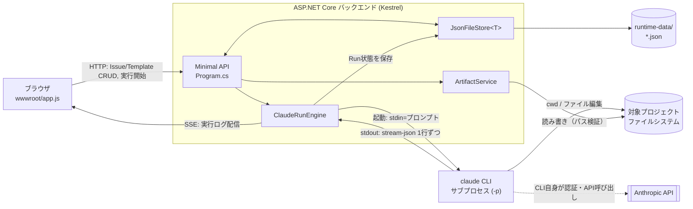

# claudeCodeGUI 設計概要

> **Snapshot** — 2026-08-16時点、コミット `bb4a6e2`（headless質問止まり対策）までの内容を反映しています。
> プロトタイプの全体像を、コードを読む前に把握するための資料です。「今こうなっている」の説明であり、確定した仕様書ではありません。実装が進むと古くなるので、最新の挙動は必ずコードとREADMEで確認してください。

## 目次

1. [全体像](#1-全体像)
2. [レイヤ構成](#2-レイヤ構成)
3. [「工程実行」の流れ](#3-工程実行の流れ)
4. [主な設計判断](#4-主な設計判断)（[4.1 モック実行モード](#41-モック実行モード要件確定未実装)を含む）
5. [ASP.NET Coreの考え方（補足）](#5-aspnet-coreの考え方補足)
6. [claude CLIを外部から使う仕組み（補足）](#6-claude-cliを外部から使う仕組み補足)
7. [既知の制約](#7-既知の制約)

## 1. 全体像

ブラウザ・ASP.NET Coreバックエンド・claude CLIサブプロセス・対象プロジェクトのファイルシステム、この4者がどう繋がっているかが本アプリの骨格です。

ブラウザはHTTPとSSEの2経路でバックエンドとやり取りする。バックエンドは自身のデータ(`runtime-data/`)、claude CLIサブプロセス、対象プロジェクトのファイルシステムという3つの外部と接続点を持つ。

図中の各箱に対応する主なコード:

| 図の箱 | 対応するコード |
|---|---|
| Minimal API | `Program.cs:27-186` |
| ClaudeRunEngine | `Services/ClaudeRunEngine.cs` |
| ArtifactService | `Services/ArtifactService.cs` |
| JsonFileStore\<T\> | `Data/JsonFileStore.cs` |
| claude CLI（サブプロセス） | `Services/ClaudeRunEngine.cs:75-116`（起動〜終了処理） |

## 2. レイヤ構成

フォルダ構成がほぼそのまま責務分担になっています。

| フォルダ | 責務 | 対応するコード |
|---|---|---|
| `Models/` | データの形（`Issue`・`PromptTemplate`・`Run`）を定義するだけの入れ物。振る舞いは持たない。 | `Models/Issue.cs`・`Models/PromptTemplate.cs`・`Models/Run.cs`（各ファイル全体） |
| `Data/` | `JsonFileStore<T>`（1レコード=1JSONファイルの永続化）と、初回起動時に既定テンプレートを流し込む`TemplateSeeder`。 | `Data/JsonFileStore.cs:9-71`、`Data/TemplateSeeder.cs` |
| `Services/` | `ClaudeRunEngine`（claude CLIのサブプロセス管理・ログ配信）と`ArtifactService`（対象プロジェクトのファイル閲覧・編集、パス検証）。アプリのロジックの中心。 | `Services/ClaudeRunEngine.cs`、`Services/ArtifactService.cs` |
| `Program.cs` | Minimal APIのエンドポイント定義。HTTPリクエストを受けて、上記のサービス／ストアを呼び出すだけの薄い層。 | `Program.cs:27-186` |
| `wwwroot/` | フロントエンド一式（`index.html`・`app.js`・`styles.css`）。ビルドなしでそのまま配信される素のJavaScript。 | `wwwroot/app.js`（全体） |

## 3. 「工程実行」の流れ

最も複雑なのは、実行ボタンを押してからログが流れ終わるまでです。時系列で追うと以下のようになります。

1. **ブラウザが`POST /api/issues/{id}/runs`を送信**
   テンプレートIDとパーミッションモードを渡す。`Program.cs`がIssueとテンプレートを取得し、`ClaudeRunEngine.StartAsync`を呼ぶ。
   → `Program.cs:108-120`

2. **`Run`レコードを作成し、即座にIDを返す**
   実行完了を待たずに`202 Accepted`で応答する。実際の処理は`Task.Run`でバックグラウンドに切り離される（ブラウザを待たせない）。
   → `Services/ClaudeRunEngine.cs:36-65`（レコード作成は38-44行目、切り離しは62行目`_ = Task.Run(...)`）

3. **claude CLIをサブプロセスとして起動**
   作業ディレクトリ=対象プロジェクトパス。プロンプトは標準入力(stdin)経由で渡し、`--output-format stream-json`で1行1JSONの出力を受け取る設定にする。
   → `Services/ClaudeRunEngine.cs:75-103`（`ProcessStartInfo`の組み立ては75-92行目、stdin書き込みは102-103行目）

4. **標準出力を1行読むたびに、ログファイルへ追記しつつ配信キューへ流す**
   ブラウザ側は`GET /api/runs/{id}/stream`（SSE）を購読しており、新しい行が来るたびにそのまま届く。
   → 出力の読み取りは`Services/ClaudeRunEngine.cs:105-110`（`PumpAsync`呼び出し）と156-162行目（`PumpAsync`本体）。ログ追記とキューへの配信は`RunContext.Append`（227-237行目）。SSE配信側は`Program.cs:128-137`と`ClaudeRunEngine.cs:188-210`（`StreamLogAsync`）・248-284行目（`TailAsync`）。

5. **プロセス終了後、終了コードと最終行(`type:"result"`)を見て`Run.Status`を確定**
   `succeeded`／`failed`を判定し、結果を`runtime-data/runs/`に保存する。
   → 終了処理は`Services/ClaudeRunEngine.cs:112-131`、判定ロジックは`ApplyResult`（134-154行目）、保存は`Data/JsonFileStore.cs:46-63`（`SaveAsync`）。

## 4. 主な設計判断

いずれも「個人のローカル用ツール」という前提のもとで、単純さを優先して決めたものです。

| 論点 | 選択 | 理由 | 対応するコード |
|---|---|---|---|
| Issue管理の範囲 | ツール内で完結（GitHub Issue等とは非連携） | 外部サービス連携の実装コストをかけず、まず動くものを優先 | `Models/Issue.cs`（外部IDを持たない自己完結な構造） |
| 成果物の保存先 | 対象プロジェクトのリポジトリ内に直接生成 | waterfall-dev-workflowスキルの規約に合わせ、成果物がそのままGit管理下に残るようにする | `Services/ArtifactService.cs:49-58`（`issue.TargetProjectPath`配下に限定して読み書き） |
| 本ツール自体のデータ | ファイルベースJSON（`JsonFileStore`） | 単一ユーザー・ローカル利用なのでDBサーバーは過剰 | `Data/JsonFileStore.cs:9-71` |
| claude CLIの実行方式 | 非同期起動 + SSEでログ配信 | 工程実行は数十秒〜数分かかるため、ブラウザをブロックしない | `Program.cs:118-119`（`202 Accepted`）、`Services/ClaudeRunEngine.cs:62`（`Task.Run`） |
| headless実行が質問してしまう問題 | `--append-system-prompt`で「質問せず前提を置いて進める」と常時指示 | headlessは対話不可のため、質問された時点で実質的に手詰まりになるのを防ぐ | `Services/ClaudeRunEngine.cs:16-19`（指示文の定義）、91-92行目（起動引数への追加） |

### 4.1 モック実行モード（要件確定・未実装）

claude CLIが無い/未認証の環境でも本ツールの動作を見せられるようにするための要件。2026-08-24に要件のみ確定。実装は別途着手する。

| # | 論点 | 決定内容 |
|---|---|---|
| 1 | 目的 | (a) claude CLI未導入/未認証の第三者へのデモ・配布用、(b) 自分の開発中に実際のAPI呼び出しを避けるための開発用モック。両方を満たす |
| 2 | 有効化方法 | `appsettings.json`に`ClaudeCli:MockMode`(bool)を追加し明示的にON/OFF可能にする。加えて、設定済みCLIパスが実行不可（ファイル不在等）と判定された場合は`MockMode`の値によらず自動的にモック実行へフォールバックする |
| 3 | UIトグル | 追加しない。Run単位の切替はせず、アプリ全体の挙動として`appsettings.json`のみで統一する |
| 4 | モック内容 | Issueの実データ（title/description等）に依存しない、工程（Stage: `requirements`/`design`/`implementation`/`testing`/`deployment`）ごとの汎用サンプルテキストを都度組み立てる |
| 5 | 配信方式 | 即座に全行を返す（意図的な遅延なし）。SSE配信・`Run`状態遷移（`running`→`succeeded`）の経路は本番実行と共通のまま通す |
| 6 | 出力フォーマット | 実際のstream-json行のうち、フロントエンド（`wwwroot/app.js`の`appendLogLine`）が解釈する3種類を再現する：`type:"system"`（`session_id`を持つinit行）・`type:"assistant"`（`message.content[].text`にサンプルテキスト）・`type:"result"`（`is_error`/`result`）。既存の`ApplyResult`（`Services/ClaudeRunEngine.cs:134-154`、最終行の`type:"result"`パースで`Run.Status`を確定）をそのまま流用できる形にする |
| 7 | ファイル書き込み | 対象プロジェクト（`issue.TargetProjectPath`）への実ファイル生成は一切行わない。ログ出力のみ |
| 8 | 履歴上の区別 | `Models/Run.cs`に`IsMock`(bool)フラグを追加し、Run一覧・詳細表示でモック実行だと分かるようにする |

## 5. ASP.NET Coreの考え方（補足）

ASP.NET Core独特の言い回しだけ、一般的なWeb開発の感覚に翻訳しておきます。

### Minimal API — 「コントローラークラス」を作らない流儀

よくあるWebフレームワークでは「ルーティング定義」と「処理本体」が別クラスに分かれますが、Minimal APIは`Program.cs`に`app.MapGet("/api/issues", ...)`のように直接書き並べます。エンドポイントの数だけラムダ式が並ぶイメージです。

> **近い感覚**: PythonのFlaskで`@app.route("/api/issues")`と書くのや、Node.js/Expressで`app.get("/api/issues", ...)`と書くのとほぼ同じ発想です。
>
> **コード上の該当箇所**: `Program.cs:27-186`。例えば`app.MapGet("/api/issues", ...)`は`Program.cs:30-31`。

### 依存性注入 (DI) — 引数を書くだけで必要なものが渡ってくる

各エンドポイントのラムダ式は`(string id, JsonFileStore<Issue> store) => ...`のように、必要なオブジェクトを引数として書くだけで受け取れます。`Program.cs`冒頭の`builder.Services.AddSingleton(...)`で「このクラスが要求されたらこのインスタンスを渡す」と登録しておくと、フレームワークが自動的に解決してくれる仕組みです。

> **近い感覚**: テストコードでモックを差し込む「依存性の注入」と同じ考え方が、アプリ本体の配線にも使われている、というだけです。
>
> **コード上の該当箇所**: 登録は`Program.cs:10-15`。受け取り側の例は`Program.cs:30`の`JsonFileStore<Issue> store`引数（`ClaudeRunEngine`自体も`Services/ClaudeRunEngine.cs:26-32`のコンストラクタ引数でIConfiguration等を受け取っている）。

### Kestrel と wwwroot

Kestrelは.NETに内蔵のHTTPサーバー本体（`dotnet run`で立ち上がる実体）。`wwwroot/`配下に置いたHTML/CSS/JSは、ビルドや変換を挟まずそのまま配信されます。フロントエンドは普通の静的サイトとして書いているだけで、React/Vue等のビルドの仕組みは一切登場しません。

> **コード上の該当箇所**: ホスト自体の起動は`Program.cs:5`の`WebApplication.CreateBuilder(args)`〜`Program.cs:187`の`app.Run()`。静的ファイル配信の有効化は`Program.cs:24-25`（`UseDefaultFiles()`・`UseStaticFiles()`）。

## 6. claude CLIを外部から使う仕組み（補足）

### 「サブプロセスとして起動する」とは

ターミナルで自分が`claude -p "質問"`と打つのと原理的には同じことを、C#の`Process`クラスがプログラムから代わりに行っています。標準入力・標準出力をプログラム側に繋ぎ替え（リダイレクト）ることで、キーボードとターミナル画面の代わりに、コードが直接やり取りできるようにしています。

> **近い感覚**: シェルスクリプトで`echo "prompt" | claude -p`とパイプで繋ぐのと同じことを、C#の`ProcessStartInfo`（`RedirectStandardInput/Output`）でやっています。
>
> **コード上の該当箇所**: `Services/ClaudeRunEngine.cs:75-92`（`ProcessStartInfo`の設定と`-p`等の起動引数）。

### プロンプトを引数ではなく標準入力で渡す理由

コマンドライン引数には長さの上限や特殊文字のエスケープの問題があるため、長文になりがちなプロンプトは標準入力（stdin）経由で渡す方が安全です。

> **コード上の該当箇所**: `Services/ClaudeRunEngine.cs:102-103`（`process.StandardInput.WriteAsync(prompt)`）。プロンプト自体の組み立ては`BuildPrompt`（67-71行目、テンプレート内の`{{issue.title}}`等を置換）。

### stream-json出力と、なぜSSEを重ねているか

`--output-format stream-json`を指定すると、処理の進行に合わせて1行1つのJSONが逐次出力されます。これをそのままターミナルに流せば人間が読めますが、本アプリではブラウザで見せたいので、受け取った行をSSE（Server-Sent Events）というHTTPの仕組みでブラウザに転送し直しています。二段構えになっているのはそのためです。

> **コード上の該当箇所**: 出力の読み取りと最終行(`type:"result"`)の捕捉は`Services/ClaudeRunEngine.cs:105-109`。JSONの解析は`ApplyResult`（134-154行目）。SSEとして書き出す側は`Program.cs:128-137`（`ctx.Response.WriteAsync($"data: {line}\n\n", ...)`）。ブラウザ側の受信は`wwwroot/app.js`の`new EventSource(...)`。

### 認証について

本アプリはAPIキー等の認証情報を一切扱いません。ローカルにインストール・ログイン済みの`claude` CLIをそのまま呼び出しているだけなので、認証は完全にCLI側の責任範囲です（`appsettings.json`で指定しているのは実行ファイルのパスのみ）。

> **コード上の該当箇所**: `Services/ClaudeRunEngine.cs:28`（`config["ClaudeCli:Path"]`）と`appsettings.json`の`ClaudeCli:Path`設定。

## 7. 既知の制約

プロトタイプとして意図的に省いている部分です。次に触るときに驚かないための一覧。

- **SSEの自動再接続なし** — 接続が途切れるとログ表示は止まる。ページ再読み込みで復旧が必要。
- **同時実行の排他制御なし** — 同じIssueに対して複数の工程実行を同時に走らせると、対象プロジェクトへの書き込みが競合する可能性がある。
- **「質問しない」対策は万能ではない** — headlessが止まる問題は緩和したが、Issueの説明が薄いと、その分だけ仮定（＝品質のばらつき）が増える。
- **自律ループモード未実装** — README記載の将来構想。工程完了後の自動継続実行はまだない。
- **自動テスト未整備** — プロトタイプ段階のため、動作確認は毎回手動で実施している。
- **単一ユーザー・ローカル専用が前提** — 認証機構やマルチユーザー対応は設計に含まれていない。

---

操作手順は [`docs/guide.html`](./guide.html)、最新状況はリポジトリの [`README.md`](../README.md) を参照してください。
