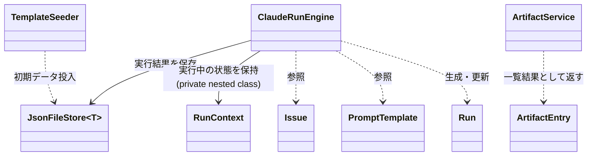

# claudeCodeGUI クラス・関数設計書（暫定）

> **Snapshot** — 2026-08-17時点、コミット `4f62f0f` までの内容を反映しています。
> [`architecture-overview.md`](./architecture-overview.md)（全体の流れ・設計判断）を読んだ後、「あの処理はどのファイルの何行目か」を探すための**逆引き用リファレンス**です。プロトタイプ段階のため実装が進むと古くなります。行番号がずれていたら該当クラス名・メソッド名で検索してください。

## 目次

1. [クラス一覧（俯瞰図）](#1-クラス一覧俯瞰図)
2. [Models — データの入れ物](#2-models--データの入れ物)
3. [Data — 永続化](#3-data--永続化)
4. [Services — アプリのロジック中心](#4-services--アプリのロジック中心)
5. [Program.cs — APIエンドポイント一覧](#5-programcs--apiエンドポイント一覧)
6. [wwwroot/app.js — フロントエンド関数一覧](#6-wwwrootappjs--フロントエンド関数一覧)
7. [逆引きインデックス「〜したいときはここを見る」](#7-逆引きインデックスしたいときはここを見る)

---

## 1. クラス一覧（俯瞰図）

`ClaudeRunEngine`と`ArtifactService`が「重要な処理」のほぼ全てを持っています。`Models/`は振る舞いを持たないデータ構造、`Program.cs`はこれらを呼び出すだけの薄い層です。

---

## 2. Models — データの入れ物

いずれもプロパティのみ・ロジックなし。`Program.cs`のリクエストDTOとほぼ1:1対応します。

### `Issue`（`Models/Issue.cs`）

| プロパティ | 型 | 既定値 | 意味 |
|---|---|---|---|
| `Id` | string | GUID | 主キー |
| `Title` / `Description` | string | "" | Issueの内容 |
| `TargetProjectPath` | string | "" | 対象プロジェクトの絶対パス。`ArtifactService`と`ClaudeRunEngine`のアクセス範囲の起点 |
| `CurrentStage` | string | `"requirements"` | 5工程のうちどこにいるか（`requirements`/`design`/`implementation`/`testing`/`deployment`） |
| `Status` | string | `"open"` | `open` \| `in_progress` \| `done` |
| `CreatedAt` / `UpdatedAt` | DateTimeOffset | UTC now | — |

### `PromptTemplate`（`Models/PromptTemplate.cs`）

| プロパティ | 型 | 意味 |
|---|---|---|
| `Id` | string | 主キー |
| `Name` | string | 一覧表示用の名前 |
| `Stage` | string | どの工程用のテンプレートか（`Issue.CurrentStage`と同じ値域） |
| `Body` | string | プロンプト本文。`{{issue.title}}`等のプレースホルダを含む（置換は`ClaudeRunEngine.BuildPrompt`） |

### `Run`（`Models/Run.cs`）

| プロパティ | 型 | 意味 |
|---|---|---|
| `Id` | string | 主キー |
| `IssueId` / `TemplateId` / `Stage` | string | どのIssue・テンプレートに対する実行か |
| `PermissionMode` | string | `acceptEdits` \| `bypassPermissions` \| `plan`（CLIにそのまま渡す） |
| `Status` | string | `running` → `succeeded`/`failed`/`canceled` |
| `ExitCode` | int? | プロセス終了コード |
| `ResultSummary` | string? | stream-jsonの最終行(`type:"result"`)から抽出した要約 |
| `IsError` | bool | 同上、`is_error`フィールド |
| `StartedAt` / `FinishedAt` | DateTimeOffset(?) | — |

---

## 3. Data — 永続化

### `JsonFileStore<T>`（`Data/JsonFileStore.cs`）

1レコード=1JSONファイル。`Issue`・`PromptTemplate`・`Run`それぞれ専用のインスタンスがDIコンテナにSingleton登録されている（`Program.cs:10-12`）。

| メソッド | 行 | シグネチャ | 処理内容 |
|---|---|---|---|
| コンストラクタ | 17-22 | `JsonFileStore(string dataRoot, string collectionName, Func<T,string> getId)` | `{dataRoot}/{collectionName}/`ディレクトリを作成。`getId`はレコードからファイル名(=ID)を取り出す関数 |
| `GetAllAsync` | 26-36 | `Task<List<T>>` | ディレクトリ内の全`*.json`を読み込んでデシリアライズ |
| `GetAsync` | 38-44 | `Task<T?> GetAsync(string id)` | 1件取得。ファイルが無ければ`default`（=null） |
| `SaveAsync` | 46-63 | `Task SaveAsync(T item)` | **`.tmp`に書いてから`File.Move(overwrite:true)`**（原子的な書き換え）。書き込み中は`SemaphoreSlim(1,1)`で直列化 |
| `DeleteAsync` | 65-70 | `Task DeleteAsync(string id)` | ファイル削除（存在しなくてもエラーにしない） |

> 探すときのヒント: 「保存が壊れないか」「同時書き込みは大丈夫か」はここ（46-63行目）を見れば分かります。

### `TemplateSeeder`（`Data/TemplateSeeder.cs`）

| メソッド | 行 | 処理内容 |
|---|---|---|
| `SeedDefaultsAsync` | 7-25 | `PromptTemplate`ストアが空の場合のみ、5工程分の既定テンプレートを投入。起動時に`Program.cs:19-22`から一度だけ呼ばれる |

---

## 4. Services — アプリのロジック中心

### `ClaudeRunEngine`（`Services/ClaudeRunEngine.cs`）

**責務**: claude CLIをサブプロセスとして起動し、標準出力をログファイル＋SSE購読者へリアルタイム配信する。**最も複雑で、最も重要な処理はここに集中しています。**

#### フィールド

| 名前 | 行 | 意味 |
|---|---|---|
| `HeadlessGuidance` | 16-19 | `--append-system-prompt`に付与する固定文言。「質問せず前提を置いて進める」指示（[既知の対策](./architecture-overview.md#4-主な設計判断)） |
| `_claudeCliPath` | 21 | `appsettings.json`の`ClaudeCli:Path` |
| `_active` | 24 | `ConcurrentDictionary<runId, RunContext>`。**実行中のRunだけがここに存在**する（完了すると`ExecuteAsync`の`finally`で除去される） |

#### メソッド

| メソッド | 行 | シグネチャ | 処理内容 |
|---|---|---|---|
| コンストラクタ | 26-32 | `ClaudeRunEngine(IConfiguration, string dataRoot, JsonFileStore<Run>)` | CLIパス・ログ出力先(`{dataRoot}/run-logs/`)の決定 |
| `StartAsync` | 36-65 | `Task<Run> StartAsync(Issue, PromptTemplate, string permissionMode)` | **エントリポイント**。①対象ディレクトリの存在チェック（無ければ即`failed`で返す, 46-54行目）②`Run`レコード作成・保存 ③`RunContext`を`_active`に登録 ④`Task.Run`で`ExecuteAsync`をバックグラウンド起動して**待たずに返る**（62行目） |
| `BuildPrompt` | 67-71 | `static string BuildPrompt(string templateBody, Issue issue)` | `{{issue.title}}`等4種のプレースホルダを`Issue`の値で置換。**プロンプト組み立ての唯一の場所** |
| `ExecuteAsync` | 73-132 | `Task ExecuteAsync(Run, Issue, string prompt, string permissionMode, RunContext)` | **心臓部**。`ProcessStartInfo`組み立て(75-92) → `-p --output-format stream-json --verbose --permission-mode {mode} --append-system-prompt {HeadlessGuidance}`という起動引数を構成 → プロセス起動しstdinにプロンプト書き込み(99-103) → stdout/stderrを`PumpAsync`で並行して読む(105-112) → プロセス終了を待って`ApplyResult`で結果確定(113-116) → 例外時は`failed`扱い(118-124) → `finally`で必ず保存・`_active`から除去(125-131) |
| `ApplyResult` | 134-154 | `static void ApplyResult(Run, string? lastResultLine, int exitCode)` | stream-jsonの最終`type:"result"`行をJSONパースし`is_error`/`result`を`Run`に反映。**パース失敗しても実行自体は継続扱い**（147-150、JSON例外を握りつぶす設計判断） |
| `PumpAsync` | 156-162 | `static Task PumpAsync(StreamReader, Action<string> onLine)` | 1行ずつ読んで`onLine`コールバックに渡すだけの汎用ループ（stdout用・stderr用で共用） |
| `CancelAsync` | 164-184 | `Task<bool> CancelAsync(string runId)` | `_active`から`Process`を取り出し`Kill(entireProcessTree:true)`。実行中でなければ`false` |
| `IsActive` | 186 | `bool IsActive(string runId)` | `_active`に存在するか |
| `StreamLogAsync` | 188-210 | `IAsyncEnumerable<string> StreamLogAsync(string runId, CancellationToken)` | **SSE配信の起点**。①ログファイルの既存行を全部返す ②実行中なら`RunContext.TailAsync`に接続して以降の新規行を待ちながら返す。**遅れて接続したブラウザでも過去ログを読める仕組み** |

#### `RunContext`（`ClaudeRunEngine`のprivate nested class, 212-285行目）

実行中の1つの`Run`に対応する状態保持オブジェクト。`TaskCompletionSource`による「新しい行が来るまで待つ」通知の仕組み。

| メンバー | 行 | 処理内容 |
|---|---|---|
| `Process` | 220 | 実行中のプロセスへの参照（`CancelAsync`が使う） |
| `Append` | 227-237 | ログ行をメモリ上のリストに追加し、**同時にファイルへも追記**（233行目`File.AppendAllText`）。待機中の`TailAsync`を起こすため`_signal`を発火して差し替える |
| `Complete` | 239-246 | プロセス終了をマーク。待機中の`TailAsync`を起こして`yield break`させる |
| `TailAsync` | 248-284 | `IAsyncEnumerable<string>`。`fromIndex`以降の新規行を、来るたびに`yield return`。行が無くまだ実行中なら`_signal.Task`を`await`して待機（ポーリングではなくイベント駆動） |

> 探すときのヒント: 「ログがブラウザにどう届くか」を追うなら `RunContext.Append`(227) → `TailAsync`(248) → `StreamLogAsync`(188) → `Program.cs`の`/api/runs/{id}/stream`(128) → `app.js`の`EventSource`(195) の順に読むと繋がります。

### `ArtifactService`（`Services/ArtifactService.cs`）

**責務**: `Issue.TargetProjectPath`配下のファイルを一覧・読み書きする。**対象ディレクトリの外に出さないためのパス検証がこのクラスの存在意義**です。

| メンバー | 行 | シグネチャ | 処理内容 |
|---|---|---|---|
| `ArtifactEntry`（record） | 3 | `record ArtifactEntry(string Name, string RelativePath, bool IsDirectory)` | 一覧表示1件分のDTO |
| `List` | 11-27 | `List<ArtifactEntry> List(string rootPath, string relativeDir)` | ディレクトリ一覧。`.git`/`bin`/`obj`/`node_modules`を除外(19行目)。ディレクトリ→ファイルの順、それぞれ名前順にソート |
| `ReadFile` | 29-33 | `string ReadFile(string rootPath, string relativePath)` | テキストとして全文読み込み（バイナリだと文字化け・例外の可能性あり。呼び出し元の`app.js`側でtry/catchして警告表示） |
| `WriteFile` | 35-40 | `void WriteFile(string rootPath, string relativePath, string content)` | 親ディレクトリを作成してから全文書き込み(上書き) |
| `ToRelative` | 42-47 | `static string ToRelative(string rootPath, string fullPath)` | 絶対パス→ルートからの相対パスへ変換（`\`→`/`統一） |
| `ResolveWithinRoot` | 49-58 | `static string ResolveWithinRoot(string rootPath, string relativePath)` | **セキュリティの要**。`Path.GetFullPath`で正規化した上で、結果が`root`自身か`root + セパレータ`で始まらない場合`UnauthorizedAccessException`を投げる（`../`によるディレクトリトラバーサル対策） |

> 探すときのヒント: 「パス検証・アクセス制御はどこか」を探すなら`ResolveWithinRoot`(49-58)一択です。`List`/`ReadFile`/`WriteFile`は全てここを経由してから実ファイル操作を行います。

---

## 5. Program.cs — APIエンドポイント一覧

Minimal API方式のため、1エンドポイント=1ラムダ式で完結しています（コントローラークラスなし）。

| メソッド | パス | 行 | 処理内容 |
|---|---|---|---|
| GET | `/api/health` | 27 | 死活確認 |
| GET | `/api/issues` | 30-31 | Issue一覧（更新日時降順） |
| GET | `/api/issues/{id}` | 33-34 | Issue単体 |
| POST | `/api/issues` | 36-46 | Issue新規作成 |
| PUT | `/api/issues/{id}` | 48-61 | Issue更新（タイトル・説明・パス・工程・ステータス全項目） |
| DELETE | `/api/issues/{id}` | 63-67 | Issue削除（関連するRun/ログは削除されない＝孤児化する点に注意） |
| GET | `/api/templates` | 70-71 | テンプレート一覧（工程順→名前順） |
| GET | `/api/templates/{id}` | 73-74 | テンプレート単体 |
| POST | `/api/templates` | 76-81 | テンプレート新規作成 |
| PUT | `/api/templates/{id}` | 83-94 | テンプレート更新 |
| DELETE | `/api/templates/{id}` | 96-100 | テンプレート削除 |
| GET | `/api/issues/{issueId}/runs` | 103-106 | そのIssueの実行履歴（開始日時降順） |
| POST | `/api/issues/{issueId}/runs` | **108-120** | **実行開始**。Issue・テンプレートの存在確認→`ClaudeRunEngine.StartAsync`呼び出し→`202 Accepted` |
| GET | `/api/runs/{id}` | 122-123 | Run単体（ポーリング用） |
| POST | `/api/runs/{id}/cancel` | 125-126 | 実行中断 |
| GET | `/api/runs/{id}/stream` | **128-137** | **SSEログ配信**。`ClaudeRunEngine.StreamLogAsync`をそのまま`data: {line}\n\n`形式で書き出す |
| GET | `/api/issues/{issueId}/artifacts` | 140-152 | ファイル/ディレクトリ一覧 |
| GET | `/api/issues/{issueId}/artifacts/content` | 154-170 | ファイル内容取得 |
| PUT | `/api/issues/{issueId}/artifacts/content` | 172-185 | ファイル内容保存 |

リクエストDTO（末尾189-193行目）: `CreateIssueRequest` / `UpdateIssueRequest` / `SaveTemplateRequest` / `StartRunRequest` / `WriteArtifactRequest`。いずれもエンドポイント名から素直に対応するので個別説明は省略。

DI登録（10-15行目）: `JsonFileStore<Issue>`・`JsonFileStore<PromptTemplate>`・`JsonFileStore<Run>`・`ClaudeRunEngine`・`ArtifactService`を全てSingletonとして登録。

---

## 6. wwwroot/app.js — フロントエンド関数一覧

ビルドなしの素のJavaScript。1ファイル(`app.js`, 399行)にDOM操作・API呼び出し・状態管理が全て入っている。

### 共通・状態

| 名前 | 行 | 内容 |
|---|---|---|
| `api(path, options)` | 10-21 | `fetch`のラッパー。エラー時は`res.status: body`の`Error`を投げる。204は`null`を返す |
| モジュールレベル変数 | 35-40 | `issues`・`templates`・`selectedIssueId`・`selectedTemplateId`・`activeEventSource`・`currentArtifactDir`（フレームワークを使わないため、状態はグローバル変数で保持） |
| `switchView(name)` | 27-32 | "issues"/"templates"タブの表示切り替え |

### Issue画面

| 名前 | 行 | 内容 |
|---|---|---|
| `loadIssues` / `renderIssueList` | 42-60 | 一覧取得・描画 |
| `selectIssue(id)` | 62-68 | Issue詳細＋実行履歴を取得して`renderIssueDetail`へ |
| `renderIssueDetail(issue, runs)` | 70-156 | 詳細画面全体を構築。編集フォーム・実行パネル・成果物ブラウザを1つの`innerHTML`で生成し、各要素にイベントを再バインド。**Issue詳細に入るたびに`loadArtifactDir(issue.id, "")`でファイルツリーをルートから再取得**（153-154行目） |
| `renderRunHistory(runs)` | 158-171 | 実行履歴テーブルの描画 |

### 実行制御（`ClaudeRunEngine`と対になる部分）

| 名前 | 行 | 内容 |
|---|---|---|
| `startRun(issueId)` | 175-209 | `POST /runs`で実行開始→返ってきた`run.id`で`new EventSource(...)`を張る→`onmessage`で1行ずつ`appendLogLine`、`type:"result"`を検知したら`es.close()`して`finishRun` |
| `appendLogLine(logView, rawLine)` | 211-230 | stream-jsonの1行をJSONパースし、`type`(`assistant`/`result`/`system`/その他)ごとに人間が読みやすい表示文字列へ整形。**パース失敗時は生の行をそのまま表示**（stderr行等） |
| `finishRun(issueId)` | 232-239 | ボタン状態を戻し、履歴とIssue一覧を再取得 |
| `cancelRun()` | 241-244 | `POST /runs/{id}/cancel` |

### 成果物ブラウザ

| 名前 | 行 | 内容 |
|---|---|---|
| `loadArtifactDir(issueId, relDir)` | 247-273 | ディレクトリ一覧を取得しツリー描画。`⬆ ..`で親へ、ディレクトリクリックで再帰的に`loadArtifactDir`、ファイルクリックで`loadArtifactFile` |
| `loadArtifactFile(issueId, relPath)` | 277-286 | ファイル内容取得しテキストエリアに反映。失敗時（バイナリ等）は`alert` |
| `saveArtifact(issueId)` | 288-295 | テキストエリアの内容を`PUT`で保存 |

### テンプレート画面

| 名前 | 行 | 内容 |
|---|---|---|
| `loadTemplates` / `renderTemplateList` | 314-329 | Issue側と対称的な構造 |
| `selectTemplate(id)` / `renderTemplateDetail(t)` | 331-371 | 詳細表示・編集フォーム・削除ボタン |
| フォームsubmitハンドラ（Issue作成/テンプレ作成） | 298-311, 373-385 | 新規作成フォームの送信処理 |

### ユーティリティ

| 名前 | 行 | 内容 |
|---|---|---|
| `escapeHtml` / `escapeAttr` | 388-393 | XSS対策のエスケープ。**`innerHTML`に値を差し込む箇所は必ずこれを通す設計**（通していない箇所がないか変更時は要確認） |
| `init()` (IIFE) | 396-399 | 起動時に`loadTemplates`→`loadIssues` |

---

## 7. 逆引きインデックス「〜したいときはここを見る」

| やりたいこと | 見るべき場所 |
|---|---|
| claude CLIの起動引数を変えたい（例: パーミッションモードの選択肢を増やす） | `Services/ClaudeRunEngine.cs:85-92`（引数組み立て）＋`wwwroot/app.js:101-105`（選択肢のUI） |
| headless実行が質問で止まる問題の対策文言を変えたい | `Services/ClaudeRunEngine.cs:16-19`（`HeadlessGuidance`） |
| プロンプトのプレースホルダを増やしたい（例: `{{issue.status}}`を追加） | `Services/ClaudeRunEngine.cs:67-71`（`BuildPrompt`） |
| 実行結果の成功/失敗判定ロジックを変えたい | `Services/ClaudeRunEngine.cs:134-154`（`ApplyResult`） |
| ログがブラウザに届く経路を追いたい | `RunContext.Append`(227) → `TailAsync`(248) → `StreamLogAsync`(188) → `Program.cs:128-137` → `app.js:195-208`の`EventSource` |
| 実行の同時実行制御・排他を入れたい | `Services/ClaudeRunEngine.cs:36-65`（`StartAsync`）と`_active`ディクショナリ周り。現状は排他制御なし（[既知の制約](./architecture-overview.md#7-既知の制約)） |
| 対象プロジェクト外へのアクセスを防いでいる箇所 | `Services/ArtifactService.cs:49-58`（`ResolveWithinRoot`） |
| 保存データの実体（JSON配置場所）を知りたい | `Data/JsonFileStore.cs:17-22`（コンストラクタ）。実体は`runtime-data/{issues,templates,runs}/*.json`、ログは`runtime-data/run-logs/{runId}.log` |
| 初回起動時の既定テンプレートを変えたい | `Data/TemplateSeeder.cs:12-19` |
| 新しいAPIエンドポイントを足したい | `Program.cs`内の該当セクション（`// ---- Issues ----`等のコメント区切りで整理されている） |
| 新しい工程（ステージ）を追加したい | バックエンド: `Models/Issue.cs`・`Models/PromptTemplate.cs`の`Stage`は自由文字列なので型変更は不要。既定値投入は`Data/TemplateSeeder.cs:12-19`。フロント: `wwwroot/app.js:1-7`の`STAGES`配列に追加するだけで一覧・選択肢に反映される |
| XSS対策のエスケープ漏れがないか確認したい | `wwwroot/app.js`内で`innerHTML =`する箇所を検索し、埋め込む値が`escapeHtml`/`escapeAttr`を通っているか確認 |
| ディレクトリトラバーサルやパス関連の脆弱性を確認したい | `Services/ArtifactService.cs:49-58` 一本に集約されているので、ここだけ確認すればよい |

---

Program.csの薄さゆえに、「重要な処理」は実質`ClaudeRunEngine`と`ArtifactService`の2クラスにほぼ全て収まっています。まずこの2ファイルを通読すれば、他の場所（Models/Data/Program.cs/app.js）は自然に読めるはずです。
